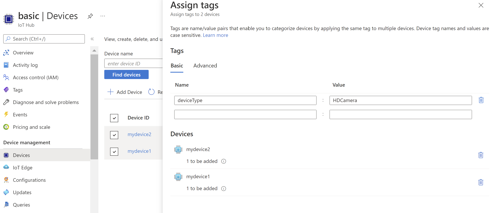
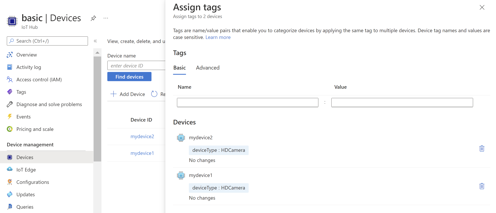

# How to manage devices using device twin tags in Azure IoT Hub
This article demonstrates how to use tags to manage IoT devices using [device twin tags](iot-hub-devguide-device-twins.md#tags-and-properties-format)

Device twin tags can be used as a powerful tool to help you organize your devices. This is especially important when you have multiple kinds of devices within your IoT solutions, you can use tags to set types, locations etc. For example:

```json
{
    "deviceId": "mydevice1",
    "etag": "AAAAAAAAAAw=",
    "deviceEtag": "ODIxNTY5ODUz",
    "status": "enabled",
    "statusUpdateTime": "0001-01-01T00:00:00Z",
    "connectionState": "Connected",
    "lastActivityTime": "0001-01-01T00:00:00Z",
    "cloudToDeviceMessageCount": 0,
    "authenticationType": "sas",
    "x509Thumbprint": {
        "primaryThumbprint": null,
        "secondaryThumbprint": null
    },
    "modelId": "",
    "version": 13,
    "tags": {
        "deploymentLocation": {
            "building": "43",
            "floor": "1"
        },
		"deviceType":"HDCamera"
    },
    "properties": {
     ...
    }
}
```


## Pre-requisites

* An IoT Hub. Create one with the [CLI](iot-hub-create-using-cli.md) or the [Azure portal](iot-hub-create-through-portal.md).

* At least two registered device. Register devices in the [Azure portal](iot-hub-create-through-portal.md#register-a-new-device-in-the-iot-hub).

## Adding and viewing device twin tags using Azure Portal

This section describes how to create an IoT hub using the [Azure portal](https://portal.azure.com).

1. Sign in to the [Azure portal](https://portal.azure.com) and go to your IoT Hub.

2. Select the **Device** tab in the left navigation.

3. Select the desired devices, click **Assign Tags**.
   
   :::image type="content" source="./media/iot-hubs-manage-device-twin-tags/iot-hub-device-select-device-to-assign-tags.png" alt-text="Select devices to assign Tags.":::

4. In the opened view, you can see the tags the devices already have. To add a new basic tag, provide a **name** and **value** for the tag. The format for key and value pair is found in [Tags and properties format](iot-hub-devguide-device-twins.md#tags-and-properties-format). Select **Save** to save the rule
   
    

4. After saving, you can view the tags that were added by clicking **Assign Tags** again. 

   

5. Alternatively, you can add a nested tag by clicking the advanced tab in the **Assign Tags**

   

## Querying basic and nested tags
Following the example above, you can filter devices using the query box
   

## Editting and deleting device twin tags using Azure Portal
!!TODO 

## Managing Tags using Azure CLI
The following section walk through several examples of tagging using Azure CLI. For full references to the [device twin CLI](https://docs.microsoft.com/cli/azure/iot/hub/device-twin?view=azure-cli-latest#az-iot-hub-device-twin-update)

1. At the command prompt, run the [login command](/cli/azure/get-started-with-azure-cli):

    ```azurecli
    az login
    ```

    Follow the instructions to authenticate using the code and sign in to your Azure account through a web browser.

2. If you have multiple Azure subscriptions, signing in to Azure grants you access to all the Azure accounts associated with your credentials. Use the following [command to list the Azure accounts](/cli/azure/account) available for you to use:

    ```azurecli
    az account list
    ```

    Use the following command to select the subscription that you want to use to run the commands to create your IoT hub. You can use either the subscription name or ID from the output of the previous command:

    ```azurecli
    az account set --subscription {your subscription name or id}
    ```
    
3. The following command enables file notifications and sets the file notification properties to their default values. (The file upload notification time to live is set to one hour and the  lock duration is set to 60 seconds.)

    ```azurecli
    az iot hub device-twin update -n {iothub_name} \
        -d {device_id} --tags '{"country": "USA"}'
    ```

4. You can add complex nested tags by importing a json file or adding json directly to the input:

    ```azurecli
    az iot hub device-twin update --name {your iot hub name} \
        -d {device_id} --tags /path/to/file
    ```
    ```azurecli
    az iot hub device-twin update --name {your iot hub name} \
        -d {device_id} --tags '{"country":{"county":"king"}}'
    ```
5. Using the command on an existing tag to update the value:
    ```azurecli
    az iot hub device-twin update --name {your iot hub name} \
        -d {device_id} --tags '{"country": "Germany"}'
    ```
6. The following command removes the tag that was added by setting the value to **null**. 
    ```azurecli
    az iot hub device-twin update --name {your iot hub name} \
        -d {device_id} --tags '{"country": null}'
    ```

 > [!NOTE]
 > If you are using Powershell or CloudShell>Powershell mode, you need to add a forward slash '\\' to escape all the double quotes. Example:  --tags '{\\"country\\":\\"US\\"}'
    
## Create Jobs to set Tags using Azure CLI
For full references to the [IoT Hub Jobs CLI](/cli/azure/iot/hub/job?view=azure-cli-latest#az-iot-hub-job-create-examples)

## Next steps

Now you have learned about device twins, you may be interested in the following IoT Hub developer guide topics:

* [Understand and use module twins in IoT Hub](iot-hub-devguide-module-twins.md)
* [Invoke a direct method on a device](iot-hub-devguide-direct-methods.md)
* [Schedule jobs on multiple devices](iot-hub-devguide-jobs.md)

To try out some of the concepts described in this article, see the following IoT Hub tutorials:

* [How to use the device twin](iot-hub-node-node-twin-getstarted.md)
* [How to use device twin properties](tutorial-device-twins.md)
* [Device management with Azure IoT Tools for VS Code](iot-hub-device-management-iot-toolkit.md)
