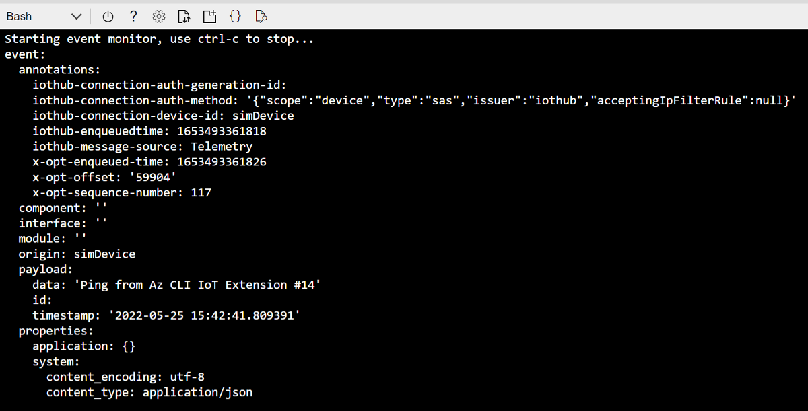
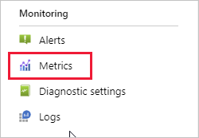
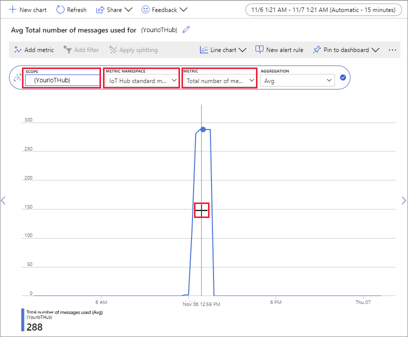

# Quickstart: Send telemetry from a device to an IoT hub and monitor it with the Azure CLI

IoT Hub is an Azure service that enables you to ingest high volumes of telemetry from your IoT devices into the cloud for storage or processing. In this quickstart, you use the Azure CLI to create an IoT Hub and a simulated device, send device telemetry to the hub, and send a cloud-to-device message. You also use the Azure portal to visualize device metrics. This is a basic workflow for developers who use the CLI to interact with an IoT Hub application.

## Prerequisites
- If you don't have an Azure subscription, [create one for free](https://azure.microsoft.com/free/?WT.mc_id=A261C142F) before you begin.
- Azure CLI. You can run all commands in this quickstart using the Azure Cloud Shell, an interactive CLI shell that runs in your browser. If you use the Cloud Shell, you don't need to install anything. If you prefer to use the CLI locally, this quickstart requires Azure CLI version 2.0.76 or later. Run az --version to find the version. To install or upgrade, see [Install Azure CLI]( /cli/azure/install-azure-cli).

## Sign in to the Azure portal
Sign in to the Azure portal at https://portal.azure.com.

Regardless whether you run the CLI locally or in the Cloud Shell, keep the portal open in your browser.  You use it later in this quickstart.

## Launch the Cloud Shell
In this section, you launch an instance of the Azure Cloud Shell. If you use the CLI locally, skip to the section [Prepare two CLI sessions](#prepare-two-cli-sessions).

To launch the Cloud Shell:

1. Select the **Cloud Shell** button on the top-right menu bar in the Azure portal. 

    

    > [!NOTE]
    > If this is the first time you've used the Cloud Shell, it prompts you to create storage, which is required to use the Cloud Shell.  Select a subscription to create a storage account and Microsoft Azure Files share. 

2. Select your preferred CLI environment in the **Select environment** dropdown. This quickstart uses the **Bash** environment. All the following CLI commands work in the PowerShell environment too. 

    

## Prepare two CLI sessions

In this section, you prepare two Azure CLI sessions. If you're using the Cloud Shell, you will run the two sessions in separate browser tabs. If using a local CLI client, you will run two separate CLI instances. You'll use the first session as a simulated device, and the second session to monitor and send messages. To run a command, select **Copy** to copy a block of code in this quickstart, paste it into your shell session, and run it.

Azure CLI requires you to be logged into your Azure account. All communication between your Azure CLI shell session and your IoT hub is authenticated and encrypted. As a result, this quickstart does not need additional authentication that you'd use with a real device, such as a connection string.

*  Run the [az extension add](/cli/azure/extension#az_extension_add) command to add the Microsoft Azure IoT Extension for Azure CLI to your CLI shell. The IOT Extension adds IoT Hub, IoT Edge, and IoT Device Provisioning Service (DPS) specific commands to Azure CLI.

   ```azurecli
   az extension add --name azure-iot
   ```
   
   After you install the Azure IOT extension, you don't need to install it again in any Cloud Shell session. 

   [!INCLUDE [iot-hub-cli-version-info](../../includes/iot-hub-cli-version-info.md)]

*  Open a second CLI session.  If you're using the Cloud Shell, select **Open new session**. If you're using the CLI locally, open a second instance. 

    >[!div class="mx-imgBorder"]
    >

## Create an IoT Hub
In this section, you use the Azure CLI to create a resource group and an IoT Hub.  An Azure resource group is a logical container into which Azure resources are deployed and managed. An IoT Hub acts as a central message hub for bi-directional communication between your IoT application and the devices. 

> [!TIP]
> Optionally, you can create an Azure resource group, an IoT Hub, and other resources by using the [Azure portal](iot-hub-create-through-portal.md), [Visual Studio Code](iot-hub-create-use-iot-toolkit.md), or other programmatic methods.  

1. Run the [az group create](/cli/azure/group#az_group_create) command to create a resource group. The following command creates a resource group named *MyResourceGroup* in the *eastus* location. 

    ```azurecli
    az group create --name MyResourceGroup --location eastus
    ```

1. Run the [az iot hub create](/cli/azure/iot/hub#az_iot_hub_create) command to create an IoT hub. It might take a few minutes to create an IoT hub. 

    *YourIotHubName*. Replace this placeholder name and the curly bracket characters with the name you chose for your IoT hub. An IoT hub name must be globally unique in Azure. This placeholder is used in the rest of this quickstart to represent your IoT hub name.

    ```azurecli
    az iot hub create --resource-group MyResourceGroup --name {YourIoTHubName}
    ```

## Create and monitor a device
In this section, you create a simulated device in the first CLI session. The simulated device sends device telemetry to your IoT hub. In the second CLI session, you monitor events and telemetry, and send a cloud-to-device message to the simulated device.

To create and start a simulated device:
1. Run the [az iot hub device-identity create](/cli/azure/iot/hub/device-identity#az_iot_hub_device_identity_create) command in the first CLI session. This creates the simulated device identity. 

    *YourIotHubName*. Replace this placeholder below with the name you chose for your IoT hub. 

    *simDevice*. You can use this name directly for the simulated device in the rest of this quickstart. Optionally, use a different name. 

    ```azurecli
    az iot hub device-identity create --device-id simDevice --hub-name {YourIoTHubName} 
    ```

1. Run the [az iot device simulate](/cli/azure/iot/device#az_iot_device_simulate) command in the first CLI session.  This starts the simulated device. The device sends telemetry to your IoT hub and receives messages from it.  

    *YourIotHubName*. Replace this placeholder below with the name you chose for your IoT hub. 

    ```azurecli
    az iot device simulate -d simDevice -n {YourIoTHubName}
    ```

To monitor a device:
1. In the second CLI session, run the [az iot hub monitor-events](/cli/azure/iot/hub#az_iot_hub_monitor_events) command. This starts monitoring the simulated device. The output shows telemetry that the simulated device sends to the IoT hub.

    *YourIotHubName*. Replace this placeholder below with the name you chose for your IoT hub. 

    ```azurecli
    az iot hub monitor-events --output table --hub-name {YourIoTHubName}
    ```

    

1. After you monitor the simulated device in the second CLI session, press Ctrl+C to stop monitoring. 

## Use the CLI to send a message
In this section, you use the second CLI session to send a message to the simulated device.

1. In the first CLI session, confirm that the simulated device is running. If the device has stopped, run the following command to start it:

    *YourIotHubName*. Replace this placeholder below with the name you chose for your IoT hub. 

    ```azurecli
    az iot device simulate -d simDevice -n {YourIoTHubName}
    ```

1. In the second CLI session, run the [az iot device c2d-message send](/cli/azure/iot/device/c2d-message#az_iot_device_c2d-message-send) command. This sends a cloud-to-device message from your IoT hub to the simulated device. The message includes a string and two key-value pairs.  

    *YourIotHubName*. Replace this placeholder below with the name you chose for your IoT hub. 

    ```azurecli
    az iot device c2d-message send -d simDevice --data "Hello World" --props "key0=value0;key1=value1" -n {YourIoTHubName}
    ```
    Optionally, you can send cloud-to-device messages by using the Azure portal. To do this, browse to the overview page for your IoT Hub, select **IoT Devices**, select the simulated device, and select **Message to Device**. 

1. In the first CLI session, confirm that the simulated device received the message. 

    

1. After you view the message, close the second CLI session. Keep the first CLI session open. You use it to clean up resources in a later step.

## View messaging metrics in the portal
The Azure portal enables you to manage all aspects of your IoT Hub and devices. In a typical IoT Hub application that ingests telemetry from devices, you might want to monitor devices or view metrics on device telemetry. 

To visualize messaging metrics in the Azure portal:
1. In the left navigation menu on the portal, select **All Resources**. This lists all resources in your subscription, including the IoT hub you created. 

1. Select the link on the IoT hub you created. The portal displays the overview page for the hub.

1. Select **Metrics** in the left pane of your IoT Hub. 

    

1. Enter your IoT hub name in **Scope**.

2. Select *Iot Hub Standard Metrics* in **Metric Namespace**.

3. Select *Total number of messages used* in **Metric**. 

4. Hover your mouse pointer over the area of the timeline in which your device sent messages. The total number of messages at a point in time appears in the lower left corner of the timeline.

    

5. Optionally, use the **Metric** dropdown to display other metrics on your simulated device. For example, *C2d message deliveries completed* or *Total devices (preview)*. 

## Clean up resources
If you no longer need the Azure resources created in this quickstart, you can use the Azure CLI to delete them.

If you continue to the next recommended article, you can keep the resources you've already created and reuse them. 

> [!IMPORTANT]
> Deleting a resource group is irreversible. The resource group and all the resources contained in it are permanently deleted. Make sure that you do not accidentally delete the wrong resource group or resources. 

To delete a resource group by name:
1. Run the [az group delete](/cli/azure/group#az_group_delete) command. This removes the resource group, the IoT Hub, and the device registration you created.

    ```azurecli
    az group delete --name MyResourceGroup
    ```
1. Run the [az group list](/cli/azure/group#az_group_list) command to confirm the resource group is deleted.  

    ```azurecli
    az group list
    ```

## Next steps
In this quickstart, you used the Azure CLI to create an IoT hub, create a simulated device, send telemetry, monitor telemetry, send a cloud-to-device message, and clean up resources. You used the Azure portal to visualize messaging metrics on your device.

If you are a device developer, the suggested next step is to see the telemetry quickstart that uses the Azure IoT Device SDK for C. Optionally, see one of the available Azure IoT Hub telemetry quickstart articles in your preferred language or SDK.

To learn how to control your simulated device from a back-end application, continue to the next quickstart.

> [!div class="nextstepaction"]
> [Quickstart: Control a device connected to an IoT hub](quickstart-control-device.md)
