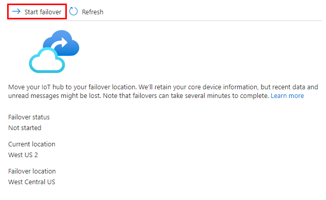
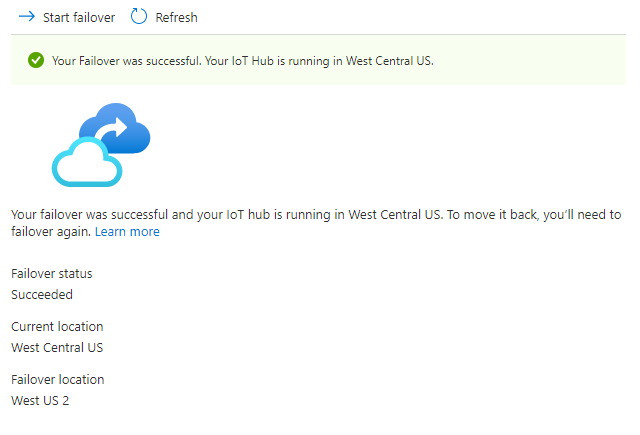

# Tutorial: Perform manual failover for an IoT hub

Manual failover is a feature of the IoT Hub service that allows customers to [failover](https://en.wikipedia.org/wiki/Failover) their hub's operations from a primary region to the corresponding Azure geo-paired region. Manual failover can be done in the event of a regional disaster or an extended service outage. You can also perform a planned failover to test your disaster recovery capabilities, although we recommend using a test IoT hub rather than one running in production. The manual failover feature is offered to customers at no additional cost for IoT hubs created after May 18, 2017.

In this tutorial, you perform the following tasks:

> [!div class="checklist"]
> * Using the Azure portal, create an IoT hub. 
> * Perform a failover. 
> * See the hub running in the secondary location.
> * Perform a failback to return the IoT hub's operations to the primary location. 
> * Confirm the hub is running correctly in the right location.

For more information about manual failover and Microsoft-initiated failover with IoT Hub, see [Cross region disaster recovery](iot-hub-ha-dr.md#cross-region-dr).

## Prerequisites

* An Azure subscription. If you don't have an Azure subscription, create a [free account](https://azure.microsoft.com/free/?WT.mc_id=A261C142F) before you begin.

* Make sure that port 8883 is open in your firewall. The device sample in this tutorial uses MQTT protocol, which communicates over port 8883. This port may be blocked in some corporate and educational network environments. For more information and ways to work around this issue, see [Connecting to IoT Hub (MQTT)](iot-hub-mqtt-support.md#connecting-to-iot-hub).

## Create an IoT hub

[!INCLUDE [iot-hub-include-create-hub](../../includes/iot-hub-include-create-hub.md)]

## Perform a manual failover

> [!NOTE]
> There is a limit of two failovers and two failbacks per day for an IoT hub.

1. Click **Resource groups** and then select your resource group. This tutorial uses **ManlFailRG**. Click on your hub in the list of resources. 

1. Under **Settings** on the IoT Hub pane, click **Failover**.

   

1. On the Manual failover pane, you see the **Current location** and the **Failover location**. The current location always indicates the location in which the hub is currently active. The failover location is the standard [Azure geo-paired region](../best-practices-availability-paired-regions.md) that is paired to the current location. You cannot change the location values. For this tutorial, the current location is `West US 2` and the failover location is `West Central US`.

   

1. At the top of the Manual failover pane, click **Start failover**. 

1. In the confirmation pane, fill in the name of your IoT hub to confirm it's the one you want to failover. Then, to initiate the failover, click **Failover**.

   The amount of time it takes to perform the manual failover is proportional to the number of devices that are registered for your hub. For example, if you have 100,000 devices, it might take 15 minutes, but if you have five million devices, it might take an hour or longer.

   

   While the manual failover process is running, a banner appears to tell you a manual failover is in progress. 

   

   If you close the IoT Hub pane and open it again by clicking it on the Resource Group pane, you see a banner that tells you the hub is in the middle of a manual failover. 

   

   After it's finished, the current and failover regions on the Manual Failover page are flipped and the hub is active again. In this example, the current location is now `WestCentralUS` and the failover location is now `West US 2`. 

   

   The overview page also shows a banner indicating that the failover is complete and the IoT Hub is running in `West Central US`.

   

## Perform a failback 

After you have performed a manual failover, you can switch the hub's operations back to the original primary region -- this is called a failback. If you have just performed a failover, you have to wait about an hour before you can request a failback. If you try to perform the failback in a shorter amount of time, an error message is displayed.

A failback is performed just like a manual failover. These are the steps: 

1. To perform a failback, return to the Iot Hub pane for your Iot hub.

2. Under **Settings** on the IoT Hub pane, click **Failover**. 

3. At the top of the Manual failover pane, click **Start failover**. 

4. In the confirmation pane, fill in the name of your IoT hub to confirm it's the one you want to failback. To then initiate the failback, click **OK**. 

   

   The banners are displayed as explained in the perform a failover section. After the failback is complete, it again shows `West US 2` as the current location and `West Central US` as the failover location, as set originally.

## Clean up resources 

To remove the resources you've created for this tutorial, delete the resource group. This action deletes all resources contained within the group. In this case, it removes the IoT hub and the resource group itself. 

1. Click **Resource Groups**. 

2. Locate and select the resource group **ManlFailRG**. Click on it to open it. 

3. Click **Delete resource group**. When prompted, enter the name of the resource group and click **Delete** to confirm. 

## Next steps

In this tutorial, you learned how to configure and perform a manual failover, and how to request a failback by performing the following tasks:

> [!div class="checklist"]
> * Using the Azure portal, create an IoT hub. 
> * Perform a failover. 
> * See the hub running in the secondary location.
> * Perform a failback to return the IoT hub's operations to the primary location. 
> * Confirm the hub is running correctly in the right location.

Advance to the next tutorial to learn how to configure ypur device from a back-end service. 

> [!div class="nextstepaction"]
> [Configure your devices](tutorial-device-twins.md)
