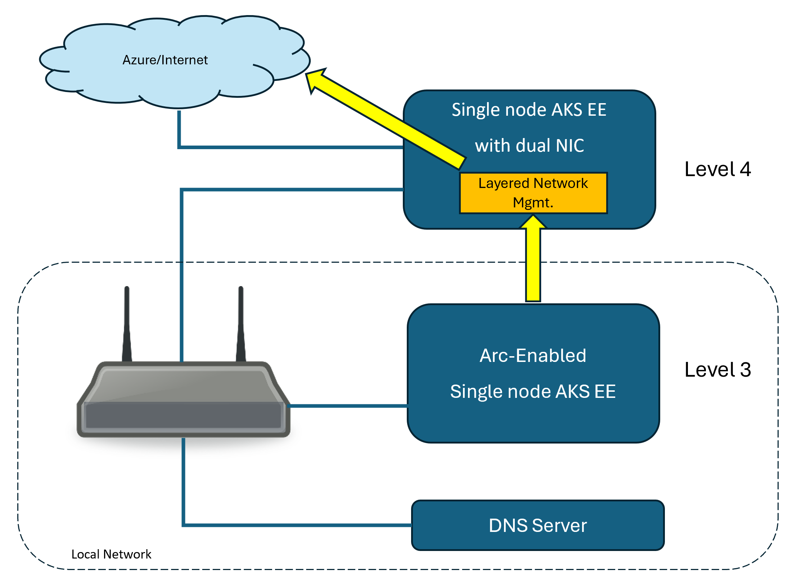

# Configure AKS Edge Essentials in Azure IoT Layered Network Management

[!INCLUDE [public-preview-note](../includes/public-preview-note.md)]

You can Arc-enable AKS Edge Essentials clusters in a *ISA-95 network environment* using the **Layered Network Management** service. In this article, you deploy an example level 4 cluster that can:
- Directly access the internet
- A dual network interface card (NIC) host that allows the level 4 cluster be visible to the level 3 local network. 
- A custom DNS that resolves the DNS server in the local network
- The level 3 Azure KS EE connects to the Layered Network Management service as a proxy for all the Azure Arc related traffic.



## Configure network environment

Complete the steps in [Configure isolated network with physical segmentation](./howto-configure-layered-network.md#configure-isolated-network-with-physical-segmentation) to configure your Wi-Fi access point, local network, and DNS server.

When configuring the DNS server, you need to point the Arc related domains to **local network IP of the level 4 machine**. For example:

```
address=/.login.microsoft.com/<local network IP of the level 4 machine>
```

## Configure level 4 AKS Edge Essentials and Layered Network Management

Follow the instruction in [Setup Level 4 Cluster and Deploy Layered Network Management Service](/docs/e4in/setup-l4-cluster/).
- Setup the level 4 AKS EE.
- Proceed with the steps in the same document to deploy the Layered Network Management service.

After you complete the steps above, the Layered Network Management service shall be up and running, ready for forwarding network traffic from level 3.

## Setup and Arc-enable Level 3 AKS EE
Follow the instruction in [Setup Level 3 Cluster and Connect to Arc](/docs/e4in/setup-l3-cluster/)
- Please follow the AKS EE path for Kubernetes setup.
- For the DNS server setting, provide the local network IP of the DNS server that you setup in the earlier step.
- Proceed the steps to connect the AKS EE cluster to Arc.

## Verification
Once the Arc enablement of the level 3 cluster is done, open the Azure portal. Navigate to your resource group. 
- You should see a **"Kubernetes - Azure Arc"** resource with the name you specified.
- Open the resource. In the overview page, the "status" of this cluster should be "online"
- You can also try [Access Kubernetes resources from Azure portal](https://learn.microsoft.com/en-us/azure/azure-arc/kubernetes/kubernetes-resource-view)

## Related content

TODO: Add your next step link(s)


<!--
Remove all the comments in this template before you sign-off or merge to the main branch.
-->
