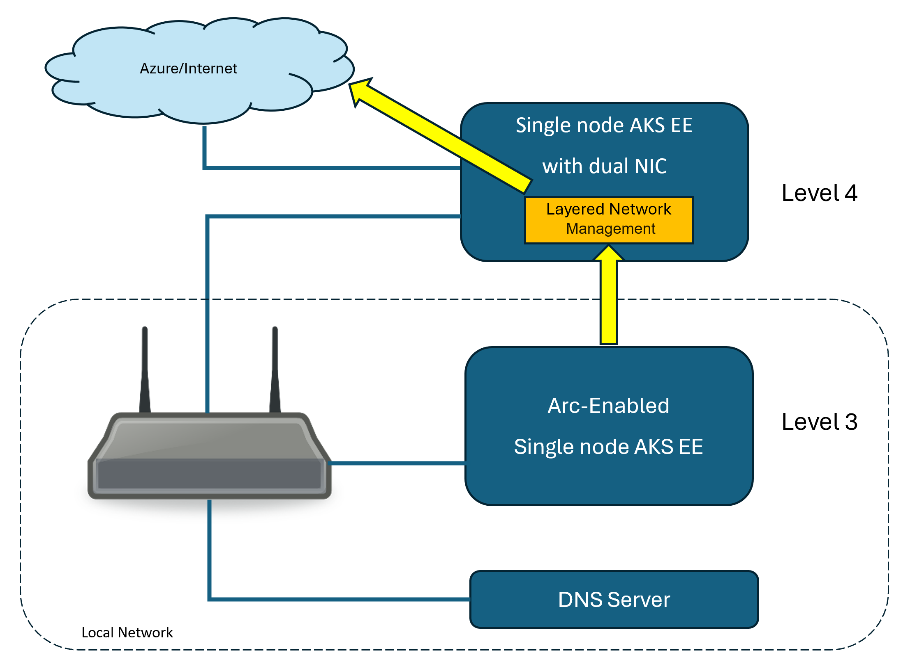
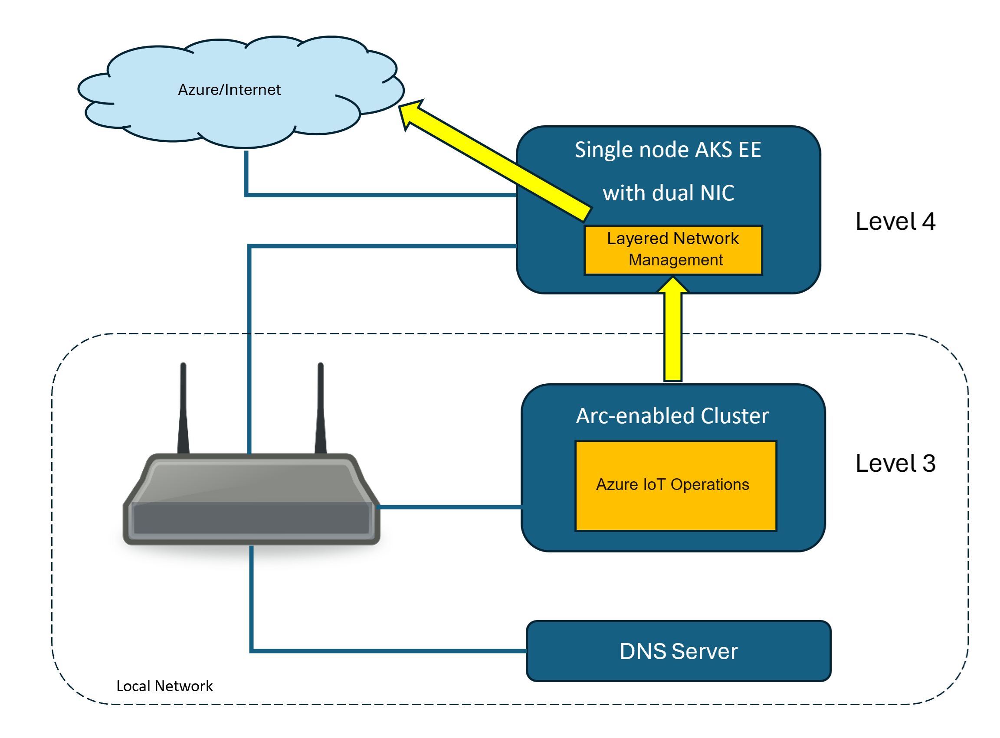

# Configure Layered Network Management service to enable Azure IoT Operations in an isolated network

[!INCLUDE [public-preview-note](../includes/public-preview-note.md)]

This is an example of deploying the Azure IoT Operations to a special environment which is different with the default [Azure IoT Operations scenario](/azure/iot-operations/get-started/quickstart-deploy). By default the Azure IoT Operations is deployed to an Arc-enabled cluster which has direct internet access. In this scenario, you will deploy the Azure IoT Operations to an isolated network environment. The hardware and cluster will still have to meet all the prerequisites of Azure IoT Operations. On top of those, there are additional configurations for the network, host OS and cluster to be fulfilled. As a result, the Azure IoT Operations components will be able to run and connect to Arc through the Layered Network Management service.
>[!IMPORTANT]
> This is an advanced scenario for the Azure IoT Operations. It is strongly recommended to complete the following trials to have basic concepts before you start this advanced scenario.
> - [Deploy Azure IoT Layered Network Management to an AKS cluster](howto-deploy-aks-layered-network.md)
> - [Quickstart: Deploy Azure IoT Operations to an Arc-enabled Kubernetes cluster](/azure/iot-operations/get-started/quickstart-deploy)

>[!IMPORTANT]
> You cannot migrate a previously deployed Azure IoT Operations from its original network to an isolated network. Please follow all the steps to begin with setting up new clusters.

In this example, you will Arc-enable AKS Edge Essentials or K3S clusters in the isolated layer of an ISA-95 network environment using the Layered Network Management service running in one level above. 
The network and cluster architecture are decrived as below:
- The level 4 single-node cluter is running on a host machine with:
    - Direct access to the internet.
    - A secondary network interface card (NIC) connecting to the local network. It allows the level 4 cluster being visible to the level 3 local network.
- A custom DNS in the local network. Please refer to the [Configure custom DNS](/azure/iot-operations/manage-layered-network/howto-configure-layered-network#configure-custom-dns) for the options. For getting the enviornment setup quickly, it is recommended to use the **CoreDNS** approach instead of a DNS server.
- The level 3 cluster connects to the Layered Network Management service as a proxy for all the Azure Arc related traffic.

### Configure level 4 AKS Edge Essentials and Layered Network Management

After the network is setup. You need to start with configuring the level 4 kubernetes cluster. Complete the steps in:
- [Configure IoT Layered Network Management level 4 cluster](./howto-configure-l4-cluster-layered-network.md).

With the instruction, you will:
- Setup and Windws 11 machine and configure the AKS Edge Essentials.
- Deploy and configure the Layered Network Management service to run on the cluster.
You need to identify the **local IP** of the host machine. In later steps, you will direct to traffic from level 3 to this IP address with a custom DNS.

After you complete this section, the Layered Network Management service is ready for forwarding network traffic from level 3 to Azure.

### Configure the custom DNS

In the local network, you need to setup the mechanism to redirect all the network traffic to the Layered Network Management service. Refer to the steps in:
- [Configure custom DNS](/azure/iot-operations/manage-layered-network/howto-configure-layered-network#configure-custom-dns)
    - If you choose the CoreDNS approach, you can jump to the next section (Configure and Arc enable level 3 cluster) and congigure the CoreDNS before your Arc-enable the level 3 cluster.
    - If you choose to use a DNS server, you need to follow the instruction and setup the DNS server before you move to the next section.

### Configure and Arc enable level 3 cluster

In this section, you will setup the cluster in level 3. It will be Arc-ehabled and compatible for deploying the Azure IoT Operations. Follow the instruction below. You can choose either the AKS Edge Essentials or K3S as the Kubernetes platform.
- [Configure level 3 cluster in an isolated network](./howto-configure-l3-cluster-layered-network.md). 

When following the steps in the instruction, you need to:
- Install all the optional software mentioned in the instructions.
- For the DNS setting, provide the local network IP of the DNS server that you configured in the earlier step.
- Complete the steps to connect the cluster to Azure Arc.

### Verification

Once the Azure Arc enablement of the level 3 cluster is complete, navigate to your resource group in the Azure portal. You should see a **Kubernetes - Azure Arc** resource with the name you specified.

1. Open the resource overview page. 
1. Verify **status** of the cluster is **online**.

For more information, see [Access Kubernetes resources from Azure portal](/azure/azure-arc/kubernetes/kubernetes-resource-view).

## Deploy Azure IoT Operations

Once your level 3 cluster is Arc-enabled, you can deploy IoT Operations to the cluster. All IoT Operations components will be deployed to the level 3 cluster and connect to Arc through the Layered Network Management service. The data pipeline also routes through the Layered Network Management service.

Follow the instruction below to deploy IoT Operations to the level 3 cluster.
- [Quickstart: Deploy Azure IoT Operations to an Arc-enabled Kubernetes cluster](/azure/iot-operations/get-started/quickstart-deploy)
    - With the steps in earlier sections, you should have fulfill the [Prerequisites](/azure/iot-operations/get-started/quickstart-deploy#prerequisites) and [Arc-enable](/azure/iot-operations/get-started/quickstart-deploy#connect-a-kubernetes-cluster-to-azure-arc) for Azure IoT Operations. You can review these steps to make sure nothing is missing.
    - Start from the [Configure cluster and deploy Azure IoT Operations](/azure/iot-operations/get-started/quickstart-deploy#configure-cluster-and-deploy-azure-iot-operations) and complete all the further steps.

## Next steps

Once the IoT Operations is deployed, you can try the following quickstarts. The Azure IoT Operations in your level 3 cluster shall be capable to work as described in the quickstarts.

- [Quickstart: Add OPC UA assets to your Azure IoT Operations cluster](../get-started/quickstart-add-assets.md)
- [Quickstart: Use Data Processor pipelines to process data from your OPC UA assets](../get-started/quickstart-process-telemetry.md)
