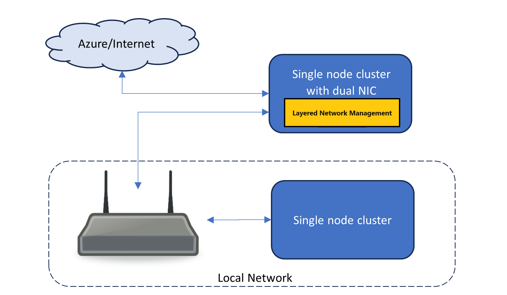

# Configure Azure IoT Layered Network Management environment

[!INCLUDE [public-preview-note](../includes/public-preview-note.md)]

Using Azure IoT Layered Network service, you can configure an isolated network environment with physical or logical segmentation.

Each isolated layer that's level 3 and lower, requires you to include a DNS server.

## Configure isolated network with physical segmentation

The following example configuration is a simple isolated network with minimum physical devices.



- The wireless access point is used for setting up a local network and doesn't provide internet access.
- **Level 4 cluster** is a single node cluster hosted on a dual network interface card (NIC) physical machine that connects to internet and the local network.
- **Level 3 cluster** is a single node cluster hosted on a physical machine. This device cluster only connects to the local network.

Layered Network Management is deployed to the dual NIC cluster. The cluster in the local network connects to Layered Network Management as a proxy to access Azure and Arc services. Generally, it would need another DNS server in the local network to provide domain name resolution and point the traffic to Layered Network Management.

## Configure Isolated Network with logical segmentation

The following example is an isolated network environment where each level is logically segmented with subnets. In this test environment, there are multiple clusters one at each level. The clusters can be AKS Edge Essentials or K3S. The Kubernetes cluster in the level 4 network has direct internet access. The Kubernetes clusters in level 3 and below don't have internet access.

<!---->

The multiple levels of networks in this test setup are accomplished using subnets within a network:

- **Level 4 subnet (10.104.0.0/16)** - This subnet has access to the internet. All the requests are sent to the destinations on the internet. This subnet has a single Windows 11 machine with the IP address 10.104.0.10
- **Level 3 subnet (10.103.0.0/16)** - This subnet doesn't have access to the internet and is configured to only have access to the IP address 10.104.0.10 in Level 4. This subnet contains a Windows 11 machine with the IP address 10.103.0.33 and a Linux machine that hosts a DNS server. The DNS server is configured using the steps in [configure the DNS server](#configure-the-dns-server). All the domains in the DNS configuration must be mapped to the address 10.104.0.10.
- **Level 2 subnet (10.102.0.0/16)** - Like Level 3, this subnet doesn't have access to the internet. It's configured to only have access to the IP address 10.103.0.33 in Level 3. This subnet contains a Windows 11 machine with the IP address 10.102.0.28 and a Linux machine that hosts a DNS server. There's one Windows 11 machine (node) in this network with IP address 10.102.0.28. All the domains in the DNS configuration must be mapped to the address 10.103.0.33.

## Configure the DNS server

A DNS server is only needed for levels 3 and below. This example uses a [dnsmasq](https://dnsmasq.org/) server, running on Ubuntu for DNS resolution.

1. Install an Ubuntu machine in the local network.
1. Enable the *dnsmasq* service on the Ubuntu machine.

    ```bash
    apt update
    apt install dnsmasq
    systemctl status dnsmasq
    ```
1. Modify the `/etc/dnsmasq.conf` file as shown to route these domains to the upper level.
    - Change the IP address from 10.104.0.10 to respective destination address for that level - IP address of the Layered Network Management service in the parent level.
    - Verify the `interface` where you're running the *dnsmasq* and change the value as needed.
    - As an alternative, you can put `address=/#/<IP of upper level Layered Network Management service>` in the IPV4 and IPV6 address sections.
    - The following configuration only contains the necessary endpoints for enabling IoT Operations. 

    ```conf
    # Add domains which you want to force to an IP address here.
    # The example below send any host in double-click.net to a local
    # web-server.
    address=/management.azure.com/10.104.0.10
    address=/dp.kubernetesconfiguration.azure.com/10.104.0.10
    address=/.dp.kubernetesconfiguration.azure.com/10.104.0.10
    address=/login.microsoftonline.com/10.104.0.10
    address=/.login.microsoft.com/10.104.0.10
    address=/.login.microsoftonline.com/10.104.0.10
    address=/login.microsoft.com/10.104.0.10
    address=/mcr.microsoft.com/10.104.0.10
    address=/.data.mcr.microsoft.com/10.104.0.10
    address=/gbl.his.arc.azure.com/10.104.0.10
    address=/.his.arc.azure.com/10.104.0.10
    address=/k8connecthelm.azureedge.net/10.104.0.10
    address=/guestnotificationservice.azure.com/10.104.0.10
    address=/.guestnotificationservice.azure.com/10.104.0.10
    address=/sts.windows.nets/10.104.0.10
    address=/k8sconnectcsp.azureedge.net/10.104.0.10
    address=/.servicebus.windows.net/10.104.0.10
    address=/servicebus.windows.net/10.104.0.10
    address=/obo.arc.azure.com/10.104.0.10
    address=/.obo.arc.azure.com/10.104.0.10
    address=/adhs.events.data.microsoft.com/10.104.0.10
    address=/dc.services.visualstudio.com/10.104.0.10
    address=/go.microsoft.com/10.104.0.10
    address=/onegetcdn.azureedge.net/10.104.0.10
    address=/www.powershellgallery.com/10.104.0.10
    address=/self.events.data.microsoft.com/10.104.0.10
    address=/psg-prod-eastus.azureedge.net/10.104.0.10
    address=/.azureedge.net/10.104.0.10
    address=/api.segment.io/10.104.0.10
    address=/nw-umwatson.events.data.microsoft.com/10.104.0.10
    address=/sts.windows.net/10.104.0.10
    address=/.azurecr.io/10.104.0.10
    address=/.blob.core.windows.net/10.104.0.10
    address=/global.metrics.azure.microsoft.scloud/10.104.0.10
    address=/.prod.hot.ingestion.msftcloudes.com/10.104.0.10
    address=/.prod.microsoftmetrics.com/10.104.0.10
    address=/global.metrics.azure.eaglex.ic.gov/10.104.0.10
    
    # --address (and --server) work with IPv6 addresses too.
    address=/guestnotificationservice.azure.com/fe80::20d:60ff:fe36:f83
    address=/.guestnotificationservice.azure.com/fe80::20d:60ff:fe36:f833
    address=/.servicebus.windows.net/fe80::20d:60ff:fe36:f833
    address=/servicebus.windows.net/fe80::20d:60ff:fe36:f833
    
    # If you want dnsmasq to listen for DHCP and DNS requests only on
    # specified interfaces (and the loopback) give the name of the
    # interface (eg eth0) here.
    # Repeat the line for more than one interface.
    interface=enp1s0
    
    # Or you can specify which interface _not_ to listen on
    # except-interface=
    # Or which to listen on by address (remember to include 127.0.0.1 if
    # you use this.)
    listen-address=::1,127.0.0.1,10.102.0.72
    
    # If you don't want dnsmasq to read /etc/hosts, uncomment the
    # following line.
    no-hosts
    ```

## Related content

[What is Azure IoT Layered Network Management?](./concept-layered-network.md)


