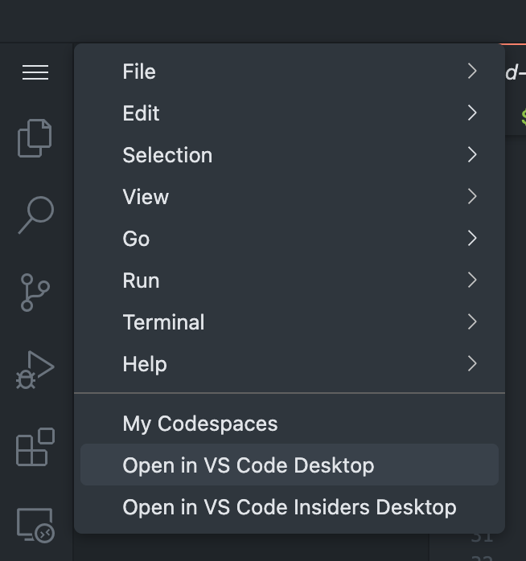

# Build a real-time dashboard in Microsoft Fabric with MQTT data

[!INCLUDE [public-preview-note](../includes/public-preview-note.md)]

In this walkthrough, you build a real-time Power BI dashboard in Microsoft Fabric using simulated MQTT data that is published to IoT MQ. The architecture uses the IoT MQ's Kafka connector to deliver messages to an Event Hubs namespace. Messages are then streamed to a Kusto database in Microsoft Fabric using an eventstream and visualized in a Power BI dashboard. 

## Prepare your Kubernetes cluster

This walkthrough uses a virtual Kubernetes environment hosted in a GitHub Codespace to help you get going quickly. If you want to use a different environment, all the artifacts are available in the [explore-iot-operations](https://github.com/Azure-Samples/explore-iot-operations/tree/main/tutorials/mq-realtime-fabric-dashboard) GitHub repo so you can easily follow along. 

1. Create the codespace, optionally entering your Azure details to store them as environment variables for the terminal.

   

1. Once the codespace is ready, select the menu button at the top left, then select **Open in VS Code Desktop**.

   

1. [Deploy IoT Operations using az CLI](../deploy-iot-ops/howto-deploy-iot-operations.md#deploy-extensions&tabs=cli).

