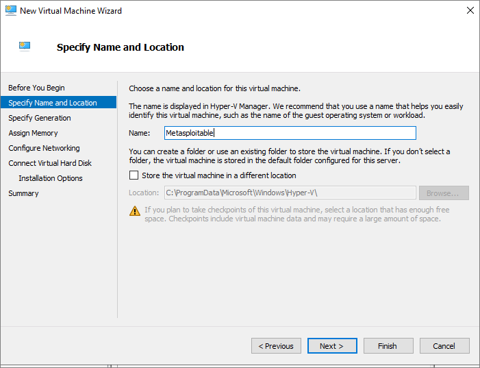
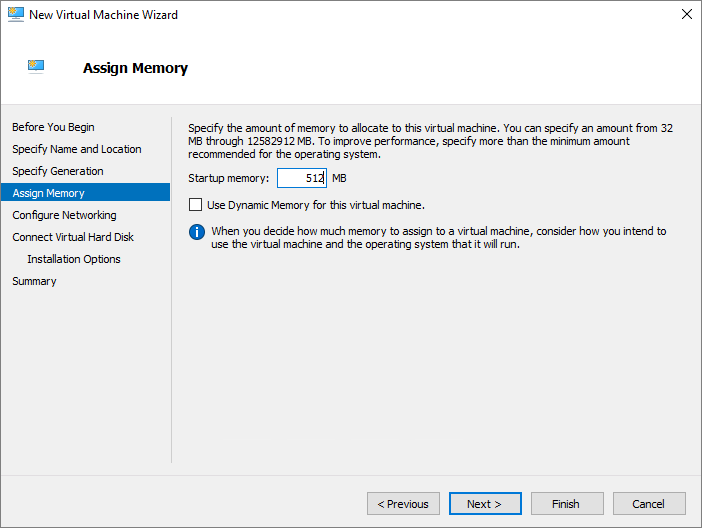
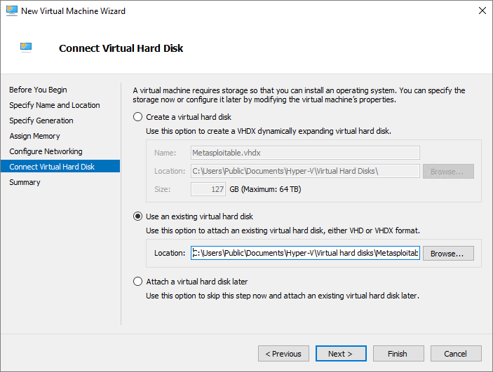
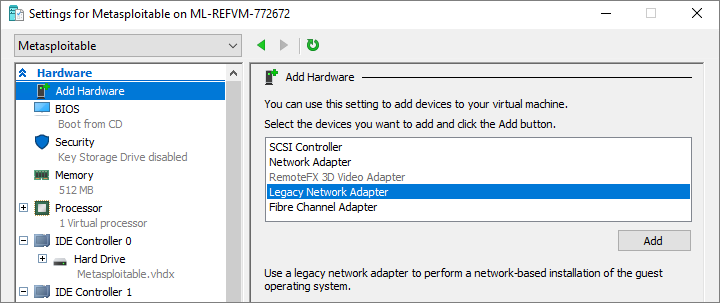
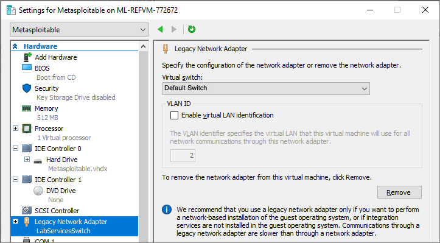

# Set up a lab to teach ethical hacking class

[!INCLUDE [preview note](./includes/lab-services-new-update-focused-article.md)]

This article shows you how to set up a class that focuses on forensics side of ethical hacking. Penetration testing, a practice used by the ethical hacking community, occurs when someone attempts to gain access to the system or network to demonstrate vulnerabilities that a malicious attacker may exploit.

In an ethical hacking class, students can learn modern techniques for defending against vulnerabilities. Each student gets a Windows Server host virtual machine that has two nested virtual machines – one virtual machine with [Metasploitable3](https://github.com/rapid7/metasploitable3) image and another machine with [Kali Linux](https://www.kali.org/) image. The Metasploitable virtual machine is used for exploiting purposes and Kali virtual machine provides access to the tools needed to execute forensic tasks.

This article has two main sections. The first section covers how to create the classroom lab. The second section covers how to create the template machine with nested virtualization enabled and with the tools and images needed. In this case, a Metasploitable image and a Kali Linux image on a machine that has Hyper-V enabled to host the images.

## Lab configuration

To set up this lab, you need an Azure subscription and lab account to get started. If you don't have an Azure subscription, create a [free account](https://azure.microsoft.com/free/) before you begin.

Once you get have Azure subscription, you can create a new lab plan in Azure Lab Services. For more information about creating a new lab plan, see the tutorial on [how to set up a lab plan](./tutorial-setup-lab-plan.md). You can also use an existing lab plan.

### Lab settings

For instructions on how to create a lab, see [Tutorial: Set up a classroom lab](tutorial-setup-classroom-lab.md).  Use the following settings when creating the lab.

| Lab settings | Value |
| ------------ | ------------------ |
| Virtual machine (VM) size | Medium (Nested Virtualization) |
| VM image | Windows Server 2019 Datacenter |

## Template machine configuration

After the template machine is created, start the machine and connect to it to complete the following three major tasks.

1. Set up the machine for nested virtualization. It enables all the appropriate windows features, like Hyper-V, and sets up the networking for the Hyper-V images to be able to communicate with each other and the internet.
2. Set up the [Kali](https://www.kali.org/) Linux image. Kali is a Linux distribution that includes tools for penetration testing and security auditing.
3. Set up the Metasploitable image. For this example, the [Metasploitable3](https://github.com/rapid7/metasploitable3) image will be used. This image is created to purposely have security vulnerabilities.

You can complete the tasks above by executing the [Lab Services Hyper-V Script](https://aka.ms/azlabs/scripts/hyperV) and [Lab Services Ethical Hacking Script](https://aka.ms/azlabs/classtypes/EthicalHacking) PowerShell scripts on the template machine. Once scripts have been executed, continue to [Next steps](#next-steps).

If you choose to set up the template machine manually, continue reading.  The rest of this article will cover the manual completion of template configuration tasks.  

### Prepare template machine for nested virtualization

Follow instructions to [enable nested virtualization](how-to-enable-nested-virtualization-template-vm.md) to prepare your template virtual machine for nested virtualization.

### Set up a nested virtual machine with Kali Linux Image

Kali is a Linux distribution that includes tools for penetration testing and security auditing.

1. Download image from [Offensive Security Kali Linux VM images](https://www.offensive-security.com/kali-linux-vm-vmware-virtualbox-image-download/).  Remember the default username and password noted on the download page.
    1. Download the **Kali Linux VMware 64-Bit (7z)** image for VMware.
    1. Extract the .7z file.  If you don’t already have 7 zip, download it from [https://www.7-zip.org/download.html](https://www.7-zip.org/download.html). Remember the location of the extracted folder as you'll need it later.
1. Convert the extracted vmdk file to a vhdx file so that you can use the vhdx file with Hyper-V. There are several tools available to convert VMware images to Hyper-V images.  We'll be using the [StarWind V2V Converter](https://www.starwindsoftware.com/starwind-v2v-converter).  To download, see [StarWind V2V Converter download page](https://www.starwindsoftware.com/starwind-v2v-converter#download).
    1. Start **StarWind V2V Converter**.
    1. On the **Select location of image to convert** page, choose **Local file**.  Select **Next**.
    1. On the **Source image** page, navigate to and select the Kali Linux vmdk file extracted in the previous step for the **File name** setting.  The file will be in the format Kali-Linux-{version}-vmware-amd64.vmdk.  Select **Next**.
    1. On the **Select location of destination image**, choose **Local file**.  Select **Next**.
    1. On the **Select destination image format** page, choose **VHD/VHDX**.  Select **Next**.
    1. On the **Select option for VHD/VHDX image format** page, choose **VHDX growable image**.  Select **Next**.
    1. On the **Select destination file name** page, accept the default file name.  Select **Convert**.
    1. On the **Converting** page, wait for the image to be converted.  Conversion may take several minutes.  Select **Finish** when the conversion is completed.
1. Create a new Hyper-V virtual machine.
    1. Open **Hyper-V Manager**.
    1. Choose **Action** -> **New** -> **Virtual Machine**.
    1. On the **Before You Begin** page of the **New Virtual Machine Wizard**, select **Next**.
    1. On the **Specify Name and Location** page, enter **Kali-Linux** for the **name**, and select **Next**.
    1. On the **Specify Generation** page, accept the defaults, and select **Next**.
    1. On the **Assign Memory** page, enter **2048 MB** for the **startup memory**, and select **Next**.
    1. On the **Configure Networking** page, leave the connection as **Not Connected**. You'll set up the network adapter later.
    1. On the **Connect Virtual Hard Disk** page, select **Use an existing virtual hard disk**. Browse to the location for the **Kali-Linux-{version}-vmware-amd64.vmdk** file created in the previous step, and select **Next**.
    1. On the **Completing the New Virtual Machine Wizard** page, and select **Finish**.
    1. Once the virtual machine is created, select it in the Hyper-V Manager. Don't turn on the machine yet.  
    1. Choose **Action** -> **Settings**.
    1. On the **Settings for Kali-Linux** dialog for, select **Add Hardware**.
    1. Select **Legacy Network Adapter**, and select **Add**.
    1. On the **Legacy Network Adapter** page, select **LabServicesSwitch** for the **Virtual Switch** setting, and select **OK**. LabServicesSwitch was created when preparing the template machine for Hyper-V in the **Prepare Template for Nested Virtualization** section.
    1. The Kali-Linux image is now ready for use. From **Hyper-V Manager**, choose **Action** -> **Start**, then choose **Action** -> **Connect** to connect to the virtual machine.  The default username is **kali** and the password is **kali**.

## Set up a nested VM with Metasploitable Image  

The Rapid7 Metasploitable image is an image purposely configured with security vulnerabilities. You'll use this image to test and find issues. The following instructions show you how to use a pre-created Metasploitable image. However, if a newer version of the Metasploitable image is needed, see [https://github.com/rapid7/metasploitable3](https://github.com/rapid7/metasploitable3).

1. Download the Metasploitable image.
    1. Navigate to [https://information.rapid7.com/download-metasploitable-2017.html](https://information.rapid7.com/download-metasploitable-2017.html). Fill out the form to download the image and select the **Submit** button.
    2. Select the **Download Metasploitable Now** button.
    3. When the zip file is downloaded, extract the zip file, and remember the location of the Metasploitable.vmdk file.
1. Convert the extracted vmdk file to a vhdx file so that you can use the vhdx file with Hyper-V. There are several tools available to convert VMware images to Hyper-V images.  We'll be using the [StarWind V2V Converter](https://www.starwindsoftware.com/starwind-v2v-converter) again.  To download, see [StarWind V2V Converter download page](https://www.starwindsoftware.com/starwind-v2v-converter#download).
    1. Start **StarWind V2V Converter**.
    1. On the **Select location of image to convert** page, choose **Local file**.  Select **Next**.
    1. On the **Source image** page, navigate to and select the Metasploitable.vmdk extracted in the previous step for the **File name** setting.  Select **Next**.
    1. On the **Select location of destination image**, choose **Local file**.  Select **Next**.
    1. On the **Select destination image format** page, choose **VHD/VHDX**.  Select **Next**.
    1. On the **Select option for VHD/VHDX image format** page, choose **VHDX growable image**.  Select **Next**.
    1. On the **Select destination file name** page, accept the default file name.  Select **Convert**.
    1. On the **Converting** page, wait for the image to be converted.  Conversion may take several minutes.  Select **Finish** when the conversion is completed.
1. Create a new Hyper-V virtual machine.
    1. Open **Hyper-V Manager**.
    1. Choose **Action** -> **New** -> **Virtual Machine**.
    1. On the **Before You Begin** page of the **New Virtual Machine Wizard**, select **Next**.
    1. On the **Specify Name and Location** page, enter **Metasploitable** for the **name**, and select **Next**.

        
    1. On the **Specify Generation** page, accept the defaults, and select **Next**.
    1. On the **Assign Memory** page, enter **512 MB** for the **startup memory**, and select **Next**.

        
    1. On the **Configure Networking** page, leave the connection as **Not Connected**. You'll set up the network adapter later.
    1. On the **Connect Virtual Hard Disk** page, select **Use an existing virtual hard disk**. Browse to the location for the **metasploitable.vhdx** file created in the previous step, and select **Next**.

        
    1. On the **Completing the New Virtual Machine Wizard** page, and select **Finish**.
    1. Once the virtual machine is created, select it in the Hyper-V Manager. Don't turn on the machine yet.  
    1. Choose **Action** -> **Settings**.
    1. On the **Settings for Metasploitable** dialog for, select **Add Hardware**.
    1. Select **Legacy Network Adapter**, and select **Add**.

        
    1. On the **Legacy Network Adapter** page, select **LabServicesSwitch** for the **Virtual Switch** setting, and select **OK**. LabServicesSwitch was created when preparing the template machine for Hyper-V in the **Prepare Template for Nested Virtualization** section.

        
    1. The Metasploitable image is now ready for use. From **Hyper-V Manager**, choose **Action** -> **Start**, then choose **Action** -> **Connect** to connect to the virtual machine.  The default username is **msfadmin** and the password is **msfadmin**.

The template is now updated and has images needed for an ethical hacking penetration testing class, an image with tools to do the penetration testing and another image with security vulnerabilities to discover. The template image can now be published to the class. Select the **Publish** button on template page to publish the template to the lab.

## Cost  

If you would like to estimate the cost of this lab, you can use the following example:

For a class of 25 students with 20 hours of scheduled class time and 10 hours of quota for homework or assignments, the price for the lab would be:

25 students \* (20 + 10) hours \* 55 Lab Units \* 0.01 USD per hour = 412.50 USD

>[!IMPORTANT]
>Cost estimate is for example purposes only. For current details on pricing, see [Azure Lab Services Pricing](https://azure.microsoft.com/pricing/details/lab-services/).

## Conclusion

This article walked you through the steps to create a lab for ethical hacking class. It includes steps to set up nested virtualization for creating two virtual machines inside the host virtual machine for penetrating testing.

## Next steps

The template image can now be published to the lab. See [publish the template VM](how-to-create-manage-template.md#publish-the-template-vm) for further instructions.

As you set up your lab, see the following articles:

- [Add users](tutorial-setup-classroom-lab.md#add-users-to-the-lab)
- [Set quota](how-to-configure-student-usage.md#set-quotas-for-users)
- [Set a schedule](tutorial-setup-classroom-lab.md#set-a-schedule-for-the-lab)
- [Email registration links to students](how-to-configure-student-usage.md#send-invitations-to-users)
