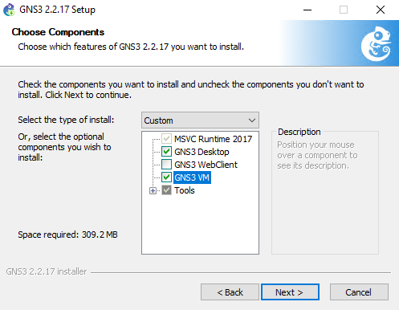
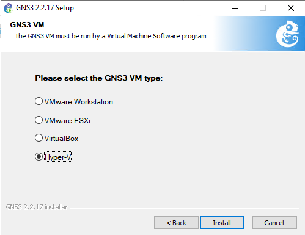
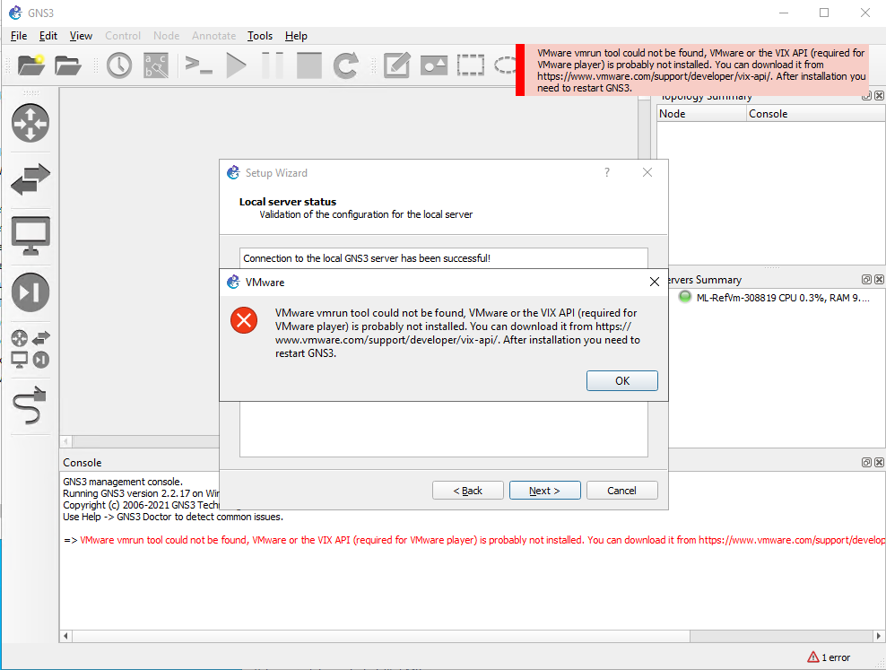
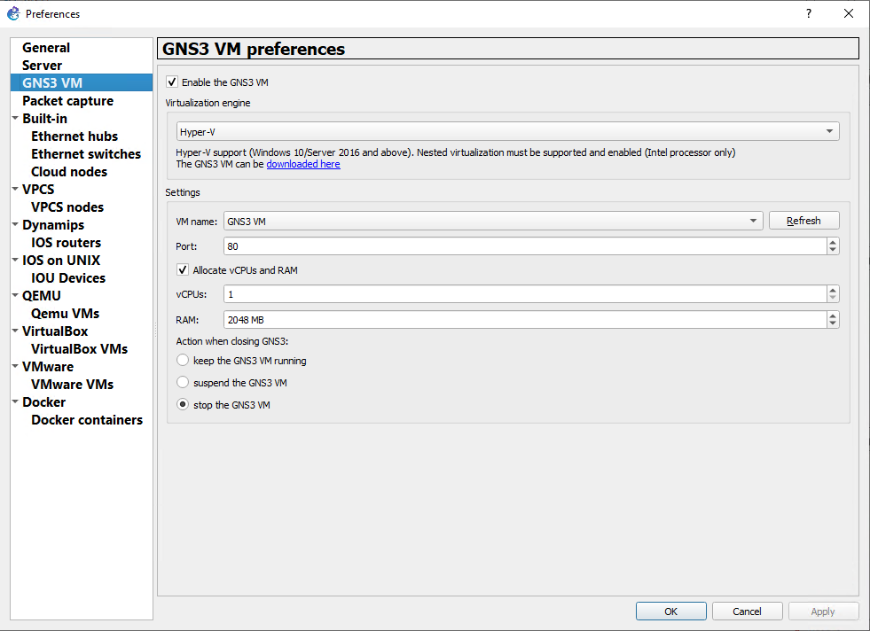

# Set up a lab to teach a networking class

[!INCLUDE [preview note](./includes/lab-services-new-update-focused-article.md)]

This article shows you how to set up a class that focuses on allowing students to emulate, configure, test, and troubleshoot virtual and real networks using [GNS3](https://www.gns3.com/) software.

This article has two main sections. The first section covers how to create the classroom lab. The second section covers how to create the template machine with nested virtualization enabled and with GNS3 installed and configured.

## Lab configuration

To set up this lab, you need access to an Azure subscription and a lab account. Discuss with your organization's admin to see if you can get access to an existing Azure subscription. If you don't have an Azure subscription, create a [free account](https://azure.microsoft.com/free/) before you begin.

Once you get have Azure subscription, you can create a new lab plan in Azure Lab Services. For more information about creating a new lab plan, see the tutorial on [how to set up a lab plan](./tutorial-setup-lab-plan.md). You can also use an existing lab plan.

### Lab settings

For instructions on how to create a lab, see [Tutorial: Set up a classroom lab](tutorial-setup-classroom-lab.md).  Use the following settings when creating the lab.

Follow [this tutorial](tutorial-setup-classroom-lab.md) to create a new lab and then apply the following settings:

| Lab settings | Value |
| ------------ | ------------------ |
| Virtual machine (VM) size | Medium (Nested Virtualization) |
| VM image | Windows 10 Pro, Version 1909 |

## Template machine configuration

After the template machine is created, start the machine and connect to it to complete the following major tasks.

1. Prepare the template machine for nested virtualization.
2. Install GNS3.
3. Create nested GNS3 VM in Hyper-V.
4. Configure GNS3 to use Windows Hyper-V VM.
5. Add appropriate appliances.
6. Publish template.

### Prepare template machine for nested virtualization

- Follow instructions in [this article](how-to-enable-nested-virtualization-template-vm.md) to prepare your template virtual machine for nested virtualization.

### Install GNS3

- Follow the instructions for [installing GNS3 on Windows](https://docs.gns3.com/docs/getting-started/installation/windows).  Make sure to include installing the **GNS3 VM** in the component dialog, see below.

Eventually you'll reach the GNS3 VM selection. Make sure to select the **Hyper-V** option.

  This option will download the PowerShell script and VHD files to create the GNS3 VM in the Hyper-V manager. Continue installation using the default values. **Once the setup is complete, don't start GNS3**.

### Create GNS3 VM

Once the setup has completed, a zip file **"GNS3.VM.Hyper-V.2.2.17.zip"** is downloaded to the same folder as the installation file, containing the drives and the PowerShell script to create the Hyper-V vm.

- **Extract all** on the GNS3.VM.Hyper-V.2.2.17.zip.  This action will extract out the drives and the PowerShell script to create the VM.
- **Run with PowerShell** on the "create-vm.ps1" PowerShell script by right-clicking on the file.
- An Execution Policy Change request may show up. Enter "Y" to execute the script.

- Once the script has completed, you can confirm the VM "GNS3 VM" has been created in the Hyper-V Manager.

### Configure GNS3 to use Hyper-V VM

Now that GNS3 is installed and the GNS3 VM is added, start up GNS3 to link the two together.  The [GNS3 Setup wizard will start automatically.](https://docs.gns3.com/docs/getting-started/setup-wizard-gns3-vm#local-gns3-vm-setup-wizard).  

- Use the **Run appliances from virtual machine** option.  Use the defaults for the rest of the wizard until you hit the **VMware vmrun tool cannot be found** error.

- Choose **Ok**, and **Cancel** out of the wizard.
- To complete the connection to the Hyper-V vm, open the **Edit** -> **Preferences** -> **GNS3 VM** and select **Enable the GNS3 VM** and select the **Hyper-V** option.

### Add appropriate appliances

At this point, you'll want to add the appropriate [appliances for the class.](https://docs.gns3.com/docs/using-gns3/beginners/install-from-marketplace)

### Prepare to publish template

Now that the template VM is set up properly, and ready for publishing there are a few key points to check.

- Make sure that the GNS3 VM is shut down or turned off.  Publishing while the VM is still running will corrupt the VM.
- Close down GNS3, publishing while and running can lead to unintended side effects.
- Clean up any installation files or other unnecessary files.

## Cost  

If you would like to estimate the cost of this lab, you can use the following example:

For a class of 25 students with 20 hours of scheduled class time and 10 hours of quota for homework or assignments, the price for the lab would be:

25 students \* (20 + 10) hours \* 84 Lab Units \* 0.01 USD per hour = 630 USD.

**Important:** Cost estimate is for example purposes only.  For current details on pricing, see [Azure Lab Services Pricing](https://azure.microsoft.com/pricing/details/lab-services/).

## Conclusion

This article walked you through the steps to create a lab for network configuration using GNS3.

## Next steps

The template image can now be published to the lab. See [publish the template VM](how-to-create-manage-template.md#publish-the-template-vm) for further instructions.

As you set up your lab, see the following articles:

- [Add users](tutorial-setup-classroom-lab.md#add-users-to-the-lab)
- [Set quota](how-to-configure-student-usage.md#set-quotas-for-users)
- [Set a schedule](tutorial-setup-classroom-lab.md#set-a-schedule-for-the-lab)
- [Email registration links to students](how-to-configure-student-usage.md#send-invitations-to-users)
