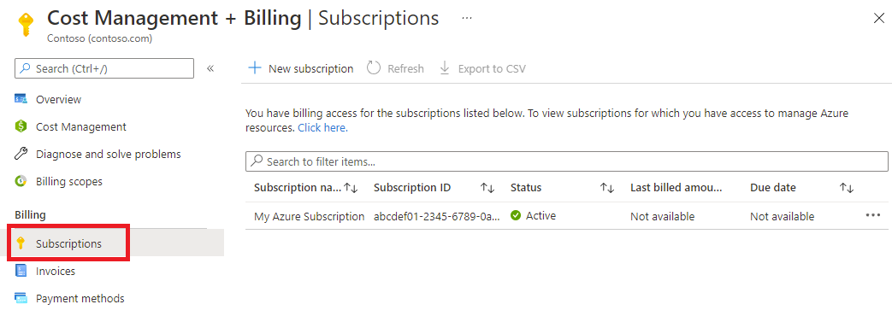
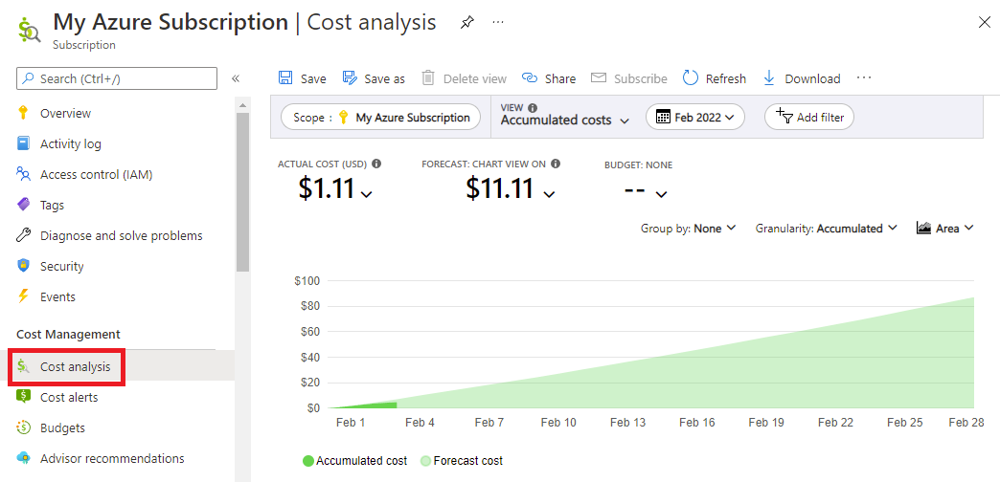

# Cost management for Azure Lab Services

For Azure Lab Services, cost management can be broken down into two distinct areas: cost estimation and cost analysis. Cost estimation occurs when you're setting up the lab to make sure that the initial structure of the lab will fit within the expected budget. Cost analysis usually occurs at the end of the month to determine the necessary actions for the next month.

## Estimate the lab costs

Each lab dashboard has a **Costs & Billing** section that lays out a rough estimate of what the lab will cost for the month. The cost estimate summarizes the hour usage with the maximum number of users by the estimated cost per hour. To get the most accurate estimate, set up the lab, including the [schedule](how-to-create-schedules.md). The dashboard will reflect the estimated cost.

This estimate might not show all the possible costs. A few resources aren't included:

- The template preparation cost. It can vary significantly in the amount of time needed to create the template. The cost to run the template is the same as the overall lab cost per hour.
- Any [shared image gallery](how-to-use-shared-image-gallery.md) costs, because a gallery can be shared among multiple labs.
- Hours incurred when the lab creator starts a virtual machine (VM).

> [!div class="mx-imgBorder"]
> 

## Analyze the previous month's usage

The cost analysis is for reviewing the previous month's usage to help you determine any adjustments for the lab. You can find the breakdown of past costs in the [subscription cost analysis](../cost-management-billing/costs/quick-acm-cost-analysis.md). In the Azure portal, you can enter **Subscriptions** in the search box and then select the **Subscriptions** option.

> [!div class="mx-imgBorder"]
> 

Select the specific subscription that you want to review.

> [!div class="mx-imgBorder"]
> 

Select **Cost Analysis** in the left pane under **Cost Management**.

> [!div class="mx-imgBorder"]
> 

This dashboard allows in-depth cost analysis, including the ability to export to different file types on a schedule. For more information, see [Cost Management + Billing overview](../cost-management-billing/cost-management-billing-overview.md).

You can filter by resource type. Using `microsoft.labservices/labaccounts` will show only the cost associated with Lab Services.

## Understand the usage

The following screenshot is an example of a cost analysis.

> [!div class="mx-imgBorder"]
> 

By default, there are six columns: **Resource**, **Resource type**, **Location**, **Resource group name**, **Tags**, and **Cost**. The **Resource** column contains the information about the lab plan, lab name, and VM. The rows that show the lab plan, lab name, and default (second and third rows) are the cost for the lab. The used VMs have a cost that you can see for the rows that show the lab plan, lab name, default, and VM name.

In this example, adding the first and second rows (both start with **aaalab / dockerlab**) will give you the total cost for the lab "dockerlab" in the "aaalab" lab plan.

To get the overall cost for the image gallery, change the resource type to `Microsoft.Compute/Galleries`. A shared image gallery might not show up in the costs, depending on where the gallery is stored.

> [!NOTE]
> A shared image gallery is connected to the lab plan. That means multiple labs can use the same image.

## Separate the costs

Some universities have used the lab plan and the resource group as ways to separate the classes. Each class has its own lab plan and resource group.

In the cost analysis pane, add a filter based on the resource group name with the appropriate resource group name for the class. Then, only the costs for that class will be visible. This allows a clearer delineation between the classes when you're viewing the costs. You can use the [scheduled export](../cost-management-billing/costs/tutorial-export-acm-data.md) feature of the cost analysis to download the costs of each class in separate files.

In the November 2021 Update:

- Labs get tagged with the name of the lab plan they were created from, so you can filter by the lab plan tag to view total cost across labs created from a lab plan.
- You can set custom tags on labs or resource groups containing the labs to organize and analyze cost.

## Manage costs

Depending on the type of class, there are ways to manage costs to reduce instances of VMs that are running without a student using them.

### Automatic shutdown settings for cost control

Automatic shutdown features enable you to prevent wasted VM usage hours in the labs. The following settings catch most of the cases where users accidentally leave their virtual machines running:

> [!div class="mx-imgBorder"]
> 

You can configure these settings at both the lab plan level and the lab level. If you enable them at the lab plan level, they're applied to all labs within the lab plan. For all new lab plans, these settings are turned on by default.

### Scheduled time vs. quota time

See the [Schedules](classroom-labs-concepts.md#schedules) section in the Lab Concepts article.

### Scheduled event: stop only

In the schedule, you can add a stop-only event type that will stop all machines at a specific time. Some lab owners have set a stop-only event for every day at midnight to reduce the cost and quota usage when a student forgets to shut down the VM they're using. The downside to this type of event is that all VMs will be shut down, even if a student is using a VM.

### Other costs related to labs

Some costs aren't rolled into Lab Services but can be tied to a lab service. You can connect a shared image gallery to a lab, but it won't show under the Lab Services costs and does have costs. To help keep overall costs down, you should remove any unused images from the gallery because the images have an inherent storage cost.

Labs can have connections to other Azure resources through a virtual network. When a lab is removed, you should remove the virtual network and the other resources.

## Conclusion

Hopefully, the information in this article has given you a better understanding of the tools that can help you reduce usage costs.
