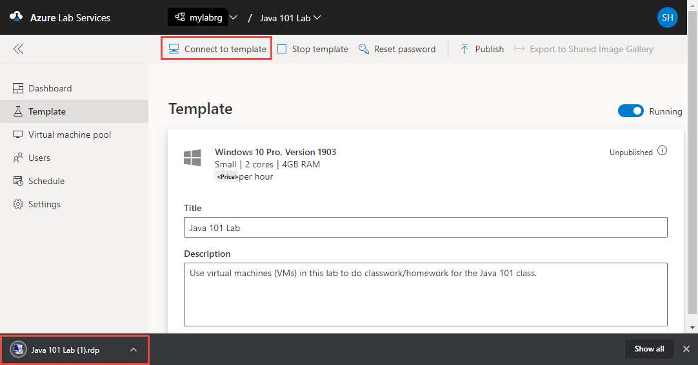

# Create and manage a classroom template in Azure Lab Services
A template in a lab is a base virtual machine image from which all users’ virtual machines are created. Set up the template virtual machine so that it is configured with exactly what you want to provide to the lab users. You can provide a name and description of the template that the lab users see. Then, you publish the template to make instances of the template VM available to your lab users. When you publish a template, Azure Lab Services creates VMs in the lab by using the template. The number of VMs created in this process is same as the maximum number of users allowed into the lab, which you can set in the usage policy of the lab. All virtual machines have the same configuration as the template.

This article describes how to create and manage a template virtual machine in a classroom lab of Azure Lab Services. 

> [!NOTE]
> When you create a lab, the template VM is created but it’s not started. You can start it, connect to it, and install any pre-requisite software for the lab, and then publish it. When you publish the template VM, it’s is automatically shut down for you if you haven’t done so. 
> 
> Template VMs incur **cost** when running, so ensure that the template VM is shutdown when you don’t need it to be running. 

## Set or update template title and description
Use the following steps to set title and description for the first time, and update them later. 

1. On the **Template** page, enter the new **title** for the lab.  
2. Enter the new **description** for the template. When you move the focus out of the text box, it's automatically saved. 

    

## Update a template VM
Use the following steps to update a template VM.  

1. Wait until the template VM is started, and then select **Connect to template** on the toolbar to connect to the template VM, and follow instructions. If it's a Windows machine, you will see an option to download the RDP file. 
1. Once you connect to the template and make changes, it will no longer have the same setup as the virtual machines last published to your users. Template changes will not be reflected on your users' existing virtual machines until after you publish again.

    
    
1. Install any software that's required for students to do the lab (for example, Visual Studio, Azure Storage Explorer, etc.). 
1. Disconnect (close your remote desktop session) from the template VM. 
1. **Stop** the template VM by selecting **Stop template**. 
1. Follow steps in the next section to **Publish** the updated template VM. 

## Publish the template VM  
In this step, you publish the template VM. When you publish the template VM, Azure Lab Services creates VMs in the lab by using the template. All virtual machines have the same configuration as the template.

1. On the **Template** page, select **Publish** on the toolbar. 

    

    > [!WARNING]
    > Once you publish, you can't unpublish. 
2. On the **Publish template** page, enter the number of virtual machines you want to create in the lab, and then select **Publish**. 

    
3. You see the **status of publishing** the template on page. This process can take up to an hour. 

    
4. Wait until the publishing is complete and then switch to the **Virtual machines pool** page by selecting **Virtual machines** on the left menu or by selecting **Virtual machines** tile. Confirm that you see virtual machines that are in **Unassigned** state. These VMs are not assigned to students yet. They should be in **Stopped** state. You can start a student VM, connect to the VM, stop the VM, and delete the VM on this page. You can start them in this page or let your students start the VMs.

    

## Next steps

See the following articles:

- [As an admin, create and manage lab plans](how-to-manage-lab-plans.md)
- [As a lab owner, create and manage labs](how-to-manage-labs.md)
- [As a lab owner, configure and control usage of a lab](how-to-configure-student-usage.md)
- [As a lab user, access labs](how-to-use-classroom-lab.md)
