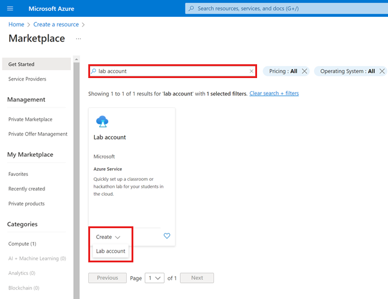
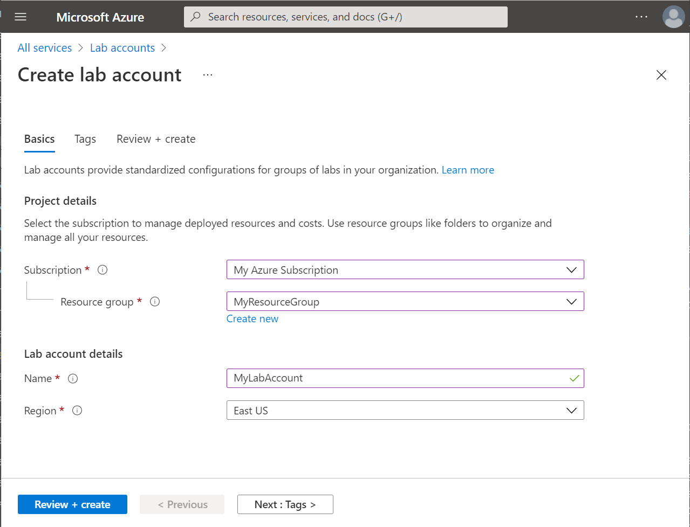
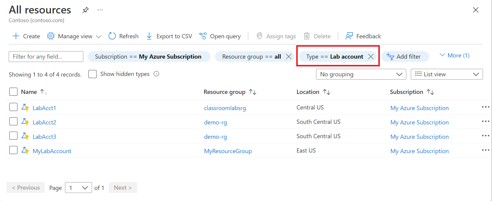
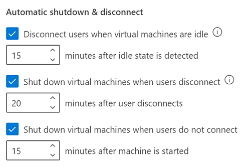

# Create and manage lab accounts (deprecated)

In Azure Lab Services, a lab account is a container for managed lab types such as labs. An administrator sets up a lab account with Azure Lab Services and provides access to lab owners who can create labs in the account. This article describes how to create a lab account, view all lab accounts, or delete a lab account.

## Create a lab account

The following steps illustrate how to use the Azure portal to create a lab account with Azure Lab Services.

1. Sign in to the [Azure portal](https://portal.azure.com).
2. Select **All Services** on the left menu. Select **Lab Accounts** in the **DevOps** section. If you select star (`*`) next to **Lab Accounts**, it's added to the **FAVORITES** section on the left menu. From the next time onwards, you select **Lab Accounts** under **FAVORITES**.

    
3. On the **Lab Accounts** page, select **Add** on the toolbar or **Create lab account** on the page.

    
4. On the **Basics** tab of the **Create a lab account** page, do the following actions:
    1. For **Lab account name**, enter a name. 
    2. Select the **Azure subscription** in which you want to create the lab account.
    3. For **Resource group**, select **Create new**, and enter a name for the resource group.
    4. For **Location**, select a location/region in which you want the lab account to be created.
    5. For the **Allow lab creator to pick lab location** field, specify whether you want lab creators to be able to select a location for the lab. By default, the option is disabled. When it's disabled, lab creators can't specify a location for the lab they are creating. The labs are created in the closest geographical location to lab account. When it's enabled, a lab creator can select a location at the time of creating a lab. For more information, see [Allow lab creator to pick location for the lab](allow-lab-creator-pick-lab-location.md).

        
5. Select **Next: Advanced** at the bottom of the page to navigate to the **Advanced** tab, and then do the following steps: 
    1. Select an existing **shared image gallery** or create one. You can save the template VM in the shared image gallery for it to be reused by others. For detailed information on shared image galleries, see [Use a shared image gallery in Azure Lab Services](how-to-use-shared-image-gallery.md).
    2. Specify whether you want to **automatically shut down Windows virtual machines** when users disconnect from them. Specify how long the virtual machines should wait for the user to reconnect before automatically shutting down.
    3. For **Peer virtual network**, select a peer virtual network (VNet) for the lab network. Labs created in this account are connected to the selected VNet and have access to the resources in the selected VNet. For more information, see [Connect your lab's virtual network with a peer virtual network](how-to-connect-peer-virtual-network.md).
    4. Specify an **address range** for VMs in the lab. The address range should be in the classless inter-domain routing (CIDR) notation (example: 10.20.0.0/23). Virtual machines in the lab will be created in this address range. For more information, see [Specify an address range for VMs in the lab](how-to-connect-peer-virtual-network.md#specify-an-address-range-for-vms-in-the-lab-account)  

        > [!NOTE]
        > The **address range** property applies only if a **peer virtual network** is enabled for the lab.

          
6. Select **Next: Tags** at the bottom of the page to switch to the **Tags** tab. Add any tags you want to associate with the lab account. Tags are name/value pairs that enable you to categorize resources and view consolidated billing by applying the same tag to multiple resources and resource groups. For more information, see [Use tags to organize your Azure resources](../azure-resource-manager/management/tag-resources.md).

    
7. Select **Review + create** at the bottom of this page to switch to the **Review + create** tab.
8. Review the summary information on this page, and select **Create**.

    
9. Wait until the deployment is complete, expand **Next steps**, and select **Go to resource** as shown in the following image:

    You can also select the **bell icon** on the toolbar (**Notifications**), confirm that the deployment succeeded, and then select **Go to resource**.

    Alternatively, select **Refresh** on the **Lab Accounts** page, and select the lab account you created.

    
10. You see the following **lab account** page:

    

## View lab accounts

1. Sign in to the [Azure portal](https://portal.azure.com).
2. Select **All resources** from the menu.
3. Select **Lab Accounts** for the **type**.
    You can also filter by subscription, resource group, locations, and tags.

    

## Delete a lab account

Follow instructions from the previous section that displays lab accounts in a list. Use the following instructions to delete a lab account:

1. Select the **lab account** that you want to delete.
1. Select **Delete** from the toolbar.

    
1. Type **Yes** for confirmation.
1. Select **Delete**.

    

> [!NOTE]
> You can also use the Az.LabServices PowerShell module (preview) to manage lab accounts. For more information, see the [Az.LabServices home page on GitHub](https://aka.ms/azlabs/samples/PowerShellModule).

## Automatic shutdown settings

Automatic shutdown features enable you to prevent wasted VM usage hours in the labs. The following settings catch most of the cases where users accidentally leave their virtual machines running:

> [!div class="mx-imgBorder"]
> 

You can configure these settings at both the lab account level and the lab level. If you enable them at the lab account level, they're applied to all labs within the lab account. For all new lab accounts, these settings are turned on by default.

### Automatically disconnect users from virtual machines that the OS deems idle

> [!NOTE]
> This setting is available only for Windows virtual machines.

When the **Disconnect users when virtual machines are idle** setting is turned on, the user is disconnected from any machines in the lab when the Windows OS deems the session to be idle (including the template virtual machines). The [Windows OS definition of idle](/windows/win32/taskschd/task-idle-conditions#detecting-the-idle-state) uses two criteria:

- User absence: no keyboard or mouse input.
- Lack of resource consumption: All the processors and all the disks were idle for a certain percentage of time.

Users will see a message like this in the VM before they're disconnected:

> [!div class="mx-imgBorder"]
> 

The virtual machine is still running when the user is disconnected. If the user reconnects to the virtual machine by signing in, windows or files that were open or work that was unsaved before the disconnect will still be there. In this state, because the virtual machine is running, it still counts as active and accrues cost.

To automatically shut down idle Windows virtual machines that are disconnected, use the combination of **Disconnect users when virtual machines are idle** and **Shut down virtual machines when users disconnect** settings.

For example, if you configure the settings as follows:

- **Disconnect users when virtual machines are idle**: 15 minutes after the idle state is detected.
- **Shut down virtual machines when users disconnect**: 5 minutes after the user disconnects.

The Windows virtual machines will automatically shut down 20 minutes after the user stops using them.

> [!div class="mx-imgBorder"]
> 

### Automatically shut down virtual machines when users disconnect

The **Shut down virtual machines when users disconnect** setting supports both Windows and Linux virtual machines. When this setting is on, automatic shutdown will occur when:

- For Windows, a Remote Desktop (RDP) connection is disconnected.
- For Linux, a SSH connection is disconnected.

> [!IMPORTANT]
> Only [specific distributions and versions of Linux](../virtual-machines/extensions/diagnostics-linux.md#supported-linux-distributions) are supported.  Shutdown settings are not supported by the [Data Science Virtual Machine - Ubuntu 18.04](https://azuremarketplace.microsoft.com/marketplace/apps/microsoft-dsvm.ubuntu-1804) image.

You can specify how long the virtual machines should wait for the user to reconnect before automatically shutting down.

### Automatically shut down virtual machines that are started but users don't connect

In a lab, a user might start a virtual machine but never connect to it. For example:

- A schedule in the lab starts all virtual machines for a class session, but some students don't show up and don't connect to their machines.
- A user starts a virtual machine but forgets to connect.

The **Shut down virtual machines when users do not connect** setting will catch these cases and automatically shut down the virtual machines.

For information on how to configure and enable automatic shutdown of VMs on disconnect, see these articles:

- [Configure automatic shutdown of VMs for a lab account](how-to-configure-lab-accounts.md)
- [Configure automatic shutdown of VMs for a lab](how-to-enable-shutdown-disconnect.md)

## Next steps

See other articles in the **How-to guides** -> **Create and configure lab accounts (lab account owner)** section of the table-of-content (TOC).
