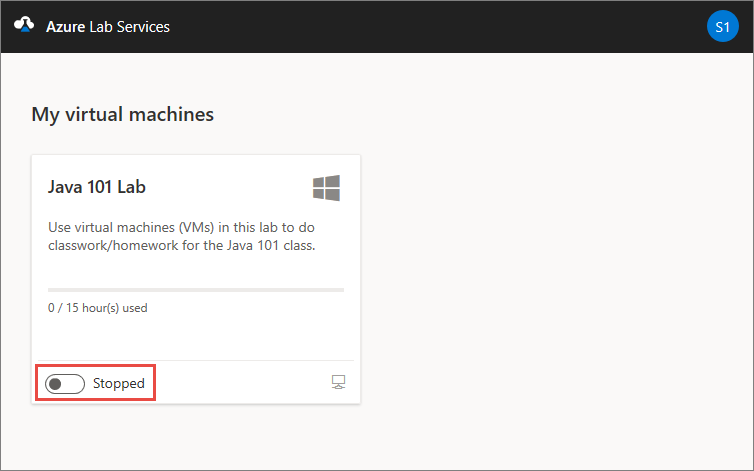
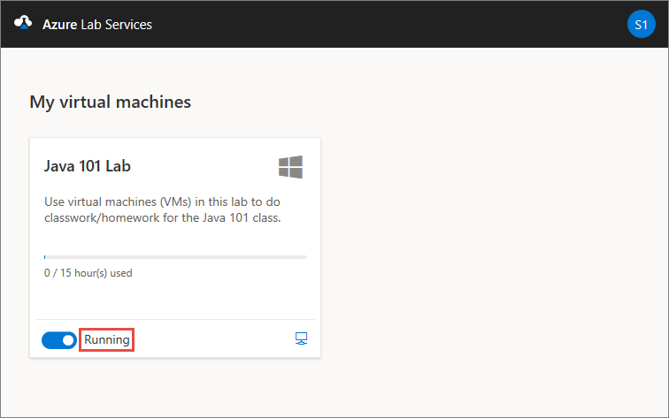
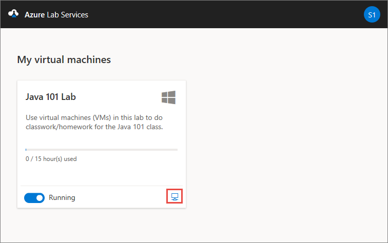
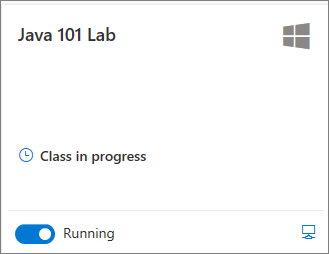
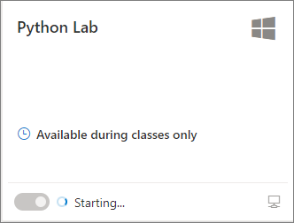
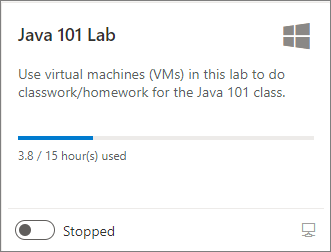
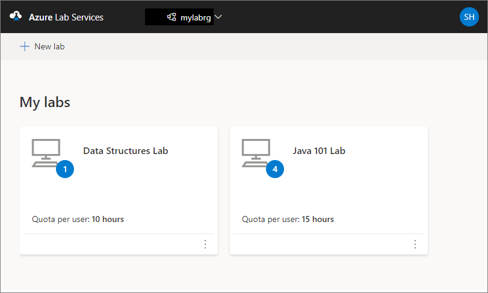

# How to access a classroom lab in Azure Lab Services
This article describes how to register to a classroom lab, view all the labs that you can access, start/stop a VM in the lab, and connect to the VM. 

## Register to the lab

1. Navigate to the **registration URL** that you received from the educator. You don't need to use the registration URL after you complete the registration. Instead, use the URL: [https://labs.azure.com](https://labs.azure.com). Internet Explorer 11 isn't supported yet. 

    
1. Sign in to the service using your school account to complete the registration. 

    > [!NOTE]
    > A Microsoft account is required for using Azure Lab Services. If you are trying to use your non-Microsoft account such as Yahoo or Google accounts to sign in to the portal, follow instructions to create a Microsoft account that will be linked to your non-Microsoft account. Then, follow the steps to complete the registration process. 
1. Once registered, confirm that you see the virtual machine for the lab you have access to. 

    
1. Wait until the virtual machine is ready. On the VM tile, notice the following fields:
    1. At the top of the tile, you see the **name of the lab**.
    1. To its right, you see the icon representing the **operating system (OS)** of the VM. In this example, it's Windows OS. 
    1. You see icons/buttons at the bottom of the tile to start/stop the VM, and connect to the VM. 
    1. To the right of the buttons, you see the status of the VM. Confirm that you see the status of the VM is **Stopped**.

        

## Start or stop the VM
1. **Start** the VM by selecting the first button as shown in the following image. This process takes some time.  

    
4. Confirm that the status of the VM is set to **Running**. 

    

    Notice that the icon of the first button changed to represent a **stop** operation. You can select this button to stop the VM. 

## Connect to the VM

1. Select the second button as shown in the following image to **connect** to the lab's VM. 

    
2. Do one of the following steps: 
    1. For **Windows** virtual machines, save the **RDP** file to the hard disk. Open the RDP file to connect to the virtual machine. Use the **user name** and **password** you get from your educator to sign in to the machine. 
    3. For **Linux** virtual machines, you can use **SSH** or **RDP** (if it's enabled) to connect to them. For more information, see [Enable remote desktop connection for Linux machines](how-to-enable-remote-desktop-linux.md). 
    1. If you are using a **Mac** to connect to the lab VM, follow instructions in the next section. 

## Progress bar 
The progress bar on the tile shows the number of hours used against the number of [quota hours](how-to-configure-student-usage.md#set-quotas-for-users) assigned to you. This time is the additional time allotted to you in addition to the scheduled time for the lab. The color of the progress bar and the text under the progress bar varies as per the following scenarios:

- If a class is in progress (within the schedule of the class), progress bar is grayed out to represent quota hours aren't being used. 

    
- If a quota isn't assigned (zero hours), the text **Available during classes only** is shown in place of the progress bar. 
    
    
- If you ran **out of quota**, the color of the progress bar is **red**. 

    
- The color of the progress bar is **blue** when it's outside the scheduled time for the lab and some of the quota time has been used. 

    

## View all the labs
After you register to the labs, you can view all the labs by taking the following steps: 

1. Navigate to [https://labs.azure.com](https://labs.azure.com). Internet Explorer 11 isn't supported yet. 
2. Sign in to the service by using the user account that you used to register to the lab. 
3. Confirm that you see all the labs you have access to. 

    

## Next steps

See the following articles:

- [As an admin, create and manage lab plans](how-to-manage-lab-plans.md)
- [As a lab owner, create and manage labs](how-to-manage-labs.md)
- [As a lab owner, set up and publish templates](how-to-create-manage-template.md)
- [As a lab owner, configure and control usage of a lab](how-to-configure-student-usage.md)
