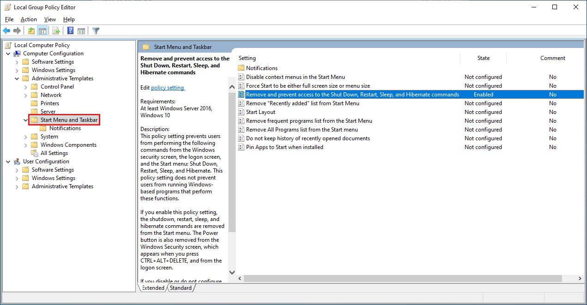
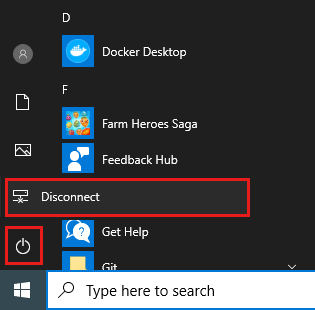

# Guide to controlling Windows shutdown behavior

Azure Lab Services provides several cost controls to ensure that Windows virtual machines (VMs) are not running unexpectedly:

- [Set a schedule](./tutorial-setup-lab.md#set-a-schedule-for-the-lab)
- [Set quotas for users](./how-to-configure-student-usage.md#set-quotas-for-users)
- [Enable automatic shutdown on disconnect](./how-to-enable-shutdown-disconnect.md)

Even with these cost controls, there are situations where a Windows VM may unexpectedly continue to run; and as a result, deduct from the student's quota:

- **RDP window is left open**
  
    When a student connects to their VM using RDP, they may inadvertently leave the RDP window open.  As long as the RDP window remains open, the **automatic shutdown on disconnect** setting will never take effect since it is only triggered after the RDP session is disconnected.

- **Windows shutdown command is used to turn off the VM**
  
    A student may use Windows shutdown command, or other shutdown mechanisms provided within Windows, to turn off the VM instead of using [Azure Lab Services' stop button](./how-to-use-lab.md#start-or-stop-the-vm).  When this happens, from the perspective of Azure Lab Services, the VM is still being used.
    
To help you prevent these situations from happening, this guide provides steps to automatically shutdown an idle Windows VM and remove the Windows shutdown command from the **Start** menu.  

> [!NOTE]
> A VM may also unexpectedly deduct from the quota when the student starts their VM, but never actually connects to it using RDP.  This guide does *not* currently address this scenario.  Instead, students should be reminded to immediately connect to their VM using RDP after they start it; or, they should stop the VM.

## Remove Windows shutdown command from Start menu

Windows **Local Group Policy** settings also allow you to remove the shutdown command from the **Start** menu.

To remove the shutdown command, you can connect to the template VM and execute the below PowerShell script.

```powershell
Set-ItemProperty -Path "HKLM:\SOFTWARE\Microsoft\Windows\CurrentVersion\Policies\Explorer" -Name "HidePowerOptions" -Value 1 -Force
```

Or, you can choose to follow these manual steps using the template VM:

1. Press the Windows key, type **gpedit**, then select **Edit group policy (Control panel)**.

1. Go to **Computer Configuration > Administrative Templates > Start Menu and Taskbar**.  

    

1. Right-click **Remove and prevent access to the Shut Down, Restart, Sleep, and Hibernate commands**, and click **Edit**.

1. Select the **Enabled** setting and then click **OK**:
 
   

1. Notice that the shutdown command no longer appears under Windows **Start** menu; only the **Disconnect** command appears.

    

## Next steps
See the article on how to prepare a Windows template VM: [Guide to setting up a Windows template machine in Azure Lab Services](how-to-prepare-windows-template.md)