# Create replication tasks for Azure resources using Azure Logic Apps (preview)

> [!IMPORTANT]
> This capability is in preview and is subject to the 
> [Supplemental Terms of Use for Microsoft Azure Previews](https://azure.microsoft.com/support/legal/preview-supplemental-terms/).

While maximum availability and reliability are top operational priorities for Azure services, many ways still exist for communication to stop due to networking or name resolution problems, errors, or temporary unresponsiveness. Such conditions aren't "disastrous" such that you'll want to abandon the regional deployment altogether as you might do in disaster recovery situation. However, the business scenario for some apps might become impacted by availability events that last no more than a few minutes or even seconds.

To reduce the effect that unpredictable events can have on your Azure resources in an Azure region, you can replicate the content in these resources from one region to another region so that you can maintain business continuity. In Azure, you can create a [*replication task*](#replication-task) that moves the data, events, or messages from a source in one region to a target in another region. That way, you can have the target readily available if the source goes offline and the target has to take over.

> [!NOTE]
> You can also use replication tasks to move content between entities in the same region, but if the 
> entire region becomes unavailable or experiences disruption, both source and target are affected.

This article provides an overview about replication tasks powered by Azure Logic Apps and shows how to create an example replication task for Azure Service Bus queues. If you're new to logic apps and workflows, review [What is Azure Logic Apps](logic-apps-overview.md) and [Single-tenant versus multi-tenant and integration service environment for Azure Logic Apps](single-tenant-overview-compare.md).

<a name="replication-task"></a>

## What is a replication task?

Generally, a replication task receives data, events, or messages from a source, moves that content to a target, and then deletes that content from the source, except for when the source is an Event Hubs entity. The replication task usually moves the content unchanged, but replication tasks powered by Azure Logic Apps also add [replication properties](#replication-properties). If the source and target protocols differ, these tasks also perform mappings between metadata structures. Replication tasks are stateless, meaning that they don't share states or other side effects across parallel or sequential executions of a task.

When you use the available replication task templates, each replication task that you create has an underlying [stateless workflow](single-tenant-overview-compare.md#stateful-stateless) in a **Logic App (Standard)** resource, which can include multiple workflows for replication tasks. This resource is hosted in single-tenant Azure Logic Apps, which is a scalable and reliable execution environment for configuring and running serverless applications, including replication and federation tasks. The single-tenant Azure Logic Apps runtime also uses the [Azure Functions extensibility model](../azure-functions/functions-bindings-register.md) and is hosted as an extension on the Azure Functions runtime. This design provides portability, flexibility, and more performance for logic app workflows plus other capabilities and benefits inherited from the Azure Functions platform and Azure App Service ecosystem.

For more information about replication and federation, review the following documentation:

- [Event Hubs multi-site and multi-region federation](../event-hubs/event-hubs-federation-overview.md)
- [Event replication tasks patterns](../event-hubs/event-hubs-federation-patterns.md)
- [Service Bus message replication and cross-region federation](../service-bus-messaging/service-bus-federation-overview.md)
- [Message replication tasks patterns](../service-bus-messaging/service-bus-federation-patterns.md)

<a name="replication-task-templates"></a>

## Replication task templates

Currently, replication task templates are available for [Azure Event Hubs](../event-hubs/event-hubs-about.md) and [Azure Service Bus](../service-bus-messaging/service-bus-messaging-overview.md). The following table lists the replication task templates currently available in this preview:

| Resource type | Replication source and target |
|---------------|-------------------------------|
| Azure Event Hubs namespace | - Event Hubs instance to Event Hubs instance <br>- Event Hubs instance to Service Bus queue <br>- Event Hubs instance to Service Bus topic |
| Azure Service Bus namespace | - Service Bus queue to Service Bus queue <br>- Service Bus queue to Service Bus topic <br>- Service Bus queue to Event Hub instance <br>- Service Bus topic subscription to Service Bus queue <br>- Service Bus topic subscription to Event Hubs instance |
|||

### Replication topology and workflow

To help you visualize how a replication task powered by Azure Logic Apps (Standard) works, the following diagrams show the replication task structure and workflow for Event Hubs instances and for Service Bus queues.

#### Replication topology for Event Hubs

The following diagram shows the topology and replication task workflow between Event Hubs instances:


For information about replication and federation in Azure Event Hubs, review the following documentation:

- [Event Hubs multi-site and multi-region federation](../event-hubs/event-hubs-federation-overview.md)
- [Event replication tasks patterns](../event-hubs/event-hubs-federation-patterns.md)

#### Replication topology for Service Bus

The following diagram shows the topology and replication task workflow between Service Bus queues:


For information about replication and federation in Azure Service Bus, review the following documentation:

- [Service Bus message replication and cross-region federation](../service-bus-messaging/service-bus-federation-overview.md)
- [Message replication tasks patterns](../service-bus-messaging/service-bus-federation-patterns.md)

<a name="replication-properties"></a>

## Metadata and property mappings

For Event Hubs, the following items obtained from the source Event Hubs namespace are replaced by new service-assigned values in the target Event Hub namespace: service-assigned metadata of an event, original enqueue time, sequence number, and offset. However, for [helper functions](https://github.com/Azure-Samples/azure-messaging-replication-dotnet/tree/main/src/Azure.Messaging.Replication) and the replication tasks in the Azure-provided samples, the original values are preserved in the user properties: `repl-enqueue-time` (ISO8601 string), `repl-sequence`, and `repl-offset`. These properties have the `string` type and contain the stringified value of the respective original properties. If the event is forwarded multiple times, the service-assigned metadata of the immediate source is appended to the already existing properties, with values separated by semicolons. For more information, review [Service-assigned metadata - Event replication task patterns](../event-hubs/event-hubs-federation-patterns.md#service-assigned-metadata).

For Service Bus, the following items obtained from the source Service Bus queue or topic are replaced by new service-assigned values in the target Service Bus queue or topic: service-assigned metadata of a message, original enqueue time, and sequence number. However, for the default replication tasks in the Azure-provided samples, the original values are preserved in the user properties: `repl-enqueue-time` (ISO8601 string) and `repl-sequence`. These properties have the `string` type and contain the stringified value of the respective original properties. If the message is forwarded multiple times, the service-assigned metadata of the immediate source is appended to the already existing properties, with values separated by semicolons. For more information, review [Service-assigned metadata - Message replication task patterns](../service-bus-messaging/service-bus-federation-patterns.md#service-assigned-metadata).

When a task replicates from Service Bus to Event Hubs, the task maps only the `User Properties` property to the `Properties` property. However, when the task replicates from Event Hubs to Service Bus, the task maps the following properties:

| From Event Hubs | To Service Bus |
|-----------------|----------------|
| ContentType | ContentType |
| CorrelationId | CorrelationId |
| MessageId | MessageId |
| PartitionKey | PartitionKey SessionId |
| Properties | User Properties |
| ReplyTo | ReplyTo |
| ReplyToGroupName | ReplyToSessionId |
| Subject | Label |
| To | To |
|||

<a name="order-preservation"></a>

## Order preservation

For Event Hubs, replication between the same number of [partitions](../event-hubs/event-hubs-features.md#partitions) creates 1:1 clones with no changes in the events, but can also include duplicates. However, replication between different numbers of partitions, only the relative order of events is preserved based on partition key, but can also include duplicates. For more information, review [Streams and order preservation](../event-hubs/event-hubs-federation-patterns.md#streams-and-order-preservation).

For Service Bus, you must enable sessions so that message sequences with the same session ID retrieved from the source are submitted to the target queue or topic as a batch in the original sequence and with the same session ID. For more information, review [Sequences and order preservation](../service-bus-messaging/service-bus-federation-patterns.md#sequences-and-order-preservation).

To learn more about multi-site and multi-region federation for Azure services where you can create replication tasks, review the following documentation:

- [Event Hubs multi-site and multi-region federation](../event-hubs/event-hubs-federation-overview.md)
- [Event replication tasks patterns](../event-hubs/event-hubs-federation-patterns.md)
- [Service Bus message replication and cross-region federation](../service-bus-messaging/service-bus-federation-overview.md)
- [Message replication tasks patterns](../service-bus-messaging/service-bus-federation-patterns.md)

<a name="pricing"></a>

## Pricing

Underneath, a replication task is powered by a stateless workflow in a **Logic App (Standard)** resource that's hosted in single-tenant Azure Logic Apps. When you create this replication task, charges start incurring immediately. Usage, metering, billing, and the pricing model follow the [Standard hosting plan](logic-apps-pricing.md#standard-pricing) and [Standard plan pricing tiers](logic-apps-pricing.md#standard-pricing-tiers).

<a name="scale-up"></a>

Based on the number of events that Event Hubs receives or messages that Service Bus handles, your hosting plan might scale up or down to maintain minimum vCPU usage and low latency during active replication. This behavior requires that when you create a logic app resource to use for your replication task, [choose the appropriate Standard plan pricing tier](#scale-out) so that Azure Logic Apps doesn't throttle or start maxing out CPU usage and can still guarantee fast replication speed.

<a name="scale-out"></a>

The following examples illustrate hosting plan pricing tier and configuration options that provide the best throughput and cost for specific replication task scenarios, based on whether the scenario is Event Hubs or Service Bus and various configuration values.

> [!NOTE]
> The examples in the following sections use 800 as the default value for the the prefetch count, 
> maximum event batch size for Event Hubs, and maximum message count for Service Bus, assuming 
> that the event or message size is 1 KB. Based on your event sizes, you might want to adjust the 
> prefetch count, maximum event batch size, or maximum message count. For example, if your event 
> size or message size is over 1 KB, you might want to reduce the values for the prefetch count, 
> and maximum event batch size or message count from 800.

### Event Hubs scale out

The following examples illustrate hosting plan pricing tier and configuration options for a replication task between two Event Hubs namespaces *in the same region*, based on the number of [partitions](../event-hubs/event-hubs-features.md#partitions), the number of events per second, and other configuration values.

> [!NOTE]
> The examples in this section use 800 as the default value for the prefetch count and maximum event batch size, 
> assuming that the event size is 1 KB. Based on your event sizes, you might want to adjust the prefetch count 
> and maximum event batch size. For example, if your event size is over 1 KB, you might want to reduce the values 
> for the prefetch count and maximum event batch size from 800.

| Pricing tier | Partition count | Events per second | Maximum bursts* | Always ready instances* | Prefetch count* | Maximum event batch size* |
|--------------|-----------------|-------------------|----------------|-------------------------|-----------------|-----------------|
| **WS1** | 1 | 1000 | 1 | 1 | 800 | 800 |
| **WS1** | 2 | 2000 | 1 | 1 | 800 | 800 |
| **WS2** | 4 | 4000 | 2 | 1 | 800 | 800 |
| **WS2** | 8 | 8000 | 2 | 1 | 800 | 800 |
| **WS3** | 16 | 16000 | 2 | 1 | 800 | 800 |
| **WS3** | 32 | 32000 | 3 | 1 | 800 | 800 |
||||||||

\* For more information about the values that you can change for each pricing tier, review the following table:

| Value | Description |
|-------|-------------|
| **Maximum bursts** | The *maximum* number of elastic workers to scale out under load. If your underlying app requires instances beyond the *always ready instances* in the next table row, your app can continue to scale out until the number of instances hits the maximum burst limit. To change this value, review [Edit hosting plan scale out settings](#edit-plan-scale-out-settings) later in this article. <p>**Note**: Any instances beyond your plan size are billed *only* when they are running and allocated to you on a per-second basis. The platform makes a best effort to scale out your app to the defined maximum limit. As a best practice, select a maximum value beyond the number that you might need as unused instances aren't billed. <p>For more information, review the following documentation as the Workflow Standard plan shares some aspects with the Azure Functions Premium plan: <p>- [Plan and SKU settings - Azure Functions Premium plan](../azure-functions/functions-premium-plan.md#plan-and-sku-settings) <br>- [What is cloud bursting](https://azure.microsoft.com/overview/what-is-cloud-bursting/)? |
| **Always ready instances** | The minimum number of instances that are always ready and warm for hosting your app. The minimum number is always 1. To change this value, review [Edit hosting plan scale out settings](#edit-plan-scale-out-settings) later in this article. <p>**Note**: Any instances beyond your plan size are billed *whether or not* they are running when allocated to you. <p>For more information, review the following documentation as the Workflow Standard plan shares some aspects with the Azure Functions Premium plan: [Always ready instances - Azure Functions Premium plan](../azure-functions/functions-premium-plan.md#always-ready-instances). |
| **Prefetch count** | The default value for `AzureFunctionsJobHost__extensions__eventHubs__eventProcessorOptions__prefetchCount` app setting in your logic app resource that determines the pre-fetch count used by the underlying `EventProcessorHost` class. To add or specify a different value for this app setting, review [Manage app settings - local.settings.json](edit-app-settings-host-settings.md?tabs=azure-portal#manage-app-settings), for example: <p>- **Name**: `AzureFunctionsJobHost__extensions__eventHubs__eventProcessorOptions__prefetchCount` <br>- **Value**: `800` (no maximum limit) <p>For more information about the `prefetchCount` property, review the following documentation: <p>- [host.json settings - Azure Event Hubs trigger and bindings for Azure Functions](../azure-functions/functions-bindings-event-hubs.md#hostjson-settings) <br>- [EventProcessorOptions.PrefetchCount property](/dotnet/api/microsoft.azure.eventhubs.processor.eventprocessoroptions.prefetchcount) <br>- [Balance partition load across multiple instances of your application](../event-hubs/event-processor-balance-partition-load.md). <br>- [Event processor host](../event-hubs/event-hubs-event-processor-host.md) <br>- [EventProcessorHost Class](/dotnet/api/microsoft.azure.eventhubs.processor.eventprocessorhost) |
| **Maximum event batch size** | The default value for the `AzureFunctionsJobHost__extensions__eventHubs__eventProcessorOptions__maxBatchSize` app setting in your logic app resource that determines the maximum event count received by each receive loop. To add or specify a different value for this app setting, review [Manage app settings - local.settings.json](edit-app-settings-host-settings.md?tabs=azure-portal#manage-app-settings), for example: <p>- **Name**: `AzureFunctionsJobHost__extensions__eventHubs__eventProcessorOptions__maxBatchSize` <br>- **Value**: `800` (no maximum limit) <p>For more information about the `maxBatchSize` property, review the following documentation: <p>- [host.json settings - Azure Event Hubs trigger and bindings for Azure Functions](../azure-functions/functions-bindings-event-hubs.md#hostjson-settings) <br>- [EventProcessorOptions.MaxBatchSize property](/dotnet/api/microsoft.azure.eventhubs.processor.eventprocessoroptions.maxbatchsize) <br>- [Event processor host](../event-hubs/event-hubs-event-processor-host.md) |
|||

### Service Bus scale out

The following examples illustrate hosting plan pricing tier and configuration options for a replication task between two Service Bus namespaces *in the same region*, based on the number of messages per second and other configuration values.

> [!NOTE]
> The examples in this section use 800 as the default value for the prefetch count and maximum message count, 
> assuming that the message size is 1 KB. Based on your message sizes, you might want to adjust the prefetch 
> count and maximum message count. For example, if your message size is over 1 KB, you might want to reduce 
> the values for the prefetch count and maximum message count from 800.

| Pricing tier | Messages per second | Maximum bursts* | Always ready instances* | Prefetch count* | Maximum message count* |
|--------------|---------------------|-----------------|-------------------------|-----------------|---------------------|
| **WS1** | 2000 | 1 | 1 | 800 | 800 |
| **WS2** | 2500 | 1 | 1 | 800 | 800 |
| **WS3** | 3500 | 1 | 1 | 800 | 800 |
|||||||

\* For more information about the values that you can change for each pricing tier, review the following table:

| Value | Description |
|-------|-------------|
| **Maximum bursts** | The *maximum* number of elastic workers to scale out under load. If your underlying app requires instances beyond the *always ready instances* in the next table row, your app can continue to scale out until the number of instances hits the maximum burst limit. To change this value, review [Edit hosting plan scale out settings](#edit-plan-scale-out-settings) later in this article. <p>**Note**: Any instances beyond your plan size are billed *only* when they are running and allocated to you on a per-second basis. The platform makes a best effort to scale out your app to the defined maximum limit. As a best practice, select a maximum value beyond the number that you might need as unused instances aren't billed. <p>For more information, review the following documentation as the Workflow Standard plan shares some aspects with the Azure Functions Premium plan: <p>- [Plan and SKU settings - Azure Functions Premium plan](../azure-functions/functions-premium-plan.md#plan-and-sku-settings) <br>- [What is cloud bursting](https://azure.microsoft.com/overview/what-is-cloud-bursting/)? |
| **Always ready instances** | The minimum number of instances that are always ready and warm for hosting your app. The minimum number is always 1. To change this value, review [Edit hosting plan scale out settings](#edit-plan-scale-out-settings) later in this article. <p>**Note**: Any instances beyond your plan size are billed *whether or not* they are running when allocated to you. <p>For more information, review the following documentation as the Workflow Standard plan shares some aspects with the Azure Functions Premium plan: [Always ready instances - Azure Functions Premium plan](../azure-functions/functions-premium-plan.md#always-ready-instances). |
| **Prefetch count** | The default value for `AzureFunctionsJobHost__extensions__serviceBus__prefetchCount` app setting in your logic app resource that determines the pre-fetch count used by the underlying `ServiceBusProcessor` class. To add or specify a different value for this app setting, review [Manage app settings - local.settings.json](edit-app-settings-host-settings.md?tabs=azure-portal#manage-app-settings), for example: <p>- **Name**: `AzureFunctionsJobHost__extensions__eventHubs__eventProcessorOptions__prefetchCount` <br>- **Value**: `800` (no maximum limit) <p>For more information about the `prefetchCount` property, review the following documentation: <p>- [host.json settings - Azure Service Bus bindings for Azure Functions](../azure-functions/functions-bindings-service-bus.md#hostjson-settings) <br>- [ServiceBusProcessor.PrefetchCount property](/dotnet/api/azure.messaging.servicebus.servicebusprocessor.prefetchcount) <br>- [ServiceBusProcessor Class](/dotnet/api/azure.messaging.servicebus.servicebusprocessor) |
| **Maximum message count** | The default value for the `AzureFunctionsJobHost__extensions__serviceBus__batchOptions__maxMessageCount` app setting in your logic app resource that determines the maximum number of messages to send when triggered. To add or specify a different value for this app setting, review [Manage app settings - local.settings.json](edit-app-settings-host-settings.md?tabs=azure-portal#manage-app-settings), for example: <p>- **Name**: `AzureFunctionsJobHost__extensions__serviceBus__batchOptions__maxMessageCount` <br>- **Value**: `800` (no maximum limit) <p>For more information about the `maxMessageCount` property, review the following documentation: [host.json settings - Azure Event Hubs bindings for Azure Functions](../azure-functions/functions-bindings-service-bus.md#hostjson-settings).|
|||

## Prerequisites

- An Azure account and subscription. If you don't have a subscription, [sign up for a free Azure account](https://azure.microsoft.com/free/?WT.mc_id=A261C142F).

- The source and target resources or entities, which should exist in different Azure regions so that you can test for the geo-disaster recovery failover scenario. These entities can vary based on the task template that you want to use. The example in this article uses two Service Bus queues, which are located in different namespaces and Azure regions.

- A **Logic App (Standard)** resource that you can reuse when you create the replication task. That way, you can customize this resource specifically for your replication task, for example, by [choosing the hosting plan and pricing tier](#pricing) based on your replication scenario's needs, such as capacity, throughput, and scaling. Although you can create this resource when you create the replication task, you can't change the region, hosting plan, and pricing tier. The following list provides other reasons and best practices for a previously created logic app resource:

  - You can create this logic app resource in a region that differs from the source and target entities in your replication task.

    Currently, this guidance is provided due to the replication task's native integration within Azure resources. When you create a replication task between entities and choose to create a new logic app resource rather than use an existing one, the *new logic app is created in the same region as the source entity*. If the source region becomes unavailable, the replication task also can't work. In a failover scenario, the task also can't start reading data from the new source, formerly the target entity, which is what the [active-passive replication pattern](../service-bus-messaging/service-bus-federation-overview.md#active-passive-replication) tries to achieve.

  - You can customize this logic app resource ahead of time by choosing the hosting plan and pricing tier, rather than using the default attributes. That way, your replication task can process more events or messages per second for faster replication. If you create this resource when you create the replication task, these default attributes are fixed.

  - You can make sure that this logic app resource contains *only replication task workflows*, especially if you want to follow the active-passive replication pattern. When you use an existing logic app to create your replication task, this option adds the task (stateless workflow) to that logic app resource.

  For more information, review [Create an integration workflow with single-tenant Azure Logic Apps (Standard) in the Azure portal](create-single-tenant-workflows-azure-portal.md).

- Optional: The connection string for the target namespace. This option enables having the target exist in a different subscription, so that you can set up cross-subscription replication.

   To find the connection string for the target entity, follow these steps:

   1. In the [Azure portal](https://portal.azure.com), go to the target namespace.

   1. On the namespace navigation menu, under **Settings**, select **Shared access policies**.

   1. On the **Shared access policies** pane that opens, under **Policy**, select **RootManageSharedAccessKey**.

   1. On the **SAS Policy: RootManageSharedAccessKey** pane that opens, copy the **Primary Connection String** value.

   1. Save the connection string somewhere so that you can later use the string to connect to the target namespace.

<a name="naming"></a>

## Naming conventions

Give careful consideration to the naming strategy you use for your replication tasks or entities, if you haven't created them yet. Make sure that the names are easily identifiable and differentiated. For example, if you're working with Event Hubs namespace, the replication task replicates from every event hub in the source namespace. If you're working with Service Bus queues, the following table provides an example for naming the entities and replication task:

| Source name | Example | Replication app | Example | Target name | Example |
|-------------|---------|-----------------|---------|-------------|---------|
| Namespace: `<name>-sb-<region>` | `fabrikam-sb-weu` | Logic app: `<name-source-region-target-region>` | `fabrikam-rep-weu-wus` | Namespace: `<name>-sb-<region>` | `fabrikam-sb-wus` |
| Queue: `<name>` | `jobs-transfer` | Workflow: `<name>` | `jobs-transfer-workflow` | Queue: `<name>` | `jobs` |
|||||||

<a name="create-replication-task"></a>

## Create a replication task

This example shows how to create a replication task for Service Bus queues.

1. In the [Azure portal](https://portal.azure.com), find the Service Bus namespace that you want to use as the source.

1. On the namespace navigation menu, in the **Automation** section, and select **Tasks (preview)**.

   

1. On the **Tasks** pane, select **Add a task** so that you can select a task template.

   

1. On the **Add a task** pane, under **Select a template**, in the template for the replication task that you want to create, select **Select**. If the next page doesn't appear, select **Next: Authenticate**.

   This example continues by selecting the **Replicate to Service Bus queue** task template, which replicates content between Service Bus queues.

   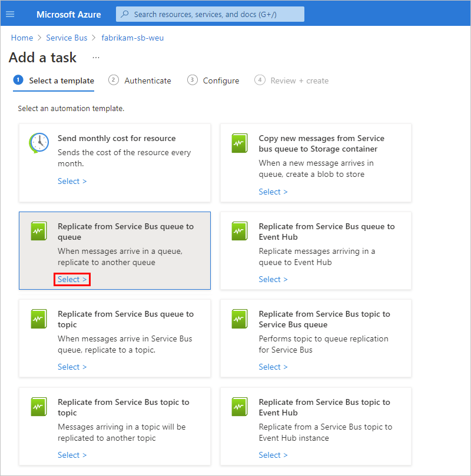

1. On the **Authenticate** tab, in the **Connections** section, select **Create** for every connection that appears in the task so that you can provide authentication credentials for all the connections. The types of connections in each task vary based on the task.

   This example shows the prompt to create the connection to the target Service Bus namespace where the target queue exists. The connection already exists for the source Service Bus namespace.

   

1. Provide the necessary information about the target, and then select **Create**.

   For this example, provide a display name for the connection, and then select the Service Bus namespace where the target queue exists.

   

   > [!TIP]
   > You can also create the connection with a connection string instead. This option 
   > enables having the target in a different subscription, so that you can set up 
   > cross-subscription replication. The target, or source based on where you started 
   > creating the replication task, is dynamically configured so that you only have 
   > to connect the target. To use a connection string, use the following steps:
   >
   > 1. On the **Connect** pane, select **Connect via connection string**.
   >
   > 2. In the **Connection String** box, enter the connection string for the target namespace.

   The following example shows the successfully created connection:

   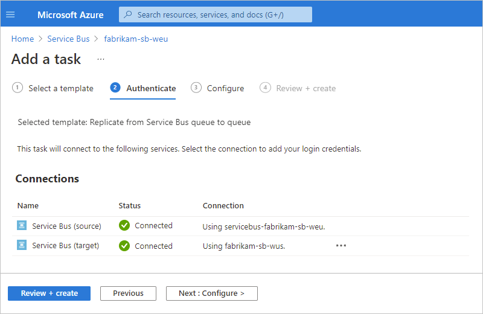

1. After you finish all the connections, select **Next: Configure**.

1. On the **Configure** tab, provide a name for the task and any other information required for the task.

   > [!NOTE]
   > You can't change the task name after creation, so consider a name that still applies if you 
   > [edit the underlying workflow](#edit-task-workflow). Changes that you make to the underlying 
   > workflow apply only to the task that you created, not the task template.
   >
   > For example, if you name your task `fabrikam-rep-weu-wus`, but you later edit the underlying 
   > workflow for a different purpose, you can't change the task name to match.

   1. To add the task workflow to an existing **Logic App (Standard)** resource, from the **Logic App** list, select the existing logic app. To create a new **Logic App (Standard)** resource instead, under the **Logic App** list, select **Create new**, and provide the name to use for the new logic app.

      > [!NOTE]
      > If you create a new logic app resource during replication task creation, the logic app is created in the 
      > *same region as the source entity*, which is problematic if the source region becomes unavailable and won't 
      > work in a failover scenario. The best practice is to create a **Logic App (Standard)** resource in a different 
      > region than your source. When you create the replication task, select the existing logic app instead and 
      > add the underlying stateless workflow to the existing logic app. For more information, review the [Prerequisites](#prerequisites).

   1. When you're done, select **Review + create**.

   

1. On **Review + create** tab, confirm the Azure resources that the replication task requires for operation.

   - If you chose to create a new logic app resource for the replication task, the pane shows the required Azure resources that the replication task will create to operate. For example, these resources include an Azure Storage account that contains configuration information for the logic app resource, workflow, and other runtime operations. For example with Event Hubs, this storage account contains checkpoint information and the position or *offset* in the stream where the source entity stops if the source region is disrupted or becomes unavailable.

     The following example shows the **Review + create** tab if you chose to create a new logic app:

     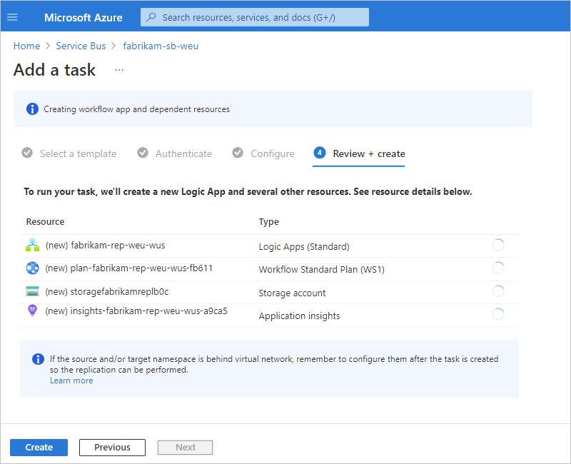

   - If you chose to reuse an existing logic app resource for the replication task, the pane shows the Azure resources that the replication will reuse to operate.

     The following example shows the **Review + create** tab if you chose to reuse an existing logic app:

     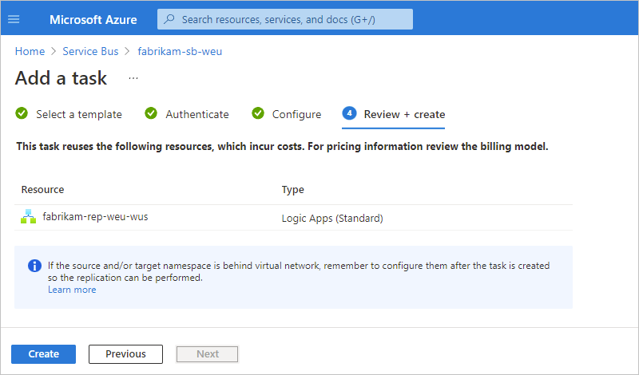

   > [!NOTE]
   > If your source, target, or both are behind a virtual network, you have to set up permissions and access 
   > after you create the task. In this scenario, permissions and access are required so that the logic app 
   > workflow can perform the replication task.

1. When you're ready, select **Create**.

   The task that you created, which is automatically live and running, now appears on the **Tasks** list.

   > [!TIP]
   > If the task doesn't appear immediately, try refreshing the tasks list or wait a little before you refresh. On the toolbar, select **Refresh**.

   

1. If your resources are behind a virtual network, remember to set up permissions for the logic app resource and workflow to access those resources.

## Set up retry policy

To avoid data loss during an availability event on either side of a replication relationship, you need to configure the retry policy for robustness. To configure the retry policy for a replication task, review the [documentation about retry policies in Azure Logic Apps](logic-apps-exception-handling.md#retry-policies) and the steps to [edit the underlying workflow](#edit-task-workflow).

<a name="review-task-history"></a>

## Review task history

This example shows how to view a task's history of workflow runs along with their statuses, inputs, outputs, and other information and continues using the example for a Service Bus queue replication task.

1. In the [Azure portal](https://portal.azure.com), find the Azure resource or entity that has the task history that you want to review.

   For this example, this resource is a Service Bus namespace.

1. On the resource navigation menu, under **Settings**, in the **Automation** section, select **Tasks (preview)**.

1. On the **Tasks** pane, find the task that you want to review. In that task's **Runs** column, select **View**.

   

   This step opens the **Overview** pane for the underlying stateless workflow, which is included in a Standard logic app resource.

1. To view run history for a stateless workflow, on the **Overview** pane toolbar, select **Enable debug mode**.

   The **Run History** tab shows any previous, in progress, and waiting runs for the task along with their identifiers, statuses, start times, and run durations.

   

   The following table describes the possible statuses for a run:

   | Status | Description |
   |--------|-------------|
   | **Cancelled** | The task was canceled while running. |
   | **Failed** | The task has at least one failed action, but no subsequent actions existed to handle the failure. |
   | **Running** | The task is currently running. |
   | **Succeeded** | All actions succeeded. A task can still finish successfully if an action failed, but a subsequent action existed to handle the failure. |
   | **Waiting** | The run hasn't started yet and is paused because an earlier instance of the task is still running. |
   |||

1. To view the statuses and other information for each step in a run, select that run.

   The run details pane opens and shows the underlying workflow that ran.

   - A workflow always starts with a [*trigger*](../connectors/apis-list.md#triggers). For this task, the workflow starts with a Service Bus trigger that waits for messages to arrive in the source Service Bus queue.

   - Each step shows its status and run duration. Steps that have 0-second durations took less than 1 second to run.

   

1. To review the inputs and outputs for each step, select the step, which opens a pane that shows the inputs, outputs, and properties details for that step.

   This example shows the inputs for the Service Bus trigger.

   

To learn how you can build your own automated workflows so that you can integrate apps, data, services, and systems apart from the context of replication tasks for Azure resources, review [Create an integration workflow with single-tenant Azure Logic Apps (Standard) in the Azure portal](create-single-tenant-workflows-azure-portal.md).

<a name="monitor"></a>

## Monitor replication tasks

To check the performance and health of your replication task, or underlying logic app workflow, you can use [Application Insights](../azure-monitor/app/app-insights-overview.md), which is a capability in Azure Monitor. The [Application Insights Application Map](../azure-monitor/app/app-map.md) is a useful visual tool that you can use to monitor replication tasks. This map is automatically generated from the captured monitoring information so that you can explore the performance and reliability of the replication task source and target transfers. For immediate diagnostic insights and low latency visualization of log details, you can work with the [Live Metrics](../azure-monitor/app/live-stream.md) portal tool, also a capability in Azure Monitor.

<a name="edit-task"></a>

## Edit the task

To change a task, you have these options:

- [Edit the task "inline"](#edit-task-inline) so that you can change the task's properties, such as connection information or configuration information.

- [Edit the task's underlying workflow](#edit-task-workflow) in the designer.

<a name="edit-task-inline"></a>

### Edit the task inline

1. In the [Azure portal](https://portal.azure.com), find the resource that has the task that you want to update.

1. On the resource navigation menu, in the **Automation** section, select **Tasks (preview)**.

1. In the tasks list, find the task that you want to update. Open the task's ellipses (**...**) menu, and select **Edit in-line**.

   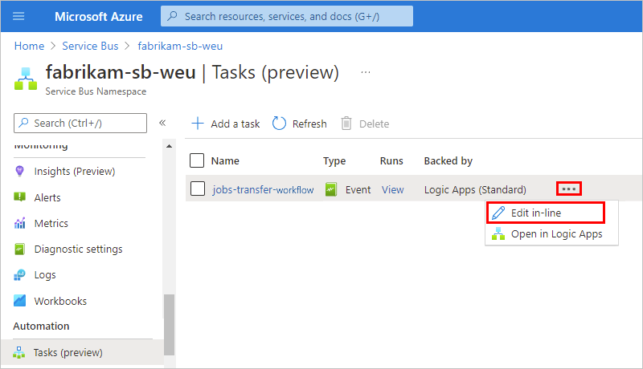

   By default, the **Authenticate** tab appears and shows the existing connections.

1. To add new authentication credentials or select different existing authentication credentials for a connection, open the connection's ellipses (**...**) menu, and select either **Add new connection** or if available, different authentication credentials.

   > [!NOTE]
   > You can edit only the target connection, not the source connection.

   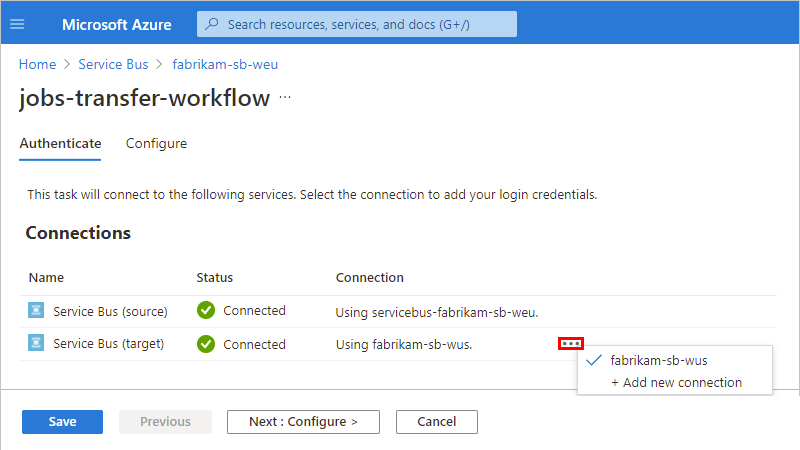

1. To update other task properties, select **Next: Configure**.

   For the task in this example, you can specify different source and target queues. However, the task name and underlying logic app and workflow remain the same.

   

1. When you're done, select **Save**.

<a name="edit-task-workflow"></a>

### Edit the task's underlying workflow

You can edit the underlying workflow behind a replication task, which changes the original configuration for the task that you created but not the task template itself. After you make and save your changes, your edited task no longer performs the same function as the original task. If you want a task that performs the original functionality, you might have to create a new task with the same template. If you don't want to recreate the original task, avoid changing the workflow behind the task using the designer. Instead, create a **Logic App (Standard)** stateless workflow to meet your integration needs. For more information, review [Create an integration workflow with single-tenant Azure Logic Apps (Standard) in the Azure portal](create-single-tenant-workflows-azure-portal.md).

1. In the [Azure portal](https://portal.azure.com), find the resource that has the task that you want to update.

1. On the resource navigation menu, in the **Automation** section, select **Tasks**.

1. In the tasks list, find the task that you want to update. Open the task's ellipses (**...**) menu, and select **Open in Logic Apps**.

   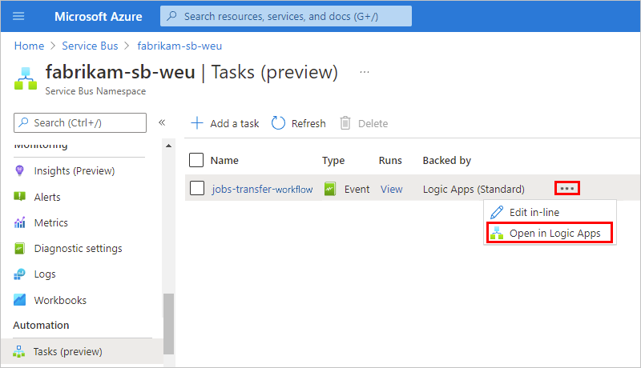

   The Azure portal changes context to designer where you can now edit the workflow.

   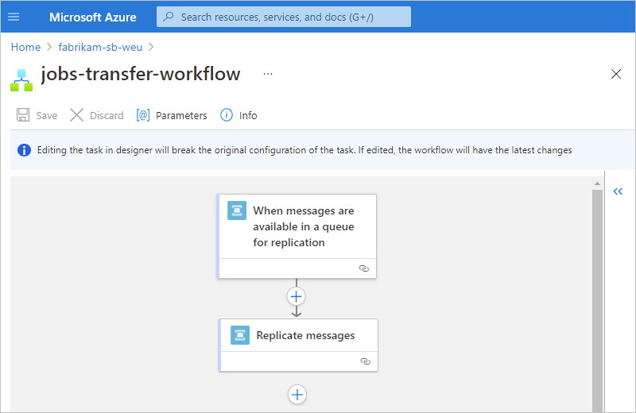

   You can now edit the workflow's trigger and actions as well as the properties for the trigger and actions.

1. To view the properties for the trigger or an action, select that trigger or action.

   

   For this example, the trigger's **IsSessionsEnabled** property is changed to **Yes**.

1. To save your changes, on the designer toolbar, select **Save**.

   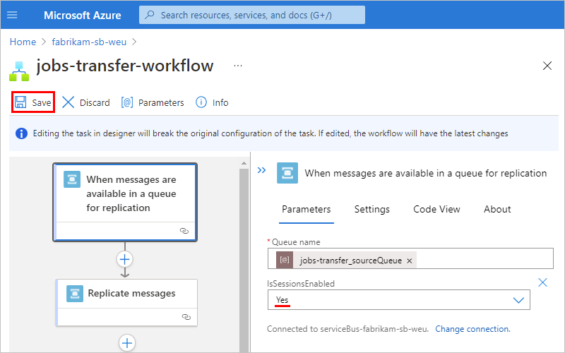

1. To test and run the updated workflow, open the logic app resource that contains the updated workflow. On the workflow navigation menu, select **Overview** > **Run Trigger** > **Run**.

   After the run finishes, the designer shows the workflow's run details. To review the inputs and outputs for each step, select the step, which opens a pane that shows the inputs, outputs, and properties details for that step.

   This example shows the selected Service Bus trigger's inputs, outputs, and properties, along with the updated trigger property value.

   

1. To disable the workflow so that the task doesn't continue running, on the **Overview** toolbar, select **Disable**. For more information, review [Disable or enable single-tenant workflows](create-single-tenant-workflows-azure-portal.md#disable-or-enable-workflows).

<a name="failover"></a>

## Set up failover for Azure Event Hubs

For Azure Event Hubs replication between the same entity types, geo-disaster recovery requires performing a failover from the source entity to the target entity and then telling any affected event consumers and producers to use the endpoint for the target entity, which becomes the new source. So, if a disaster happens, and the source entity fails over, consumers and producers, including your replication task, are redirected to the new source. The storage account that was created by your replication task contains checkpoint information and the position or offset in the stream where the source entity stops if the source region is disrupted or becomes unavailable.

To make sure that the storage account doesn't contain any legacy information from the original source and that your replication task begins reading and replicating events from the start of the new source stream, you have to manually clean up any legacy information from the original source and reconfigure the replication task.

1. In the [Azure portal](https://portal.azure.com), open the logic app resource or underlying workflow behind the replication task.

   > [!NOTE]
   > The logic app resource should contain only replication task workflows.

1. On the resource or workflow's navigation menu, select **Overview**. On the **Overview** toolbar, either select **Disable** for the workflow or select **Stop** for the logic app resource.

1. To find the storage account that's used by the replication task's underlying logic app resource to store the checkpoint and stream offset information from the source entity, follow these steps:

   1. On your logic app resource menu, under **Settings**, select **Configuration**.

   1. On the **Configuration** pane, on the **Application settings** tab, select the **AzureWebJobsStorage** app setting.

      This setting specifies the connection string and storage account used by the logic app resource.

      > [!NOTE]
      > If the app setting doesn't appear in the list, select **Show Values**.

   1. Select the **AzureWebJobsStorage** app setting so that you can view the storage account name.

   This example shows how to find the name for this storage account, which is `storagefabrikamreplb0c` here:

   

   1. To confirm that the storage account resource exists, in the Azure portal search box, enter the name, and then select the storage account, for example:

   

1. Now delete the folder that contains the source entity's checkpoint and offset information by using the following steps:

   1. Download, install, and open the latest [Azure Storage Explorer desktop client](https://azure.microsoft.com/features/storage-explorer/), if you don't already have the most recent version.

      > [!NOTE]
      > For the delete cleanup task, you currently have to use the Azure Storage Explorer client, 
      > *not* the storage explorer, browser, editor, or management experience in the Azure portal.
      >
      > Although you can delete container folders with the PowerShell [`Remove-AzStorageDirectory` command](/powershell/module/az.storage/remove-azstoragedirectory), 
      > this command works only on *empty* folders.

   1. If you haven't already, sign in with your Azure account, and make sure that your Azure subscription for your storage account resource is selected. For more information, review [Get started with Storage Explorer](../vs-azure-tools-storage-manage-with-storage-explorer.md).

   1. In the Explorer window, under your Azure subscription name, go to **Storage Accounts** > **{*your-storage-account-name*}** > **Blob Containers** > **azure-webjobs-eventhub**.

      > [!NOTE]
      > If the **azure-webjobs-eventhub** folder doesn't exist, the replication task hasn't run yet. 
      > The folder appears only after the replication task runs at least one time.

      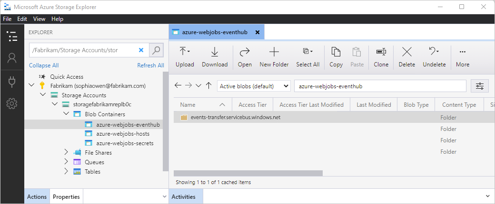

   1. In the **azure-webjobs-eventhub** pane that opens, select the Event Hubs namespace folder, which has a name with the following format: `<source-Event-Hubs-namespace-name>.servicebus.windows.net`.

   1. After the namespace folder opens, in the **azure-webjobs-eventhub** pane, select the <*former-source-entity-name*> folder. From either the toolbar or folder's shortcut menu, select **Delete**, for example:

      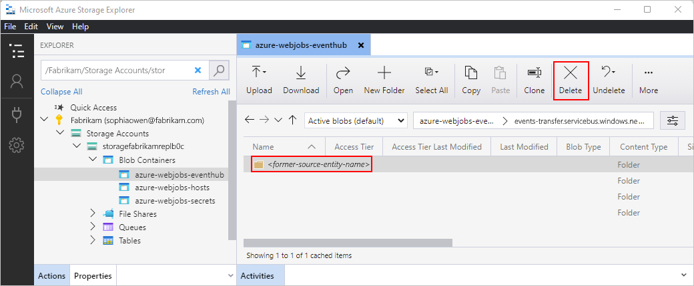

   1. Confirm that you want to delete the folder.

1. Return to the logic app resource or workflow behind the replication task. Restart the logic app or enable the workflow again.

To make producers and consumers to use the new source endpoint, you need to make information about the new source entity available to use and find in a location that's easy to reach and update. If producers or consumers encounter frequent or persistent errors, they should check that location and adjust their configuration. There are numerous ways to share that configuration, but DNS and file shares are examples.

For more information about geo-disaster recovery, review the following documentation:

- [Azure Event Hubs - Geo-disaster recovery](../event-hubs/event-hubs-geo-dr.md)
- [Azure Service Bus - Geo-disaster recovery](../service-bus-messaging/service-bus-geo-dr.md)

<a name="edit-plan-scale-out-settings"></a>

## Edit hosting plan scale-out settings

### [Portal](#tab/portal)

1. In the [Azure portal](https://portal.azure.com), open the underlying logic app resource for your replication task.

1. On the logic app resource menu, under **Settings**, select **Scale out (App Service Plan)**.

   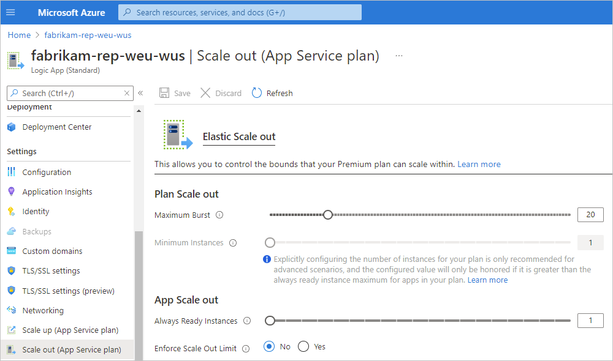

1. Based on your scenario's needs, under **Plan Scale out** and **App Scale out**, change the values for the maximum burst and always ready instances, respectively.

1. When you're done, on the **Scale out (App Service plan)** pane toolbar, select **Save**.

### [Azure CLI](#tab/azurecli)

You can also configure always ready instances for an app with the Azure CLI.

```azurecli-interactive
az resource update -g <resource_group> -n <logic-app-app-name>/config/web --set properties.minimumElasticInstanceCount=<desired_always_ready_count> --resource-type Microsoft.Web/sites
```

---

For more information, review the following documentation as the Workflow Standard plan shares some aspects with the Azure Functions Premium plan:

- [Plan and SKU settings - Azure Functions Premium plan](../azure-functions/functions-premium-plan.md#plan-and-sku-settings)
- [What is cloud bursting](https://azure.microsoft.com/overview/what-is-cloud-bursting/)?
- [Always ready instances - Azure Functions Premium plan](../azure-functions/functions-premium-plan.md#always-ready-instances)

<a name="problems-failures"></a>

## Replication problems and failures

This section describes possible ways that replication can fail or stop working:

- Message size limits

  Make sure to send messages smaller than 1 MB because the replication task adds [replication properties](#replication-properties). Otherwise, if the message size is larger than the size of events that can be sent to an Event Hubs entity after the task adds [replication properties](#replication-properties), the replication process fails.

  For example, suppose the message size is 1 MB. After the task adds replication properties, the message size is larger than 1 MB. The outbound call that attempts to send the message will fail.

- Partition keys

  If any partition keys exist in the events, replication between Event Hubs instances fails if those instances have the same number of partitions.

## Next steps

- [About the workflow designer in single-tenant Azure Logic Apps](designer-overview.md)
- [Edit host and app settings for logic apps in single-tenant Azure Logic Apps](edit-app-settings-host-settings.md)
- [Create parameters to use in workflows across environments in single-tenant Azure Logic Apps](parameterize-workflow-app.md)
