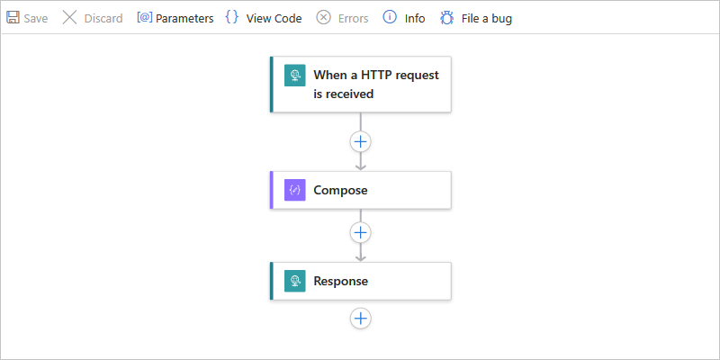
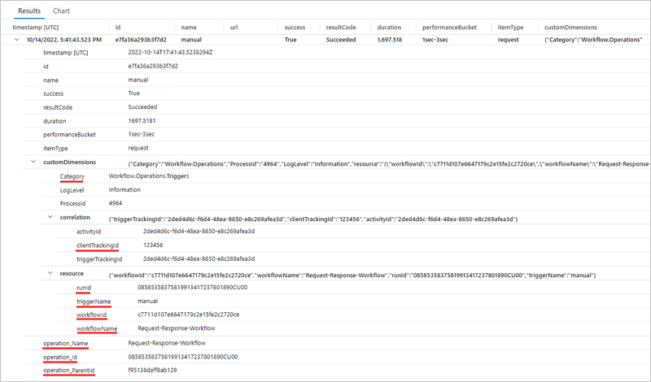
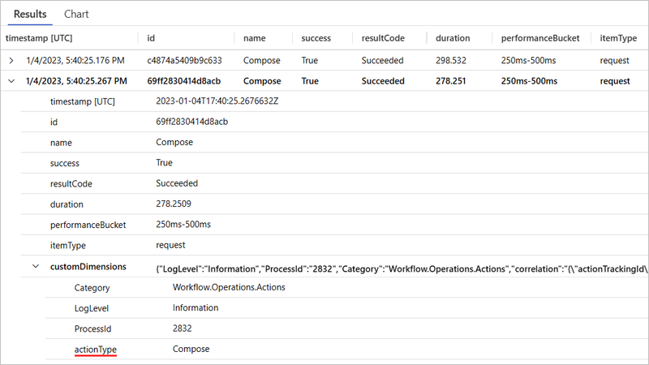
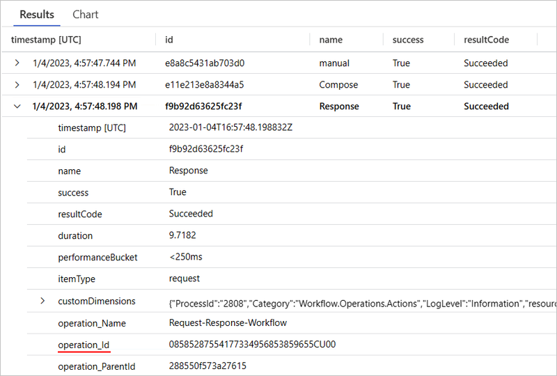
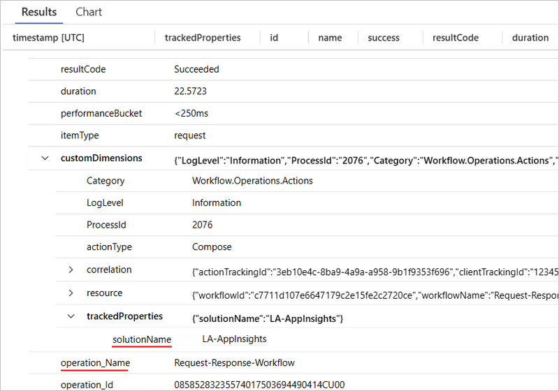
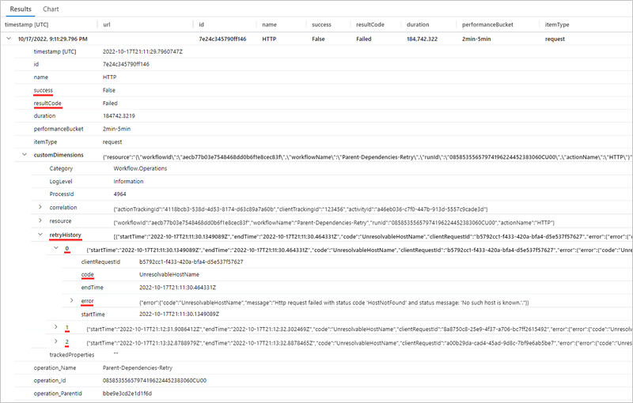
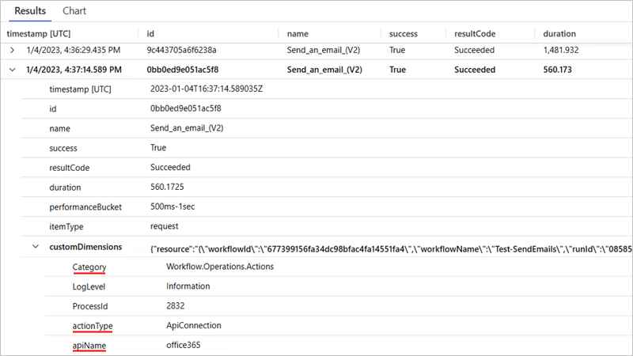
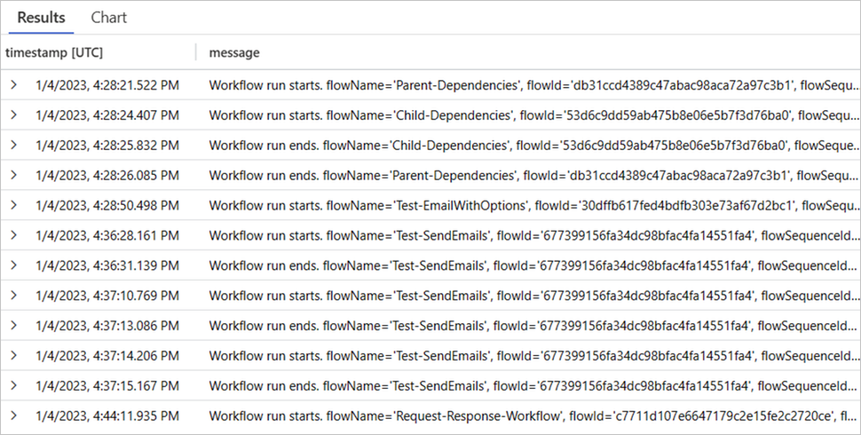
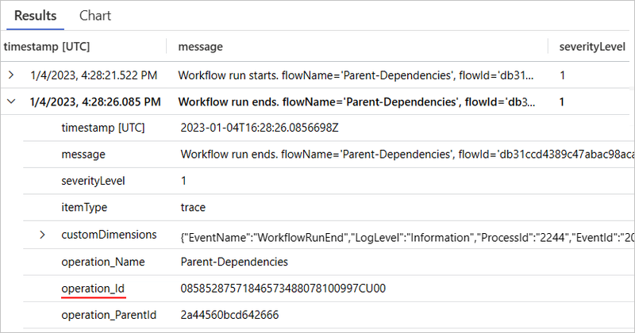
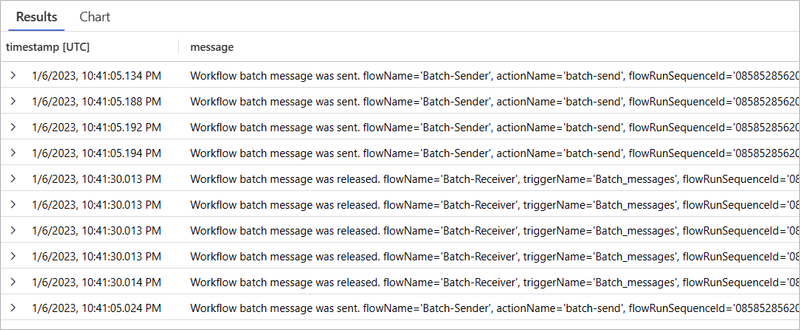

# Enable enhanced and view telemetry in Application Insights for Standard workflows in Azure Logic Apps

[!INCLUDE [logic-apps-sku-standard](../../includes/logic-apps-sku-standard.md)]

This how-to guide shows how to turn on enhanced telemetry collection in Application Insights for your Standard logic app resource and then view the collected data after your workflow finishes a run.

For information about the improvements to the telemetry tables in Application Insights for Standard logic app workflows, see [Application Insights Enhancements for Azure Logic Apps (Standard)](https://techcommunity.microsoft.com/t5/azure-integration-services-blog/application-insights-enhancements-for-azure-logic-apps-standard/ba-p/3758909).

## Prerequisites

- An Azure account and subscription. If you don't have a subscription, [sign up for a free Azure account](https://azure.microsoft.com/free/?WT.mc_id=A261C142F).

- An [Application Insights](../azure-monitor/app/app-insights-overview.md) instance. You create this resource [in advance](../azure-monitor/app/create-workspace-resource.md), when you create your Standard logic app, or after logic app deployment.

- A Standard logic app and workflow, either in the Azure portal or in Visual Studio Code.

  - Your logic app resource or project must use the Azure Functions v4 runtime, which is enabled by default.

  - Your logic app must [have enabled Application Insights](create-single-tenant-workflows-azure-portal.md#enable-open-application-insights) for diagnostics logging and tracing. You can do so either when you create your logic app or after deployment.

## Enable enhanced telemetry in Application Insights

### [Portal](#tab/portal)

1. In the [Azure portal](https://portal.azure.com), open your Standard logic app resource.

1. On the logic app menu, under **Development Tools**, select **Advanced Tools**. On the **Advanced Tools** page, select **Go**, which opens the Kudu tools.

1. On the **Kudu** page, from the **Debug console** menu, select **CMD**. In the folder directory table, browse to the following file and select **Edit**: **site/wwwroot/host.json**

1. In the **host.json** file, add the following JSON code:

   ```json
   {
      "version": "2.0",
      "extensionBundle": {
         "id": "Microsoft.Azure.Functions.ExtensionBundle.Workflows",
         "version": "[1, 2.00]"
      },
      "extensions": {
         "workflow": {
            "Settings": {
               "Runtime.ApplicationInsightTelemetryVersion": "v2"
            }
         }
      }
   }
   ```

   This configuration enables the default level of verbosity. For other options, see [Filter events at the source](#filter-events-source).

### [Visual Studio Code](#tab/visual-studio-code)

1. In Visual Studio Code, open your logic app project, and then open the project's **host.json** file.

1. In the **host.json** file, add the following JSON code:

   ```json
   {
      "version": "2.0",
      "extensionBundle": {
         "id": "Microsoft.Azure.Functions.ExtensionBundle.Workflows",
         "version": "[1, 2.00]"
      },
      "extensions": {
         "workflow": {
            "Settings": {
               "Runtime.ApplicationInsightTelemetryVersion": "v2"
            }
         }
      }
   }
   ```

   This configuration enables the default level of verbosity. For other options, see [Filter events at the source](#filter-events-source).

---

<a name="open-application-insights"></a>

## Open Application Insights

After your workflow finishes a run and a few minutes pass, open your Application Insights resource.

1. In the [Azure portal](https://portal.azure.com), on your logic app menu, under **Settings**, select **Application Insights**.

1. On the Application Insights resource menu, under **Monitoring**, select **Logs**.

## View enhanced telemetry in Application Insights

The following sections describe the tables in Application Insights where you can find and view the enhanced telemetry generated from your workflow run.

| Table name | Description |
|------------|-------------|
| [Requests](#requests-table) | Details about the following events in a workflow run: <br><br>- Trigger and action events <br>- Retry attempts <br>- Connector usage |
| [Traces](#traces-table) | Details about the following events in one or more workflow runs: <br><br>- Workflow start and end events <br>- Batch send and receive events |
| [Exceptions](#exceptions-table) | Details about exception events in a workflow run |
| [Dependencies](#dependencies-table) | Details about dependency events in a workflow run |

### Requests table

The Requests table contains fields that track data about the following events in Standard workflow runs:

- Trigger and action events
- Retry attempts
- Connector usage

To show how data gets into these fields, suppose you have the following example Standard workflow that starts with a **Request** trigger and follows with the **Compose** action and the **Response** action.



The trigger settings has a parameter named **Custom Tracking Id**. The parameter value is set to an expression that pulls the **orderId** property value from the body of an incoming message:


Next, the workflow's **Compose** action settings has an added tracked property named **solutionName**. The property value is set to the name of the logic app resource.


 The **Compose** action is followed by a **Response** action that returns a response to the caller.

The following list has example queries that you can create and run against the Requests table:

| Task | Steps |
|------|-------|
| View all trigger and action events | [Query for all trigger and action events](#requests-table-view-all-trigger-action-events) |
| View only trigger events or action events | [Query for only trigger or action events](#requests-table-view-trigger-or-action-events) |
| View trigger or action events with a specific operation type | [Query trigger or action events by operation type](#requests-table-view-trigger-action-events-type) |
| View trigger and action events with a specific workflow run ID | [Query trigger and action events by workflow run ID](#requests-table-view-trigger-action-events-workflow-id) |
| View trigger and action events with a specific client tracking ID | [Query trigger and action events by client tracking ID](#requests-table-view-events-client-tracking-id)
| View trigger and action events with a specific solution name | [Query trigger and action events by solution name](#requests-table-view-events-solution-name) |
| View trigger and action events with retry attempts | [Query trigger and action events for retry attempts](#requests-table-view-retries) |
| View trigger and action events with connector usage | [Query for trigger and action events for connector usage](#requests-table-view-connector-usage) |

<a name="requests-table-view-all-trigger-action-events"></a>

#### Query for all trigger and action events

After the workflow runs and a few minutes pass, you can create a query against the Requests table to view all the operation events.

1. If necessary, select the time range that you want to review. By default, this value is the last 24 hours.

1. To view all trigger and action events, create and run the following query:

   ```kusto
   requests
   | sort by timestamp desc
   | take 10
   ```

   The following example shows the **Results** tab with the noted columns and data in each row:

   

   | Column | Description | Example |
   |--------|-------------|---------|
   | **name** | Workflow operation name | For this example, the rows show **manual** (Request trigger), **Compose**, and **Response**. |
   | **success** | Operation execution status | For this example, all the rows show **True** for a successful execution. If an error happened, the value is **False**. |
   | **resultCode** | Operation execution status code | For this example, all the rows show **Succeeded** (200). |
   | **duration** | Operation execution duration | Varies for each operation. |

1. To view the details for a specific operation, expand the row for the trigger or action:

   The following example shows the expanded details for the **Request** trigger:

   

   | Property | Description | Example |
   |----------|-------------|---------|
   | **Category** | The operation category, which is always either **Workflow.Operations.Triggers** or **Workflow.Operations.Actions**, based on the operation | **Workflow.Operations.Triggers**. |
   | **clientTrackingId** | Custom tracking ID, if specified | **123456** |
   | **triggerName** | Trigger name | **manual** |
   | **workflowId** | ID for the workflow that ran the trigger | **c7711d107e6647179c2e15fe2c2720ce** |
   | **workflowName** | Name for the workflow that ran the trigger | **Request-Response-Workflow** |
   | **operation_Name** | Name for the operation that ran the trigger. In this case, this name is the same as the workflow name. | **Request-Response-Workflow** |
   | **operation_Id** | ID for the component or workflow that just ran. If an exceptions or dependencies exist, this value transcends the tables so you can link to these executions. | **08585355657974196224452383060CU00** |
   | **operation_ParentId** | Linkable ID for the workflow that called the trigger | **f95138daff8ab129** |

   The following example shows the expanded details for the **Compose** action:

   

   | Property | Description | Example |
   |----------|-------------|---------|
   | **Category** | The operation category, which is always either **Workflow.Operations.Triggers** or **Workflow.Operations.Actions**, based on the operation | **Workflow.Operations.Actions** |
   | **clientTrackingId** | Custom tracking ID, if specified | **123456** |
   | **actionName** | Action name | **Compose** |
   | **runId** | ID for the workflow run instance | **08585358375819913417237801890CU00** |
   | **workflowId** | ID for the workflow that ran the action | **c7711d107e6647179c2e15fe2c2720ce** |
   | **workflowName** | Name for the workflow that ran the action | **Request-Response-Workflow** |
   | **solutionName** | Tracked property name, if specified | **LA-AppInsights** |
   | **operation_Name** | Name for the operation that ran the action. In this case, this name is the same as the workflow name. | **Request-Response-Workflow** |
   | **operation_Id** | ID for the component or workflow that just ran. If an exceptions or dependencies exist, this value transcends the tables so you can link to these executions. | **08585355657974196224452383060CU00** |
   | **operation_ParentId** | Linkable ID for the workflow that called the action | **f95138daff8ab129** |

<a name="requests-table-view-trigger-or-action-events"></a>

#### Query for only trigger or action events

You can create a query against the Requests table to view a subset of operation events, based on operation category and the workflow name.

1. If necessary, select the time range that you want to review. By default, this value is the last 24 hours.

1. To view all trigger events in a specific workflow, create and run a query with the **customDimensions.Category** property value set to **Workflow.Operations.Triggers** and **operation_Name** set to the workflow name, for example:

   ```kusto
   requests
   | where customDimensions.Category == "Workflow.Operations.Triggers" and operation_Name == "Request-Response-Workflow"
   ```

   

1. To view all action events in a specific workflow, create a query with the **customDimensions.Category** property value set to **Workflow.Operations.Actions** and **operation_Name** set to the workflow name, for example:

   ```kusto
   requests
   | where customDimensions.Category == "Workflow.Operations.Actions" and operation_Name == "Request-Response-Workflow"
   ```

   

<a name="requests-table-view-trigger-action-events-type"></a>

#### Query trigger or action events by operation type

You can create a query against the Requests table to view events for a specific trigger or action type.

1. If necessary, select the time range that you want to review. By default, this value is the last 24 hours.

1. To view all operation events with a specific trigger type, create and run a query with the **customDimensions.triggerType** value set to the trigger type you want, for example:

   ```kusto
   requests
   | where customDimensions.triggerType == "Request"
   ```

   

1. To view all operation events with a specific action type, create and run a query with the **customDimensions.actionType** value set to the action type you want, for example:

   ```kusto
   requests
   | where customDimensions.actionType == "Compose"
   ```

   

<a name="requests-table-view-trigger-action-events-workflow-id"></a>

#### Query trigger and action events by workflow run ID

You can create a query against the Requests table to view a subset of operation events, based on the workflow run ID. This workflow run ID is the same ID that you can find in the workflow's run history.

1. If necessary, select the time range that you want to review. By default, this value is the last 24 hours.

1. To view all operation events with a specific workflow run ID, create and run a query with the **operation_Id** value set to the workflow run ID, for example:

   ```kusto
   requests
   | where operation_Id == "08585287554177334956853859655CU00"
   ```

   

<a name="requests-table-view-events-client-tracking-id"></a>

#### Query trigger and action events by client tracking ID

You can create a query against the Requests table to view a subset of operation events, based on the workflow name and client tracking ID.

1. If necessary, select the time range that you want to review. By default, this value is the last 24 hours.

1. To view all operation events with a specific client tracking ID in a specific workflow, create and run a query with the **operation_Name** value set to the workflow name and the **clientTrackingId** property value set to the value you want, for example:

   ```kusto
   requests
   | where operation_Name == "Request-Response-Workflow"
   | extend correlation = todynamic(tostring(customDimensions.correlation))
   | where correlation.clientTrackingId == "123456"
   ```

   

<a name="requests-table-view-events-solution-name"></a>

#### Query trigger and action events by solution name

You can create a query against the Requests table to view a subset of operation events, based on the workflow name and solution name.

1. If necessary, select the time range that you want to review. By default, this value is the last 24 hours.

1. To view all operation events with a specific client tracking ID in a specific workflow, create and run a query with the **operation_Name** value set to the workflow name and the **solutionName** property value set to the value you want, for example:

   ```kusto
   requests
   | where operation_Name == "Request-Response-Workflow" and customDimensions has "trackedProperties"
   | extend trackedProperties = todynamic(tostring(customDimensions.trackedProperties))
   | where trackedProperties.solutionName == "LA-AppInsights"
   ```

   

#### Retry attempts

To show how this data gets into the Requests table, the following example Standard workflow uses an **HTTP** action that calls a URL, which doesn't resolve. The workflow also has a retry policy that is set to a fixed interval that retries three times, once every 60 seconds.


<a name="requests-table-view-retries"></a>

#### Query trigger and action events for retry attempts

You can create a query against the Requests table to view a subset of operation events with retry attempts.

1. If necessary, select the time range that you want to review. By default, this value is the last 24 hours.

1. To view all the trigger and action events, create and run the following query in Application Insights:

   ```kusto
   requests
   | sort by timestamp desc
   | take 10
   ```

1. To view the retry attempts for an operation with a retry policy, expand the row for that operation.

   The following example shows the expanded details for the **HTTP** action:

   

   The **success** and **resultCode** property values indicate that the **HTTP** action failed. Along with the properties described in [Query the Requests table for all trigger and action events](#requests-table-view-all-trigger-action-events), the record contains the following information, which include three retry attempts:

   | Property | Description | Example |
   |----------|-------------|---------|
   | **retryHistory** | History details for one or more retry attempts |
   | **code** | Error type for a specific retry attempt |
   | **error** | Details about the specific error that happened |

<a name="requests-table-view-connector-usage"></a>

#### Query trigger and action events for connector usage

You can create a query against the Requests table to view a subset of operation events, based on specific connector usage.

1. If necessary, select the time range that you want to review. By default, this value is the last 24 hours.

1. To view all trigger events using a specific connector type, create and run a query with the following properties and values:

   ```kusto
   requests
   | where customDimensions.Category == "Workflow.Operations.Triggers" and customDimensions.triggerType =="ApiConnectionWebhook" and customDimensions.apiName =="commondataservice"
   ```

   | Property | Example value |
   |----------|---------------|
   | **customDimensions.Category** | **Workflow.Operations.Triggers** |
   | **customDimensions.triggerType** | The operation type, for example, **ApiConnectionWebhook** |
   | **customDimensions.apiName** | The connector's API name in JSON format, for example, **commondataservice** for the Microsoft Dataverse connector |

   

1. To view all action events with specific connector usage, create and run a query with the **customDimensions.Category** value set to **Workflow.Operations.Actions**, the **customDimensions.triggerType** value set to the operation type, and the **customDimensions.apiName** set to the connector's API name in JSON format, for example:

   | Property | Example value |
   |----------|---------------|
   | **customDimensions.Category** | **Workflow.Operations.Actions** |
   | **customDimensions.triggerType** | The operation type, for example, **ApiConnection** |
   | **customDimensions.apiName** | The connector's API name in JSON format, for example, **office365** for the Microsoft Office 365 Outlook connector |

   ```kusto
   requests
   | where customDimensions.Category == "Workflow.Operations.Actions" and customDimensions.actionType == "ApiConnection" and customDimensions.apiName == "office365"
   ```

   

For both triggers and actions, Application Insights differentiates between the types of connections that exist. You might see different values in the **actionType** and **triggerType** fields based on whether the connection has **ApiConnection**, **ApiConnectionWebhook**, the built-in basic type such as **Request**, or the built-in service provider-based **ServiceProvider** type.

### Traces table

The Traces table contains fields that track data about the following events in Standard workflow runs:

- Workflow start and end events

  This information is represented as two distinct events due to the potential for long-running workflow executions.

- Batch send and receive events

  For more information, see [Using Built-In Batch Operations in Azure Logic Apps (Standard)](https://techcommunity.microsoft.com/t5/azure-integration-services-blog/using-built-in-batch-operations-in-azure-logic-apps-standard/ba-p/3650659)

The following list has example queries that you can create and run against the Traces table:

| Task | Steps |
|------|-------|
| View start and end events in all workflow runs | [Query for start and end events in all workflow runs](#traces-table-view-all-start-end-events) |
| View start and end events in a specific workflow run | [Query for start and end events in a workflow run](#traces-table-view-start-end-events-specific-run) |
| View batch send and receive events in all workflow runs | [Query for batch send and batch receive events in all workflow runs](#traces-table-view-all-batch-send-receive-events) |

<a name="traces-table-view-all-start-end-events"></a>

#### Query for start and end events in all workflow runs

You can create a query against the Traces table to view all the start and end events for all workflow runs.

1. If necessary, select the time range that you want to review. By default, this value is the last 24 hours.

1. Create and run a query with the **customDimensions.Category** value set to **Workflow.Operations.Runs**, for example:

   ```kusto
   traces
   | where customDimensions.Category == "Workflow.Operations.Runs"
   ```

   

<a name="traces-table-view-start-end-events-specific-run"></a>

#### Query for start and end events in a specific workflow run

You can create a query against the Traces table to view the start and end events for a specific workflow run.

1. If necessary, select the time range that you want to review. By default, this value is the last 24 hours.

1. Create and run a query with the **customDimensions.Category** value set to **Workflow.Operations.Runs** and the **operation_Id** value set to the workflow run ID, for example:

   ```kusto
   traces
   | where customDimensions.Category == "Workflow.Operations.Runs"
   | and operation_Id == "08585287571846573488078100997CU00"
   ```

   

<a name="traces-table-view-all-batch-send-receive-events"></a>

#### Query for batch send and batch receive events in all workflow runs

You can create a query against the Traces table to view the batch send and batch receive events in all workflow runs.

1. If necessary, select the time range that you want to review. By default, this value is the last 24 hours.

1. Create and run a query with the **customDimensions.Category** value set to **Workflow.Operations.Runs** and the **operation_Id** value set to the workflow run ID, for example:

   ```kusto
   traces
   | where customDimensions.Category == "Workflow.Operations.Batch"
   ```

   

### Exceptions table

### Dependencies table

The Dependencies table contains fields that track dependency events, which are emitted when one resource calls another resource, and both use Application Insights. Examples for Azure Logic Apps include a service calling another service over HTTP, a database, or file system. Application Insights measures the duration of dependency calls and whether those calls succeed or fail, along with information, such as the dependency name. You can investigate specific dependency calls and correlate them to requests and exceptions.


<a name="filter-events-source"></a>

## Filter events at the source

In Application Insights, you can filter events in the following ways:

- Write queries.
- Filter at the source by specifying criteria to evaluate before emitting events. By applying filters at the source, you can reduce the amount of necessary storage and as a result, operating costs.

