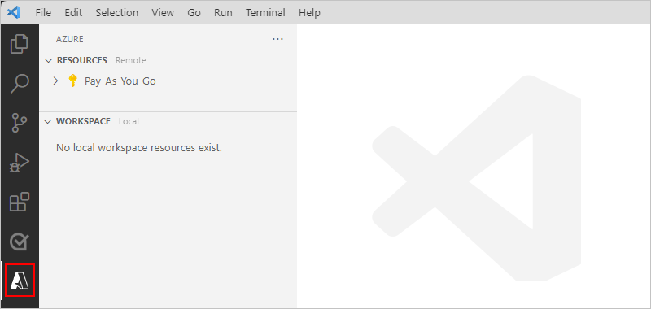
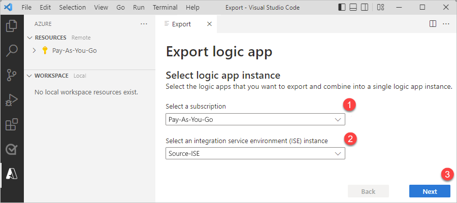
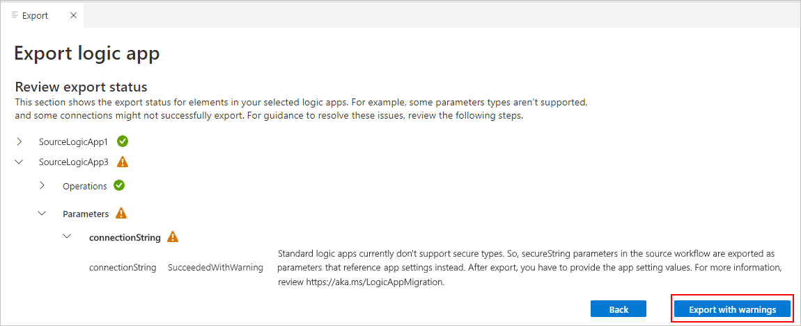
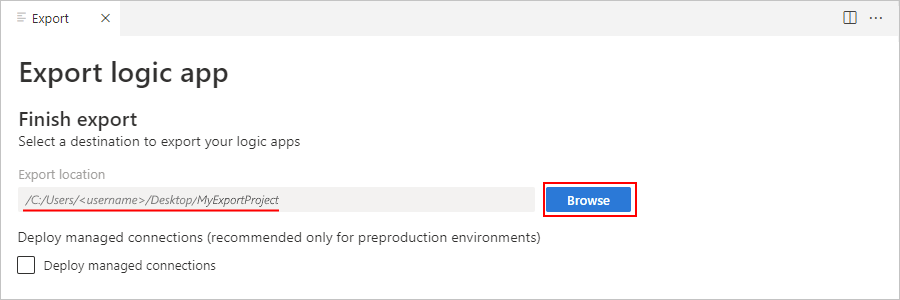
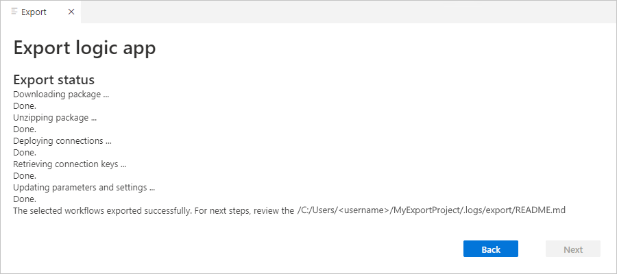
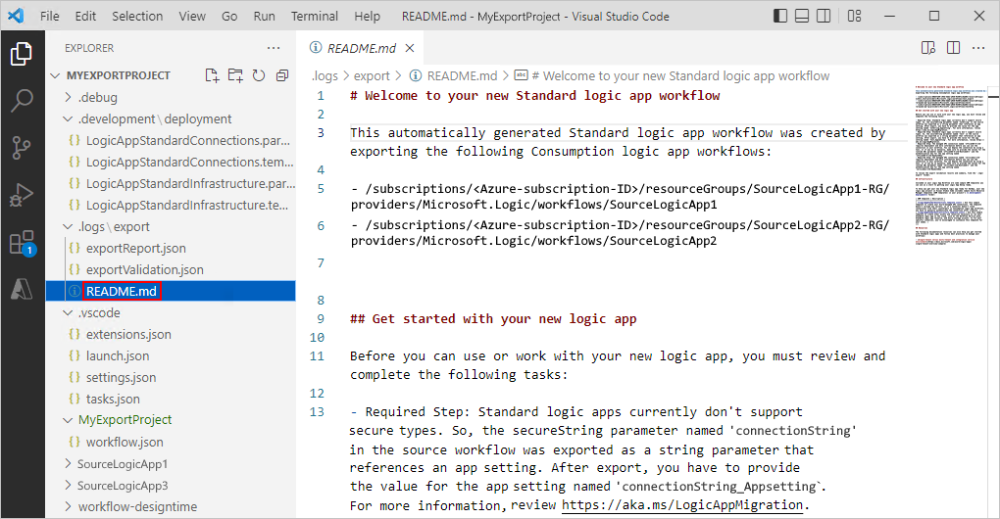

# Export logic app workflows from an ISE to Standard Azure Logic Apps (Preview)

> [!NOTE]
>
> This capability is in preview and is subject to the 
> [Supplemental Terms of Use for Microsoft Azure Previews](https://azure.microsoft.com/support/legal/preview-supplemental-terms/).

Standard workflows that run in single-tenant Azure Logic Apps offer many new and improved capabilities. For example, you get compute isolation, virtual network integration, and private endpoints along with local development and debugging using Visual Studio Code, App Services Environment support, low latency with stateless workflows, and more.

If you want the benefits from Standard workflows, but your workflows run in an Integration Service Environment (ISE), you can now replace your ISE with single-tenant Azure Logic Apps. This switch makes sense for most scenarios that require some ISE capabilities such as isolation and network integration, but not others, and can help reduce operation costs.

You can now export logic apps from an ISE to Azure Logic Apps (Standard). With Visual Studio Code and the latest Azure Logic Apps (Standard) extension, you can export your logic apps as stateless workflows to a Standard logic app project. You can then locally update, test, and debug your workflows to get them ready for redeployment. When you're ready, you can deploy either directly from Visual Studio Code or through your own DevOps process.

> [!NOTE]
>
> The export capability doesn't migrate your workflows. Instead, this tool replicates artifacts, such as 
> workflow definitions, connections, integration account artifacts, and others. Your source logic app 
> resources, workflows, trigger history, run history, and other data stay intact.
>
> You control the export process and your migration journey. You can test and validate your exported workflows 
> on the destination platform to your satisfaction. You choose when to disable or delete your source logic apps. 

This article provides information about the export process and shows how to export your logic app workflows from an ISE to a local Standard logic app project.

## Known issues and limitations

- To run the export tool, you must be on the same network as your ISE. In other words, if your ISE is internal, you have to run the export tool from a Visual Studio Code instance that can access your ISE through the internal network. Otherwise, you can't download the exported package or files.

- The following logic apps and scenarios are currently ineligible for export:

  - Consumption workflows in multi-tenant Azure Logic Apps
  - Logic apps that use custom connectors
  - Logic apps that use the Azure API Management connector
  - Logic apps that use the Azure Functions connector

- The export tool doesn't export any infrastructure information, such as virtual network dependencies or integration account settings.

- The export tool can export logic app workflows with triggers that have concurrency settings. However, single-tenant Azure Logic Apps ignores these settings.

- For now, connectors with the **ISE** label deploy as their *managed* versions, which appear in the designer under the **Azure** tab. The export tool will have the capability to export **ISE** connectors as built-in, service provider connectors when the latter gain parity with their ISE versions. The export tool automatically makes the conversion when an **ISE** connector is available to export as a built-in, service provider connector.

- Currently, connection credentials aren't cloned from source logic app workflows. Before your logic app workflows can run, you'll have to reauthenticate these connections after export.

## Exportable operation types

| Operation | JSON type |
|-----------|-----------|
| Trigger | **Built-in**: `Http`, `HttpWebhook`, `Recurrence`, `manual` (Request)   **Managed**: `ApiConnection` `ApiConnectionNotification`, `ApiConnectionWebhook` |
| Action | **Built-in**: `AppendToArrayVariable`, `AppendToStringVariable`, `Compose`, `DecrementVariable`, `Foreach`, `Http`, `HttpWebhook`, `If`, `IncrementVariable`, `InitializeVariable`, `JavaScriptCode`, `Join`, `ParseJson`, `Response`, `Scope`, `Select`, `SetVariable`, `Switch`, `Table`, `Terminate`, `Until`, `Wait`   - **Managed**: `ApiConnection`, `ApiConnectionWebhook` |

<!--
| Operation | JSON type |
|-----------|-----------|
| Trigger | **Built-in**  - `Http`  - `HttpWebhook`  - `Recurrence`  - `manual` (Request)   **Managed**:  - `ApiConnection`  - `ApiConnectionNotification`  - `ApiConnectionWebhook` |
| Action | **Built-in**:  - `AppendToArrayVariable`  - `AppendToStringVariable`  - `Compose`  - `DecrementVariable`  - `Foreach`  - `Http`  - `HttpWebhook`  - `If`  - `IncrementVariable`  - `InitializeVariable`  - `JavaScriptCode`  - `Join`  - `ParseJson`  - `Response`  - `Scope`  - `Select`  - `SetVariable`  - `Switch`  - `Table`  - `Terminate`  - `Until`  - `Wait`   - **Managed**:  - `ApiConnection`  - `ApiConnectionWebhook` |
-->

## Prerequisites

- An Azure account and subscription. 

- An existing ISE with the logic app workflows that you want to export.

- To include managed connections in your deployment, you'll need an existing resource group in Azure as the destination for where to put your exported workflows. This option is recommended only for non-production environments.

- Review and meet the requirements for [how to set up Visual Studio Code with the Azure Logic Apps (Standard) extension](create-single-tenant-workflows-visual-studio-code.md#prerequisites).

## Group logic apps for export

With the Azure Logic Apps (Standard) extension, you can combine multiple ISE-hosted logic apps into a single Standard logic app project. In single-tenant Azure Logic Apps, one Standard logic app resource can have multiple workflows. This way, you can pre-validate your workflows so that you don't miss any dependencies when you select logic apps for export.

Consider the following recommendations when you select logic apps for export:

- Group logic apps where workflows share the same resources, such as integration account artifacts, maps, and schemas, or use resources through a chain of processes.

- For the organization and number of workflows per logic app, review [Best practices and recommendations](create-single-tenant-workflows-azure-portal.md#best-practices-and-recommendations).

## Export ISE workflows to a local project

### Select logic apps for export

1. In Visual Studio Code, sign in to Azure, if you haven't already.

1. In the left navigation bar, select **Azure** to open the **Azure** window (Shift + Alt + A), and expand the **Logic Apps (Standard)** extension view.

   

1. On the extension toolbar, select **Export Logic App...**.

   

1. After the **Export** tab opens, select your Azure subscription and ISE instance, and then select **Next**.

   

1. Select the logic apps to export. Each selected logic app appears on the **Selected logic apps** list to the side. When you're done, select **Next**.    

   

   > [!TIP]
   >
   > You can also search for logic apps and filter on resource group.

   The export tool starts to validate whether your selected logic apps are eligible for export.

### Review export validation results

1. After export validation completes, review the results by expanding the entry for each logic app.

   - Logic apps that have errors are ineligible for export. You must remove these logic apps from the export list until you fix them at the source. To remove a logic app from the list, select **Back**.

     For example, **SourceLogicApp2** has an error and can't be exported until fixed:

     

   - Logic apps that pass validation with or without warnings are still eligible for export. To continue, select **Export** if all apps validate successfully, or select **Export with warnings** if apps have warnings.

     For example, **SourceLogicApp3** has a warning, but you can still continue to export:

     

   The following table provides more information about each validation icon and status:

   | Validation icon | Validation status |
   |-----------------|-------------------|
   |  | Item passed validation, so export can continue without problems to resolve. |
   |  | Item failed validation, so export can't continue.   The validation entry for the failed item automatically appears expanded and provides information about the validation failure. |
   |  | Item passed validation with a warning, but export can continue with required post-export resolution.   The validation entry for the item with a warning automatically appears expanded and provides information about the warning and required post-export remediation. |

1. After the **Finish export** section appears, for **Export location**, browse and select a local folder for your new Standard logic app project.

   

1. If your workflow has *managed* connections that you want to deploy, which is only recommended for non-production environments, select **Deploy managed connections**, which shows existing resource groups in your Azure subscription. Select the resource group where you want to deploy the managed connections.

   

1. Under **After export steps**, review any required post-export steps, for example:

   

1. Based on your scenario, select **Export and finish** or **Export with warnings and finish**.

   The export tool downloads your project to your selected folder location, expands the project in Visual Studio Code, and deploys any managed connections, if you selected that option.

   

1. After this process completes, Visual Studio Code opens a new workspace. You can now safely close the export window.

1. From your Standard logic app project, open and review the README.md file for the required post-export steps.

   

## Post-export steps

### Remediation steps

Some exported logic app workflows require post-export remediation steps to run on the Standard platform. 

1. From your Standard logic app project, open the README.md file, and review the remediation steps for your exported workflows, The README.md file is generated by the export tool and contains all the required post-export steps.

1. Before you make any changes to your source logic app workflow, make sure to test your new Standard logic app resource and workflows.

### Integration account actions and settings

If you export actions that depend on an integration account, you have to manually set up your Standard logic app with a reference to the integration account that contains the required artifacts.

1. Find your integration account's callback URL. Save the value for the next step.

   For more information, review [how to find your integration account's callback URL in the Azure portal](logic-apps-enterprise-integration-create-integration-account.md?tabs=standard#find-your-integration-accounts-callback-url).

1. In your Standard logic app project, open the **local.settings.json** file. Add an app setting that has the [specified properties and values](logic-apps-enterprise-integration-create-integration-account.md?tabs=standard#link-your-integration-account-to-your-standard-logic-app-resource), including the previously saved callback URL and as described by this step's version in the Azure portal.

   For more information about editing app settings in your project, review [Edit host and app settings for Standard logic apps in single-tenant Azure Logic Apps](edit-app-settings-host-settings.md?tabs=visual-studio-code).

## Project folder structure

After the export process finishes, your Standard logic app project contains new folders and files alongside most others in a [typical Standard logic app project](create-single-tenant-workflows-visual-studio-code.md).

The following table describes these new folders and files added by the export process:

| Folder | File | Description |
|--------|------|-------------|
| .development\\deployment | LogicAppStandardConnections.parameters.json | Azure Resource Manager template parameters file for deploying managed connectors |
| | LogicAppStandardConnections.template.json | Azure Resource Manager template definition for deploying managed connectors |
| | LogicAppStandardInfrastructure.parameters.json | Azure Resource Manager template parameters file for deploying Standard logic app resource |
| | LogicAppStandardInfrastructure.template.json | Azure Resource Manager template definition for deploying Standard logic app resource |
| .logs\\export | exportReport.json | Export report summary raw file, which includes all the steps required for post-export remediation |
| | exportValidation.json | Validation report raw file, which includes the validation results for each exported logic app. |
| | README.md | Markdown file with export results summary, including the created logic apps and all the required next steps. |

## Next steps

- [Run, test, and debug locally](create-single-tenant-workflows-visual-studio-code.md#run-test-and-debug-locally)