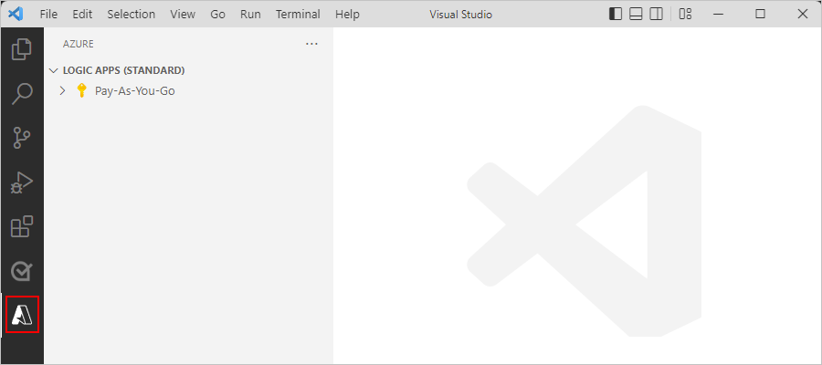
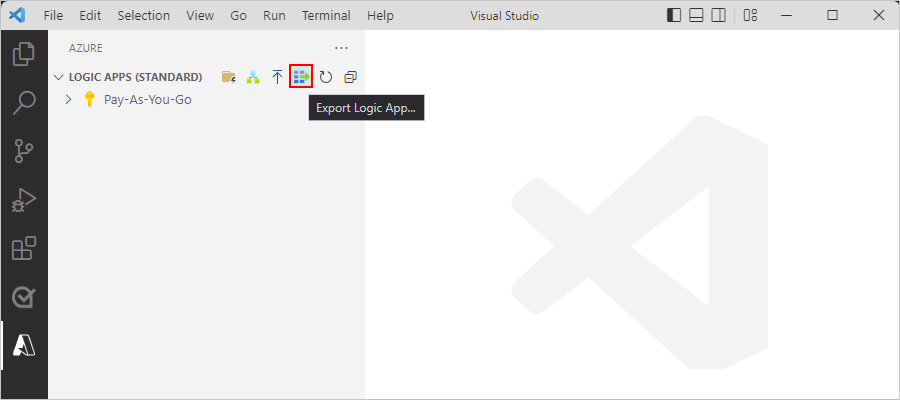
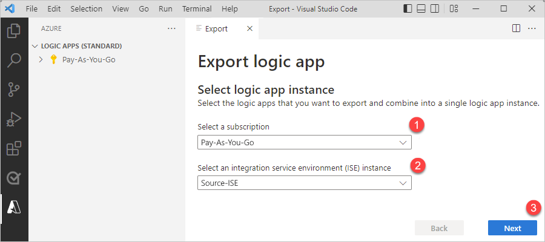
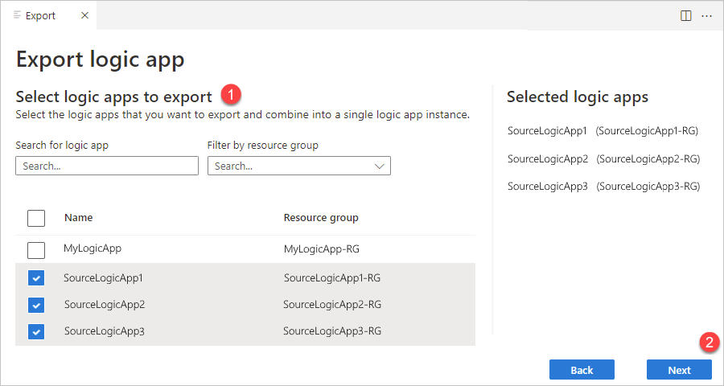
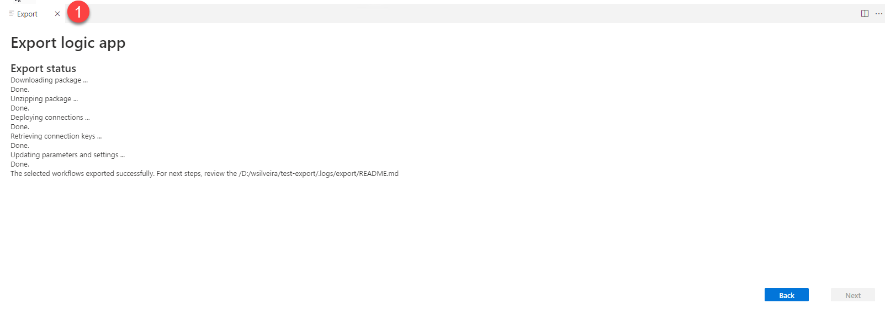

# Export workflows from an integration service environment (ISE) to Azure Logic Apps (Standard)

> [!NOTE]
>
> This capability is in preview and is subject to the 
> [Supplemental Terms of Use for Microsoft Azure Previews](https://azure.microsoft.com/support/legal/preview-supplemental-terms/).

Standard workflows that run in single-tenant Azure Logic Apps offer many new and improved capabilities. For example, you get compute isolation, virtual network integration, and private endpoints along with local development and debugging using Visual Studio Code, App Services Environment support, low latency with stateless workflows, and more.

If you want the benefits from Standard workflows, but your workflows run in an Integration Service Environment (ISE), you can now replace your ISE with single-tenant Azure Logic Apps. This switch makes sense for most scenarios that require some ISE capabilities such as isolation and network integration, but not others, and can help reduce operation costs.

You can now export logic apps from an ISE to Azure Logic Apps (Standard). With Visual Studio Code and the latest Azure Logic Apps (Standard) extension, you can export your logic apps as stateless workflows to a Standard logic app project. You can then locally update, test, and debug your workflows to get them ready for redeployment. When you're ready, you can deploy either directly from Visual Studio Code or through your own DevOps process.

> [!NOTE]
>
> The export capability doesn't migrate your workflows. Instead, this tool replicates artifacts, such as 
> workflow definitions, connections, integration account artifacts, and others. Your source logic app 
> resources, workflows, trigger history, run history, and other data stay intact.
>
> You control the export process and your migration journey. You can test and validate your exported workflows 
> on the destination platform to your satisfaction. You choose when to disable or delete your source logic apps. 

This article provides information about the export process and shows how to export your logic app workflows from an ISE to a local Standard logic app project.

## Known issues and limitations

- To run the export tool, you must be on the same network as your ISE. In other words, if your ISE is internal, you have to run the export tool from a Visual Studio Code instance that can access your ISE through the internal network. Otherwise, you can't download the exported package or files.

- The following logic apps and scenarios are currently ineligible for export:

  - Consumption workflows in multi-tenant Azure Logic Apps
  - Logic apps that use custom connectors
  - Logic apps that use the Azure API Management connector
  - Logic apps that use the Azure Functions connector

- The process doesn't export any infrastructure information, such as virtual network dependencies or integration account settings.

- You can export logic apps with triggers that have concurrency settings, but single-tenant Azure Logic Apps ignores these settings.

- For now, connectors with the **ISE** label deploy as their *managed* versions, which appear in the designer under the **Azure** tab. The export tool will have the capability to export **ISE** connectors as built-in, service provider connectors when the latter gain parity with their ISE versions. The export tool automatically makes the conversion when an **ISE** connector is available to export as a built-in, service provider connector.

## Exportable operation types

| Operation | JSON type |
|-----------|-----------|
| Trigger | **Built-in**: `Http`, `HttpWebhook`, `Recurrence`, `manual` (Request)   **Managed**: `ApiConnection` `ApiConnectionNotification`, `ApiConnectionWebhook` |
| Action | **Built-in**: `AppendToArrayVariable`, `AppendToStringVariable`, `Compose`, `DecrementVariable`, `Foreach`, `Http`, `HttpWebhook`, `If`, `IncrementVariable`, `InitializeVariable`, `JavaScriptCode`, `Join`, `ParseJson`, `Response`, `Scope`, `Select`, `SetVariable`, `Switch`, `Table`, `Terminate`, `Until`, `Wait`   - **Managed**: `ApiConnection`, `ApiConnectionWebhook` |

<!--
| Operation | JSON type |
|-----------|-----------|
| Trigger | **Built-in**  - `Http`  - `HttpWebhook`  - `Recurrence`  - `manual` (Request)   **Managed**:  - `ApiConnection`  - `ApiConnectionNotification`  - `ApiConnectionWebhook` |
| Action | **Built-in**:  - `AppendToArrayVariable`  - `AppendToStringVariable`  - `Compose`  - `DecrementVariable`  - `Foreach`  - `Http`  - `HttpWebhook`  - `If`  - `IncrementVariable`  - `InitializeVariable`  - `JavaScriptCode`  - `Join`  - `ParseJson`  - `Response`  - `Scope`  - `Select`  - `SetVariable`  - `Switch`  - `Table`  - `Terminate`  - `Until`  - `Wait`   - **Managed**:  - `ApiConnection`  - `ApiConnectionWebhook` |
-->

## Prerequisites

Review and meet the requirements for [how to set up Visual Studio Code with the Azure Logic Apps (Standard) extension](create-single-tenant-workflows-visual-studio-code.md#prerequisites).

## Group logic apps for export

With the Azure Logic Apps (Standard) extension, you can combine multiple ISE-hosted logic apps into a single Standard logic app project. In single-tenant Azure Logic Apps, one Standard logic app resource can have multiple workflows. This way, you can pre-validate your workflows so that you don't miss any dependencies when you select logic apps for export.

Consider the following recommendations when you select logic apps for export:

- Group logic apps where workflows share the same resources, such as integration account artifacts, maps, and schemas, or use resources through a chain of processes.

- For the organization and number of workflows per logic app, review [Best practices and recommendations](create-single-tenant-workflows-azure-portal.md#best-practices-and-recommendations).

## Export ISE workflows to a local project

1. In Visual Studio Code, sign in to Azure, if you haven't already.

1. In the left navigation bar, select **Azure** to open the **Azure** window (Shift + Alt + A), and expand the **Logic Apps (Standard)** extension view.

   

1. On the extension toolbar, select **Export Logic App...**.

   

1. After the **Export** tab opens, select your Azure subscription and ISE instance, and then select **Next**.

   

1. Now, select the logic apps to export. Each selected logic app appears on the **Selected logic apps** list to the side. When you're done, select **Next**.    

   

   > [!TIP]
   >
   > You can also search for logic apps and filter on resource group.

1. After validation completes, review the results by expanding the entry for each logic app.

   - Logic apps that have errors are ineligible for export. You must remove these logic apps from the export list until you fix them at the source. To remove a logic app from the list, select **Back**.

     For example, **SourceLogicApp2** has an error and can't be exported until fixed:

     

   - Logic apps that pass validation or have warnings are still eligible for export. If all logic apps pass validation, with or without warnings, the **Export** button is available. To continue, select **Export** if all apps pass, or select **Export with warnings** if warnings exist.

     For example, **SourceLogicApp3** has a warning, but you can still continue to export:

     

   The following table provides more information about each validation icon and status:

   | Validation icon | Validation status |
   |-----------------|-------------------|
   |  | Item failed validation – export can't continue. The item that failed validation will be automatically expanded and will provide a text explaining the validation failure reason. |
   |  | Item passed validation – export can continue and no other remediation is required. |
   |  | Item passed validation with warning – the export can continue, but some post export remediation will be required. The item that generated the warning will be automatically expanded and will provide text explaining the required post export remediation |

1.  Once the logic apps are ready to be exported, you must provide a location for the new VS Code project folder and click on export (or export with warnings) to complete the export

    
    Alternatively, if your logic app have managed connections and you want to deploy it, you must also provide an existing resource group where the managed connections will be deployed. Notice that at this stage, connection credentials will not be cloned from the original logic app, so you will need to reauthenticate the connections after export, before your logic app workflows can work.

    

    1.  The export will download and expand the project in the location you selected – it will also deploy connections if you selected that option. After this is complete, a new workspace will be open. It is now safe to close the export window.

        

    2.  Start reviewing the README.md file for post deployment steps, in the new window

        

## Post-deployment steps

### Integration Account actions and content

When exporting actions that are dependent on an Integration account will need to manually configure a reference to an integration account containing the required artefacts. Follow the instructions here to configure an integration account on Logic Apps Standard.

### Post-deployment remediation

Some Logic Apps will require remediation steps post export to run on the Standard platform. Take note of the remediation steps and make sure you test your new Standard resource before making any changes to your original Consumption Logic App. You will find all the necessary post deployment steps in the README.md file generated as part of the export.

## Folder Structure

You will find a new set of files and folders created on the Logic App Standard project after executing the export tool. The table below describes each file appended:

| Folder                    | File                                           | Description                                                                                                              |
|---------------------------|------------------------------------------------|--------------------------------------------------------------------------------------------------------------------------|
| .development\\ deployment | LogicAppStandardConnections.parameters.json    | ARM template parameters file for deployment of Managed Connectors                                                        |
|                           | LogicAppStandardConnections.template.json      | ARM template definition for deployment of Managed Connectors                                                             |
|                           | LogicAppStandardInfrastructure.parameters.json | ARM template parameters file for deployment of Logic App Standard App                                                    |
|                           | LogicAppStandardInfrastructure.template.json   | ARM template definition for deployment of Logic App Standard App                                                         |
| .logs/export              | exportReport.json                              | Export Report summary raw file, which includes all the steps required for post deployment remediation                    |
|                           | exportValidation.json                          | Validation Report raw file, which includes validation results for each logic app exported.                               |
|                           | README.md                                      | Markdown file with a summary of the export result, including the list of logic apps created and all required next steps. |

## Next steps
