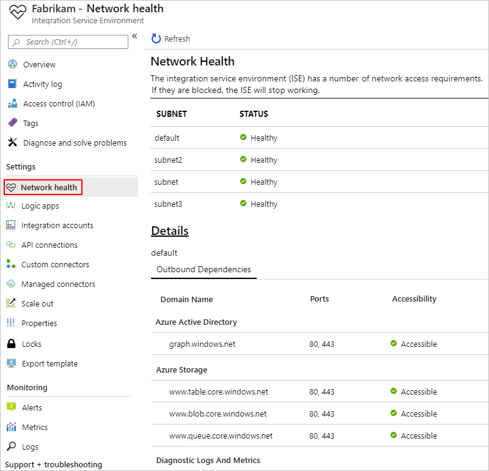
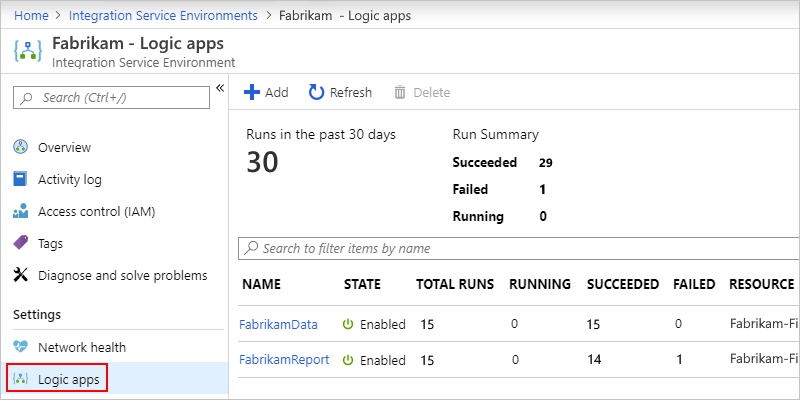
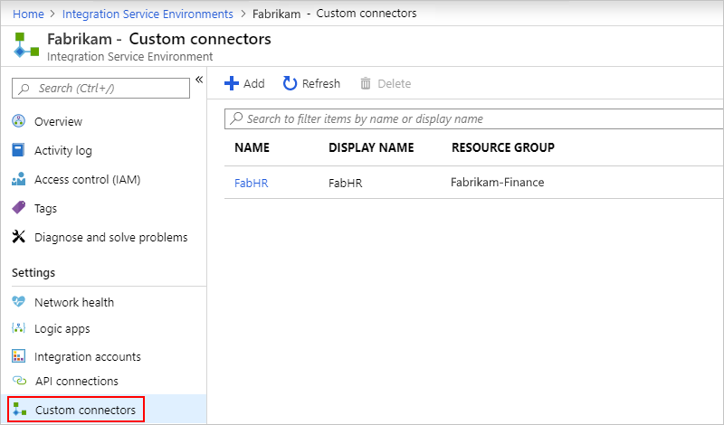
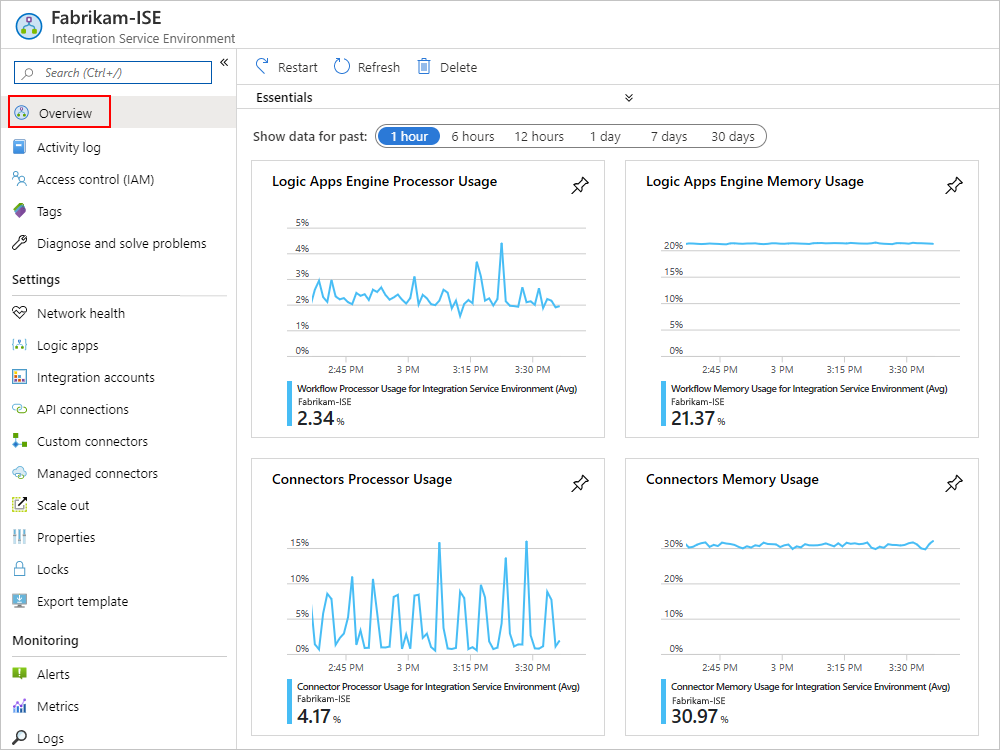
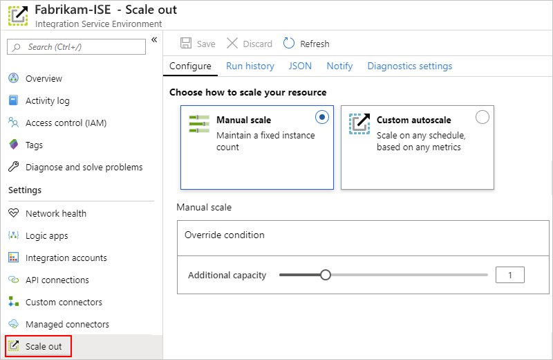
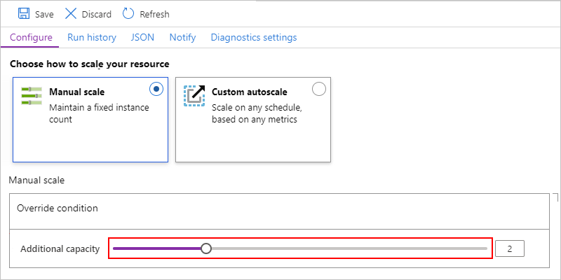
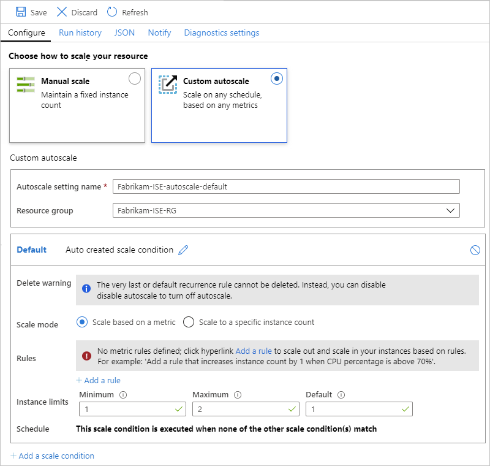

# Manage your integration service environment (ISE) in Azure Logic Apps

> [!IMPORTANT]
>
> On August 31, 2024, the ISE resource will retire, due to its dependency on Azure Cloud Services (classic), 
> which retires at the same time. Before the retirement date, export any logic apps from your ISE to Standard 
> logic apps so that you can avoid service disruption. Standard logic app workflows run in single-tenant Azure 
> Logic Apps and provide the same capabilities plus more.
>
> Starting November 1, 2022, you can no longer create new ISE resources. However, ISE resources existing 
> before this date are supported through August 31, 2024. For more information, see the following resources:
>
> - [ISE Retirement - what you need to know](https://techcommunity.microsoft.com/t5/integrations-on-azure-blog/ise-retirement-what-you-need-to-know/ba-p/3645220)
> - [Single-tenant versus multi-tenant and integration service environment for Azure Logic Apps](single-tenant-overview-compare.md)
> - [Azure Logic Apps pricing](https://azure.microsoft.com/pricing/details/logic-apps/)
> - [Export ISE workflows to a Standard logic app](export-from-ise-to-standard-logic-app.md)
> - [Integration Services Environment will be retired on 31 August 2024 - transition to Logic Apps Standard](https://azure.microsoft.com/updates/integration-services-environment-will-be-retired-on-31-august-2024-transition-to-logic-apps-standard/)
> - [Cloud Services (classic) deployment model is retiring on 31 August 2024](https://azure.microsoft.com/updates/cloud-services-retirement-announcement/)

This article shows how to perform management tasks for your [integration service environment (ISE)](../logic-apps/connect-virtual-network-vnet-isolated-environment-overview.md), for example:

* Find and view your ISE.

* Enable access for your ISE.

* Check your ISE's network health.

* Manage the resources such as multi-tenant based logic apps, connections, integration accounts, and connectors in your ISE.

* Add capacity, restart your ISE, or delete your ISE, follow the steps in this topic. To add these artifacts to your ISE, see [Add artifacts to your integration service environment](../logic-apps/add-artifacts-integration-service-environment-ise.md).

## View your ISE

1. In the [Azure portal](https://portal.azure.com) search box, enter **integration service environments**, and select **Integration Service Environments**.

   

1. From the results list, select your integration service environment.

   

1. Continue to the next sections to find logic apps, connections, connectors, or integration accounts in your ISE.

## Enable access for your ISE

When you use an ISE with an Azure virtual network, a common setup problem is having one or more blocked ports. The connectors that you use for creating connections between your ISE and destination systems might also have their own port requirements. For example, if you communicate with an FTP system by using the FTP connector, the port that you use on your FTP system needs to be available, for example, port 21 for sending commands.

To make sure that your ISE is accessible and that the logic apps in that ISE can communicate across each subnet in your virtual network, [open the ports described in this table for each subnet](#network-ports-for-ise). If any required ports are unavailable, your ISE won't work correctly.

* If you have multiple ISE instances that need access to other endpoints that have IP restrictions, deploy an [Azure Firewall](../firewall/overview.md) or a [network virtual appliance](../virtual-network/virtual-networks-overview.md#filter-network-traffic) into your virtual network and route outbound traffic through that firewall or network virtual appliance. You can then [set up a single, outbound, public, static, and predictable IP address](connect-virtual-network-vnet-set-up-single-ip-address.md) that all the ISE instances in your virtual network can use to communicate with destination systems. That way, you don't have to set up extra firewall openings at those destination systems for each ISE.

   > [!NOTE]
   > You can use this approach for a single ISE when your scenario requires limiting the 
   > number of IP addresses that need access. Consider whether the extra costs for 
   > the firewall or virtual network appliance make sense for your scenario. Learn more about 
   > [Azure Firewall pricing](https://azure.microsoft.com/pricing/details/azure-firewall/).

* If you created a new Azure virtual network and subnets without any constraints, you don't need to set up [network security groups (NSGs)](../virtual-network/network-security-groups-overview.md#network-security-groups) in your virtual network to control traffic across subnets.

* For an existing virtual network, you can *optionally* set up [network security groups (NSGs)](../virtual-network/network-security-groups-overview.md#network-security-groups) to [filter network traffic across subnets](../virtual-network/tutorial-filter-network-traffic.md). If you want to go this route, or if you're already using NSGs, make sure that you [open the ports described in this table](#network-ports-for-ise) for those NSGs.

  When you set up [NSG security rules](../virtual-network/network-security-groups-overview.md#security-rules), you need to use *both* the **TCP** and **UDP** protocols, or you can select **Any** instead so you don't have to create separate rules for each protocol. NSG security rules describe the ports that you must open for the IP addresses that need access to those ports. Make sure that any firewalls, routers, or other items that exist between these endpoints also keep those ports accessible to those IP addresses.

* For an ISE that has *external* endpoint access, you must create a network security group (NSG), if you don't have one already. You need to add an inbound security rule to the NSG to allow traffic from managed connector outbound IP addresses. To set up this rule, follow these steps:

  1. On your ISE menu, under **Settings**, select **Properties**.

  1. Under **Connector outgoing IP addresses**, copy the public IP address ranges, which also appear in this article, [Limits and configuration - Outbound IP addresses](logic-apps-limits-and-config.md#outbound).

  1. Create a network security group, if you don't have one already.
   
  1. Based on the following information, add an inbound security rule for the public outbound IP addresses that you copied. For more information, review [Tutorial: Filter network traffic with a network security group using the Azure portal](../virtual-network/tutorial-filter-network-traffic.md#create-a-network-security-group).

     | Purpose | Source service tag or IP addresses | Source ports | Destination service tag or IP addresses | Destination ports | Notes |
     |---------|------------------------------------|--------------|-----------------------------------------|-------------------|-------|
     | Permit traffic from connector outbound IP addresses | <*connector-public-outbound-IP-addresses*> | * | Address space for the virtual network with ISE subnets | * | |

* If you set up forced tunneling through your firewall to redirect Internet-bound traffic, review the [forced tunneling requirements](#forced-tunneling).

### Network ports used by your ISE

This table describes the ports that your ISE requires to be accessible and the purpose for those ports. To help reduce complexity when you set up security rules, the table uses [service tags](../virtual-network/service-tags-overview.md) that represent groups of IP address prefixes for a specific Azure service. Where noted, *internal ISE* and *external ISE* refer to the [access endpoint that's selected during ISE creation](connect-virtual-network-vnet-isolated-environment.md#create-environment). For more information, review [Endpoint access](connect-virtual-network-vnet-isolated-environment-overview.md#endpoint-access).

> [!IMPORTANT]
>
> For all rules, make sure that you set source ports to `*` because source ports are ephemeral.

#### Inbound security rules

| Source ports | Destination ports | Source service tag or IP addresses | Destination service tag or IP addresses | Purpose | Notes |
|--------------|-------------------|------------------------------------|-----------------------------------------|---------|-------|
| * | * | Address space for the virtual network with ISE subnets | Address space for the virtual network with ISE subnets | Intersubnet communication within virtual network. | Required for traffic to flow *between* the subnets in your virtual network.   **Important**: For traffic to flow between the *components* in each subnet, make sure that you open all the ports within each subnet. |
| * | 443 | Internal ISE:  **VirtualNetwork**   External ISE: **Internet** or see **Notes** | **VirtualNetwork** | - Communication to your logic app   - Runs history for your logic app | Rather than use the **Internet** service tag, you can specify the source IP address for these items:   - The computer or service that calls any request triggers or webhooks in your logic app   - The computer or service from where you want to access logic app runs history   **Important**: Closing or blocking this port prevents calls to logic apps that have request triggers or webhooks. You're also prevented from accessing inputs and outputs for each step in runs history. However, you're not prevented from accessing logic app runs history. |
| * | 454 | **LogicAppsManagement** |**VirtualNetwork** | Azure Logic Apps designer - dynamic properties| Requests come from the Azure Logic Apps access endpoint's [inbound IP addresses](logic-apps-limits-and-config.md#inbound) for that region.   **Important**: If you're working with Azure Government cloud, the **LogicAppsManagement** service tag won't work. Instead, you have to provide the Azure Logic Apps [inbound IP addresses](logic-apps-limits-and-config.md#azure-government-inbound) for Azure Government. |
| * | 454 | **LogicApps** | **VirtualNetwork** | Network health check | Requests come from the Azure Logic Apps access endpoint's [inbound IP addresses](logic-apps-limits-and-config.md#inbound) and [outbound IP addresses](logic-apps-limits-and-config.md#outbound) for that region.   **Important**: If you're working with Azure Government cloud, the **LogicApps** service tag won't work. Instead, you have to provide both the Azure Logic Apps [inbound IP addresses](logic-apps-limits-and-config.md#azure-government-inbound) and [outbound IP addresses](logic-apps-limits-and-config.md#azure-government-outbound) for Azure Government. |
| * | 454 | **AzureConnectors** | **VirtualNetwork** | Connector deployment | Required to deploy and update connectors. Closing or blocking this port causes ISE deployments to fail and prevents connector updates and fixes.   **Important**: If you're working with Azure Government cloud, the **AzureConnectors** service tag won't work. Instead, you have to provide the [managed connector outbound IP addresses](logic-apps-limits-and-config.md#azure-government-outbound) for Azure Government. |
| * | 454, 455 | **AppServiceManagement** | **VirtualNetwork** | App Service Management dependency ||
| * | Internal ISE: 454   External ISE: 443 | **AzureTrafficManager** | **VirtualNetwork** | Communication from Azure Traffic Manager ||
| * | 3443 | **APIManagement** | **VirtualNetwork** | Connector policy deployment   API Management - management endpoint  | For connector policy deployment, port access is required to deploy and update connectors. Closing or blocking this port causes ISE deployments to fail and prevents connector updates and fixes. |
| * | 6379 - 6383, plus see **Notes** | **VirtualNetwork** | **VirtualNetwork** | Access Azure Cache for Redis Instances between Role Instances | For ISE to work with Azure Cache for Redis, you must open these [outbound and inbound ports described by the Azure Cache for Redis FAQ](../azure-cache-for-redis/cache-how-to-premium-vnet.md#outbound-port-requirements). |

#### Outbound security rules

| Source ports | Destination ports | Source service tag or IP addresses | Destination service tag or IP addresses | Purpose | Notes |
|--------------|-------------------|------------------------------------|-----------------------------------------|---------|-------|
| * | * | Address space for the virtual network with ISE subnets | Address space for the virtual network with ISE subnets | Intersubnet communication within virtual network | Required for traffic to flow *between* the subnets in your virtual network.   **Important**: For traffic to flow between the *components* in each subnet, make sure that you open all the ports within each subnet. |
| * | 443, 80 | **VirtualNetwork** | Internet | Communication from your logic app | This rule is required for Secure Socket Layer (SSL) certificate verification. This check is for various internal and external sites, which is the reason that the Internet is required as the destination. |
| * | Varies based on destination | **VirtualNetwork** | Varies based on destination | Communication from your logic app | Destination ports vary based on the endpoints for the external services with which your logic app needs to communicate.   For example, the destination port is port 25 for an SMTP service, port 22 for an SFTP service, and so on. |
| * | 80, 443 | **VirtualNetwork** | **AzureActiveDirectory** | Azure Active Directory ||
| * | 80, 443, 445 | **VirtualNetwork** | **Storage** | Azure Storage dependency ||
| * | 443 | **VirtualNetwork** | **AppService** | Connection management ||
| * | 443 | **VirtualNetwork** | **AzureMonitor** | Publish diagnostic logs & metrics ||
| * | 1433 | **VirtualNetwork** | **SQL** | Azure SQL dependency ||
| * | 1886 | **VirtualNetwork** | **AzureMonitor** | Azure Resource Health | Required for publishing health status to Resource Health. |
| * | 5672 | **VirtualNetwork** | **EventHub** | Dependency from Log to Event Hubs policy and monitoring agent ||
| * | 6379 - 6383, plus see **Notes** | **VirtualNetwork** | **VirtualNetwork** | Access Azure Cache for Redis Instances between Role Instances | For ISE to work with Azure Cache for Redis, you must open these [outbound and inbound ports described by the Azure Cache for Redis FAQ](../azure-cache-for-redis/cache-how-to-premium-vnet.md#outbound-port-requirements). |
| * | 53 | **VirtualNetwork** | IP addresses for any custom Domain Name System (DNS) servers on your virtual network | DNS name resolution | Required only when you use custom DNS servers on your virtual network |

In addition, you need to add outbound rules for [App Service Environment (ASE)](../app-service/environment/intro.md):

* If you use Azure Firewall, you need to set up your firewall with the App Service Environment (ASE) [fully qualified domain name (FQDN) tag](../firewall/fqdn-tags.md#current-fqdn-tags), which permits outbound access to ASE platform traffic.

* If you use a firewall appliance other than Azure Firewall, you need to set up your firewall with *all* the rules listed in the [firewall integration dependencies](../app-service/environment/firewall-integration.md#dependencies) that are required for App Service Environment.

#### Forced tunneling requirements

If you set up or use [forced tunneling](../firewall/forced-tunneling.md) through your firewall, you have to permit extra external dependencies for your ISE. Forced tunneling lets you redirect Internet-bound traffic to a designated next hop, such as your virtual private network (VPN) or to a virtual appliance, rather than to the Internet so that you can inspect and audit outbound network traffic.

If you don't permit access for these dependencies, your ISE deployment fails and your deployed ISE stops working.

* User-defined routes

  To prevent asymmetric routing, you must define a route for each and every IP address that's listed below with **Internet** as the next hop.

  * [Azure Logic Apps inbound and outbound addresses for the ISE region](logic-apps-limits-and-config.md#firewall-configuration-ip-addresses-and-service-tags)  
  * [Azure IP addresses for connectors in the ISE region, available in this download file](https://www.microsoft.com/download/details.aspx?id=56519)
  * [App Service Environment management addresses](../app-service/environment/management-addresses.md)  
  * [Azure Traffic Manager management addresses](https://azuretrafficmanagerdata.blob.core.windows.net/probes/azure/probe-ip-ranges.json)
  * [Azure API Management Control Plane IP addresses](../api-management/virtual-network-reference.md#control-plane-ip-addresses)

* Service endpoints

  You need to enable service endpoints for Azure SQL, Storage, Service Bus, KeyVault, and Event Hubs because you can't send traffic through a firewall to these services.

* Other inbound and outbound dependencies

   Your firewall *must* allow the following inbound and outbound dependencies:

   * [Azure App Service Dependencies](../app-service/environment/firewall-integration.md#deploying-your-ase-behind-a-firewall)
   * [Azure Cache Service Dependencies](../azure-cache-for-redis/cache-how-to-premium-vnet.md#what-are-some-common-misconfiguration-issues-with-azure-cache-for-redis-and-virtual-networks)
   * [Azure API Management Dependencies](../api-management/virtual-network-reference.md)

## Check network health

On your ISE menu, under **Settings**, select **Network health**. This pane shows the health status for your subnets and outbound dependencies on other services.

> [!CAUTION]
> If your ISE's network becomes unhealthy, the internal App Service Environment (ASE) that's used by your ISE can also become unhealthy. 
> If the ASE is unhealthy for more than seven days, the ASE is suspended. To resolve this state, check your virtual network setup. 
> Resolve any problems that you find, and then restart your ISE. Otherwise, after 90 days, the suspended ASE is deleted, and your 
> ISE becomes unusable. So, make sure that you keep your ISE healthy to permit the necessary traffic.
> 
> For more information, see these topics:
>
> * [Azure App Service diagnostics overview](../app-service/overview-diagnostics.md)
> * [Message logging for Azure App Service Environment](../app-service/environment/using-an-ase.md#logging)

## Manage your logic apps

You can view and manage the logic apps that are in your ISE.

1. On your ISE menu, under **Settings**, select **Logic apps**.

   

1. To remove logic apps that you no longer need in your ISE, select those logic apps, and then select **Delete**. To confirm that you want to delete, select **Yes**.

> [!NOTE]
> If you delete and recreate a child logic app, you must resave the parent logic app. The recreated child app will have different metadata.
> If you don't resave the parent logic app after recreating its child, your calls to the child logic app will fail with an error of "unauthorized". 
> This behavior applies to parent-child logic apps, for example, those that use artifacts in integration accounts or call Azure functions.

## Manage API connections

You can view and manage the connections that were created by the logic apps running in your ISE.

1. On your ISE menu, under **Settings**, select **API connections**.

   

1. To remove connections that you no longer need in your ISE, select those connections, and then select **Delete**. To confirm that you want to delete, select **Yes**.

## Manage ISE connectors

You can view and manage the API connectors that are deployed to your ISE.

1. On your ISE menu, under **Settings**, select **Managed connectors**.

   

1. To remove connectors that you don't want available in your ISE, select those connectors, and then select **Delete**. To confirm that you want to delete, select **Yes**.

## Manage custom connectors

You can view and manage the custom connectors that you deployed to your ISE.

1. On your ISE menu, under **Settings**, select **Custom connectors**.

   

1. To remove custom connectors that you no longer need in your ISE, select those connectors, and then select **Delete**. To confirm that you want to delete, select **Yes**.

## Manage integration accounts

1. On your ISE menu, under **Settings**, select **Integration accounts**.

   

1. To remove integration accounts from your ISE when no longer needed, select those integration accounts, and then select **Delete**.

## Export integration account (preview)

For a Standard integration account created from inside an ISE, you can export that integration account to an existing Premium integration account. The export process has two steps: export the artifacts, and then export the agreement states. Artifacts include partners, agreements, certificates, schemas, and maps. However, the export process currently doesn't support assemblies and RosettaNet PIPs.

Your integration account also stores the runtime states for specific B2B actions and EDI standards, such as the MIC number for AS2 actions and the control numbers for X12 actions. If you configured your agreements to update these states every time that a transaction is processed and to use these states for message reconciliation and duplicate detection, make sure that you also export these states. You can export either all agreement states or one agreement state at a time.

> [!IMPORTANT]
>
> Make sure to choose a time window when your source integration account doesn't have any activity in your agreements to avoid state inconsistencies.

### Prerequisites

If you don't have a Premium integration account, [create a Premium integration account](./enterprise-integration/create-integration-account.md).

### Export artifacts

This process copies artifacts from the source to the destination.

1. In the [Azure portal](https://portal.azure.com), open your Standard integration account.

1. On the integration account menu, under **Settings**, select **Export**.

   > [!NOTE]
   >
   > If the **Export** option doesn't appear, make sure that you selected a Standard integration account that was created from inside an ISE.

1. On the **Export** page toolbar, select **Export Artifacts**.

1. Open the **Target integration account** list, which contains all the Premium accounts in your Azure subscription, select the Premium integration account that you want, and then select **OK**.

   The **Export** page now shows the export status for your artifacts.

1. To confirm the exported artifacts, open your destination Premium integration account.

### Export agreement state (optional)

1. On the **Export** page toolbar, select **Export Agreement State**.

1. On the **Export Agreement State** pane, open the **Target integration account** list, and select the Premium integration account that you want.

1. To export all agreement states, don't select any agreement from the **Agreement** list. To export an individual agreement state, select an agreement from the **Agreement** list.

1. When you're done, select **OK**.

   The **Export** page now shows the export status for your agreement states.

## Add ISE capacity

The Premium ISE base unit has fixed capacity, so if you need more throughput, you can add more scale units, either during creation or afterwards. The Developer SKU doesn't include the capability to add scale units.

> [!IMPORTANT]
> Scaling out an ISE can take 20-30 minutes on average.

1. In the [Azure portal](https://portal.azure.com), go to your ISE.

1. To review usage and performance metrics for your ISE, on your ISE menu, select **Overview**.

   

1. Under **Settings**, select **Scale out**. On the **Configure** pane, select from these options:

   * [**Manual scale**](#manual-scale): Scale based on the number of processing units that you want to use.
   * [**Custom autoscale**](#custom-autoscale): Scale based on performance metrics by selecting from various criteria and specifying the threshold conditions for meeting that criteria.

   

### Manual scale

1. After you select **Manual scale**, for **Additional capacity**, select the number of scaling units that you want to use.

   

1. When you're done, select **Save**.

### Custom autoscale

1. After you select **Custom autoscale**, for **Autoscale setting name**, provide a name for your setting and optionally, select the Azure resource group where the setting belongs.

   

1. For the **Default** condition, select either **Scale based on a metric** or **Scale to a specific instance count**.

   * If you choose instance-based, enter the number for the processing units, which is a value from 0 to 10.

   * If you choose metric-based, follow these steps:

     1. In the **Rules** section, select **Add a rule**.

     1. On the **Scale rule** pane, set up your criteria and action to take when the rule triggers.

     1. For **Instance limits**, specify these values:

        * **Minimum**: The minimum number of processing units to use
        * **Maximum**: The maximum number of processing units to use
        * **Default**: If any problems happen while reading the resource metrics, and the current capacity is below the default capacity, autoscaling scales out to the default number of processing units. However, if the current capacity exceeds the default capacity, autoscaling doesn't scale in.

1. To add another condition, select **Add scale condition**.

1. When you're finished with your autoscale settings, save your changes.

## Restart ISE

If you change your DNS server or DNS server settings, you have to restart your ISE so that the ISE can pick up those changes. Restarting a Premium SKU ISE doesn't result in downtime due to redundancy and components that restart one at a time during recycling. However, a Developer SKU ISE experiences downtime because no redundancy exists. For more information, see [ISE SKUs](../logic-apps/connect-virtual-network-vnet-isolated-environment-overview.md#ise-level).

1. In the [Azure portal](https://portal.azure.com), go to your ISE.

1. On the ISE menu, select **Overview**. On the Overview toolbar, **Restart**.

## Delete ISE

Before you delete an ISE that you no longer need or an Azure resource group that contains an ISE, check that you have no policies or locks on the Azure resource group that contains these resources or on your Azure virtual network because these items can block deletion.

After you delete your ISE, you might have to wait up to 9 hours before you try to delete your Azure virtual network or subnets.

## Next steps

* [Add resources to integration service environments](../logic-apps/add-artifacts-integration-service-environment-ise.md)
