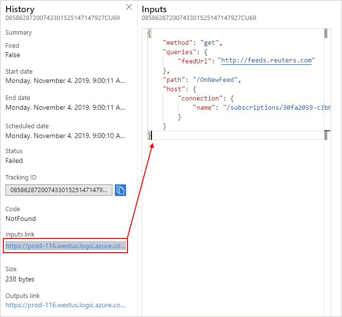
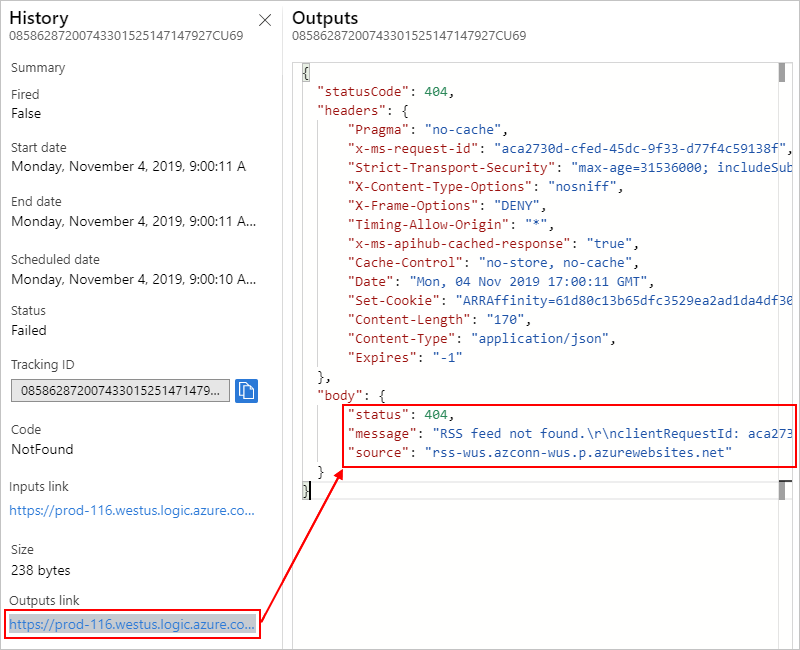
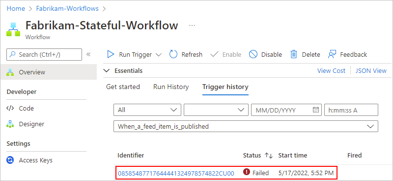
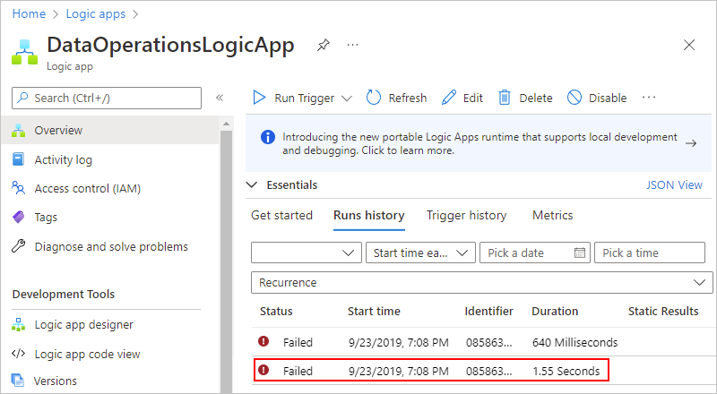
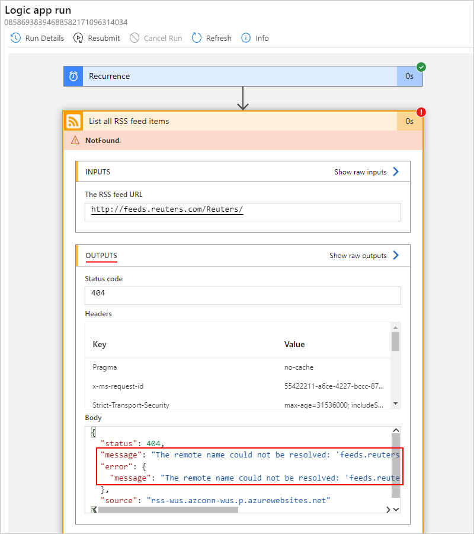
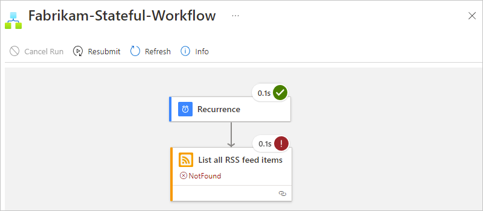

# Troubleshoot and diagnose workflow failures in Azure Logic Apps

[!INCLUDE [logic-apps-sku-consumption-standard](../../includes/logic-apps-sku-consumption-standard.md)]

Your logic app workflow generates information that can help you diagnose and debug problems in your app. You can diagnose your workflow by reviewing the inputs, outputs, and other information for each step in the workflow using the Azure portal. Or, you can add some steps to a workflow for runtime debugging.

## Check trigger history

Each workflow run starts with a trigger, which either fires on a schedule or waits for an incoming request or event. The trigger history lists all the trigger attempts that your workflow made and information about the inputs and outputs for each trigger attempt. If the trigger doesn't fire, try the following steps.

### [Consumption](#tab/consumption)

1. To check the trigger's status in your Consumption logic app, [review the trigger history](monitor-logic-apps.md#review-trigger-history). To view more information about the trigger attempt, select that trigger event, for example:

   

1. Check the trigger's inputs to confirm that they appear as you expect. On the **History** pane, under **Inputs link**, select the link, which shows the **Inputs** pane.

   Trigger inputs include the data that the trigger expects and requires to start the workflow. Reviewing these inputs can help you determine whether the trigger inputs are correct and whether the condition was met so that the workflow can continue.

   

1. Check the triggers outputs, if any, to confirm that they appear as you expect. On the **History** pane, under **Outputs link**, select the link, which shows the **Outputs** pane.

   Trigger outputs include the data that the trigger passes to the next step in your workflow. Reviewing these outputs can help you determine whether the correct or expected values passed on to the next step in your workflow.

   For example, an error message states that the RSS feed wasn't found:

   

   > [!TIP]
   >
   > If you find any content that you don't recognize, learn more about 
   > [different content types](../logic-apps/logic-apps-content-type.md) in Azure Logic Apps.

### [Standard](#tab/standard)

1. To check the trigger's status in your Standard logic app, [review the trigger history](monitor-logic-apps.md#review-trigger-history). To view more information about the trigger attempt, select that trigger event, for example:

   

1. Check the trigger's inputs to confirm that they appear as you expect. On the **History** pane, under **Inputs link**, select the link, which shows the **Inputs** pane.

   Trigger inputs include the data that the trigger expects and requires to start the workflow. Reviewing these inputs can help you determine whether the trigger inputs are correct and whether the condition was met so that the workflow can continue.

   

1. Check the triggers outputs, if any, to confirm that they appear as you expect. On the **History** pane, under **Outputs link**, select the link, which shows the **Outputs** pane.

   Trigger outputs include the data that the trigger passes to the next step in your workflow. Reviewing these outputs can help you determine whether the correct or expected values passed on to the next step in your workflow.

   For example, an error message states that the RSS feed wasn't found:

   

   > [!TIP]
   >
   > If you find any content that you don't recognize, learn more about 
   > [different content types](../logic-apps/logic-apps-content-type.md) in Azure Logic Apps.

---

## Check workflow run history

Each time that the trigger fires, Azure Logic Apps creates a workflow instance and runs that instance. If a run fails, try the following steps so you can review what happened during that run. You can review the status, inputs, and outputs for each step in the workflow.

### [Consumption](#tab/consumption)

1. To check the workflow's run status in your Consumption logic app, [review the runs history](monitor-logic-apps.md#review-runs-history). To view more information about a failed run, including all the steps in that run in their status, select the failed run.

   

1. After all the steps in the run appear, select each step to expand their shapes.

   

1. Review the inputs, outputs, and any error messages for the failed step.

   

   For example, the following screenshot shows the outputs from the failed RSS action.

   

### [Standard](#tab/standard)

1. To check the workflow's run status in your Standard logic app, [review the runs history](monitor-logic-apps.md#review-runs-history). To view more information about a failed run, including all the steps in that run in their status, select the failed run.

   

1. After all the steps in the run appear, select each step to review their details.

   

1. Review the inputs, outputs, and any error messages for the failed step.

   

   For example, the following screenshot shows the outputs from the failed RSS action.

   

---

## Perform runtime debugging

To help with debugging, you can add diagnostic steps to a logic app workflow, along with reviewing the trigger and runs history. For example, you can add steps that use the [Webhook Tester](https://webhook.site/) service, so you can inspect HTTP requests and determine their exact size, shape, and format.

1. In a browser, go to the [Webhook Tester](https://webhook.site/) site, and copy the generated unique URL.

1. In your logic app, add an HTTP POST action with the body content that you want to test, for example, an expression or another step output.

1. Paste your URL from Webhook Tester into the HTTP POST action.

1. To review how Azure Logic Apps generates and forms a request, run the logic app workflow. You can then revisit the Webhook Tester site for more information.

## Performance - frequently asked questions (FAQ)

1. **Why workflow run duration is LARGER than the sum of all of its action durations?**

There are scheduling overheads in running these actions. There could be waiting time between actions due to backend system load. Workflow run duration includes these scheduling times and waiting times, in addtion to the sum of all of its action durations.

1. **Most times my workflow completes within 10 seconds. But occasionally it takes as long as 50 seconds. How can I make sure it always finishes within 10 seconds?**

*There is no SLA guarantee on latency. 

*Logic App Consumption is a multitenant platform, and other customers' workload may negatively affect your logic app performance. 

*If you want more predictable performance, you may consider [Integration Service Evironment (ISE)](../logic-apps/connect-virtual-network-vnet-isolated-environment-overview) or [Logic App Standard](../logic-apps/single-tenant-overview-compare). With ISE and Logic App Standard, you have the control to scale up or scale out to improve the performance. 

1. **My action is timing out after 2 minutes. How can I increase the timeout value?**

The action timeout value cannot be changed and it is fixed as 2 minutes. If the action is a HTTP action and you own the service, you have the option to change the service to use aynchronous pattern to avoid the two-minute timeout: [Perform long-running tasks with the polling action pattern](../logic-apps/logic-apps-create-api-app#perform-long-running-tasks-with-the-polling-action-pattern).

## Common problems - Standard logic apps

### Inaccessible artifacts in Azure storage account

Standard logic apps store all artifacts in an Azure storage account. You might get the following errors if these artifacts aren't accessible. For example, the storage account itself might not be accessible, or the storage account is behind a firewall but no private endpoint is set up for the storage services to use.

| Azure portal location | Error |
|-----------------------|-------|
| Overview pane | - **System.private.corelib:Access to the path 'C:\\home\\site\\wwwroot\\hostj.son is denied**   - **Azure.Storage.Blobs: This request is not authorized to perform this operation** |
| Workflows pane | - **Cannot reach host runtime. Error details, Code: 'BadRequest', Message: 'Encountered an error (InternalServerError) from host runtime.'**   - **Cannot reach host runtime. Error details, Code: 'BadRequest', Message: 'Encountered an error (ServiceUnavailable) from host runtime.'**   - **Cannot reach host runtime. Error details, Code: 'BadRequest', Message: 'Encountered an error (BadGateway) from host runtime.'** |
| During workflow creation and execution | - **Failed to save workflow**   - **Error in the designer: GetCallFailed. Failed fetching operations**   - **ajaxExtended call failed** |
|||

### Troubleshooting options

The following list includes possible causes for these errors and steps to help troubleshoot.

* For a public storage account, check access to the storage account in the following ways:

  * Check the storage account's connectivity using [Azure Storage Explorer](../vs-azure-tools-storage-manage-with-storage-explorer.md).

  * In your logic app resource's app settings, confirm the storage account's connection string in the app settings, **AzureWebJobsStorage** and **WEBSITE_CONTENTAZUREFILECONNECTIONSTRING**. For more information, review [Host and app settings for logic apps in single-tenant Azure Logic Apps](edit-app-settings-host-settings.md#manage-app-settings).

  If connectivity fails, check whether the Shared Access Signature (SAS) key in the connection string is the most recent.

* For a storage account that's behind a firewall, check access to the storage account in the following ways:

  * If firewall restrictions are enabled on the storage account, check whether [private endpoints](../private-link/private-endpoint-overview.md) are set up for Blob, File, Table, and Queue storage services.

  * Check the storage account's connectivity using [Azure Storage Explorer](../vs-azure-tools-storage-manage-with-storage-explorer.md).

  If you find connectivity problems, continue with the following steps: 

  1. In the same virtual network that's integrated with your logic app, create an Azure virtual machine, which you can put in a different subnet.

  1. From a command prompt, run **nslookup** to check that the Blob, File, Table, and Queue storage services resolve to the expected IP addresses.

     Syntax: `nslookup [StorageaccountHostName] [OptionalDNSServer]`

     Blob: `nslookup {StorageaccountName}.blob.core.windows.net`

     File: `nslookup {StorageaccountName}.file.core.windows.net`

     Table: `nslookup {StorageaccountName}.table.core.windows.net`

     Queue: `nslookup {StorageaccountName}.queue.core.windows.net`

     * If the storage service has a [Service Endpoint](../virtual-network/virtual-network-service-endpoints-overview.md), the service resolves to a public IP address.

     * If the storage service has a [private endpoint](../private-link/private-endpoint-overview.md), the service resolves to the respective network interface controller (NIC) private IP addresses.

   1. If the previous domain name server (DNS) queries resolve successfully, run the **psping** or **tcpping** commands to check connectivity to the storage account over port 443:

      Syntax: `psping [StorageaccountHostName] [Port] [OptionalDNSServer]`

      Blob: `psping {StorageaccountName}.blob.core.windows.net:443`

      File: `psping {StorageaccountName}.file.core.windows.net:443`

      Table: `psping {StorageaccountName}.table.core.windows.net:443`

      Queue: `psping {StorageaccountName}.queue.core.windows.net:443`

   1. If each storage service is resolvable from your Azure virtual machine, find the DNS that's used by the virtual machine for resolution. 
     
      1. Set your logic app's **WEBSITE_DNS_SERVER** app setting to the DNS, and confirm that the DNS works successfully.

      1. Confirm that VNet integration is set up correctly with appropriate virtual network and subnet in your Standard logic app.

   1. If you use [private Azure DNS zones](../dns/private-dns-privatednszone.md) for your storage account's private endpoint services, check that a [virtual network link](../dns/private-dns-virtual-network-links.md) has been created to your logic app's integrated virtual network.

For more information, review [Deploy Standard logic app to a storage account behind a firewall using service or private endpoints](https://techcommunity.microsoft.com/t5/integrations-on-azure-blog/deploying-standard-logic-app-to-storage-account-behind-firewall/ba-p/2626286).

## Next steps

* [Monitor your logic app](../logic-apps/monitor-logic-apps.md)
