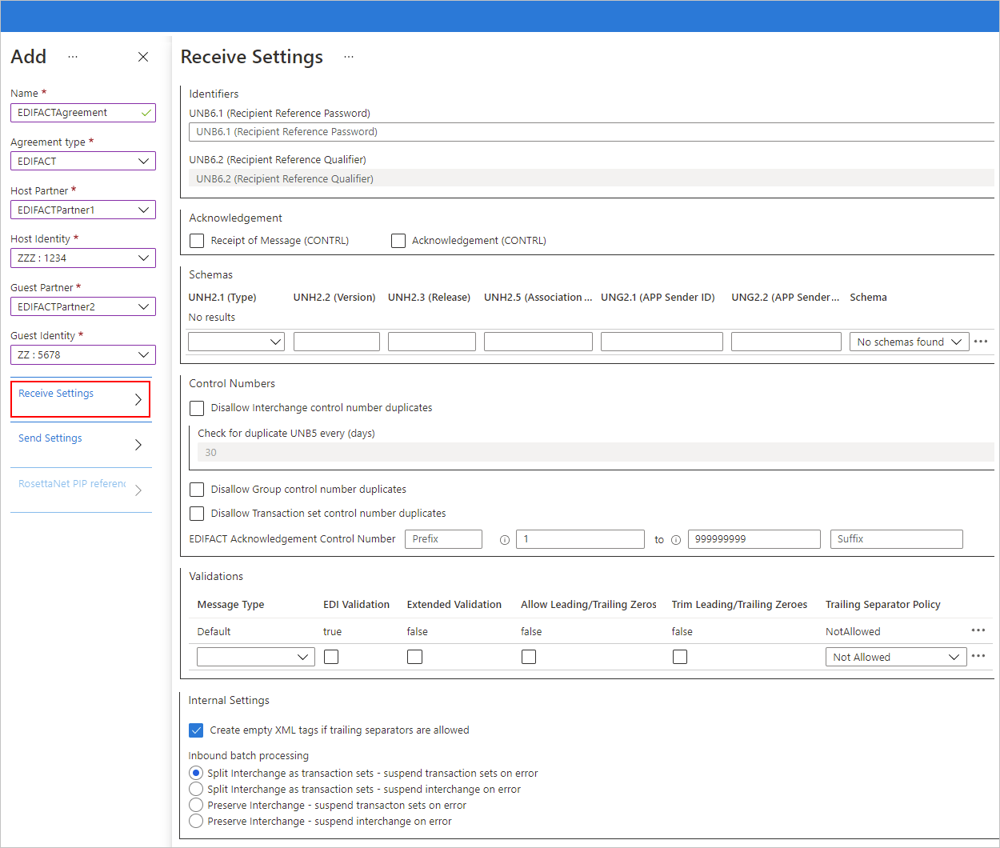

# Reference for EDIFACT message settings in agreements for Azure Logic Apps

This reference describes the properties that you can set in an EDIFACT agreement for specifying how to handle messages between [trading partners](logic-apps-enterprise-integration-partners.md). Set up these properties based on your agreement with the partner that exchanges messages with you.

## EDIFACT Receive Settings

### Identifiers

| Property | Description |
|----------|-------------|
| **UNB6.1 (Recipient Reference Password)** | An alphanumeric value that is 1-14 characters. |
| **UNB6.2 (Recipient Reference Qualifier)** | An alphanumeric value that is 1-2 characters. |
|||

### Acknowledgments

| Property | Description |
|----------|-------------|
| **Receipt of Message (CONTRL)** | Return a technical (CONTRL) acknowledgment to the interchange sender, based on the agreement's Send Settings. |
| **Acknowledgement (CONTRL)** | Return a functional (CONTRL) acknowledgment to the interchange sender, based on the agreement's Send settings. |
|||

### Schemas

| Property | Description |
|----------|-------------|
| **UNH2.1 (Type)** | The transaction set type. |
| **UNH2.2 (Version)** | The message version number that is 1-3 characters. |
| **UNH2.3 (Release)** | The message release number that is 1-3 characters. |
| **UNH2.5 (Associated Assigned Code)** | The assigned code that is alphanumeric nd up to 6 characters. |
| **UNG2.1 (App Sender ID)** |Enter an alphanumeric value with a minimum of one character and a maximum of 35 characters. |
| **UNG2.2 (App Sender Code Qualifier)** |Enter an alphanumeric value, with a maximum of four characters. |
| **Schema** | The previously uploaded schema that you want to use in either the following logic app resource type: 
- Consumption: Your linked integration account.  - Standard: Your logic app resource |
|||

### Control Numbers

| Property | Description |
|----------|-------------|
| **Disallow interchange control number duplicates** | Block duplicate interchanges. The EDIFACT decoding action checks that the interchange control number (UNB5) for the received interchange doesn't match a previously processed interchange control number. If a match is detected, the interchange isn't processed. |
| **Check for duplicate UNB5 every (days)** | If you chose to disallow duplicate interchange control numbers, you can specify the number of days between running the check. |
| **Disallow Group control number duplicates** | Block interchanges that have duplicate group control numbers (UNG5). |
| **Disallow Transaction set control number duplicates** | Block interchanges that have duplicate transaction set control numbers (UNH1). |
| **EDIFACT Acknowledgement Control Number** | Assign the transaction set reference numbers to use in an acknowledgment by entering a value for the prefix, a range of reference numbers, and a suffix. |
|||

### Validation

After you finish setting up a validation row, the next row automatically appears. If you don't specify any rules, validation uses the row that's labeled **Default**.

| Property | Description |
|----------|-------------|
| **Message Type** | The EDI message type. |
| **EDI Validation** | Run EDI validation on data types as defined by the schema's EDI properties, length restrictions, empty data elements, and trailing separators. |
| **Extended Validation** | If the data type isn't EDI, validation runs on the data element requirement and allowed repetition, enumerations, and data element length validation (min and max). |
| **Allow Leading/Trailing Zeroes** | Keep any extra leading or trailing zero and space characters. Don't remove these characters. |
| **Trim Leading/Trailing Zeroes** | Remove the leading or trailing zero and space characters. |
| **Trailing Separator Policy** | Generate trailing separators. 
 - **Not Allowed**: Prohibit trailing delimiters and separators in the received interchange. If the interchange has trailing delimiters and separators, the interchange is declared not valid. 
- **Optional**: Accept interchanges with or without trailing delimiters and separators. 
- **Mandatory**: The received interchange must have trailing delimiters and separators. |
|||

### Internal Settings

| Property | Description |
|----------|-------------|
| **Create empty XML tags if trailing separators are allowed** | The interchange sender includes empty XML tags as trailing separators. |
| **Split Interchange as transaction sets - suspend transaction sets on error** | Parse each transaction set in an interchange into a separate XML document by applying the appropriate envelope to the transaction set. Suspend only the transaction sets that fail validation. |
| **Split Interchange as transaction sets - suspend interchange on error** | Parse each transaction set in an interchange into a separate XML document by applying the appropriate envelope. Suspend the entire interchange when one or more transaction sets in the interchange fail validation. |
| **Preserve Interchange - suspend transaction sets on error** | Keep the interchange intact, create an XML document for the entire batched interchange. Suspend only the transaction sets that fail validation, while continuing to process all other transaction sets. |
| **Preserve Interchange - suspend interchange on error** | Keep the interchange intact, create an XML document for the entire batched interchange. Suspend the entire interchange when one or more transaction sets in the interchange fail validation. |
|||

## EDIFACT Send settings