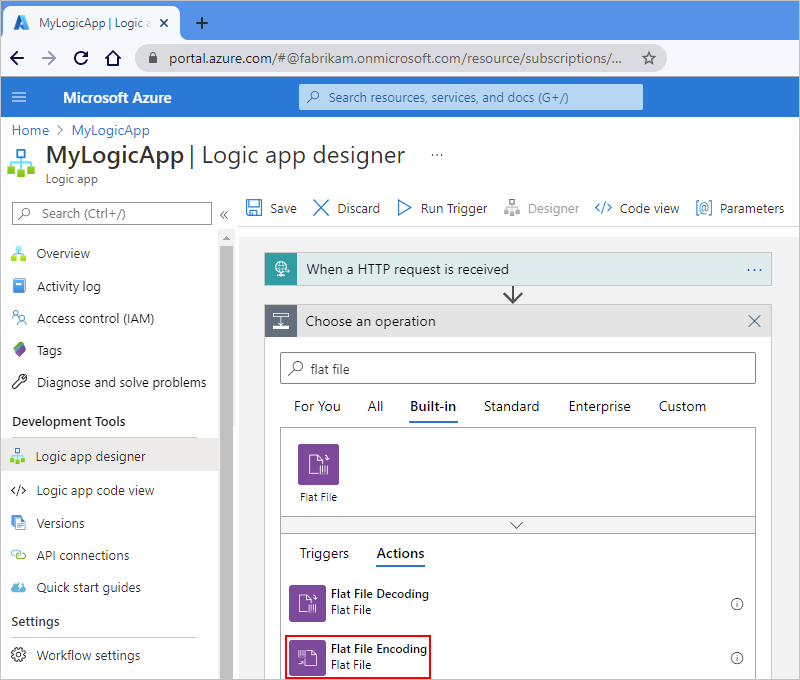
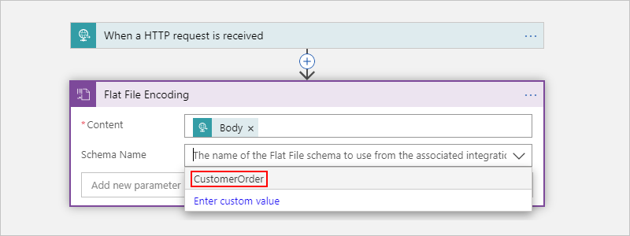
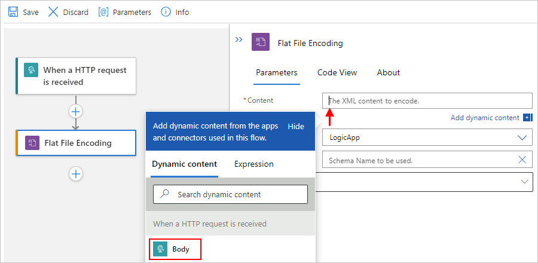
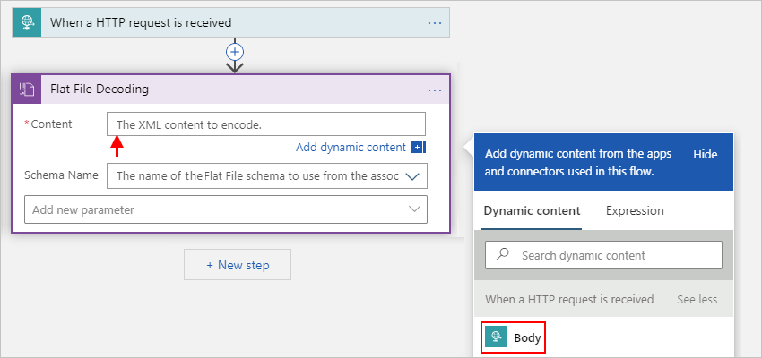
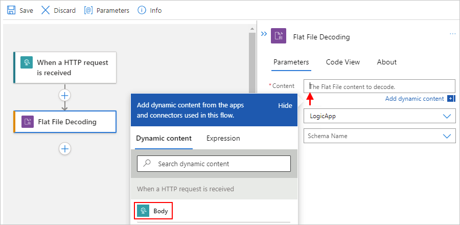
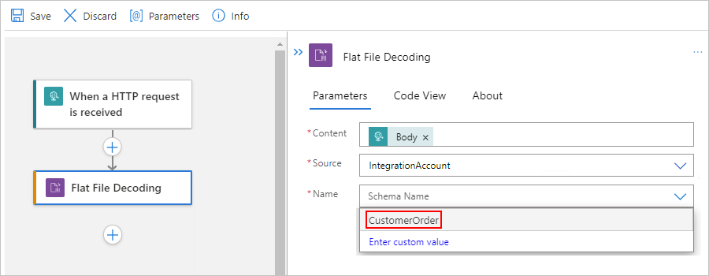

# Encode and decode flat files in Azure Logic Apps

[!INCLUDE [logic-apps-sku-consumption-standard](../../includes/logic-apps-sku-consumption-standard.md)]

Before you send XML content to a business partner in a business-to-business (B2B) scenario, you might want to encode that content first. If you receive encoded XML content, you'll need to decode that content first. When you're building a logic app workflow in Azure Logic Apps, you can encode and decode flat files by using the **Flat File** built-in connector actions and providing a schema to use for encoding and decoding. You can use **Flat File** actions in multi-tenant Consumption logic app workflows and single-tenant Standard logic app workflows.

> [!NOTE]
>
> In Standard logic app workflows, the **Flat File** actions are currently in preview.

While no **Flat File** triggers are available, you can use any trigger or action to feed the source XML content into your workflow for encoding or decoding. For example, you can use a built-in connector trigger, a managed or Azure-hosted connector trigger available for Azure Logic Apps, or even another app.

This article shows how to add the **Flat File** encoding and decoding actions to your workflow.

For more information, review the following documentation:

* [Consumption versus Standard logic apps](logic-apps-overview.md#resource-type-and-host-environment-differences)
* [Integration account built-in connectors](../connectors/built-in.md#integration-account-built-in)
* [Built-in connectors overview for Azure Logic Apps](../connectors/built-in.md)
* [Managed or Azure-hosted connectors in Azure Logic Apps](/connectors/connector-reference/connector-reference-logicapps-connectors)

## Prerequisites

* An Azure account and subscription. If you don't have a subscription yet, [sign up for a free Azure account](https://azure.microsoft.com/free/?WT.mc_id=A261C142F).

* The logic app workflow, blank or existing, where you want to use the **Flat File** action.

  If you have a blank workflow, use any trigger that you want to start the workflow. This example uses the Request trigger.

* Your logic app resource and workflow. Flat file operations don't have any triggers available, so your workflow has to minimally include a trigger. For more information, review the following documentation:

  * [Quickstart: Create your first Consumption logic app workflow with multi-tenant Azure Logic Apps](quickstart-create-first-logic-app-workflow.md)

  * [Create a Standard logic app workflow with single-tenant Azure Logic Apps](create-single-tenant-workflows-azure-portal.md)

* The flat file [schema](logic-apps-enterprise-integration-schemas.md) to use for encoding and decoding the XML content.

* Based on whether you're working on a Consumption or Standard logic app workflow, you'll need an [integration account resource](logic-apps-enterprise-integration-create-integration-account.md). Usually, you need this resource when you want to define and store artifacts for use in enterprise integration and B2B workflows.

  > [!IMPORTANT]
  >
  > To work together, both your integration account and logic app resource must exist in the same Azure subscription and Azure region.

  * If you're working on a Consumption logic app workflow, your logic app resource requires a [link to your integration account](logic-apps-enterprise-integration-create-integration-account.md?tabs=consumption#link-account).

  * If you're working on a Standard logic app workflow, you can link your your logic app resource to your integration account, upload encoding schemas directly to your logic app resource, or both, based on the following scenarios:

    * If you already have an integration account with the artifacts that you need or want to use, you can link your integration account to multiple Standard logic app resources where you want to use the artifacts. That way, you don't have to upload schemas to each individual logic app. For more information, review [Link your logic app resource to your integration account](logic-apps-enterprise-integration-create-integration-account.md?tabs=standard#link-account).

    * Some Azure-hosted integration account connectors, such as AS2, EDIFACT, and X12, let you create a connection to your integration account. If you're just using these connectors, you don't need the link.

    * The built-in connectors named **Flat File** and **Liquid** let you select schemas and maps that you previously uploaded to your logic app resource or to a linked integration account, but not both. You can then use these artifacts across all child workflows within the same logic app resource.

  So, if you don't have or need an integration account, you can use the upload option. Otherwise, you can use the linking option. Either way, you can use these artifacts across all child workflows within the same logic app resource.

* An [integration account resource](logic-apps-enterprise-integration-create-integration-account.md) where you define and store artifacts, such as trading partners, agreements, certificates, and so on, for use in your enterprise integration and B2B workflows. This resource has to meet the following requirements:

  * Is associated with the same Azure subscription as your logic app resource.

  * Exists in the same location or Azure region as your logic app resource.

  * If you're using the [**Logic App (Consumption)** resource type](logic-apps-overview.md#resource-type-and-host-environment-differences), your integration account requires the following items:

    * The flat file [schema](logic-apps-enterprise-integration-schemas.md) to use for encoding or decoding the XML content.

    * A [link to your logic app resource](logic-apps-enterprise-integration-create-integration-account.md#link-account).

  * If you're using the [**Logic App (Standard)** resource type](logic-apps-overview.md#resource-type-and-host-environment-differences), you don't store schemas in your integration account. Instead, you can [directly add schemas to your logic app resource](logic-apps-enterprise-integration-schemas.md) using either the Azure portal or Visual Studio Code. You can then use these schemas across multiple workflows within the *same logic app resource*.

    You still need an integration account to store other artifacts, such as partners, agreements, and certificates, along with using the [AS2](logic-apps-enterprise-integration-as2.md), [X12](logic-apps-enterprise-integration-x12.md), and [EDIFACT](logic-apps-enterprise-integration-edifact.md) operations. However, you don't need to link your logic app resource to your integration account, so the linking capability doesn't exist. Your integration account still has to meet other requirements, such as using the same Azure subscription and existing in the same location as your logic app resource.

    > [!NOTE]
    > Currently, only the **Logic App (Consumption)** resource type supports [RosettaNet](logic-apps-enterprise-integration-rosettanet.md) operations. 
    > The **Logic App (Standard)** resource type doesn't include [RosettaNet](logic-apps-enterprise-integration-rosettanet.md) operations.

## Limits

Make sure that the contained XML groups in the flat file schema that you generate doesn't have excessive numbers of the `max count` property set to a value *greater than 1*. Avoid nesting an XML group with a `max count` property value greater than 1 inside another XML group with a `max count` property greater than 1.

Each time that the flat file schema allows the choice of the next fragment, the Azure Logic Apps engine that parses the schema generates a *symbol* and a *prediction* for that fragment. If the schema allows too many such constructs, for example, more than 100,000, the schema expansion becomes excessively large, which consumes too much resources and time.

## Add Flat File Encoding action

### [Consumption](#tab/consumption)

1. In the [Azure portal](https://portal.azure.com), open your logic app workflow in the designer.

1. If you have a blank workflow that doesn't have a trigger, add any trigger you want. Otherwise, continue to the next step.

   This example uses the Request trigger, which is named **When a HTTP request is received**, and handles inbound requests from outside the logic app workflow. To add the Request trigger, follow these steps:

   1. Under the designer search box, select **Built-in**. In the designer search box, enter `HTTP request`.

   1. From the triggers list, select the Request trigger named **When an HTTP request is received**.

   > [!TIP]
   > Providing a JSON schema is optional. If you have a sample payload from the inbound request, 
   > select **Use sample payload to generate schema**, enter the sample payload, and select **Done**. 
   > The schema appears in the **Request Body JSON Schema** box.

1. Under the step in your workflow where you want to add the **Flat File Encoding** action, choose an option:

   * To add the **Flat File Encoding** action at the end of your workflow, select **New step**.

   * To add the **Flat File Encoding** action between existing steps, move your pointer over the arrow that connects those steps so that the plus sign (**+**) appears. Select that plus sign, and then select **Add an action**.

1. In the **Choose an operation** search box, enter `flat file`. From the actions list, select the action named **Flat File Encoding**.

   

1. Click inside the **Content** box so that the dynamic content list appears. From the list, in the **When a HTTP request is received** section, select the **Body** property, which contains the request body output from the trigger and the content to encode.

   

   > [!TIP]
   > If the **Body** property doesn't appear in the dynamic content list, 
   > select **See more** next to the **When a HTTP request is received** section label.
   > You can also directly enter the content to decode in the **Content** box.

1. From the **Schema Name** list, select the schema that's in your linked integration account to use for encoding, for example:

   

   > [!NOTE]
   > If no schema appears in the list, your integration account doesn't contain any schema files 
   > to use for encoding. Upload the schema that you want to use to your integration account.

1. Save your workflow. On the designer toolbar, select **Save**.

1. To test your workflow, send a request to the HTTPS endpoint, which appears in the Request trigger's **HTTP POST URL** property, and include the XML content that you want to encode in the request body.

You're now done with setting up your flat file encoding action. In a real world app, you might want to store the encoded data in a line-of-business (LOB) app, such as Salesforce. Or, you can send the encoded data to a trading partner. To send the output from the encoding action to Salesforce or to your trading partner, use the other [connectors available in Azure Logic Apps](../connectors/apis-list.md).

### [Standard](#tab/standard)

1. In the [Azure portal](https://portal.azure.com), open your logic app workflow in the designer.

1. If you have a blank workflow that doesn't have a trigger, add any trigger you want. Otherwise, continue to the next step.

   This example uses the Request trigger, which is named **When a HTTP request is received**, and handles inbound requests from outside the logic app workflow. To add the Request trigger, follow these steps:

   1. On the designer, select **Choose an operation**. In the **Choose an operation** pane that opens, under the search box, select **Built-in**.

   1. In the search box, enter `HTTP request`. From the triggers list, select the Request trigger named **When an HTTP request is received**.

     > [!TIP]
     > Providing a JSON schema is optional. If you have a sample payload from the inbound request, 
     > select **Use sample payload to generate schema**, enter the sample payload, and select **Done**. 
     > The schema appears in the **Request Body JSON Schema** box.

1. Under the step in your workflow where you want to add the **Flat File Encoding** action, choose an option:

   * To add the **Flat File Encoding** action at the end of your workflow, select the plus sign (**+**), and then select **Add an action**.

   * To add the **Flat File Encoding** action between existing steps, select the plus sign (**+**) that appears between those steps, and then select **Insert a new step**.

1. In the **Choose an operation** pane that opens, under the search box, select **Built-in**.

1. In the search box, enter `flat file`. From the actions list, select the action named **Flat File Encoding**.

   

1. Click inside the **Content** box so that the dynamic content list appears. From the list, in the **When a HTTP request is received** section, select the **Body** property, which contains the request body output from the trigger and the content to encode.

   

   > [!TIP]
   > If the **Body** property doesn't appear in the dynamic content list, 
   > select **See more** next to the **When a HTTP request is received** section label.
   > You can also directly enter the content to encode in the **Content** box.

1. From the **Name** list, select the schema that you previously uploaded to your logic app resource for encoding, for example:

   

   > [!NOTE]
   > If no schema appears in the list, your Standard logic app resource doesn't contain any schema files to use for encoding. 
   > Learn how to [upload the schemma that you want to use to your Standard logic app resource](logic-apps-enterprise-integration-schemas.md).

1. Save your workflow. On the designer toolbar, select **Save**.

1. To test your workflow, send a request to the HTTPS endpoint, which appears in the Request trigger's **HTTP POST URL** property, and include the XML content that you want to encode in the request body.

You're now done with setting up your flat file encoding action. In a real world app, you might want to store the encoded data in a line-of-business (LOB) app, such as Salesforce. Or, you can send the encoded data to a trading partner. To send the output from the encoding action to Salesforce or to your trading partner, use the other [connectors available in Azure Logic Apps](../connectors/apis-list.md).

---

## Add Flat File Decoding action

### [Consumption](#tab/consumption)

1. In the [Azure portal](https://portal.azure.com), open your logic app workflow in the designer.

1. If you have a blank workflow that doesn't have a trigger, add any trigger you want. Otherwise, continue to the next step.

   This example uses the Request trigger, which is named **When a HTTP request is received**, and handles inbound requests from outside the logic app workflow. To add the Request trigger, follow these steps:

   1. Under the designer search box, select **Built-in**. In the designer search box, enter `HTTP request`.

   1. From the triggers list, select the Request trigger named **When an HTTP request is received**.

   > [!TIP]
   > Providing a JSON schema is optional. If you have a sample payload from the inbound request, 
   > select **Use sample payload to generate schema**, enter the sample payload, and select **Done**. 
   > The schema appears in the **Request Body JSON Schema** box.

1. Under the step in your workflow where you want to add the **Flat File Decoding** action, choose an option:

   * To add the **Flat File Decoding** action at the end of your workflow, select **New step**.

   * To add the **Flat File Decoding** action between existing steps, move your pointer over the arrow that connects those steps so that the plus sign (**+**) appears. Select that plus sign, and then select **Add an action**.

1. In the **Choose an operation** search box, enter `flat file`. From the actions list, select the action named **Flat File Decoding**.

   

1. Click inside the **Content** box so that the dynamic content list appears. From the list, in the **When a HTTP request is received** section, select the **Body** property, which contains the request body output from the trigger and the content to decode.

   

   > [!TIP]
   > If the **Body** property doesn't appear in the dynamic content list, 
   > select **See more** next to the **When a HTTP request is received** section label. 
   > You can also directly enter the content to decode in the **Content** box.

1. From the **Schema Name** list, select the schema that's in your linked integration account to use for decoding, for example:

   

   > [!NOTE]
   > If no schema appears in the list, your integration account doesn't contain any schema files 
   > to use for decoding. Upload the schema that you want to use to your integration account.

1. Save your workflow. On the designer toolbar, select **Save**.

1. To test your workflow, send a request to the HTTPS endpoint, which appears in the Request trigger's **HTTP POST URL** property, and include the XML content that you want to decode in the request body.

You're now done with setting up your flat file decoding action. In a real world app, you might want to store the decoded data in a line-of-business (LOB) app, such as Salesforce. Or, you can send the decoded data to a trading partner. To send the output from the decoding action to Salesforce or to your trading partner, use the other [connectors available in Azure Logic Apps](../connectors/apis-list.md).

### [Standard](#tab/standard)

1. In the [Azure portal](https://portal.azure.com), open your logic app workflow in the designer.

1. If you have a blank workflow that doesn't have a trigger, add any trigger you want. Otherwise, continue to the next step.

   This example uses the Request trigger, which is named **When a HTTP request is received**, and handles inbound requests from outside the logic app workflow. To add the Request trigger, follow these steps:

   1. On the designer, select **Choose an operation**. In the **Choose an operation** pane that opens, under the search box, select **Built-in**.

   1. In the search box, enter `HTTP request`. From the triggers list, select the Request trigger named **When an HTTP request is received**.

     > [!TIP]
     > Providing a JSON schema is optional. If you have a sample payload from the inbound request, 
     > select **Use sample payload to generate schema**, enter the sample payload, and select **Done**. 
     > The schema appears in the **Request Body JSON Schema** box.

1. Under the step in your workflow where you want to add the **Flat File Decoding** action, choose an option:

   * To add the **Flat File Decoding** action at the end of your workflow, select the plus sign (**+**), and then select **Add an action**.

   * To add the **Flat File Decoding** action between existing steps, select the plus sign (**+**) that appears between those steps, and then select **Insert a new step**.

1. In the **Choose an operation** pane that opens, under the search box, select **Built-in**.

1. In the search box, enter `flat file`. From the actions list, select the action named **Flat File Decoding**.

   

1. Click inside the **Content** box so that the dynamic content list appears. From the list, in the **When a HTTP request is received** section, select the **Body** property, which contains the request body output from the trigger and the content to decode.

   

   > [!TIP]
   > If the **Body** property doesn't appear in the dynamic content list, 
   > select **See more** next to the **When a HTTP request is received** section label.
   > You can also directly enter the content to decode in the **Content** box.

1. From the **Name** list, select the schema that you previously uploaded to your logic app resource for decoding, for example:

   

   > [!NOTE]
   > If no schema appears in the list, your Standard logic app resource doesn't contain any schema files to use for decoding. 
   > Learn how to [upload the schema that you want to use to your Standard logic app resource](logic-apps-enterprise-integration-schemas.md).

1. Save your workflow. On the designer toolbar, select **Save**.

1. To test your workflow, send a request to the HTTPS endpoint, which appears in the Request trigger's **HTTP POST URL** property, and include the XML content that you want to decode in the request body.

You're now done with setting up your flat file decoding action. In a real world app, you might want to store the decoded data in a line-of-business (LOB) app, such as Salesforce. Or, you can send the decoded data to a trading partner. To send the output from the decoding action to Salesforce or to your trading partner, use the other [connectors available in Azure Logic Apps](../connectors/apis-list.md).

---

## Next steps

* Learn more about the [Enterprise Integration Pack](logic-apps-enterprise-integration-overview.md)
