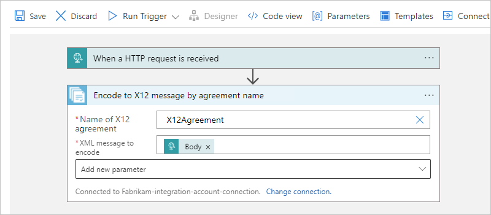
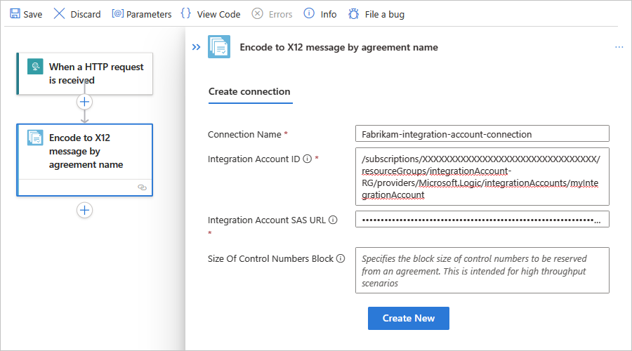
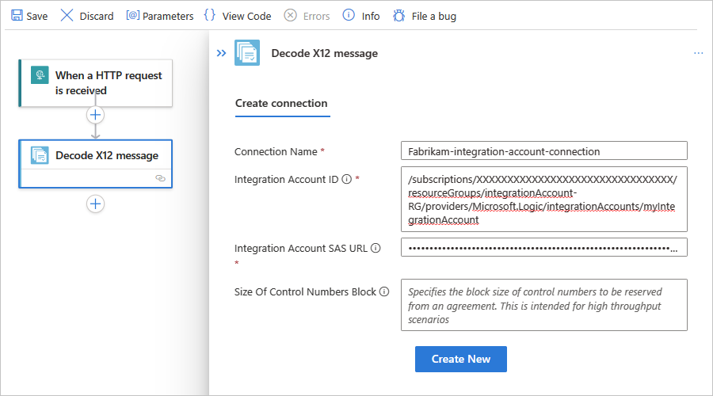

# Exchange X12 messages using workflows in Azure Logic Apps

[!INCLUDE [logic-apps-sku-consumption-standard](../../includes/logic-apps-sku-consumption-standard.md)]

To send and receive X12 messages in workflows that you create using Azure Logic Apps, use the **X12** connector, which provides operations that support and manage X12 communication.

This how-to guide shows how to add the X12 encoding and decoding actions to an existing logic app workflow. The **X12** connector doesn't include any triggers, so you can use any trigger to start your workflow. The examples in this guide use the [Request trigger](../connectors/connectors-native-reqres.md).

## Connector technical reference

The **X12** connector has one version across workflows in [multi-tenant Azure Logic Apps, single-tenant Azure Logic Apps, and the integration service environment (ISE)](logic-apps-overview.md#resource-environment-differences). For technical information about the **X12** connector, see the following documentation:

* [Connector reference page](/connectors/x12/), which describes the triggers, actions, and limits as documented by the connector's Swagger file

* [B2B protocol limits for message sizes](logic-apps-limits-and-config.md#b2b-protocol-limits)

  For example, in an [integration service environment (ISE)](connect-virtual-network-vnet-isolated-environment-overview.md), this connector's ISE version uses the [B2B message limits for ISE](logic-apps-limits-and-config.md#b2b-protocol-limits).

## Prerequisites

* An Azure account and subscription. If you don't have an Azure subscription yet, [sign up for a free Azure account](https://azure.microsoft.com/free/?WT.mc_id=A261C142F).

* An [integration account resource](logic-apps-enterprise-integration-create-integration-account.md) where you define and store artifacts, such as trading partners, agreements, certificates, and so on, for use in your enterprise integration and B2B workflows. This resource has to meet the following requirements:

  * Both your integration account and logic app resource must exist in the same Azure subscription and Azure region.

  * Defines at least two [trading partners](logic-apps-enterprise-integration-partners.md) that participate in the **X12** operation used in your workflow. The definitions for both partners must use the same X12 business identity qualifier.

  * Defines an [X12 agreement](logic-apps-enterprise-integration-agreements.md) between the trading partners that participate in your workflow. Each agreement requires a host partner and a guest partner. The content in the messages between you and the other partner must match the agreement type. For information about agreement settings to use when receiving and sending messages, see [X12 message settings](logic-apps-enterprise-integration-x12-message-settings.md).

    > [!IMPORTANT]
    >
    > If you're working with Health Insurance Portability and Accountability Act (HIPAA) schemas, you have to add a 
    > `schemaReferences` section to your agreement. For more information, review [HIPAA schemas and message types](#hipaa-schemas).

  * Defines the [schemas](logic-apps-enterprise-integration-schemas.md) to use for XML validation.

    > [!IMPORTANT]
    >
    > If you're working with Health Insurance Portability and Accountability Act (HIPAA) schemas, make sure to review [HIPAA schemas and message types](#hipaa-schemas).

* Based on whether you're working on a Consumption or Standard logic app workflow, your logic app resource might require a link to your integration account:

  | Logic app workflow | Link required? |
  |--------------------|----------------|
  | Consumption | Connection to integration account required, but no link required. You can create the connection when you add the **X12** operation to your workflow. |
  | Standard | Connection to integration account required, but no link required. You can create the connection when you add the **X12** operation to your workflow. |

* The logic app resource and workflow where you want to use the X12 operations.

  For more information, see the following documentation:

  * [Create an example Consumption logic app workflow in multi-tenant Azure Logic Apps](quickstart-create-example-consumption-workflow.md)

  * [Create an example Standard logic app workflow in single-tenant Azure Logic Apps](create-single-tenant-workflows-azure-portal.md)

## Encode X12 messages

The **Encode to X12 message** operation performs the following tasks:

* Resolves the agreement by matching sender and receiver context properties.
* Serializes the EDI interchange and converts XML-encoded messages into EDI transaction sets in the interchange.
* Applies transaction set header and trailer segments.
* Generates an interchange control number, a group control number, and a transaction set control number for each outgoing interchange.
* Replaces separators in the payload data.
* Validates EDI and partner-specific properties.
  * Schema validation of transaction-set data elements against the message schema.
  * EDI validation on transaction-set data elements.
  * Extended validation on transaction-set data elements.
* Requests a Technical and Functional Acknowledgment, if configured.
  * Generates a Technical Acknowledgment as a result of header validation. The technical acknowledgment reports the status of the processing of an interchange header and trailer by the address receiver.
  * Generates a Functional Acknowledgment generates as a result of body validation. The functional acknowledgment reports each error encountered while processing the received document.

### [Consumption](#tab/consumption)

1. In the [Azure portal](https://portal.azure.com), open your logic app resource and workflow in the designer.

1. In the designer, [follow these general steps to add the **X12** action named **Encode to X12 message by agreement name** to your workflow](create-workflow-with-trigger-or-action?tabs=consumption#add-action).

   > [!NOTE]
   >
   > If you want to use **Encode to X12 message by identities** action instead, 
   > you later have to provide different values, such as the **Sender identifier** 
   > and **Receiver identifier** that's specified by your X12 agreement. 
   > You also have to specify the **XML message to encode**, which can be the output 
   > from the trigger or a preceding action.

1. When prompted, provide the following connection information for your integration account:

   | Property | Required | Description |
   |----------|----------|-------------|
   | **Connection name** | Yes | A name for the connection |
   | **Integration Account** | Yes | From the list of available integration accounts, select the account to use. |

   For example:

   

1. When you're done, select **Create**.

1. In the X12 action information box, provide the following property values:

   | Property | Required | Description |
   |----------|----------|-------------|
   | **Name of X12 agreement** | Yes | The X12 agreement to use. |
   | **XML message to encode** | Yes | The XML message to encode |
   | Other parameters | No | This operation includes the following other parameters:   - **Data element separator**  - **Component separator**  - **Replacement character**  - **Segment terminator**  - **Segment terminator suffix**  - **Control Version Number**  - **Application Sender Identifier/Code GS02**  - **Application Receiver Identifier/Code GS03**   For more information, review [X12 message settings](logic-apps-enterprise-integration-x12-message-settings.md). |

   For example, you can use the **Body** content output from the Request trigger as the XML message payload:

   

### [Standard](#tab/standard)

1. In the [Azure portal](https://portal.azure.com), open your logic app resource and workflow in the designer.

1. In the designer, [follow these general steps to add the **X12** action named **Encode to X12 message by agreement name** to your workflow](create-workflow-with-trigger-or-action?tabs=standard#add-action).

   > [!NOTE]
   >
   > If you want to use **Encode to X12 message by identities** action instead, 
   > you later have to provide different values, such as the **Sender identifier** 
   > and **Receiver identifier** that's specified by your X12 agreement. 
   > You also have to specify the **XML message to encode**, which can be the output 
   > from the trigger or a preceding action.

1. When prompted, provide the following connection information for your integration account:

   | Property | Required | Description |
   |----------|----------|-------------|
   | **Connection Name** | Yes | A name for the connection |
   | **Integration Account ID** | Yes | The resource ID for your integration account, which has the following format:   **`/subscriptions/<Azure-subscription-ID>/resourceGroups/<resource-group-name>/providers/Microsoft.Logic/integrationAccounts/<integration-account-name>`**   For example:  `/subscriptions/XXXXXXXXXXXXXXXXXXXXXXXXXXXXXXXX/resourceGroups/integrationAccount-RG/providers/Microsoft.Logic/integrationAccounts/myIntegrationAccount`   To find this resource ID, follow these steps:    1. In the Azure portal, open your integration account.  2. On the integration account menu, select **Overview**.  3. On the **Overview** page, select **JSON View**.  4. From the **Resource ID** property, copy the value. |
   | **Integration Account SAS URL** | Yes | The request endpoint URL that uses shared access signature (SAS) authentication to provide access to your integration account. This callback URL has the following format:   **`https://<request-endpoint-URI>sp=<permissions>sv=<SAS-version>sig=<signature>`**   For example:  `https://prod-04.west-us.logic-azure.com:443/integrationAccounts/XXXXXXXXXXXXXXXXXXXXXXXXXXXXXXXX?api-version=2015-08-1-preview&sp=XXXXXXXXX&sv=1.0&sig=ZZZZZZZZZZZZZZZZZZZZZZZZZZZ`   To find this URL, follow these steps:   1. In the Azure portal, open your integration account.  2. On the integration account menu, under **Settings**, select **Callback URL**.  3. From the **Generated Callback URL** property, copy the value. |
   | **Size of Control Number Block** | No | The block size of control numbers to reserve from an agreement for high throughput scenarios |

   For example:

   

1. When you're done, select **Create**.

1. In the X12 action information box, provide the following property values:

   | Property | Required | Description |
   |----------|----------|-------------|
   | **Name Of X12 Agreement** | Yes | The X12 agreement to use. |
   | **XML Message To Encode** | Yes | The XML message to encode |
   | **Advanced parameters** | No | This operation includes the following other parameters:   - **Data element separator**  - **Component separator**  - **Replacement character**  - **Segment terminator**  - **Segment terminator suffix**  - **Control Version Number**  - **Application Sender Identifier/Code GS02**  - **Application Receiver Identifier/Code GS03**   For more information, review [X12 message settings](logic-apps-enterprise-integration-x12-message-settings.md). |

   For example, you can use the **Body** content output from the Request trigger as the XML message payload:

   

---

## Decode X12 messages

The **Decode X12 message** operation performs the following tasks:

* Validates the envelope against trading partner agreement.

* Validates EDI and partner-specific properties.

  * EDI structural validation and extended schema validation
  * Interchange envelope structural validation
  * Schema validation of the envelope against the control schema
  * Schema validation of the transaction set data elements against the message schema
  * EDI validation on transaction-set data elements

* Verifies that the interchange, group, and transaction set control numbers aren't duplicates.

  * Checks the interchange control number against previously received interchanges.
  * Checks the group control number against other group control numbers in the interchange.
  * Checks the transaction set control number against other transaction set control numbers in that group.

* Splits an interchange into transaction sets, or preserves the entire interchange:

  * Split the interchange into transaction sets or suspend transaction sets on error: Parse each transaction set. The X12 decode action outputs only those transaction sets failing validation to `badMessages`, and outputs the remaining transactions sets to `goodMessages`.

  * Split the interchange into transaction sets or suspend interchange on error: Parse each transaction set. If one or more transaction sets in the interchange fail validation, the X12 decode action outputs all the transaction sets in that interchange to `badMessages`.

  * Preserve the interchange or suspend transaction sets on error: Preserve the interchange and process the entire batched interchange. The X12 decode action outputs only those transaction sets failing validation to `badMessages`, and outputs the remaining transactions sets to `goodMessages`.

  * Preserve the interchange or suspend interchange on error: Preserve the interchange and process the entire batched interchange. If one or more transaction sets in the interchange fail validation, the X12 decode action outputs all the transaction sets in that interchange to `badMessages`.

* Generates a Technical and Functional Acknowledgment, if configured.

  * Generates a Technical Acknowledgment as a result of header validation. The technical acknowledgment reports the status of the processing of an interchange header and trailer by the address receiver.
  * Generates a Functional Acknowledgment as a result of body validation. The functional acknowledgment reports each error encountered while processing the received document.

### [Consumption](#tab/consumption)

1. In the [Azure portal](https://portal.azure.com), open your logic app resource and workflow in the designer.

1. In the designer, [follow these general steps to add the **X12** action named **Decode X12 message** to your workflow](create-workflow-with-trigger-or-action?tabs=consumption#add-action).

1. When prompted, provide the following connection information for your integration account:

   | Property | Required | Description |
   |----------|----------|-------------|
   | **Connection name** | Yes | A name for the connection |
   | **Integration Account** | Yes | From the list of available integration accounts, select the account to use. |

   For example:

   

1. When you're done, select **Create**.

1. In the X12 action information box, provide the following property values:

   | Property | Required | Description |
   |----------|----------|-------------|
   | **X12 flat file message to decode** | Yes | The X12 message in flat file format to decode   **Note**: The XML message payload or content for the message array, good or bad, is base64 encoded. So, you must use an expression that processes this content. For example, the following expression processes the message content as XML:   **`xml(base64ToBinary(item()?['Body']))`** |
   | Other parameters | No | This operation includes the following other parameters:   - **Preserve Interchange**  - **Suspend Interchange on Error**   For more information, review [X12 message settings](logic-apps-enterprise-integration-x12-message-settings.md). |

   For example, you can use the **Body** content output from the Request trigger as the XML message payload, but you must first preprocess this content using an expression:

   

### [Standard](#tab/standard)

1. In the [Azure portal](https://portal.azure.com), open your logic app resource and workflow in the designer.

1. In the designer, [follow these general steps to add the **X12** action named **Decode X12 message** to your workflow](create-workflow-with-trigger-or-action?tabs=standard#add-action).

1. When prompted, provide the following connection information for your integration account:

   | Property | Required | Description |
   |----------|----------|-------------|
   | **Connection Name** | Yes | A name for the connection |
   | **Integration Account ID** | Yes | The resource ID for your integration account, which has the following format:   **`/subscriptions/<Azure-subscription-ID>/resourceGroups/<resource-group-name>/providers/Microsoft.Logic/integrationAccounts/<integration-account-name>`**   For example:  `/subscriptions/XXXXXXXXXXXXXXXXXXXXXXXXXXXXXXXX/resourceGroups/integrationAccount-RG/providers/Microsoft.Logic/integrationAccounts/myIntegrationAccount`   To find this resource ID, follow these steps:    1. In the Azure portal, open your integration account.  2. On the integration account menu, select **Overview**.  3. On the **Overview** page, select **JSON View**.  4. From the **Resource ID** property, copy the value. |
   | **Integration Account SAS URL** | Yes | The request endpoint URL that uses shared access signature (SAS) authentication to provide access to your integration account. This callback URL has the following format:   **`https://<request-endpoint-URI>sp=<permissions>sv=<SAS-version>sig=<signature>`**   For example:  `https://prod-04.west-us.logic-azure.com:443/integrationAccounts/XXXXXXXXXXXXXXXXXXXXXXXXXXXXXXXX?api-version=2015-08-1-preview&sp=XXXXXXXXX&sv=1.0&sig=ZZZZZZZZZZZZZZZZZZZZZZZZZZZ`   To find this URL, follow these steps:   1. In the Azure portal, open your integration account.  2. On the integration account menu, under **Settings**, select **Callback URL**.  3. From the **Generated Callback URL** property, copy the value. |
   | **Size of Control Number Block** | No | The block size of control numbers to reserve from an agreement for high throughput scenarios |

   For example:

   

1. When you're done, select **Create**.

1. In the X12 action information box, provide the following property values:

   | Property | Required | Description |
   |----------|----------|-------------|
   | **X12 Flat File Message To Decode** | Yes | The X12 message in flat file format to decode   **Note**: The XML message payload or content for the message array, good or bad, is base64 encoded. So, you must use an expression that processes this content. For example, the following expression processes the message content as XML:   **`xml(base64ToBinary(item()?['Body']))`** |
   | **Advanced parameters** | No | This operation includes the following other parameters:   - **Preserve Interchange**  - **Suspend Interchange on Error**   For more information, review [X12 message settings](logic-apps-enterprise-integration-x12-message-settings.md). |

   For example, you can use the **Body** content output from the Request trigger as the XML message payload, but you must first preprocess this content using an expression:

   

---

## Next steps

* [X12 TA1 technical acknowledgments and error codes](logic-apps-enterprise-integration-x12-ta1-acknowledgment.md)
* [X12 997 functional acknowledgments and error codes](logic-apps-enterprise-integration-x12-997-acknowledgment.md)
* [X12 message settings](logic-apps-enterprise-integration-x12-message-settings.md)