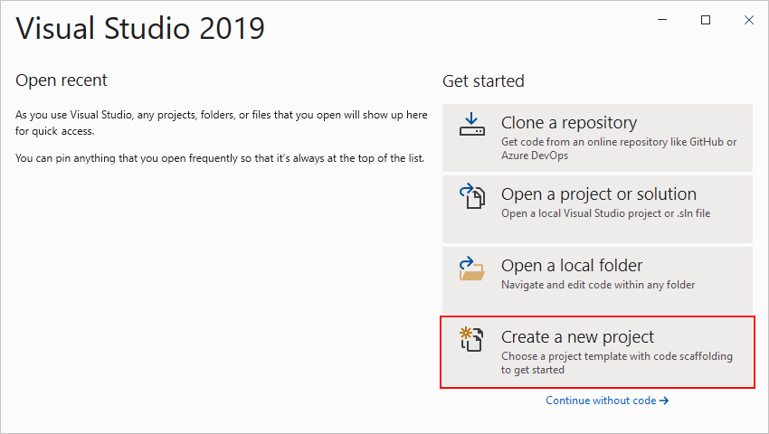
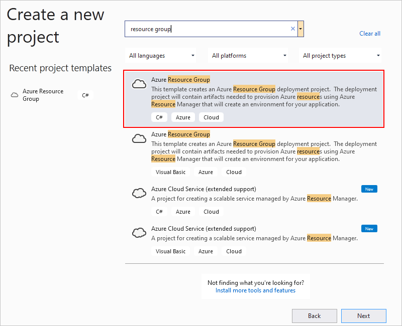

# Create an example serverless app with Azure Logic Apps and Azure Functions in Visual Studio

You can quickly create, build, and deploy cloud-based "serverless" apps by using the services and capabilities in Azure, such as Azure Logic Apps and Azure Functions. When you use Azure Logic Apps, you can quickly and easily build workflows using low-code or no-code approaches to simplify orchestrating combined tasks. You can integrate different services, cloud, on-premises, or hybrid, without coding those interactions, having to maintain glue code, or learn new APIs or specifications. When you use Azure Functions, you can speed up development by using an event-driven model. You can use triggers that respond to events by automatically running your own code. You can use bindings to seamlessly integrate other services.

This article shows how to build an example serverless app by using an Azure Quickstart template. This template creates an Azure resource group project, which contains an Azure Resource Manager deployment template. This template defines a basic logic app resource where a predefined a workflow calls a predefined Azure function. The workflow definition includes the following components:

* A Request trigger that receives HTTP requests. To start this trigger, you send a request to the trigger's URL.
* An Azure Functions action that calls a predefined function that's powered by an Azure web app.
* A Response action that returns an HTTP response containing the result from the function.

For more information, review the following articles:

* [Serverless computing: An introduction to serverless technologies](https://azure.microsoft.com/overview/serverless-computing/)
* [About Azure Logic Apps](logic-apps-overview.md)
* [About Azure Functions](../azure-functions/functions-overview.md)
* [Azure Serverless: Overview for building cloud-based apps and solutions with Azure Logic Apps and Azure Functions](logic-apps-serverless-overview.md)

## Prerequisites

* An Azure subscription. If you don't have an Azure subscription, [sign up for a free Azure account](https://azure.microsoft.com/free/?WT.mc_id=A261C142F).

* Download and install the following tools, if you don't already have them:

  * [Visual Studio 2019, 2017, or 2015 (Community or other edition)](https://aka.ms/download-visual-studio). This quickstart uses Visual Studio Community 2019, which is free.

    > [!IMPORTANT]
    > When you install Visual Studio 2019 or 2017, make sure to select the **Azure development** workload.

  * [Microsoft Azure SDK for .NET (version 2.9.1 or later)](https://azure.microsoft.com/downloads/). Learn more about [Azure SDK for .NET](/dotnet/azure/intro).

  * [Azure PowerShell](https://github.com/Azure/azure-powershell#installation).

  * Azure Logic Apps Tools for the Visual Studio version that you're using. You can either [learn how install this extension from inside Visual Studio](/visualstudio/ide/finding-and-using-visual-studio-extensions), or you can download the respective versions of the Azure Logic Apps Tools from the Visual Studio Marketplace:

    * [Visual Studio 2019](https://aka.ms/download-azure-logic-apps-tools-visual-studio-2019)
    * [Visual Studio 2017](https://aka.ms/download-azure-logic-apps-tools-visual-studio-2017)
    * [Visual Studio 2015](https://aka.ms/download-azure-logic-apps-tools-visual-studio-2015)

    > [!IMPORTANT]
    > Make sure that you restart Visual Studio after you finish installing.

  * [Azure Functions Core Tools](https://www.npmjs.com/package/azure-functions-core-tools) so that you can locally debug your Azure function. For more information, review [Work with Azure Functions Core Tools](../azure-functions/functions-run-local.md).

* Access to the internet while using the embedded workflow designer.

  The designer requires an internet connection to create resources in Azure and to read the properties and data from [managed connectors](../connectors/managed.md) in your workflow. For example, if you use the SQL connector, the designer checks your server instance for available default and custom properties.

## Create a resource group project

To get started, create an Azure resource group project as a container for your serverless app. In Azure, a *resource group* is a logical collection that you use to organize the resources for an entire app. You can then manage and deploy these resources as a single asset. For a serverless app in Azure, a resource group includes the resources from Azure Logic Apps *and* Azure Functions. For more information, review [Resource Manager terminology](../azure-resource-manager/management/overview.md#terminology).

1. Open Visual Studio, and sign in with your Azure account, if prompted.
1. If the start window opens, select **Create a new project**.

   

1. Otherwise, from the **File** menu, select **New** > **Project**.

   

1. After the **Create a new project** window opens, in the search box, find and select the **Azure Resource Group** project template for either C# or Visual Basic. This example continues with C#.

   

1. After the **Configure your new project** window opens, provide information about your project, such as the name. When you're done, select **Create**.

   

1. When the **Select Azure Template** window opens, from the **Show templates from this location** list, select **Azure QuickStart (github.com/Azure/azure-quickstart-templates)** as the templates location.

1. In the search box, enter `logic-app-and-function-app`. From the results, select the template named **quickstarts\microsoft.logic\logic-app-and-function-app**. When you're done, select **OK**.

   

   Visual Studio creates your resource group project, including the solution container for your project.

   

1. Next, deploy your solution to Azure. You must complete this deployment step before you can open the deployment template and review the resources for your serverless app.

## Deploy your solution

Before you can open your logic app using the workflow designer in Visual Studio, 
you must have an Azure resource group that's already deployed in Azure. The designer 
can then create connections to resources and services in your logic app. For this task, 
follow these steps to deploy your solution from Visual Studio to the Azure portal:

1. In Solution Explorer, from your resource project's shortcut menu, select **Deploy** > **New**.

   

1. If they're not already selected, select your Azure subscription and the
resource group to which you want to deploy. Then, select **Deploy**.

   

1. If the **Edit Parameters** box appears, provide the resource names 
to use for your logic app and your Azure function app at deployment, 
and then save your settings. Make sure you use a globally unique name 
for your function app.

   

   When Visual Studio starts deployment to your specified resource group, 
   your solution's deployment status appears in the Visual Studio **Output** window. 
   After deployment finishes, your logic app is live in the Azure portal.

## Edit your logic app in Visual Studio

To edit your logic app after deployment, open your logic app by using the workflow designer in Visual Studio.

1. In Solution Explorer, from the shortcut menu of the azuredeploy.json file, 
select **Open With Logic App Designer**.

   

   > [!TIP]
   > If you don't have this command in Visual Studio 2019, check that you have the latest updates for Visual Studio.

1. After the **Logic App Properties** box appears, 
under **Subscription**, select your Azure subscription if it's not already selected. Under **Resource Group**, 
select the resource group and location where you deployed your solution, 
and then select **OK**.

   

   After the workflow designer opens, you can continue adding steps or change the workflow, and save your updates.

   

## Create your Azure Functions project

To create your Functions project and function by using JavaScript, 
Python, F#, PowerShell, Batch, or Bash, follow the steps in 
[Work with Azure Functions Core Tools](../azure-functions/functions-run-local.md). 
To develop your Azure function by using C# inside your solution, 
use a C# class library by following the steps in 
[Publish a .NET class library as a Function App](https://azure.microsoft.com/blog/).

## Deploy functions from Visual Studio

Your deployment template deploys any Azure functions that you have in your solution 
from the Git repo that's specified by variables in the azuredeploy.json file. 
If you create and author your Functions project in your solution, you can check 
that project into Git source control (for example, GitHub or Azure DevOps) 
and then update the `repo` variable so that the template deploys your Azure function.

## Manage logic apps and view run history

For logic apps already deployed in Azure, you can still edit, 
manage, view run history for, and disable those apps from Visual Studio.

1. From the **View** menu in Visual Studio, open **Cloud Explorer**.

1. Under **All subscriptions**, select the Azure subscription 
associated with the logic apps that you want to manage, and then select **Apply**.

1. Under **Logic Apps**, select your logic app. From that app's shortcut menu, 
select **Open with Logic App Editor**.

   > [!TIP]
   > If you don't have this command in Visual Studio 2019, check that you have the latest updates for Visual Studio.

You can now download the already published logic app into your resource group project. 
So, although you might have started a logic app in the Azure portal, you can still import 
and manage that app in Visual Studio. For more information, see 
[Manage logic apps with Visual Studio](../logic-apps/manage-logic-apps-with-visual-studio.md).

## Next steps

* [Manage logic apps with Visual Studio](manage-logic-apps-with-visual-studio.md)
