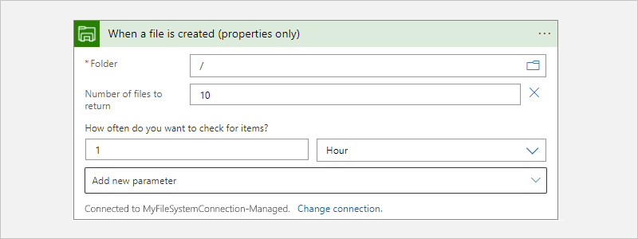
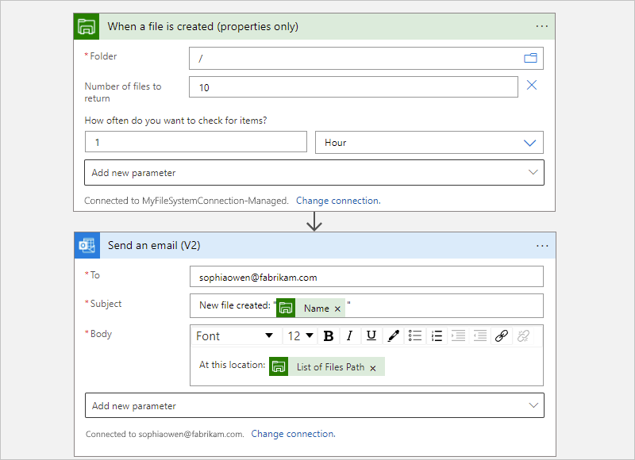
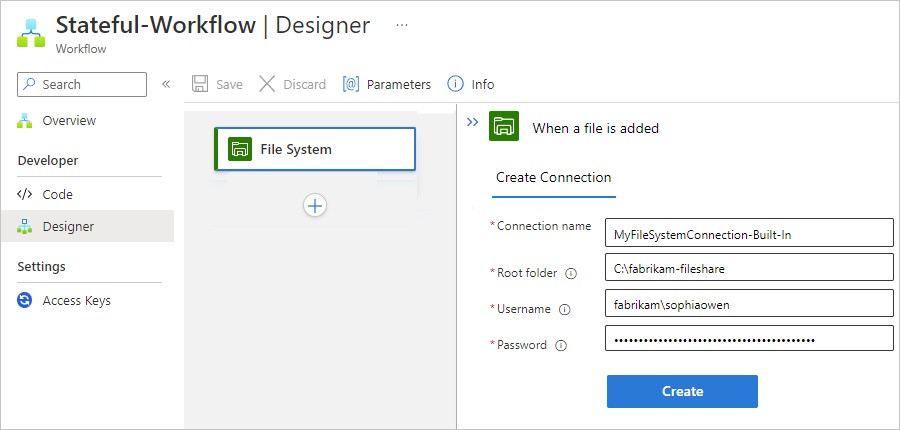
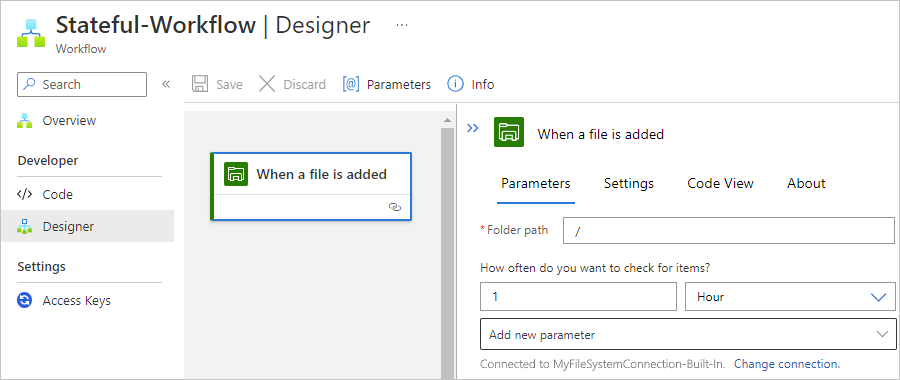
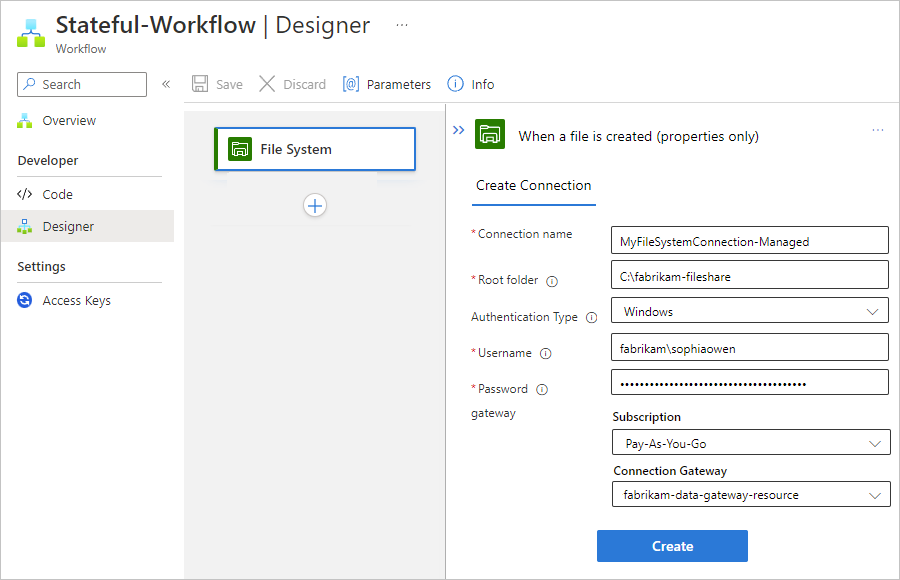
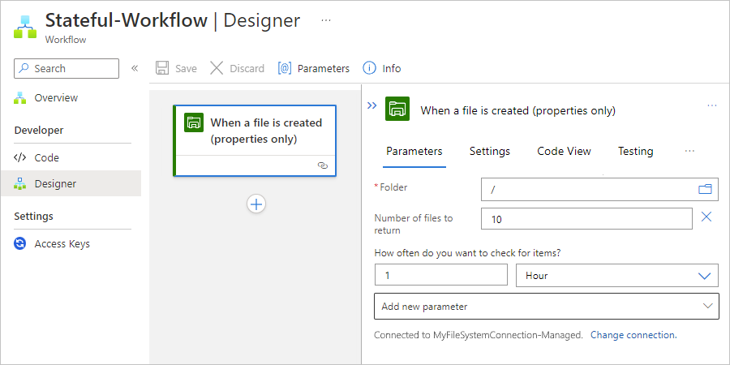
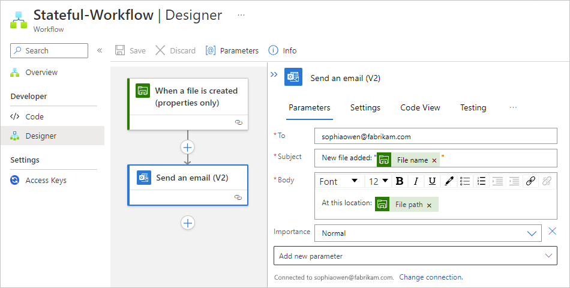

# Connect to on-premises file systems from workflows in Azure Logic Apps

[!INCLUDE [logic-apps-sku-consumption](../../includes/logic-apps-sku-consumption.md)]

This how-to guide shows how to access an on-premises file share from a workflow in Azure Logic Apps by using the File System connector. You can then create automated workflows that run when triggered by events in your file share or in other systems and run actions to manage your files. The connector provides the following capabilities:

- Create, get, append, update, and delete files.
- List files in folders or root folders.
- Get file content and metadata.

In this article, the example scenarios demonstrate the following tasks:

- Trigger a workflow when a file is created or added to a file share, and then send an email.
- Trigger a workflow when copying a file from a Dropbox account to a file share, and then send an email.

## Connector technical reference

The File System connector has different versions, based on [logic app type and host environment](../logic-apps/logic-apps-overview.md#resource-environment-differences).

| Logic app | Environment | Connector version |
|-----------|-------------|-------------------|
| **Consumption** | Multi-tenant Azure Logic Apps | Managed connector, which appears in the designer under the **Standard** label. For more information, review the following documentation:   - [File System managed connector reference](/connectors/filesystem/)  - [Managed connectors in Azure Logic Apps](../connectors/managed.md) |
| **Consumption** | Integration service environment (ISE) | Managed connector, which appears in the designer under the **Standard** label, and the ISE version, which has different message limits than the Standard class. For more information, review the following documentation:   - [File System managed connector reference](/connectors/filesystem/)  - [ISE message limits](../logic-apps/logic-apps-limits-and-config.md#message-size-limits)  - [Managed connectors in Azure Logic Apps](../connectors/managed.md) |
| **Standard** | Single-tenant Azure Logic Apps and App Service Environment v3 (Windows plans only) | Managed connector, which appears in the designer under the **Azure** label, and built-in connector, which appears in the designer under the **Built-in** label. The built-in version differs in the following ways:   - The built-in version supports only Standard logic apps that run in an App Service Environment v3 with Windows plans only.   - The built-in version can connect directly to a file share and access Azure virtual networks. You don't need an on-premises data gateway.   For more information, review the following documentation:   - [File System managed connector reference](/connectors/filesystem/)  - [File System built-in connector reference](/azure/logic-apps/connectors/built-in/reference/filesystem/)  - [Built-in connectors in Azure Logic Apps](../connectors/built-in.md) |

## Limitations

- The File System connector currently supports only Windows file systems on Windows operating systems.
- Mapped network drives aren't supported.

## Prerequisites

* An Azure account and subscription. If you don't have an Azure subscription, [sign up for a free Azure account](https://azure.microsoft.com/free/?WT.mc_id=A261C142F).

* To connect to your file share, different requirements apply, based on your logic app and the hosting environment:

  - Consumption logic app workflows

    - In multi-tenant Azure Logic Apps, you need to meet the following requirements, if you haven't already:
    
      1. [Install the on-premises data gateway on a local computer](logic-apps-gateway-install.md). The File System managed connector requires that your gateway installation and file system server must exist in the same Windows domain.
      1. [Create an on-premises data gateway resource in Azure](logic-apps-gateway-connection.md).
      1. After you add a File System managed connector trigger or action to your workflow, select the data gateway resource that you previously created so you can connect to your file system.

    - In an ISE, you don't need the on-premises data gateway. Instead, you can use the ISE-versioned File System connector.

  - Standard logic app workflows

    You can use the File System built-in connector or managed connector.

    * To use the File System managed connector, follow the same requirements as a Consumption logic app workflow in multi-tenant Azure Logic Apps.

    * To use the File System built-in connector, your Standard logic app workflow must run in App Service Environment v3, but doesn't require the data gateway resource.

* Access to the computer that has the file system you want to use. For example, if you install the data gateway on the same computer as your file system, you need the account credentials for that computer.

* To follow the example scenario in this how-to guide, you need an email account from a provider that's supported by Azure Logic Apps, such as Office 365 Outlook, Outlook.com, or Gmail. For other providers, [review other supported email connectors](/connectors/connector-reference/connector-reference-logicapps-connectors). This example uses the Office 365 Outlook connector with a work or school account. If you use another email account, the overall steps are the same, but your UI might slightly differ.

  > [!IMPORTANT]
  > If you want to use the Gmail connector, only G-Suite business accounts can use this connector without restriction in logic apps. 
  > If you have a Gmail consumer account, you can use this connector with only specific Google-approved services, or you can 
  > [create a Google client app to use for authentication with your Gmail connector](/connectors/gmail/#authentication-and-bring-your-own-application). 
  > For more information, see [Data security and privacy policies for Google connectors in Azure Logic Apps](../connectors/connectors-google-data-security-privacy-policy.md).

* For the example File System action scenario, you need a [Dropbox account](https://www.dropbox.com/), which you can sign up for free.

* The logic app workflow where you want to access your file share. To start your workflow with a File System trigger, you have to start with a blank workflow. To add a File System action, start your workflow with any trigger.

## Add a File System trigger

### [Consumption](#tab/consumption)

1. In the [Azure portal](https://portal.azure.com), open your blank logic app workflow in the designer.

1. On the designer, under the search box, select **Standard**. In the search box, enter **file system**.

1. From the triggers list, select the [File System trigger](/connectors/filesystem/#triggers) that you want. This example continues with the trigger named **When a file is created**.

   

1. In the connection information box, provide the following information as required:

   | Property | Required | Value | Description |
   |----------|----------|-------|-------------|
   | **Connection name** | Yes | <*connection-name*> | The name to use for your connection |
   | **Root folder** | Yes | <*root-folder-name*> | The root folder for your file system, which is usually the main parent folder and is the folder used for the relative paths with all triggers that work on files.   For example, if you installed the on-premises data gateway, use the local folder on the computer with the data gateway installation. Or, use the folder for the network share where the computer can access that folder, for example, **`\\PublicShare\\MyFileSystem`**. |
   | **Authentication Type** | No | <*auth-type*> | The type of authentication that your file system server uses, which is **Windows** |
   | **Username** | Yes | <*domain-and-username*> | The domain and username for the computer where you have your file system.   For the managed File System connector, use one of the following values with the backslash (**`\`**):   - **<*domain*>\\<*username*>**  - **<*local-computer*>\\<*username*>**   For example, if your file system folder is on the same computer as the on-premises data gateway installation, you can use **<*local-computer*>\\<*username*>**.   - For the ISE-based File System connector, use the forward slash instead (**`/`**):   - **<*domain*>/<*username*>**  - **<*local-computer*>/<*username*>** |
   | **Password** | Yes | <*password*> | The password for the computer where you have your file system |
   | **gateway** | No | - <*Azure-subscription*>  - <*gateway-resource-name*> | This section applies only to the managed File System connector:   - **Subscription**: The Azure subscription associated with the data gateway resource  - **Connection Gateway**: The data gateway resource |

   The following example shows the connection information for the managed File System trigger:

   

   The following example shows the connection information for the ISE-based File System trigger:

   

1. When you're done, select **Create**.

   Azure Logic Apps creates and tests your connection, making sure that the connection works properly. If the connection is set up correctly, the setup options appear for your selected trigger.

1. Continue building your workflow.

   1. Provide the required information for your trigger.

      For this example, select the folder path on your file system server to check for a newly created file. Specify the number of files to return and how often you want to check.

      

   1. To test your workflow, add an Outlook action that sends you an email when a file is created on the file system in specified folder. Enter the email recipients, subject, and body. For testing, you can use your own email address.

      

      > [!TIP]
      >
      > To add outputs from previous steps in the workflow, click inside the trigger's edit boxes. 
      > When the dynamic content list appears, select from the available outputs.

1. Save your logic app. Test your workflow by uploading a file and triggering the workflow.

   If successful, your workflow sends an email about the new file.

### [Standard](#tab/standard)

#### Built-in connector trigger

These steps apply only to Standard logic apps in an App Service Environment v3 with Windows plans only.

1. In the [Azure portal](https://portal.azure.com), open your blank logic app workflow in the designer.

1. On the designer, under the search box, select **Built-in**. In the search box, enter **file system**.

1. From the triggers list, select the [File System trigger](/azure/logic-apps/connectors/built-in/reference/filesystem/#triggers) that you want. This example continues with the trigger named **When a file is added**.

   

1. In the connection information box, provide the following information as required:

   | Property | Required | Value | Description |
   |----------|----------|-------|-------------|
   | **Connection name** | Yes | <*connection-name*> | The name to use for your connection |
   | **Root folder** | Yes | <*root-folder-name*> | The root folder for your file system, which is usually the main parent folder and is the folder used for the relative paths with all triggers that work on files.   For example, if you installed the on-premises data gateway, use the local folder on the computer with the data gateway installation. Or, use the folder for the network share where the computer can access that folder, for example, **`\\PublicShare\\MyFileSystem`**. |
   | **Username** | Yes | <*domain-and-username*> | The domain and username for the computer where you have your file system.   For the managed File System connector, use one of the following values with the backslash (**`\`**):   - **<*domain*>\\<*username*>**  - **<*local-computer*>\\<*username*>** |
   | **Password** | Yes | <*password*> | The password for the computer where you have your file system |

   The following example shows the connection information for the File System built-in connector trigger:

   

1. When you're done, select **Create**.

   Azure Logic Apps creates and tests your connection, making sure that the connection works properly. If the connection is set up correctly, the setup options appear for your selected trigger.

1. Continue building your workflow.

   1. Provide the required information for your trigger.

      For this example, select the folder path on your file system server to check for a newly added file. Specify how often you want to check.

      

   1. To test your workflow, add an Outlook action that sends you an email when a file is added to the file system in specified folder. Enter the email recipients, subject, and body. For testing, you can use your own email address.

      

      > [!TIP]
      >
      > To add outputs from previous steps in the workflow, click inside the trigger's edit boxes. 
      > When the dynamic content list appears, select from the available outputs.

1. Save your logic app. Test your workflow by uploading a file and triggering the workflow.

   If successful, your workflow sends an email about the new file.

#### Managed connector trigger

1. In the [Azure portal](https://portal.azure.com), open your blank logic app workflow in the designer.

1. On the designer, under the search box, select **Azure**. In the search box, enter **file system**.

1. From the triggers list, select the [File System trigger](/connectors/filesystem/#triggers/#triggers) that you want. This example continues with the trigger named **When a file is created**.

   

1. In the connection information box, provide the following information as required:

   | Property | Required | Value | Description |
   |----------|----------|-------|-------------|
   | **Connection name** | Yes | <*connection-name*> | The name to use for your connection |
   | **Root folder** | Yes | <*root-folder-name*> | The root folder for your file system, which is usually the main parent folder and is the folder used for the relative paths with all triggers that work on files.   For example, if you installed the on-premises data gateway, use the local folder on the computer with the data gateway installation. Or, use the folder for the network share where the computer can access that folder, for example, **`\\PublicShare\\MyFileSystem`**. |
   | **Authentication Type** | No | <*auth-type*> | The type of authentication that your file system server uses, which is **Windows** |
   | **Username** | Yes | <*domain-and-username*> | The domain and username for the computer where you have your file system.   For the managed File System connector, use one of the following values with the backslash (**`\`**):   - **<*domain*>\\<*username*>**  - **<*local-computer*>\\<*username*>**   For example, if your file system folder is on the same computer as the on-premises data gateway installation, you can use **<*local-computer*>\\<*username*>**.   - For the ISE-based File System connector, use the forward slash instead (**`/`**):   - **<*domain*>/<*username*>**  - **<*local-computer*>/<*username*>** |
   | **Password** | Yes | <*password*> | The password for the computer where you have your file system |
   | **gateway** | No | - <*Azure-subscription*>  - <*gateway-resource-name*> | This section applies only to the managed File System connector:   - **Subscription**: The Azure subscription associated with the data gateway resource  - **Connection Gateway**: The data gateway resource |

   The following example shows the connection information for the File System managed connector trigger:

   

1. When you're done, select **Create**.

   Azure Logic Apps creates and tests your connection, making sure that the connection works properly. If the connection is set up correctly, the setup options appear for your selected trigger.

1. Continue building your workflow.

   1. Provide the required information for your trigger.

      For this example, select the folder path on your file system server to check for a newly created file. Specify the number of files to return and how often you want to check.

      

   1. To test your workflow, add an Outlook action that sends you an email when a file is created on the file system in specified folder. Enter the email recipients, subject, and body. For testing, you can use your own email address.

      

      > [!TIP]
      >
      > To add outputs from previous steps in the workflow, click inside the trigger's edit boxes. 
      > When the dynamic content list appears, select from the available outputs.

1. Save your logic app. Test your workflow by uploading a file and triggering the workflow.

   If successful, your workflow sends an email about the new file.

---

## Add a File System action

1. In the [Azure portal](https://portal.azure.com), open your logic app in the workflow designer, if not already open.

1. After the last step or between steps in your workflow, add a new step or action.

   This example uses a Dropbox trigger and follows that step with a File System action.

1. Under the **Choose an operation** search box, select **All**. In the search box, enter **file system**.

1. From the actions list, select the File System action that you want. This example continues with the action named **Create file**.

   

1. If you're prompted to create your file system server connection, provide the following information as required:

   | Property | Required | Value | Description |
   |----------|----------|-------|-------------|
   | **Connection name** | Yes | <*connection-name*> | The name to use for your connection |
   | **Root folder** | Yes | <*root-folder-name*> | The root folder for your file system, which is usually the main parent folder and is the folder used for the relative paths with all triggers that work on files.   For example, if you installed the on-premises data gateway, use the local folder on the computer with the data gateway installation. Or, use the folder for the network share where the computer can access that folder, for example, **`\\PublicShare\\MyFileSystem`**. |
   | **Authentication Type** | No | <*auth-type*> | The type of authentication that your file system server uses, which is **Windows** |
   | **Username** | Yes | <*domain-and-username*> | The domain and username for the computer where you have your file system.   For the managed File System connector, use one of the following values with the backslash (**`\`**):   - **<*domain*>\\<*username*>**  - **<*local-computer*>\\<*username*>**   For example, if your file system folder is on the same computer as the on-premises data gateway installation, you can use **<*local-computer*>\\<*username*>**.   - For the ISE-based File System connector, use the forward slash instead (**`/`**):   - **<*domain*>/<*username*>**  - **<*local-computer*>/<*username*>** |
   | **Password** | Yes | <*password*> | The password for the computer where you have your file system |
   | **gateway** | No | - <*Azure-subscription*>  - <*gateway-resource-name*> | This section applies only to the managed File System connector:   - **Subscription**: The Azure subscription associated with the data gateway resource  - **Connection Gateway**: The data gateway resource |
   |||||

   The following example shows the connection information for the managed File System action:

   

   The following example shows the connection information for the ISE-based File System action:

   

1. After you provide the required information for your connection, select **Create**.

   Azure Logic Apps creates and tests your connection, making sure that the connection works properly. If the connection is set up correctly, the setup options appear for your selected action.

1. Continue building your workflow.

   1. Provide the required information for your action.

      For this example, select the folder path on your file system server to use, which is the root folder here. Enter the file name and content, based on the file uploaded to Dropbox.

      

      > [!TIP]
      >
      > To add outputs from previous steps in the workflow, click inside the trigger's edit boxes. 
      > When the dynamic content list appears, select from the available outputs.

   1. To test your workflow, add an Outlook action that sends you an email when the File System action creates a file. Enter the email recipients, subject, and body. For testing, you can use your own email address.

      

1. Save your logic app. Test your workflow by uploading a file to Dropbox.

   If successful, your workflow creates a file on your file system server, based on the uploaded file in DropBox, and sends an email about the created file.

## Next steps

* Learn how to [connect to on-premises data](../logic-apps/logic-apps-gateway-connection.md) 
* Learn about other [Logic Apps connectors](../connectors/apis-list.md)
