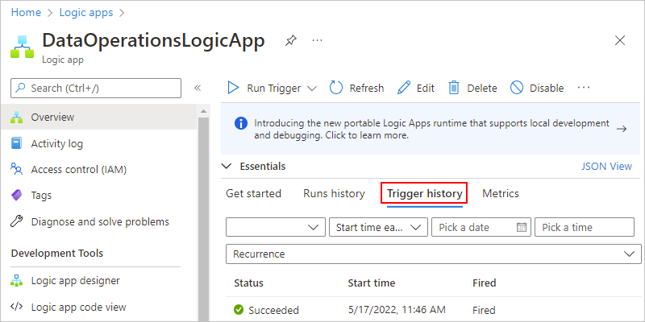
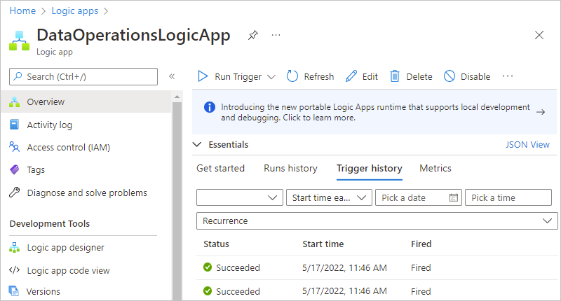
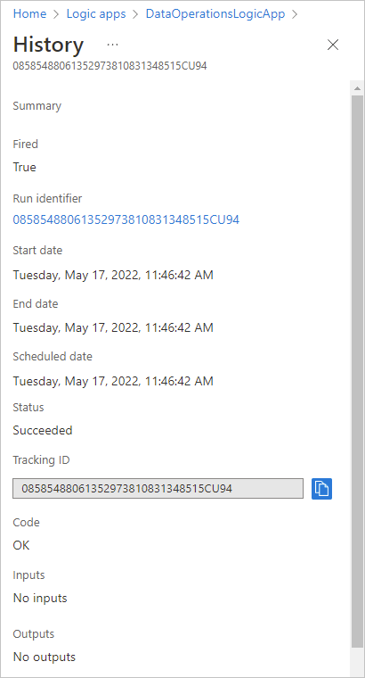
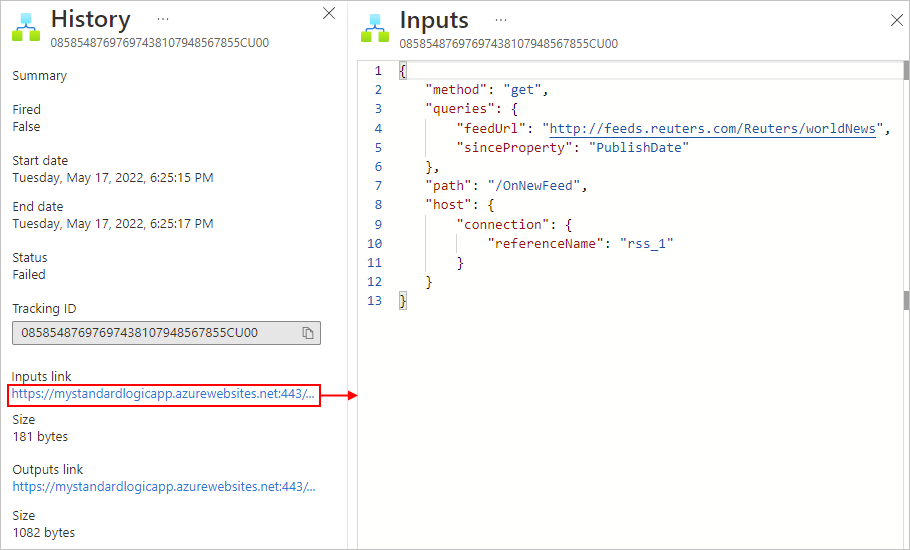
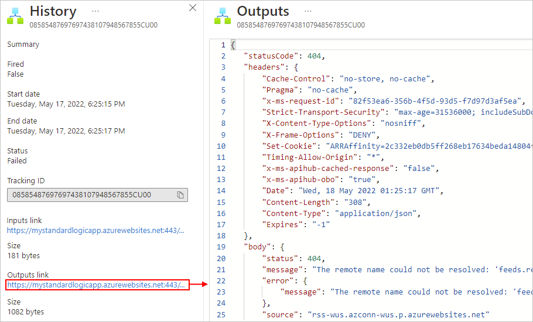
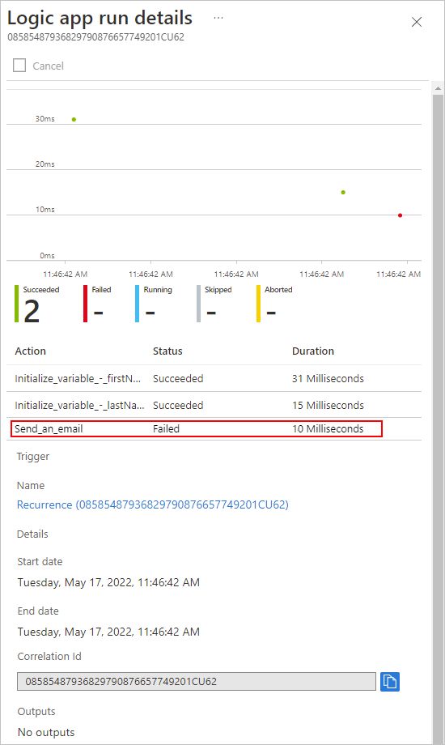

# Monitor run status, review trigger history, and set up alerts for Azure Logic Apps

> [!NOTE]
> This article applies only to Consumption logic apps. For information about reviewing run status and monitoring for Standard logic apps, 
> review the following sections in [Create an integration workflow with single-tenant Azure Logic Apps](create-single-tenant-workflows-azure-portal.md): 
> [Review run history](create-single-tenant-workflows-azure-portal.md#review-run-history), [Review trigger history](create-single-tenant-workflows-azure-portal.md#review-trigger-history), and [Enable or open Application Insights after deployment](create-single-tenant-workflows-azure-portal.md#enable-open-application-insights).

After you create and run a [Consumption logic app workflow](quickstart-create-first-logic-app-workflow.md), you can check that workflow's run status, [trigger history](#review-trigger-history), [runs history](#review-runs-history), and performance. To get notifications about failures or other possible problems, set up [alerts](#add-azure-alerts). For example, you can create an alert that detects "when more than five runs fail in an hour."

For real-time event monitoring and richer debugging, set up diagnostics logging for your logic app by using [Azure Monitor logs](../azure-monitor/overview.md). This Azure service helps you monitor your cloud and on-premises environments so that you can more easily maintain their availability and performance. You can then find and view events, such as trigger events, run events, and action events. By storing this information in [Azure Monitor logs](../azure-monitor/logs/data-platform-logs.md), you can create [log queries](../azure-monitor/logs/log-query-overview.md) that help you find and analyze this information. You can also use this diagnostic data with other Azure services, such as Azure Storage and Azure Event Hubs. For more information, see [Monitor logic apps by using Azure Monitor](monitor-logic-apps-log-analytics.md).

> [!NOTE]
> If your logic apps run in an [integration service environment (ISE)](connect-virtual-network-vnet-isolated-environment-overview.md)
> that was created to use an [internal access endpoint](connect-virtual-network-vnet-isolated-environment-overview.md#endpoint-access),
> you can view and access inputs and outputs from a workflow runs history *only from inside your virtual network*. Make sure that you have network
> connectivity between the private endpoints and the computer from where you want to access runs history. For example, your client computer can exist
> inside the ISE's virtual network or inside a virtual network that's connected to the ISE's virtual network, for example, through peering or a virtual
> private network. For more information, see [ISE endpoint access](connect-virtual-network-vnet-isolated-environment-overview.md#endpoint-access).

## Review trigger history

Each workflow run starts with a trigger, which either fires on a schedule or waits for an incoming request or event. The trigger history lists all the trigger attempts that your logic app made and information about the inputs and outputs for each trigger attempt.

### [Consumption](#tab/consumption)

1. In the [Azure portal](https://portal.azure.com), find and open your logic app workflow in the designer.

   To find your logic app, in the portal search box, enter **logic apps**, and then select **Logic apps**.

   

   The Azure portal shows all the logic apps in your Azure subscription. You can filter this list based on name, subscription, resource group, location, and so on.

   

1. Select your logic app. On your logic app's menu, select **Overview**. On the Overview pane, select **Trigger history**.

   

   Under **Trigger history**, all trigger attempts appear. Each time the trigger successfully fires, Azure Logic Apps creates an individual workflow instance and runs that instance. By default, each instance runs in parallel so that no workflow has to wait before starting a run. If your workflow triggers for multiple events or items at the same time, a trigger entry appears for each item with the same date and time. 

   

   The following table lists the possible trigger statuses:

   | Trigger status | Description |
   |----------------|-------------|
   | **Failed** | An error occurred. To review any generated error messages for a failed trigger, select that trigger attempt and choose **Outputs**. For example, you might find inputs that aren't valid. |
   | **Skipped** | The trigger checked the endpoint but found no data that met the specified criteria. |
   | **Succeeded** | The trigger checked the endpoint and found available data. Usually, a **Fired** status also appears alongside this status. If not, the trigger definition might have a condition or `SplitOn` command that wasn't met.   This status can apply to a manual trigger, recurrence-based trigger, or polling trigger. A trigger can run successfully, but the run itself might still fail when the actions generate unhandled errors. |
   |||

   > [!TIP]
   >
   > You can recheck the trigger without waiting for the next recurrence. On the 
   > **Overview** pane toolbar or on the designer toolbar, select **Run Trigger** > **Run**.

1. To view information about a specific trigger attempt, select that trigger event.

   

   If the list shows many trigger attempts, and you can't find the entry that you want, try filtering the list. If you don't find the data that you expect, try selecting **Refresh** on the toolbar.

   You can now review information about the selected trigger event, for example:

   

### [Standard](#tab/standard)

1. In the [Azure portal](https://portal.azure.com), find and open your logic app workflow in the designer.

   To find your logic app, in the portal search box, enter **logic apps**, and then select **Logic apps**.

   

   The Azure portal shows all the logic apps in your Azure subscription. You can filter this list based on name, subscription, resource group, location, and so on.

   

1. Select your logic app. On your logic app's menu, select **Overview**. On the Overview pane, select **Trigger history**.

   

   Under **Trigger history**, all trigger attempts appear. Each time the trigger successfully fires, Azure Logic Apps creates an individual workflow instance and runs that instance. By default, each instance runs in parallel so that no workflow has to wait before starting a run. If your workflow triggers for multiple events or items at the same time, a trigger entry appears for each item with the same date and time. 

   

   The following table lists the possible trigger statuses:

   | Trigger status | Description |
   |----------------|-------------|
   | **Failed** | An error occurred. To review any generated error messages for a failed trigger, select that trigger attempt and choose **Outputs**. For example, you might find inputs that aren't valid. |
   | **Skipped** | The trigger checked the endpoint but found no data that met the specified criteria. |
   | **Succeeded** | The trigger checked the endpoint and found available data. Usually, a **Fired** status also appears alongside this status. If not, the trigger definition might have a condition or `SplitOn` command that wasn't met.   This status can apply to a manual trigger, recurrence-based trigger, or polling trigger. A trigger can run successfully, but the run itself might still fail when the actions generate unhandled errors. |
   |||

   > [!TIP]
   >
   > You can recheck the trigger without waiting for the next recurrence. On the 
   > **Overview** pane toolbar, select **Run Trigger** > **Run**.

1. To view information about a specific trigger attempt, select that trigger event.

   

   If the list shows many trigger attempts, and you can't find the entry that you want, try filtering the list. If you don't find the data that you expect, try selecting **Refresh** on the toolbar.

1. Check the trigger's inputs to confirm that they appear as you expect. On the **History** pane, under **Inputs link**, select the link, which shows the **Inputs** pane.

   

1. Check the triggers outputs, if any, to confirm that they appear as you expect. On the **History** pane, under **Outputs link**, select the link, which shows the **Outputs** pane.

   Trigger outputs include the data that the trigger passes to the next step in your workflow. Reviewing these outputs can help you determine whether the correct or expected values passed on to the next step in your workflow.

   For example, the RSS trigger generated an error message that states that the RSS feed wasn't found.

   

---

## Review workflow run history

Each time the trigger successfully fires, Azure Logic Apps creates a workflow instance and runs that instance. By default, each instance runs in parallel so that no workflow has to wait before starting a run. You can review what happened during each run, including the status for each step in the workflow plus the inputs and outputs for each step.

### [Consumption](#tab/consumption)

1. In the [Azure portal](https://portal.azure.com), find and open your logic app workflow in the designer.

   To find your logic app, in the main Azure search box, enter **logic apps**, and then select **Logic apps**.

   

   The Azure portal shows all the logic apps that are associated with your Azure subscriptions. You can filter this list based on name, subscription, resource group, location, and so on.

   

1. Select your logic app. On your logic app's menu, select **Overview**. On the Overview pane, select **Runs history**.

   Under **Runs history**, all the past, current, and any waiting runs appear. If the trigger fires for multiple events or items at the same time, an entry appears for each item with the same date and time.

   

   The following table lists the possible run statuses:

   | Run status | Description |
   |------------|-------------|
   | **Aborted** | The run stopped or didn't finish due to external problems, for example, a system outage or lapsed Azure subscription. |
   | **Cancelled** | The run was triggered and started but received a cancellation request. |
   | **Failed** | At least one action in the run failed. No subsequent actions in the workflow were set up to handle the failure. |
   | **Running** | The run was triggered and is in progress, but this status can also appear for a run that is throttled due to [action limits](logic-apps-limits-and-config.md) or the [current pricing plan](https://azure.microsoft.com/pricing/details/logic-apps/).   **Tip**: If you set up [diagnostics logging](monitor-logic-apps-log-analytics.md), you can get information about any throttle events that happen. |
   | **Succeeded** | The run succeeded. If any action failed, a subsequent action in the workflow handled that failure. |
   | **Timed out** | The run timed out because the current duration exceeded the run duration limit, which is controlled by the [**Run history retention in days** setting](logic-apps-limits-and-config.md#run-duration-retention-limits). A run's duration is calculated by using the run's start time and run duration limit at that start time.   **Note**: If the run's duration also exceeds the current *run history retention limit*, which is also controlled by the [**Run history retention in days** setting](logic-apps-limits-and-config.md#run-duration-retention-limits), the run is cleared from the runs history by a daily cleanup job. Whether the run times out or completes, the retention period is always calculated by using the run's start time and *current* retention limit. So, if you reduce the duration limit for an in-flight run, the run times out. However, the run either stays or is cleared from the runs history based on whether the run's duration exceeded the retention limit. |
   | **Waiting** | The run hasn't started or is paused, for example, due to an earlier workflow instance that's still running. |
   |||

1. To review the steps and other information for a specific run, under **Runs history**, select that run. If the list shows many runs, and you can't find the entry that you want, try filtering the list.

   > [!TIP]
   >
   > If the run status doesn't appear, try refreshing the overview pane by selecting **Refresh**.
   > No run happens for a trigger that's skipped due to unmet criteria or finding no data.

   

   The **Logic app run** pane shows each step in the selected run, each step's run status, and the time taken for each step to run, for example:

   

   To view this information in list form, on the **Logic app run** toolbar, select **Run Details**.

   

   The Run Details lists each step, their status, and other information.

   

   For example, you can get the run's **Correlation ID** property, which you might need when you use the [REST API for Logic Apps](/rest/api/logic).

1. To get more information about a specific step, select either option:

   * In the **Logic app run** pane, select the step so that the shape expands. You can now view information such as inputs, outputs, and any errors that happened in that step.

     For example, suppose you had an action that failed, and you wanted to review which inputs might have caused that step to fail. By expanding the shape, you can view the inputs, outputs, and error for that step:

     

   * In the **Logic app run details** pane, select the step that you want.

     

   > [!NOTE]
   >
   > All runtime details and events are encrypted within Azure Logic Apps and 
   > are decrypted only when a user requests to view that data. You can 
   > [hide inputs and outputs in run history](logic-apps-securing-a-logic-app.md#obfuscate)
   > or control user access to this information by using
   > [Azure role-based access control (Azure RBAC)](../role-based-access-control/overview.md).

### [Standard](#tab/standard)

1. In the [Azure portal](https://portal.azure.com), find and open your logic app workflow in the designer.

   To find your logic app, in the main Azure search box, enter **logic apps**, and then select **Logic apps**.

   

   The Azure portal shows all the logic apps that are associated with your Azure subscriptions. You can filter this list based on name, subscription, resource group, location, and so on.

   

1. Select your logic app. On your logic app's menu, under **Workflows**, select **Workflows**, and then select your workflow.

   > [!NOTE]
   >
   > By default, stateless workflows don't store run history unless you enable this capability for debugging. 
   > For more information, review [Stateful versus stateless workflows](single-tenant-overview-compare.md#stateful-stateless).

1. On your workflow's menu, select **Overview**. On the Overview pane, select **Run History**.

   Under **Run History**, all the past, current, and any waiting runs appear. If the trigger fires for multiple events or items at the same time, an entry appears for each item with the same date and time.

   

   The following table lists the possible run statuses:

   | Run status | Description |
   |------------|-------------|
   | **Aborted** | The run stopped or didn't finish due to external problems, for example, a system outage or lapsed Azure subscription. |
   | **Cancelled** | The run was triggered and started but received a cancellation request. |
   | **Failed** | At least one action in the run failed. No subsequent actions in the workflow were set up to handle the failure. |
   | **Running** | The run was triggered and is in progress, but this status can also appear for a run that is throttled due to [action limits](logic-apps-limits-and-config.md) or the [current pricing plan](https://azure.microsoft.com/pricing/details/logic-apps/).   **Tip**: If you set up [diagnostics logging](monitor-logic-apps-log-analytics.md), you can get information about any throttle events that happen. |
   | **Succeeded** | The run succeeded. If any action failed, a subsequent action in the workflow handled that failure. |
   | **Timed out** | The run timed out because the current duration exceeded the run duration limit, which is controlled by the [**Run history retention in days** setting](logic-apps-limits-and-config.md#run-duration-retention-limits). A run's duration is calculated by using the run's start time and run duration limit at that start time.   **Note**: If the run's duration also exceeds the current *run history retention limit*, which is also controlled by the [**Run history retention in days** setting](logic-apps-limits-and-config.md#run-duration-retention-limits), the run is cleared from the runs history by a daily cleanup job. Whether the run times out or completes, the retention period is always calculated by using the run's start time and *current* retention limit. So, if you reduce the duration limit for an in-flight run, the run times out. However, the run either stays or is cleared from the runs history based on whether the run's duration exceeded the retention limit. |
   | **Waiting** | The run hasn't started or is paused, for example, due to an earlier workflow instance that's still running. |
   |||

1. To review the steps and other information for a specific run, under **Run History**, select that run. If the list shows many runs, and you can't find the entry that you want, try filtering the list.

   > [!TIP]
   >
   > If the run status doesn't appear, try refreshing the overview pane by selecting **Refresh**.
   > No run happens for a trigger that's skipped due to unmet criteria or finding no data.

   

   The workflow run pane shows each step in the selected run, each step's run status, and the time taken for each step to run, for example:

   

1. After all the steps in the run appear, select each step to review more information such as inputs, outputs, and any errors that happened in that step.

   For example, suppose you had an action that failed, and you wanted to review which inputs might have caused that step to fail.

   

   The following screenshot shows the outputs from the failed step.

   

   > [!NOTE]
   >
   > All runtime details and events are encrypted within Azure Logic Apps and 
   > are decrypted only when a user requests to view that data. You can 
   > [hide inputs and outputs in run history](logic-apps-securing-a-logic-app.md#obfuscate).

---

## Set up monitoring alerts

To get alerts based on specific metrics or exceeded thresholds for your logic app, set up [alerts in Azure Monitor](../azure-monitor/alerts/alerts-overview.md). For more information, review [Metrics in Azure](../azure-monitor/data-platform.md). To set up alerts without using [Azure Monitor](../azure-monitor/logs/log-query-overview.md), follow these steps.

1. On your logic app menu, under **Monitoring**, select **Alerts**. On the toolbar, select **Create** > **Alert rule**.

   

1. On the **Select a signal** pane, under **Signal type**, select the signal for which you want to get an alert.

   > [!TIP]
   >
   > You can use the search box, or to sort the signals alphabetically, 
   > select the **Signal name** column header.

   For example, to send an alert when a trigger fails, follow these steps:

   1. In the **Signal name** column, find and select the **Triggers Failed** signal.

      

   1. On the **Configure signal logic** pane, under **Alert logic**, set up your condition, and select **Done**, for example:

      | Property | Example value |
      |----------|---------------|
      | **Operator** | **Greater than or equal to** |
      | **Aggregation type** | **Count** |
      | **Threshold value** | **1** |
      | **Unit** | **Count** |
      | **Condition preview** | **Whenever the count of triggers failed is greater than or equal to 1** |
      | **Aggregation granularity (Period)** | **1 minute** |
      | **Frequency of evaluation** | **Every 1 Minute** |
      |||

      For more information, review [Create, view, and manage log alerts by using Azure Monitor](../azure-monitor/alerts/alerts-activity-log.md).

      The following screenshot shows the finished condition:

      

   The **Create an alert rule** page now shows the condition that you created and the cost for running that alert.

   

1. If you're satisfied, select **Next: Details** to finish creating the rule.

## Next steps

* [Monitor logic apps with Azure Monitor](monitor-logic-apps-log-analytics.md)
