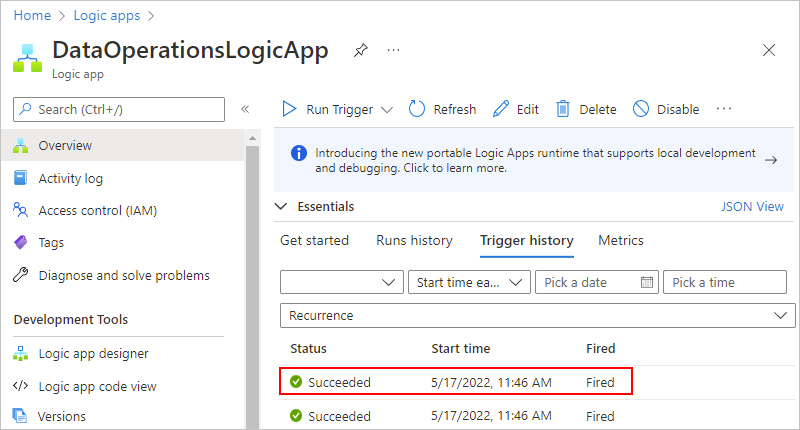
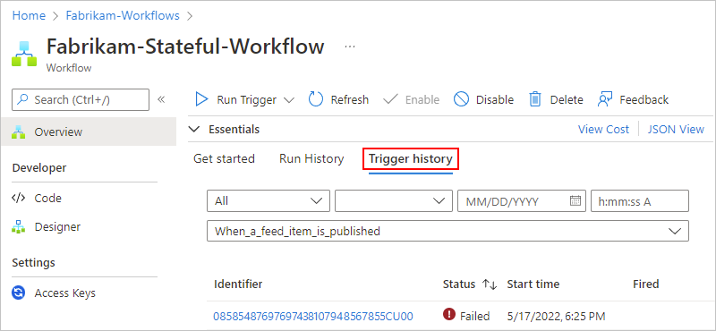
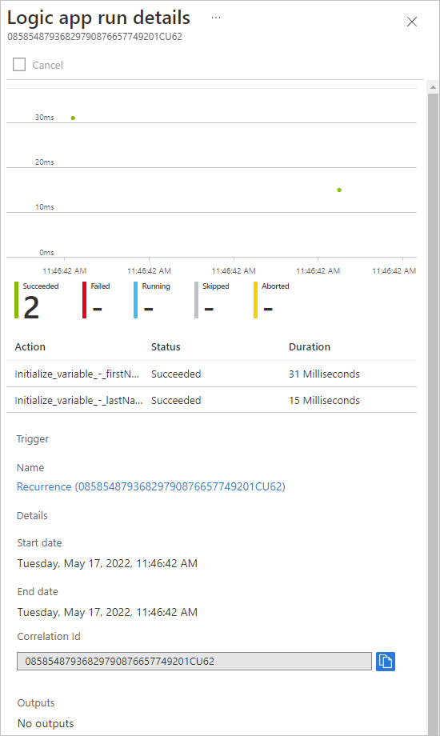
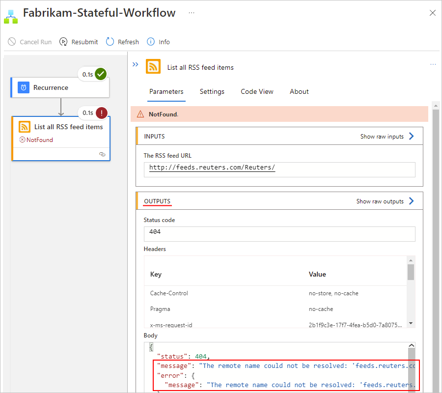
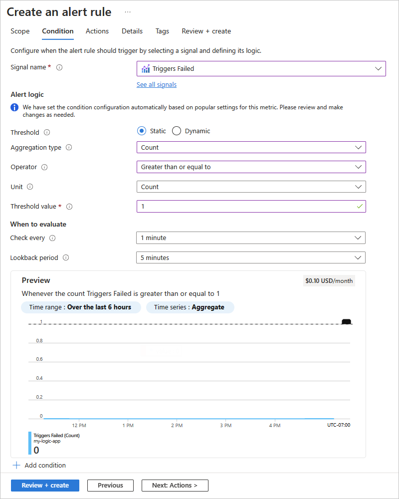

# Monitor workflow run status, review trigger and workflow run history, and set up alerts in Azure Logic Apps

[!INCLUDE [logic-apps-sku-consumption-standard](../../includes/logic-apps-sku-consumption-standard.md)]

After you create and run a logic app workflow, you can check that workflow's run status, trigger history, workflow run history, and performance.

This guide shows how to perform the following tasks:

- [Review trigger history](#review-trigger-history).
- [Review workflow run history](#review-runs-history).
- [Set up alerts](#add-azure-alerts) to get notifications about failures or other possible problems. For example, you can create an alert that detects "when more than five runs fail in an hour".

To monitor and review the workflow run status for Standard workflows, see the following sections in [Create an example Standard logic app workflow in single-tenant Azure Logic Apps](create-single-tenant-workflows-azure-portal.md):

- [Review trigger history](create-single-tenant-workflows-azure-portal.md#review-trigger-history)
- [Review workflow run history](create-single-tenant-workflows-azure-portal.md#review-run-history).
- [Enable or open Application Insights after deployment](create-single-tenant-workflows-azure-portal.md#enable-open-application-insights).

For real-time event monitoring and richer debugging, you can set up diagnostics logging for your logic app workflow by using [Azure Monitor logs](../azure-monitor/overview.md). This Azure service helps you monitor your cloud and on-premises environments so that you can more easily maintain their availability and performance. You can then find and view events, such as trigger events, run events, and action events. By storing this information in [Azure Monitor logs](../azure-monitor/logs/data-platform-logs.md), you can create [log queries](../azure-monitor/logs/log-query-overview.md) that help you find and analyze this information. You can also use this diagnostic data with other Azure services, such as Azure Storage and Azure Event Hubs. For more information, see [Monitor logic apps by using Azure Monitor](monitor-workflows-collect-diagnostic-data.md).

> [!NOTE]
>
> If your workflow runs in an [integration service environment (ISE)](connect-virtual-network-vnet-isolated-environment-overview.md)
> that was created to use an [internal access endpoint](connect-virtual-network-vnet-isolated-environment-overview.md#endpoint-access),
> you can view and access inputs and outputs from a workflow runs history *only from inside your virtual network*. Make sure that you have network
> connectivity between the private endpoints and the computer from where you want to access runs history. For example, your client computer can exist
> inside the ISE's virtual network or inside a virtual network that's connected to the ISE's virtual network, for example, through peering or a virtual
> private network. For more information, see [ISE endpoint access](connect-virtual-network-vnet-isolated-environment-overview.md#endpoint-access).

<a name="review-trigger-history"></a>

## Review trigger history

Each workflow run starts with a trigger, which either fires on a schedule or waits for an incoming request or event. The trigger history lists all the trigger attempts that your workflow made and information about the inputs and outputs for each trigger attempt.

### [Consumption](#tab/consumption)

1. In the [Azure portal](https://portal.azure.com), open your logic app resource and workflow in the designer.

1. On your logic app menu, select **Overview**. On the **Overview** pane, select **Trigger history**.

   

   Under **Trigger history**, all trigger attempts appear. Each time the trigger successfully fires, Azure Logic Apps creates an individual workflow instance and runs that instance. By default, each instance runs in parallel so that no workflow has to wait before starting a run. If your workflow triggers for multiple events or items at the same time, a trigger entry appears for each item with the same date and time.

   

   The following table lists the possible trigger statuses:

   | Trigger status | Description |
   |----------------|-------------|
   | **Failed** | An error occurred. To review any generated error messages for a failed trigger, select that trigger attempt, and choose **Outputs**. For example, you might find inputs that aren't valid. |
   | **Skipped** | The trigger checked the endpoint but found no data that met the specified criteria. |
   | **Succeeded** | The trigger checked the endpoint and found available data. Usually, a **Fired** status also appears alongside this status. If not, the trigger definition might have a condition or `SplitOn` command that wasn't met. <br><br>This status can apply to a manual trigger, recurrence-based trigger, or polling trigger. A trigger can run successfully, but the run itself might still fail when the actions generate unhandled errors. |

   > [!TIP]
   >
   > You can recheck the trigger without waiting for the next recurrence. On the 
   > **Overview** pane toolbar or on the designer toolbar, select **Run Trigger** > **Run**.

1. To view information about a specific trigger attempt, select that trigger event.

   

   If the list shows many trigger attempts, and you can't find the entry that you want, try filtering the list. If you don't find the data that you expect, try selecting **Refresh** on the toolbar.

   You can now review information about the selected trigger event, for example:

   

### [Standard](#tab/standard)

For a stateful workflow, you can review the trigger history for each run, including the trigger status along with inputs and outputs, separately from the [workflow's run history](#review-runs-history). In the Azure portal, trigger history and run history appear at the workflow level, not the logic app level.

1. In the [Azure portal](https://portal.azure.com), open your logic app resource and workflow in the designer.

1. On the workflow menu, select **Overview**. On the **Overview** page, select **Trigger history**.

   

   Under **Trigger history**, all trigger attempts appear. Each time the trigger successfully fires, Azure Logic Apps creates an individual workflow instance and runs that instance. By default, each instance runs in parallel so that no workflow has to wait before starting a run. If your workflow triggers for multiple events or items at the same time, a trigger entry appears for each item with the same date and time. 

   

   The following table lists the possible trigger statuses:

   | Trigger status | Description |
   |----------------|-------------|
   | **Failed** | An error occurred. To review any generated error messages for a failed trigger, select that trigger attempt and choose **Outputs**. For example, you might find inputs that aren't valid. |
   | **Skipped** | The trigger checked the endpoint but found no data that met the specified criteria. |
   | **Succeeded** | The trigger checked the endpoint and found available data. Usually, a **Fired** status also appears alongside this status. If not, the trigger definition might have a condition or `SplitOn` command that wasn't met. <br><br>This status can apply to a manual trigger, recurrence-based trigger, or polling trigger. A trigger can run successfully, but the run itself might still fail when the actions generate unhandled errors. |

   > [!TIP]
   >
   > You can recheck the trigger without waiting for the next recurrence. On the 
   > **Overview** page toolbar, select **Run Trigger** > **Run**.

1. To view information about a specific trigger attempt, select the identifier for that trigger attempt.

   

   If the list shows many trigger attempts, and you can't find the entry that you want, try filtering the list. If you don't find the data that you expect, try selecting **Refresh** on the toolbar.

1. Check the trigger's inputs to confirm that they appear as you expect. On the **History** pane, under **Inputs link**, select the link, which shows the **Inputs** pane.

   

1. Check the triggers outputs, if any, to confirm that they appear as you expect. On the **History** pane, under **Outputs link**, select the link, which shows the **Outputs** pane.

   Trigger outputs include the data that the trigger passes to the next step in your workflow. Reviewing these outputs can help you determine whether the correct or expected values passed on to the next step in your workflow.

   For example, the RSS trigger generated an error message that states that the RSS feed wasn't found.

   

---

<a name="review-runs-history"></a>

## Review workflow run history

Each time a trigger successfully fires, Azure Logic Apps creates a workflow instance and runs that instance. By default, each instance runs in parallel so that no workflow has to wait before starting a run. You can review what happened during each run, including the status, inputs, and outputs for each step in the workflow.

### [Consumption](#tab/consumption)

1. In the [Azure portal](https://portal.azure.com), open your logic app resource and workflow in the designer.

1. On your logic app menu, select **Overview**. On the **Overview** page, select **Runs history**.

   Under **Runs history**, all the past, current, and any waiting runs appear. If the trigger fires for multiple events or items at the same time, an entry appears for each item with the same date and time.

   

   The following table lists the possible run statuses:

   | Run status | Description |
   |------------|-------------|
   | **Aborted** | The run stopped or didn't finish due to external problems, for example, a system outage or lapsed Azure subscription. |
   | **Cancelled** | The run was triggered and started, but received a cancellation request. |
   | **Failed** | At least one action in the run failed. No subsequent actions in the workflow were set up to handle the failure. |
   | **Running** | The run was triggered and is in progress. However, this status can also appear for a run that's throttled due to [action limits](logic-apps-limits-and-config.md) or the [current pricing plan](https://azure.microsoft.com/pricing/details/logic-apps/). <br><br>**Tip**: If you set up [diagnostics logging](monitor-workflows-collect-diagnostic-data.md), you can get information about any throttle events that happen. |
   | **Succeeded** | The run succeeded. If any action failed, a subsequent action in the workflow handled that failure. |
   | **Timed out** | The run timed out because the current duration exceeded the run duration limit, which is controlled by the [**Run history retention in days** setting](logic-apps-limits-and-config.md#run-duration-retention-limits). A run's duration is calculated by using the run's start time and run duration limit at that start time. <br><br>**Note**: If the run's duration also exceeds the current *run history retention limit*, which is also controlled by the [**Run history retention in days** setting](logic-apps-limits-and-config.md#run-duration-retention-limits), the run is cleared from the runs history by a daily cleanup job. Whether the run times out or completes, the retention period is always calculated by using the run's start time and *current* retention limit. So, if you reduce the duration limit for an in-flight run, the run times out. However, the run either stays or is cleared from the runs history based on whether the run's duration exceeded the retention limit. |
   | **Waiting** | The run hasn't started or is paused, for example, due to an earlier workflow instance that's still running. |

1. To review the steps and other information for a specific run, under **Runs history**, select that run. If the list shows many runs, and you can't find the entry that you want, try filtering the list.

   > [!TIP]
   >
   > If the run status doesn't appear, try refreshing the overview pane by selecting **Refresh**.
   > No run happens for a trigger that's skipped due to unmet criteria or finding no data.

   

   The **Logic app run** pane shows each step in the selected run, each step's run status, and the time taken for each step to run, for example:

   

   To view this information in list form, on the **Logic app run** toolbar, select **Run Details**.

   

   The Run Details lists each step, their status, and other information.

   

   For example, you can get the run's **Correlation ID** property, which you might need when you use the [REST API for Logic Apps](/rest/api/logic).

1. To get more information about a specific step, select either option:

   * In the **Logic app run** pane, select the step so that the shape expands. You can now view information such as inputs, outputs, and any errors that happened in that step.

     For example, suppose you had an action that failed, and you wanted to review which inputs might have caused that step to fail. By expanding the shape, you can view the inputs, outputs, and error for that step:

     

   * In the **Logic app run details** pane, select the step that you want.

     

   > [!NOTE]
   >
   > All runtime details and events are encrypted within Azure Logic Apps and 
   > are decrypted only when a user requests to view that data. You can 
   > [hide inputs and outputs in run history](logic-apps-securing-a-logic-app.md#obfuscate)
   > or control user access to this information by using
   > [Azure role-based access control (Azure RBAC)](../role-based-access-control/overview.md).

### [Standard](#tab/standard)

You can view run history only for stateful workflows, not stateless workflows. To enable run history for a stateless workflow, see [Enable run history for stateless workflows](create-single-tenant-workflows-azure-portal.md#enable-run-history-stateless).

1. In the [Azure portal](https://portal.azure.com), open your logic app resource and workflow in the designer.

1. On your workflow menu, select **Overview**. On the **Overview** page, select **Run History**.

   Under **Run History**, all the past, current, and any waiting runs appear. If the trigger fires for multiple events or items at the same time, an entry appears for each item with the same date and time.

   

   The following table lists the possible final statuses that each workflow run can have and show in the portal:

   | Run status | Icon | Description |
   |------------|------|-------------|
   | **Aborted** | ![Aborted icon][aborted-icon] | The run stopped or didn't finish due to external problems, for example, a system outage or lapsed Azure subscription. |
   | **Cancelled** | ![Canceled icon][canceled-icon] | The run was triggered and started, but received a cancellation request. |
   | **Failed** | ![Failed icon][failed-icon] | At least one action in the run failed. No subsequent actions in the workflow were set up to handle the failure. |
   | **Running** | ![Running icon][running-icon] | The run was triggered and is in progress. However, this status can also appear for a run that's throttled due to [action limits](logic-apps-limits-and-config.md) or the [current pricing plan](https://azure.microsoft.com/pricing/details/logic-apps/). <br><br>**Tip**: If you set up [diagnostics logging](monitor-workflows-collect-diagnostic-data.md), you can get information about any throttle events that happen. |
   | **Skipped** | ![Skipped icon][skipped-icon] | The trigger condition was checked but wasn't met, so the run never started. |
   | **Succeeded** | ![Succeeded icon][succeeded-icon] | The run succeeded. If any action failed, a subsequent action in the workflow handled that failure. |
   | **Timed out** | ![Timed-out icon][timed-out-icon] | The run timed out because the current duration exceeded the run duration limit, which is controlled by the [**Run history retention in days** setting](logic-apps-limits-and-config.md#run-duration-retention-limits). A run's duration is calculated by using the run's start time and run duration limit at that start time. <br><br>**Note**: If the run's duration also exceeds the current *run history retention limit*, which is also controlled by the [**Run history retention in days** setting](logic-apps-limits-and-config.md#run-duration-retention-limits), the run is cleared from the runs history by a daily cleanup job. Whether the run times out or completes, the retention period is always calculated by using the run's start time and *current* retention limit. So, if you reduce the duration limit for an in-flight run, the run times out. However, the run either stays or is cleared from the runs history based on whether the run's duration exceeded the retention limit. |
   | **Waiting** | ![Waiting icon][waiting-icon] | The run hasn't started or is paused, for example, due to an earlier workflow instance that's still running. |

1. On the **Run History** tab, select the run that you want to review.

   The run details page opens and shows the status for each step in the run.

   > [!TIP]
   >
   > If the run status doesn't appear, on the **Overview** page toolbar, select **Refresh**. 
   > No run happens for a trigger that's skipped due to unmet criteria or finding no data.

   If the list shows many runs, and you can't find the entry that you want, try filtering the list.

   

   The workflow run pane shows each step in the selected run, each step's run status, and the time taken for each step to run, for example:

   

   The following table shows the possible statuses that each workflow action can have and show in the portal:

   | Action status | Icon | Description |
   |---------------|------|-------------|
   | **Aborted** | ![Aborted icon][aborted-icon] | The action stopped or didn't finish due to external problems, for example, a system outage or lapsed Azure subscription. |
   | **Cancelled** | ![Canceled icon][canceled-icon] | The action was running but received a cancel request. |
   | **Failed** | ![Failed icon][failed-icon] | The action failed. |
   | **Running** | ![Running icon][running-icon] | The action is currently running. |
   | **Skipped** | ![Skipped icon][skipped-icon] | The action was skipped because its **runAfter** conditions weren't met, for example, a preceding action failed. Each action has a `runAfter` object where you can set up conditions that must be met before the current action can run. |
   | **Succeeded** | ![Succeeded icon][succeeded-icon] | The action succeeded. |
   | **Succeeded with retries** | ![Succeeded-with-retries-icon][succeeded-with-retries-icon] | The action succeeded but only after a single or multiple retries. To review the retry history, in the run history details view, select that action so that you can view the inputs and outputs. |
   | **Timed out** | ![Timed-out icon][timed-out-icon] | The action stopped due to the timeout limit specified by that action's settings. |
   | **Waiting** | ![Waiting icon][waiting-icon] | Applies to a webhook action that's waiting for an inbound request from a caller. |

   [aborted-icon]: ./media/monitor-logic-apps/aborted.png
   [canceled-icon]: ./media/monitor-logic-apps/cancelled.png
   [failed-icon]: ./media/monitor-logic-apps/failed.png
   [running-icon]: ./media/monitor-logic-apps/running.png
   [skipped-icon]: ./media/monitor-logic-apps/skipped.png
   [succeeded-icon]: ./media/monitor-logic-apps/succeeded.png
   [succeeded-with-retries-icon]: ./media/monitor-logic-apps/succeeded-with-retries.png
   [timed-out-icon]: ./media/monitor-logic-apps/timed-out.png
   [waiting-icon]: ./media/monitor-logic-apps/waiting.png

1. After all the steps in the run appear, select each step to review more information such as inputs, outputs, and any errors that happened in that step.

   For example, suppose you had an action that failed, and you wanted to review which inputs might have caused that step to fail.

   

   The following screenshot shows the outputs from the failed step.

   

   > [!NOTE]
   >
   > All runtime details and events are encrypted within Azure Logic Apps and 
   > are decrypted only when a user requests to view that data. You can 
   > [hide inputs and outputs in run history](logic-apps-securing-a-logic-app.md#obfuscate).

---

<a name="resubmit-workflow-run"></a>

## Rerun a workflow with same inputs

You can rerun a previously finished workflow with the same inputs that the workflow previously used by resubmitting the run to Azure Logic Apps. Completing this task creates and adds a new workflow run to your workflow's run history.

> [!NOTE]
>
> If your workflow has operations such as create or delete operations, resubmitting a run might 
> create duplicate data or try to delete data that no longer exists, resulting in an error.

### [Consumption](#tab/consumption)

1. In the [Azure portal](https://portal.azure.com), open your logic app resource and workflow in the designer.

1. On your logic app menu, select **Overview**. On the **Overview** page, select **Runs history**.

   Under **Runs history**, all the past, current, and any waiting runs appear. If the trigger fires for multiple events or items at the same time, an entry appears for each item with the same date and time.

1. On the **Runs history** pane, select the run that you want to resubmit.

1. On the **Logic app run** toolbar, select **Resubmit**, and then select **Yes**.

   The **Runs history** pane now shows the resubmitted run.

   > [!TIP]
   >
   > If the resubmitted run doesn't appear, on the **Runs history** pane toolbar, select **Refresh**. 
   > No run happens for a trigger that's skipped due to unmet criteria or finding no data.

1. To review the inputs and outputs for the resubmitted workflow run, on the **Runs history** tab, select that run.

### [Standard](#tab/standard)

You can rerun only stateful workflows, not stateless workflows. To enable run history for a stateless workflow, see [Enable run history for stateless workflows](create-single-tenant-workflows-azure-portal.md#enable-run-history-stateless).

#### Rerun the entire workflow

1. In the [Azure portal](https://portal.azure.com), open your logic app resource and workflow in the designer.

1. On the workflow menu, select **Overview**. On the **Overview** page, select **Run History**, which shows the run history for the current workflow.

1. On the **Run History** tab, select the run that you want to resubmit.

1. On the run history toolbar, select **Resubmit**.

1. Return to the **Overview** page and the **Run History** tab, which now shows the resubmitted run.

   > [!TIP]
   >
   > If the resubmitted run doesn't appear, on the **Overview** page toolbar, select **Refresh**. 
   > No run happens for a trigger that's skipped due to unmet criteria or finding no data.

1. To review the inputs and outputs from the resubmitted workflow run, on the **Run History** tab, select that run.

### Rerun from a specific action (preview)

You can rerun a previously finished workflow starting at a specific action using the same inputs and outputs from the preceding actions. The resubmitted action and all subsequent actions run as usual. When the resubmitted actions finish, a new workflow run appears in your workflow's run history.

The resubmit capability is available for all actions except for non-sequential and complex concurrency scenarios and per the following limitations:

| Actions | Resubmit available? |
|---------|---------------------|
| **Condition** action and actions in the **True** and **False** paths | - Yes for **Condition** action <br>- No for actions in the **True** and **False** paths |
| **For each** action and all actions inside the loop | No for all actions |
| **Switch** action and all actions in the **Default** path and **Case** paths | - Yes for **Switch** action <br>- No for actions in the **Default** path and **Case** paths |
| **Until** action and all actions inside the loop | No for all actions |
| **Scope** | Yes, but only at the final  |

> [!NOTE]
>
> This capability is in preview. For legal terms that apply to Azure features that 
> are in beta, preview, or otherwise not yet released into general availability, see 
> [Supplemental Terms of Use for Microsoft Azure Previews](https://azure.microsoft.com/support/legal/preview-supplemental-terms/). Some aspects of this capability might change before general availability (GA).

1. In the [Azure portal](https://portal.azure.com), open your logic app resource.

1. At the logic app resource level, set up the following environment variables if you haven't already completed this step:

   1. On your logic app resource menu, under **Settings**, select **Environment variables**.

   1. On the **App settings** tab, add the following settings:

      | Setting name | Value |
      |---------------|-------|
      | **FUNCTIONS_EXTENSIONBUNDLE_SOURCE_URI** | `https://cdnforlogicappsv2.blob.core.windows.net/logicapps-brbenn` |
      | **AzureFunctionsJobHost_extensionBundle_version** | `[1.39.0.3]` |

   1. When you're done, select **Apply**.

   1. On your logic app resource menu, under **Development Tools**, select **Advanced Tools** > **Go**, which opens the **Kudu** console.

   1. On the **Kudu** toolbar, open the **Debug console** menu, and select **CMD**.

   1. Browse to the following folder: **..\home\site\wwwroot**

   1. Above the console window, in the directory table, next to the **host.json** file, select **Edit**.

   1. In the **host.json** file, immediately under `"versions"`, add the following JSON object named `"extensions"`:

      ```json
      "extensions": {
          "workflow": {
              "settings": {
                  "Runtime.IsResubmitActionsEnabled": "true"
              }
          }
      }
      ```

   1. Remember to add a comma (**,**) immediately after `"versions"`.

   1.	When you're done, on the toolbar, select **Save**.

   1.	Return to your logic app resource menu, select **Overview**, and on the toolbar, select **Restart**.

1. On the workflow menu, select **Overview**. On the **Overview** page, select **Run History**, which shows the run history for the current workflow.

1. On the **Run History** tab, select the run that you want to resubmit.

   The run details page opens and shows the status for each step in the run.

1. In the run details page, find the action from where you want to resubmit the workflow run, open the shortcut menu, and select **Submit from this action**.

   The run details page refreshes and shows the new run. All the operations that precede the resubmitted action show a lighter-colored status icon, representing reused inputs and outputs. The resubmitted action and subsequent actions show the usually-colored status icons.

   > [!TIP]
   >
   > If the run hasn't fully finished, on the run details page toolbar, select **Refresh**.

---

<a name="add-azure-alerts"></a>

## Set up monitoring alerts

To get alerts based on specific metrics or exceeded thresholds for your logic app, set up [alerts in Azure Monitor](../azure-monitor/alerts/alerts-overview.md). For more information, review [Metrics in Azure](../azure-monitor/data-platform.md).

To set up alerts without using [Azure Monitor](../azure-monitor/logs/log-query-overview.md), follow these steps, which apply to both Consumption and Standard logic app resources:

1. On your logic app menu, under **Monitoring**, select **Alerts**. On the toolbar, select **Create** > **Alert rule**.

1. On the **Create an alert rule** page, from the **Signal name** list, select the signal for which you want to get an alert.

   For example, to send an alert when a trigger fails, follow these steps:

   1. From the **Signal name** list, select the **Triggers Failed** signal.

   1. Under **Alert logic**, set up your condition, for example:

      | Property | Example value |
      |----------|---------------|
      | **Threshold** | **Static** |
      | **Aggregation type** | **Count** |
      | **Operator** | **Greater than or equal to** |
      | **Unit** | **Count** |
      | **Threshold value** | **1** |

      The **Preview** section now shows the condition that you set up, for example:

      **Whenever the count Triggers Failed is greater than or equal to 1**

   1. Under **When to evaluate**, set up the schedule for checking the condition:

      | Property | Example value |
      |----------|---------------|
      | **Check every** | **1 minute** |
      | **Lookback period** | **5 minutes** |

      For example, the finished condition looks similar to the following example, and the **Create an alert rule** page now shows the cost for running that alert:

      

1. When you're ready, select **Review + Create**.

For general information, see [Create an alert rule from a specific resource - Azure Monitor](../azure-monitor/alerts/alerts-create-new-alert-rule.md#create-or-edit-an-alert-rule-in-the-azure-portal).

## Next steps

* [Monitor logic apps with Azure Monitor](monitor-workflows-collect-diagnostic-data.md)
