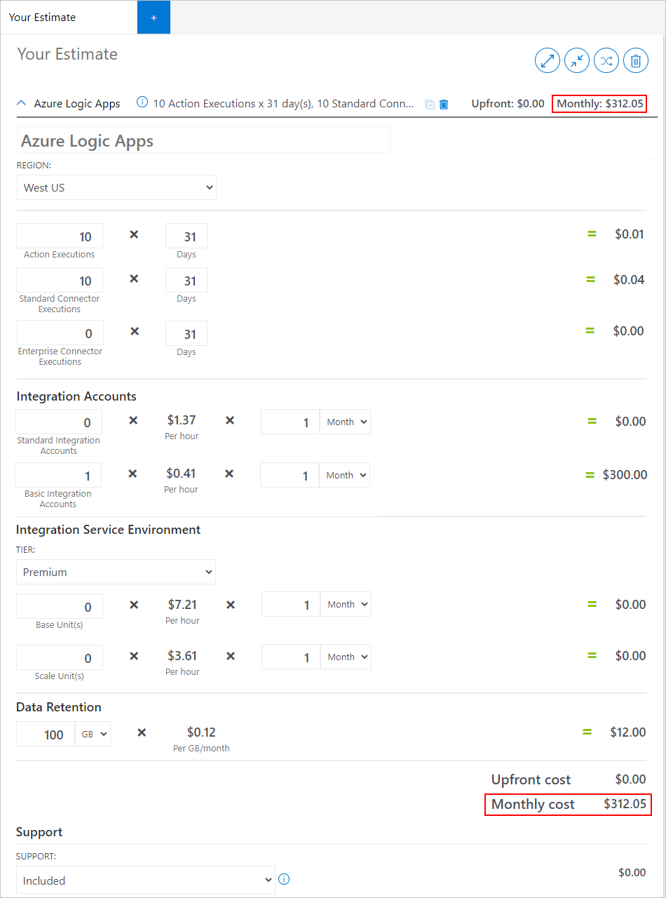
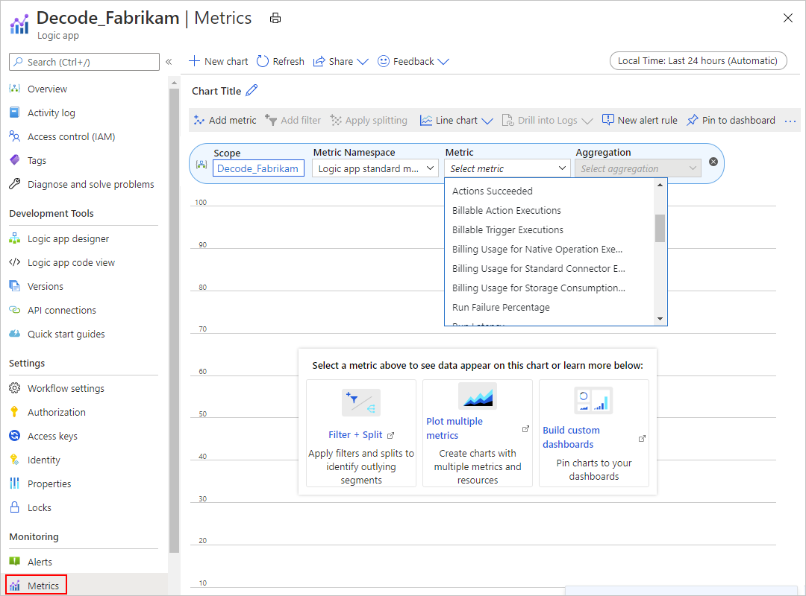
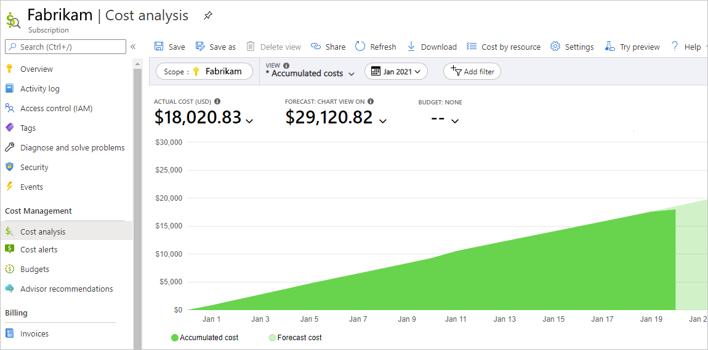
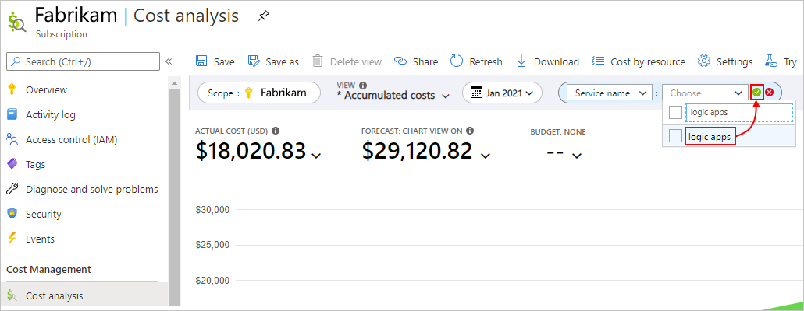
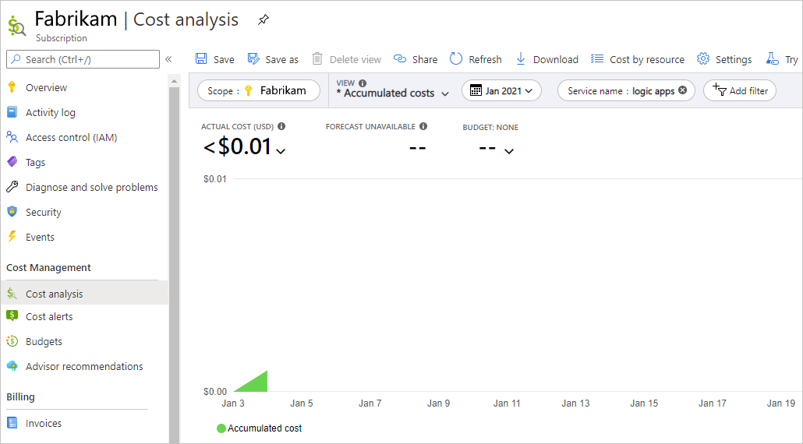

# Plan and manage costs for Azure Logic Apps

<!-- Check out the following published examples:
- [https://docs.microsoft.com/azure/cosmos-db/plan-manage-costs](https://docs.microsoft.com/azure/cosmos-db/plan-manage-costs)
- [https://docs.microsoft.com/azure/storage/common/storage-plan-manage-costs](https://docs.microsoft.com/azure/storage/common/storage-plan-manage-costs)
- [https://docs.microsoft.com/azure/machine-learning/concept-plan-manage-cost](https://docs.microsoft.com/azure/machine-learning/concept-plan-manage-cost)
-->

<!-- Note for Azure service writer: Links to Cost Management articles are full URLS with the ?WT.mc_id=costmanagementcontent_docsacmhorizontal_-inproduct-learn campaign suffix. Leave those URLs intact. They're used to measure traffic to Cost Management articles.
-->

This article helps you plan and manage costs for Azure Logic Apps. Before you create or add any resources using this service, estimate your costs by using the Azure pricing calculator. After you start using Logic Apps resources, you can set budgets and monitor costs by using [Azure Cost Management](https://docs.microsoft.com/azure/cost-management-billing/cost-management-billing-overview?WT.mc_id=costmanagementcontent_docsacmhorizontal_-inproduct-learn). To identify areas where you might want to act, you can also review forecasted costs and monitor spending trends.

Keep in mind that costs for Logic Apps are only part of the monthly costs in your Azure bill. Although this article explains how to estimate and manage costs for Logic Apps, you're billed for all the Azure services and resources that are used in your Azure subscription, including any third-party services. After you're familiar with managing costs for Logic Apps, you can apply similar methods to manage costs for all the Azure services used in your subscription.

## Prerequisites

<!--Note for Azure service writer: The section covers prereqs for the Cost Analysis feature. Add other prereqs needed for your service.  -->

[Azure Cost Management](https://docs.microsoft.com/azure/cost-management-billing/cost-management-billing-overview?WT.mc_id=costmanagementcontent_docsacmhorizontal_-inproduct-learn) supports most Azure account types. To view all the supported account types, see [Understand Cost Management data](https://docs.microsoft.com/azure/cost-management-billing/costs/understand-cost-mgt-data?WT.mc_id=costmanagementcontent_docsacmhorizontal_-inproduct-learn). To view cost data, you need at least read access for your Azure account.

For information about assigning access to Azure Cost Management data, see [Assign access to data](https://docs.microsoft.com/azure/cost-management/assign-access-acm-data?WT.mc_id=costmanagementcontent_docsacmhorizontal_-inproduct-learn).

<!--Note for Azure service writer: If you have other prerequisites for your service, insert them here -->

## Understand the billing model

Azure Logic Apps runs on Azure infrastructure that [accrues costs](https://azure.microsoft.com/pricing/details/logic-apps/) when you deploy new resources. Make sure that you understand the [billing model for the Logic Apps service along with related Azure resources](logic-apps-pricing.md), and manage any additional costs due to these dependencies when you make changes to deployed resources.

### Costs that typically accrue with Azure Logic Apps

<!--Note to Azure service writer: Include any costs that aren't obvious, hidden, or otherwise might not be present in the pricing calculator or resource creation experience in the Azure portal. You might need to sync with your product team to identify hidden costs. If you're certain that costs accrue only for your service and no others, then omit this section. -->

The Logic Apps service applies different pricing models, based on the resources that you create and use:

* Logic app resources that you create and run in the multi-tenant Logic Apps service use a [consumption pricing model](../logic-apps/logic-apps-pricing.md#consumption-pricing).

* Logic app resources that you create and run in an [integration service environment (ISE)](../logic-apps/connect-virtual-network-vnet-isolated-environment-overview.md) use a [fixed pricing model](../logic-apps/logic-apps-pricing.md#fixed-pricing).

Here are other resources that incur costs when you create them for use with logic apps:

* An [integration account](../logic-apps/logic-apps-pricing.md#integration-accounts) is a separate resource that you create and link to logic apps for building B2B integrations. Integration accounts use a [fixed pricing model](../logic-apps/logic-apps-pricing.md#integration-accounts) where the rate is based on the integration account type or *tier* that you use.

* An [ISE](../logic-apps/logic-apps-pricing.md#fixed-pricing) is a separate resource that you create as a deployment location for logic apps that need direct access to resources in a virtual network. ISEs use a [fixed pricing model](../logic-apps/logic-apps-pricing.md#fixed-pricing) where the rate is based on the ISE SKU that you create and other settings.

* A [custom connector](../logic-apps/logic-apps-pricing.md#consumption-pricing) is a separate resource that you create for a REST API that has no prebuilt connector for you to use in your logic apps. Custom connector executions use a [consumption pricing model](../logic-apps/logic-apps-pricing.md#connectors) except when you use them in an ISE.

In the multi-tenant Logic Apps service, [data retention and storage consumption](../logic-apps/logic-apps-pricing.md#data-retention) also accrue costs using a [fixed pricing model](#data-retention). However, in an ISE, data retention and storage consumption don't incur costs.

### Costs might accrue after resource deletion

<!--Note to Azure service writer: You might need to sync with your product team to identify resources that continue to exist after those ones for your service are deleted. If you're certain that no resources can exist after those for your service are deleted, then omit this section. -->

If you have these resources after deleting a logic app, these resources continue to exist and accrue costs until you delete them.

* Azure resources that had connections to your logic app, for example, Azure storage accounts and Azure function apps

* Integration accounts

* Integration service environments (ISEs). If you delete an ISE, the associated Azure virtual network and networking-related resources continue to exist.

### Using Monetary Credit with Azure Logic Apps

<!--Note to Azure service writer: Let the user know that most 1st party Azure service charges can be fulfilled by EA monetary commitment credit. However, charges from third party products and services including those from the Azure Marketplace cannot be paid for by EA monetary commitment credit. -->

You can pay for Azure Logic Apps charges with your EA monetary commitment credit. However, you can't use EA monetary commitment credit to pay for charges for third party products and services, including those from the Azure Marketplace.

## Estimate costs

Before you create resources with Azure Logic Apps, estimate your costs by using the [Azure pricing calculator](https://azure.microsoft.com/pricing/calculator/). For more information, review [Pricing model for Azure Logic Apps](../logic-apps/logic-apps-pricing.md).

1. On the [Azure pricing calculator page](https://azure.microsoft.com/pricing/calculator/), from the left menu, select **Integration** > **Azure Logic Apps**.

   

1. Scroll down the page until you can view the Azure Logic Apps pricing calculator. In the various sections for Azure resources that are directly related to Azure Logic Apps, enter the numbers of resources that you plan to use and the number of intervals over which you might use those resources.

   This screenshot shows an example cost estimate by using the calculator:

   

1. To update your cost estimates as you create and use new related resources, return to this calculator, and update those resources here.

## Create budgets and alerts

To help you proactively manage costs for your Azure account or subscription, you can create [budgets](https://docs.microsoft.com/azure/cost-management/tutorial-acm-create-budgets?WT.mc_id=costmanagementcontent_docsacmhorizontal_-inproduct-learn) and [alerts](https://docs.microsoft.com/azure/cost-management/cost-mgt-alerts-monitor-usage-spending?WT.mc_id=costmanagementcontent_docsacmhorizontal_-inproduct-learn) by using the [Azure Cost Management and Billing](https://docs.microsoft.com/azure/cost-management-billing/cost-management-billing-overview?WT.mc_id=costmanagementcontent_docsacmhorizontal_-inproduct-learn) service and capabilities.  Budgets and alerts are created for Azure subscriptions and resource groups, so they're useful as part of an overall cost monitoring strategy.

Based on spending compared to budget and cost thresholds, alerts automatically notify stakeholders about spending anomalies and overspending risks. If you want more granularity in your monitoring, you can also create budgets that use filters for specific resources or services in Azure. Filters help make sure that you don't accidentally create new resources that cost you additional money. For more information about the filter options, see [Group and filter options](https://docs.microsoft.com/azure/cost-management-billing/costs/group-filter?WT.mc_id=costmanagementcontent_docsacmhorizontal_-inproduct-learn).

## Monitor costs

Resource usage unit costs vary by time intervals, such as seconds, minutes, hours, and days, or by unit usage, such as bytes, megabytes, and so on. Some examples are by day, current and prior month, and year. Switching to longer views over time can help you identify spending trends. When you use the cost analysis features, you can view costs as graphs and tables over various time intervals. If you created budgets and cost forecasts, you can also easily find where budgets are exceeded and overspending might have occurred.

After you start incurring costs for resources that create or start using in Azure, you can review and monitor these costs in these ways:

* [Monitor logic app executions and storage consumption](#monitor-billing-metrics) by using Azure Monitor

* Run [cost analysis](https://docs.microsoft.com/azure/cost-management/quick-acm-cost-analysis?WT.mc_id=costmanagementcontent_docsacmhorizontal_-inproduct-learn) by using [Azure Cost Management and Billing](https://docs.microsoft.com/azure/cost-management-billing/cost-management-billing-overview?WT.mc_id=costmanagementcontent_docsacmhorizontal_-inproduct-learn)

### Monitor logic app executions and storage consumption

Using Azure Monitor, you can view these metrics for a specific logic app:

* Billable action executions
* Billable trigger executions
* Billing usage for native operation executions
* Billing usage for standard connector executions
* Billing usage for storage consumption
* Total billable executions

#### View execution and storage consumption metrics

1. In the Azure portal, find and open your logic app. On your logic app's menu, under **Monitoring**, select **Metrics**.

1. In the right-side pane, under **Chart Title**, in the metric bar, open the **Metric** list, and select the metric that you want.

   > [!NOTE]
   > Storage consumption is measured as the number of storage units (GB) that your logic app uses and is billed. 
   > Runs that use less than 500 MB in storage might not appear in monitoring view, but they are still billed.

   

1. In the pane's upper-right corner, select the time period that you want.

1. To view other storage consumption data, specifically action input and output sizes in your logic app's run history, [follow these steps](#input-output-sizes).

#### View action input and output sizes in run history

1. In the Azure portal, find and open your logic app.

1. On your logic app's menu, select **Overview**.

1. In the right-side pane, under **Runs history**, select the run that has the inputs and outputs you want to view.

1. Under **Logic app run**, select **Run Details**.

1. In the **Logic app run details** pane, in the actions table, which lists each action's status and duration, select the action that you want to view.

1. In the **Logic app action** pane, find the sizes for that action's inputs and outputs. Under **Inputs link** and **Outputs link**, find the links to those inputs and outputs.

   > [!NOTE]
   > For loops, only the top-level actions show sizes for their inputs and outputs. 
   > For actions inside nested loops, inputs and outputs show zero size and no links.

### Run cost analysis by using Azure Cost Management and Billing

To review costs for the Logic Apps service based on a specific scope, for example, an Azure subscription, you can use the [cost analysis](https://docs.microsoft.com/azure/cost-management/quick-acm-cost-analysis?WT.mc_id=costmanagementcontent_docsacmhorizontal_-inproduct-learn) capabilities in [Azure Cost Management and Billing](https://docs.microsoft.com/azure/cost-management-billing/cost-management-billing-overview?WT.mc_id=costmanagementcontent_docsacmhorizontal_-inproduct-learn).

1. In the Azure portal, open the scope that you want, such as your Azure subscription. From the left menu, under **Cost Management**, select **Cost analysis**.

   When you first open the cost analysis pane, the top graph shows the actual and forecasted usage costs across all the services in the subscription for the current month.

   

   > [!TIP]
   > To change scopes, in the **Cost analysis** pane, from the filters bar, select the **Scope** filter. 
   > In the **Select scope** pane, switch to the scope that you want.

   Underneath, the donut charts show the current costs by Azure services, by Azure region (location), and by resource group.

   

1. To filter the chart to a specific area, such as a service or resource, in the filters bar, select **Add filter**.

1. From the left-side list, select the filter type, for example, **Service name**. From the right-side list, select the filter, for example, **logic apps**. When you're done, select the green check mark.

   

   For example, here is the result for the Logic Apps service:

   

### Export cost data

When you need to do additional data analysis on costs, you can [export cost data](https://docs.microsoft.com/azure/cost-management-billing/costs/tutorial-export-acm-data?WT.mc_id=costmanagementcontent_docsacmhorizontal_-inproduct-learn) to a storage account. For example, a finance team can analyze this data using Excel or Power BI. You can export your costs on a daily, weekly, or monthly schedule, and set a custom date range. Exporting cost data is the recommended way to retrieve cost datasets.

## Other ways to manage and reduce costs

To help you contain costs on your Logic Apps and related resources, try these tips:

<!-- Note to Azure service writer: This is an optional section. Other than using the Cost Management methods above, there are probably ways to minimize costs for your service that are specific to your service. Because customers only pay for what they use and when they use less of a resource, the result is a smaller bill. You might already have published cost-saving content. For example, you might have best practice advice or specific ways to reduce costs that are specific to your service. If so, try to add that guidance here or at least summarize key points. Try to be as prescriptive as possible. If you have more comprehensive content, add links to your other published articles or sections here.

Add a statement that discusses any recommended settings for your service that might help keep the charges minimal if a service isn't being actively used by the customer. For example: Will turning off a VM help to get no charges for the specific VM resource?

If your team has no cost-saving recommendations or best practice advice to reduce costs, then cut this section.
-->

## Next steps

* [Optimize your cloud investment with Azure Cost Management](https://docs.microsoft.com/azure/cost-management-billing/costs/cost-mgt-best-practices?WT.mc_id=costmanagementcontent_docsacmhorizontal_-inproduct-learn)
* [Manage costs by using Cost Analysis](https://docs.microsoft.com/azure/cost-management-billing/costs/quick-acm-cost-analysis?WT.mc_id=costmanagementcontent_docsacmhorizontal_-inproduct-learn)
* [Prevent unexpected costs](https://docs.microsoft.com/azure/cost-management-billing/manage/getting-started?WT.mc_id=costmanagementcontent_docsacmhorizontal_-inproduct-learn)
* Take the [Cost Management](https://docs.microsoft.com/learn/paths/control-spending-manage-bills?WT.mc_id=costmanagementcontent_docsacmhorizontal_-inproduct-learn) guided learning course