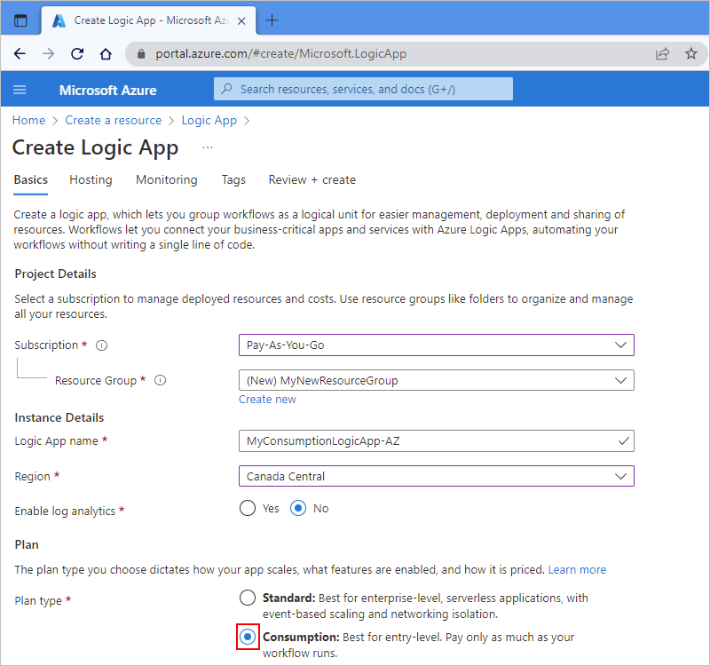
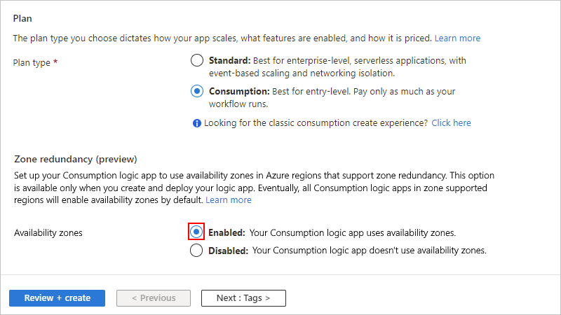

# Protect Consumption logic apps from region failures with zone redundancy and availability zones (preview)

In each Azure region, *availability zones* are physically separate locations that are tolerant to local failures. Such failures can range from software and hardware failures to events such as earthquakes, floods, and fires. These zones achieve tolerance through the redundancy and logical isolation of Azure services.

To provide resiliency and distributed availability, at least three separate availability zones exist in any Azure region that supports and enables zone redundancy. The Azure Logic Apps platform distributes these zones and logic app workloads across these zones. This capability is a key requirement for enabling resilient architectures and providing high availability if datacenter failures happen in a region. For more information about availability zones and zone redundancy, review [Azure regions and availability zones](../availability-zones/az-overview.md).

This article provides a brief overview about considerations for using availability zones in Azure Logic Apps and how to enable this capability for your Consumption logic app.

## Considerations

During preview, the following considerations apply:

* The following list includes the Azure regions where you can currently enable availability zones with the list expanding as available:  

  - Brazil South
  - Canada Central
  - France Central

* Azure Logic Apps currently supports the option to enable availability zones *only for new Consumption logic app workflows* that run in multi-tenant Azure Logic Apps.

  * This option is available *only when you create a Consumption logic app using the Azure portal*. No programmatic tool support, such as Azure PowerShell or Azure CLI, currently exists to enable availability zones.

  * This option is unavailable for existing Consumption logic app workflows and for any Standard logic app workflows.

* Existing Consumption logic app workflows are unaffected until mid-May 2022. After this time, the Azure Logic Apps team will gradually start to move existing Consumption logic app workflows towards using availability zones, several Azure regions at a time. The option to enable availability zones on new Consumption logic app workflows remains available during this time.

* If you use a firewall or restricted environment, you have to allow traffic through all the IP addresses required by Azure Logic Apps, managed connectors, and custom connectors in the Azure region where you create your logic app workflows. New IP addresses that support availability zones are already published for Azure Logic Apps, managed connectors, and custom connectors. For more information, review [Prerequisites](#prerequisites).

## Limitations

Availability zones currently doesn't support workflows that enable [chunking](logic-apps-handle-large-messages.md).

## Prerequisites

* An Azure account and subscription. If you don't have a subscription, [sign up for a free Azure account](https://azure.microsoft.com/free/?WT.mc_id=A261C142F).

* If you have a firewall or restricted environment, you have to allow traffic through all the IP addresses required by Azure Logic Apps, managed connectors, and any custom connectors in the Azure region where you create your logic app workflows. For more information, review the following documentation:

  * [Firewall configuration: IP addresses and service tags](logic-apps-limits-and-config.md#firewall-ip-configuration)

  * [Inbound IP addresses for Azure Logic Apps](logic-apps-limits-and-config.md#inbound)

  * [Outbound IP addresses for Azure Logic Apps](logic-apps-limits-and-config.md#outbound)

  * [Outbound IP addresses for managed connectors and custom connectors](/connectors/common/outbound-ip-addresses)

## Set up availability zones for Consumption logic app workflows

1. In the [Azure portal](https://portal.azure.com), start creating a Consumption logic app. On the **Create Logic App** page, stop after you select **Consumption** as the plan type for your logic app.

   

   For a quick tutorial, review [Quickstart: Create your first integration workflow with multi-tenant Azure Logic Apps and the Azure portal](quickstart-create-first-logic-app-workflow.md).

   After you select **Consumption**, the **Zone redundancy** section and options become available.

1. Under **Zone redundancy**, select **Enabled**.

   At this point, your logic app creation experience appears similar to this example:

   

1. Finish creating your logic app.

1. If you use a firewall and haven't set up access for traffic through the required IP addresses, make sure to complete that [requirement](#prerequisites).

## Next steps

* [Business continuity and disaster recovery for Azure Logic Apps](business-continuity-disaster-recovery-guidance.md)
* [Connectors in Azure Logic Apps](../connectors/apis-list.md)