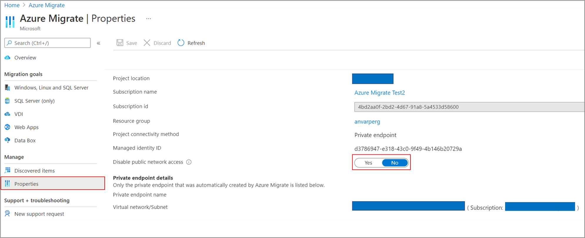
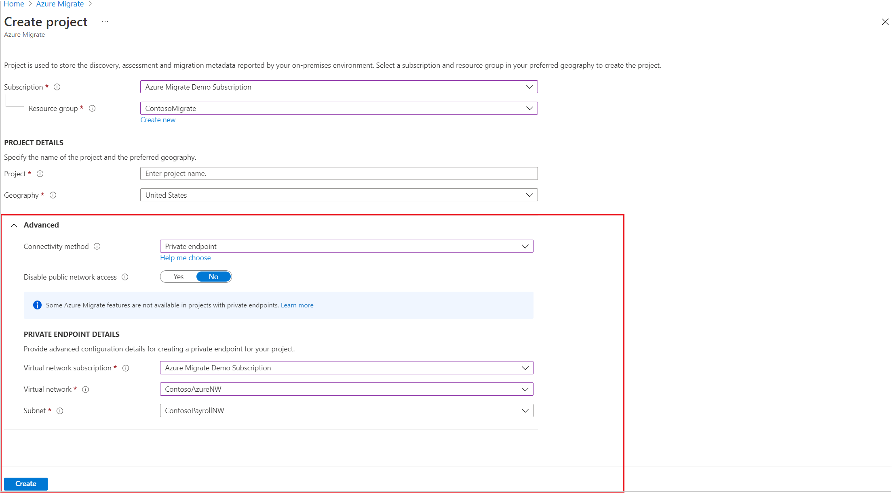
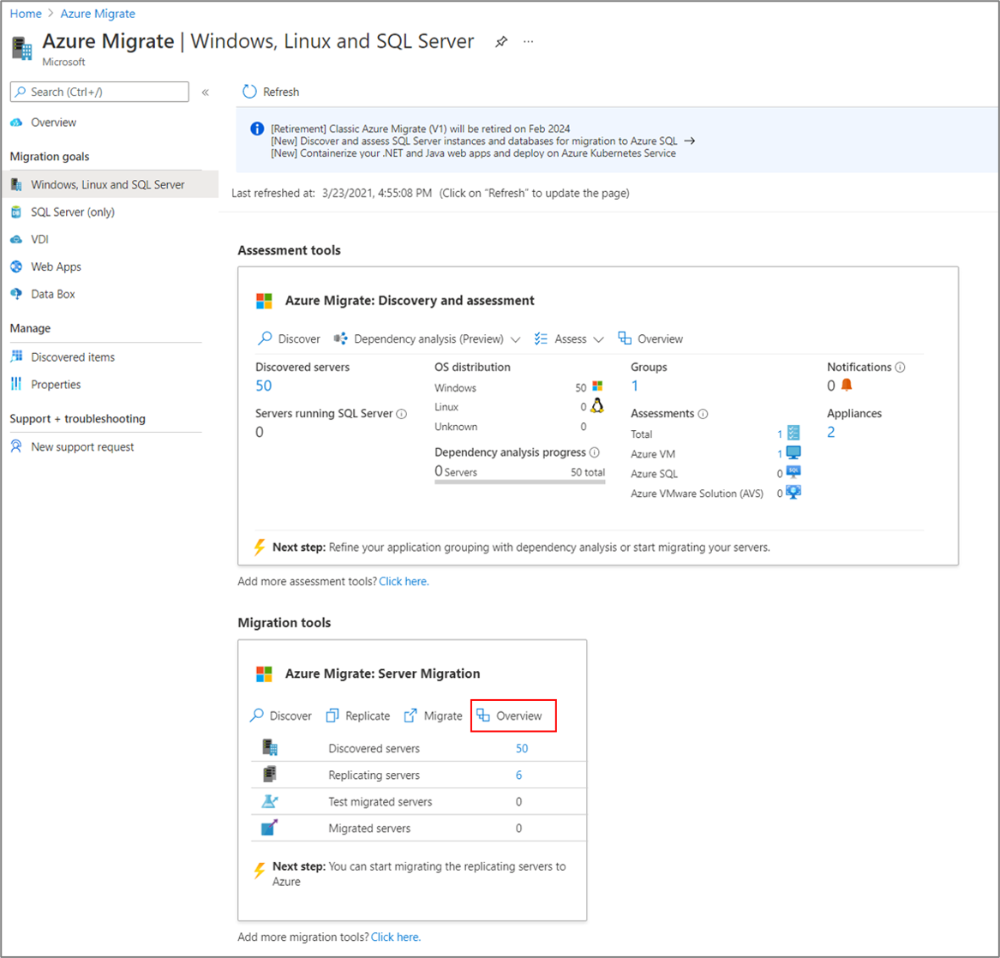
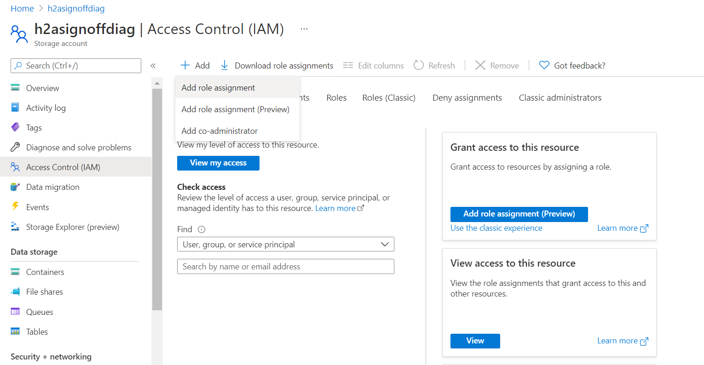

# Using Azure Migrate with private endpoints  

This article describes how to use Azure Migrate to discover, assess, and migrate servers over a private network using [Azure Private Link](../private-link/private-endpoint-overview.md).

You can use the [Azure Migrate: Discovery and Assessment](./migrate-services-overview.md#azure-migrate-discovery-and-assessment-tool) and [Azure Migrate: Server Migration](./migrate-services-overview.md#azure-migrate-server-migration-tool) tools to connect privately and securely to the Azure Migrate service over an ExpressRoute private peering or a site to site VPN connection, using Azure Private Link.

The private endpoint connectivity method is recommended when there is an organizational requirement to access the Azure Migrate service and other Azure resources without traversing public networks. Using the Private Link, you can use your existing ExpressRoute private peering circuits for better bandwidth or latency requirements.

## Support requirements

### Required permissions

**Contributor + User Access Administrator** or **Owner** permissions on the subscription.

### Supported scenarios and tools

**Deployment** | **Details** | **Tools**
--- | --- | ---
**Discovery and Assessment** | Perform an agentless, at-scale discovery and assessment of your servers running on any platform – hypervisor platforms such as [VMware vSphere](./tutorial-discover-vmware.md) or [Microsoft Hyper-V](./tutorial-discover-hyper-v.md), public clouds such as [AWS](./tutorial-discover-aws.md) or [GCP](./tutorial-discover-gcp.md), or even [bare metal servers](./tutorial-discover-physical.md). | Azure Migrate: Discovery and Assessment  <br/>
**Software inventory** | Discover apps, roles, and features running on VMware VMs. | Azure Migrate: Discovery and Assessment  
**Dependency visualization** | Use the dependency analysis capability to identify and understand dependencies across servers. <br/> [Agentless dependency visualization](./how-to-create-group-machine-dependencies-agentless.md) is supported natively with Azure Migrate private link support. <br/>[Agent-based dependency visualization](./how-to-create-group-machine-dependencies.md) requires Internet connectivity. [learn how](../azure-monitor/logs/private-link-security.md) to use private endpoints for agent-based dependency visualization. | Azure Migrate: Discovery and Assessment |
**Migration** | Perform [agentless Hyper-V migrations](./tutorial-migrate-hyper-v.md) or use the agent-based approach to migrate your [VMware VMs](./tutorial-migrate-vmware-agent.md), [Hyper-V VMs](./tutorial-migrate-physical-virtual-machines.md), [physical servers](./tutorial-migrate-physical-virtual-machines.md), [VMs running on AWS](./tutorial-migrate-aws-virtual-machines.md), [VMs running on GCP](./tutorial-migrate-gcp-virtual-machines.md), or VMs running on a different virtualization provider. | Azure Migrate: Server Migration

>[!Note]
>
> [Agentless VMware migrations](./tutorial-migrate-vmware.md) require Internet access or connectivity via ExpressRoute Microsoft peering. <br/> [Learn how](./replicate-using-expressroute.md) to use private endpoints to perform replications over ExpressRoute private peering or a site-to-site (S2S) VPN connection.  <br/><br/>

#### Other integrated tools

Other migration tools may not be able to upload usage data to the Azure Migrate project if the public network access is disabled. The Azure Migrate project should be configured to allow traffic from all networks to receive data from other Microsoft or external [independent software vendor (ISV)](./migrate-services-overview.md#isv-integration) offerings.


To enable public network access for the Azure Migrate project, Sign in to Azure portal, Navigate to **Azure Migrate properties** page on the Azure portal, select **No** > **Save**.



### Other considerations   

**Considerations** | **Details**
--- | ---
**Pricing** | For pricing information, see [Azure blob pricing](https://azure.microsoft.com/pricing/details/storage/page-blobs/) and [Azure Private Link pricing](https://azure.microsoft.com/pricing/details/private-link/).  
**Virtual network requirements** | The ExpressRoute/VPN gateway endpoint should reside in the selected virtual network or a virtual network connected to it. You may need ~15 IP addresses in the virtual network.  

## Create a project with private endpoint connectivity

Use this [article](./create-manage-projects.md#create-a-project-for-the-first-time) to set up a new Azure Migrate project.

> [!Note]
> You cannot change the connectivity method to private endpoint connectivity for existing Azure Migrate projects.

In the **Advanced** configuration section, provide the below details to create a private endpoint for your Azure Migrate project.
1. In **Connectivity method**, choose **Private endpoint**.
2. In **Disable public endpoint access**, keep the default setting  **No**. Some migration tools may not be able to upload usage data to the Azure Migrate project if public network access is disabled. [Learn more.](#other-integrated-tools)
3. In **Virtual network subscription**, select the subscription for the private endpoint virtual network.
4. In **Virtual network**, select the virtual network for the private endpoint. The Azure Migrate appliance and other software components that need to connect to the Azure Migrate project must be on this network or a connected virtual network.
5. In **Subnet**, select the subnet for the private endpoint.

   

6. Select **Create**. to create a migrate project and attach a Private Endpoint to it. Wait a few minutes for the Azure Migrate project to deploy. Do not close this page while the project creation is in progress.

## Discover and assess servers for migration using Azure Private Link

### Set up the Azure Migrate appliance

1. In **Discover machines** > **Are your machines virtualized?**, select the server type.
2. In **Generate Azure Migrate project key**, provide a name for the Azure Migrate appliance.
3. Select **Generate key** to create the required Azure resources.

    > [!Important]
    > Do not close the Discover machines page during the creation of resources.  
    - At this step, Azure Migrate creates a key vault, storage account, Recovery Services vault (only for agentless VMware migrations), and a few internal resources and attaches a private endpoint to each resource. The private endpoints are created in the virtual network selected during the project creation.  
    - Once the private endpoints are created, the DNS CNAME resource records for the Azure Migrate resources are updated to an alias in a subdomain with the prefix *privatelink*. By default, Azure Migrate also creates a private DNS zone corresponding to the *privatelink* subdomain for each resource type and inserts DNS A records for the associated private endpoints. This enables the Azure Migrate appliance and other software components residing in the source network to reach the Azure Migrate resource endpoints on private IP addresses.  
    - Azure Migrate also enables a [managed identity](../active-directory/managed-identities-azure-resources/overview.md) for the migrate project, and grants permissions to the managed identity to securely access the storage account.  

4. After the key is successfully generated, copy the key details to configure and register the appliance.   

#### Download the appliance installer file  

Azure Migrate: Discovery and assessment use a lightweight Azure Migrate appliance. The appliance performs server discovery and sends server configuration and performance metadata to Azure Migrate.  

> [!Note]
> The option to deploy an appliance using a template (OVA for servers on VMware environment and VHD Hyper-V environment) isn't supported for Azure Migrate projects with private endpoint connectivity.

To set up the appliance:
  1. Download the zipped file containing the installer script from the portal.
  2. Copy the zipped file on the server that will host the appliance.   
  3. After downloading the zipped file, verify the file security
  4. Run the installer script to deploy the appliance.

Here are the download links for each of the scenario:

Scenario | Download link | Hash value
--- | --- | ---
Hyper-V | [AzureMigrateInstaller-HyperV-Public-PrivateLink.zip](https://go.microsoft.com/fwlink/?linkid=2160557) | 17EFA01E3A7683F1CE2A08E3A9197A27D8BD2CC03C3AB5C6E00E4261A822BDB3
Physical | [AzureMigrateInstaller-Physical-Public-PrivateLink.zip](https://go.microsoft.com/fwlink/?linkid=2160558) | 01028F92C2095452F2DDCB89986CDC1F177AAC58E150A5B219A69CF1B7DA3BE0
VMware | [AzureMigrateInstaller-VMware-public-PrivateLink.zip](https://go.microsoft.com/fwlink/?linkid=2160648) | 66D3217AEC1DE51D84EC608B22BDDA605EC9C4FBAB06FC69FEC985886627C224
VMware scale-out | [AzureMigrateInstaller-VMware-Public-Scaleout-PrivateLink.zip](https://go.microsoft.com/fwlink/?linkid=2160811) | 42C1E8D5CF428E35E5B98E4E7465DD08439F0FD5C319340CE3E3ADC3DC1717A6

#### Verify security

Check that the zipped file is secure, before you deploy it.

1. Open an administrator command window on the server to which you downloaded the file.
2. Run the following command to generate the hash for the zipped file

    - ```C:\>CertUtil -HashFile <file_location> [Hashing Algorithm]```
    - Example usage for public cloud: ```C:\>CertUtil -HashFile C:\Users\administrator\Desktop\AzureMigrateInstaller-VMware-public-PrivateLink.zip SHA256 ```

3.  Verify the latest version of the appliance by comparing the hash values from the table above.

Make sure the server meets the [hardware requirements](./migrate-appliance.md) for the chosen scenario (VMware/Hyper-V/Physical or other) and can connect to the required Azure URLs - [public](./migrate-appliance.md#public-cloud-urls-for-private-link-connectivity) and [government](./migrate-appliance.md#government-cloud-urls-for-private-link-connectivity) clouds.


#### Run the script

1. Extract the zipped file to a folder on the server that will host the appliance.
2. Launch PowerShell on the machine, with administrator (elevated) privileges.
3. Change the PowerShell directory to the folder containing the contents extracted from the downloaded zipped file.
4. Run the script **AzureMigrateInstaller.ps1**, as follows:

    ```
    PS C:\Users\administrator\Desktop\AzureMigrateInstaller-VMware-public-PrivateLink> .\AzureMigrateInstaller.ps1
    ```

5. After the script runs successfully, it launches the appliance configuration manager so that you can configure the appliance. If you encounter any issues, review the script logs at C:\ProgramData\Microsoft Azure\Logs\AzureMigrateScenarioInstaller_<em>Timestamp</em>.log.

### Configure the appliance and start continuous discovery

Open a browser on any machine that can connect to the appliance server, and open the URL of the appliance configuration manager: `https://appliance name or IP address: 44368`. Alternately, you can open the configuration manager from the appliance server desktop by selecting the shortcut for the configuration manager.

#### Set up prerequisites

1. Read the third-party information and accept the **license terms**.    

2. In the configuration manager > **Set up prerequisites**, do the following:
   - **Connectivity**: The appliance checks for access to the required URLs. If the server uses a proxy:
     - Select **Set up proxy** to specify the proxy address `http://ProxyIPAddress` or `http://ProxyFQDN` and listening port.
     - Specify credentials if the proxy needs authentication. Only HTTP proxy is supported.
     - You can add a list of URLs/IP addresses that should bypass the proxy server.
     - Select **Save** to register the configuration if you have updated the proxy server details or added URLs/IP addresses to bypass proxy.

        > [!Note]
        > If you get an error with aka.ms/* link during connectivity check and you do not want the appliance to access this URL over the internet, you need to disable the auto update service on the appliance by following the steps [**here**](./migrate-appliance.md#turn-off-auto-update). After the auto-update has been disabled, the aka.ms/* URL connectivity check will be skipped.

   - **Time sync**: The time on the appliance should be in sync with internet time for discovery to work properly.
   - **Install updates**: The appliance ensures that the latest updates are installed. After the check completes, select **View appliance services** to see the status and versions of the services running on the appliance server.
        > [!Note]
        > If you have chosen to disable auto update service on the appliance, you can update the appliance services manually to get the latest versions of the services by following the steps [**here**](./migrate-appliance.md#manually-update-an-older-version).
   - **Install VDDK**: (_Needed only for VMware appliance)_ The appliance checks that VMware vSphere Virtual Disk Development Kit (VDDK) is installed. If it isn't installed, download VDDK 6.7 from VMware, and extract the downloaded zipped contents to the specified location on the appliance, as provided in the **Installation instructions**.

#### Register the appliance and start continuous discovery

After the prerequisites check has completed, follow the steps to register the appliance and start continuous discovery for respective scenarios:
- [VMware VMs](./tutorial-discover-vmware.md#register-the-appliance-with-azure-migrate)
- [Hyper-V VMs](./tutorial-discover-hyper-v.md#register-the-appliance-with-azure-migrate)
- [Physical Servers](./tutorial-discover-physical.md#register-the-appliance-with-azure-migrate)
- [AWS VMs](./tutorial-discover-aws.md#register-the-appliance-with-azure-migrate)
- [GCP VMs](./tutorial-discover-gcp.md#register-the-appliance-with-azure-migrate)


>[!Note]
> If you get a DNS resolution issues during appliance registration or at the time of starting discovery, ensure that Azure Migrate resources created during the **Generate key** step on portal are reachable from the on-premises server hosting the Azure Migrate appliance. [Learn more on how to verify network connectivity](./troubleshoot-network-connectivity.md).

### Assess your servers for migration to Azure
After the discovery is complete, assess your servers ([VMware VMs](./tutorial-assess-vmware-azure-vm.md), [Hyper-V VMs](./tutorial-assess-hyper-v.md), [physical servers](./tutorial-assess-vmware-azure-vm.md), [AWS VMs](./tutorial-assess-aws.md), [GCP VMs](./tutorial-assess-gcp.md)) for migration to Azure VMs or Azure VMware Solution (AVS), using the Azure Migrate: Discovery and Assessment tool.

You can also [assess your on-premises machines](./tutorial-discover-import.md#prepare-the-csv) with the Azure Migrate: Discovery and Assessment tool using an imported comma-separated values (CSV) file.   

## Migrate servers to Azure using Azure Private Link

The following sections describe the steps required to use Azure Migrate with [private endpoints](../private-link/private-endpoint-overview.md) for migrations using ExpressRoute private peering or VPN connections.  

This article shows a proof-of-concept deployment path for agent-based replications to migrate your [VMware VMs](./tutorial-migrate-vmware-agent.md), [Hyper-V VMs](./tutorial-migrate-physical-virtual-machines.md), [physical servers](./tutorial-migrate-physical-virtual-machines.md), [VMs running on AWS](./tutorial-migrate-aws-virtual-machines.md), [VMs running on GCP](./tutorial-migrate-gcp-virtual-machines.md), or VMs running on a different virtualization provider using Azure private endpoints. You can use a similar approach for performing [agentless Hyper-V migrations](./tutorial-migrate-hyper-v.md) using private link.

>[!Note]
>[Agentless VMware migrations](./tutorial-assess-physical.md) require Internet access or connectivity via ExpressRoute Microsoft peering.

### Set up a replication appliance for migration

The following diagram illustrates the agent-based replication workflow with private endpoints using the Azure Migrate: Server Migration tool.  


The tool uses a replication appliance to replicate your servers to Azure. See this article to [prepare and set up a machine for the replication appliance. ](./tutorial-migrate-physical-virtual-machines.md#prepare-a-machine-for-the-replication-appliance)

After you set up the replication appliance, use the following instructions to create the required resources for migration.

1. In **Discover machines** > **Are your machines virtualized?**, select **Not virtualized/Other**.
2. In **Target region**, select and confirm the Azure region to which you want to migrate the machines.
3. Select **Create resources** to create the required Azure resources. Do not close the page during the creation of resources.   
    - This creates a Recovery Services vault in the background and enables a managed identity for the vault. A Recovery Services vault is an entity that contains the replication information of servers and is used to trigger replication operations.  
    - If the Azure Migrate project has private endpoint connectivity, a private endpoint is created for the Recovery Services vault. This adds five fully qualified private names (FQDNs) to the private endpoint, one for each microservice linked to the Recovery Services vault.   
    - The five domain names are formatted in this pattern: <br/> _{Vault-ID}-asr-pod01-{type}-.{target-geo-code}_.privatelink.siterecovery.windowsazure.com  
    - By default, Azure Migrate automatically creates a private DNS zone and adds DNS A records for the Recovery Services vault microservices. The private DNS zone links to the private endpoint virtual network and allows the on-premises replication appliance to resolve the fully qualified domain names to their private IP addresses.

4. Before you register the replication appliance, ensure that the vault's private link FQDNs are reachable from the machine hosting the replication appliance. [Learn more on how to verify network connectivity.](./troubleshoot-network-connectivity.md)

5. Once you verify the connectivity, download the appliance setup and key file, run the installation process, and register the appliance to Azure Migrate. Review the [detailed steps here](./tutorial-migrate-physical-virtual-machines.md#set-up-the-replication-appliance). After you set up the replication appliance, follow these instructions to [install the mobility service](./tutorial-migrate-physical-virtual-machines.md#install-the-mobility-service) on the machines you want to migrate.

### Replicate servers to Azure using Azure Private Link

Follow [these steps](./tutorial-migrate-physical-virtual-machines.md#replicate-machines) to select servers for replication.  

In **Replicate** > **Target settings** > **Cache/Replication storage account**, use the drop-down to select a storage account to replicate over a private link.  

If your Azure Migrate project has private endpoint connectivity, you must  [grant permissions to the Recovery Services vault managed identity](#grant-access-permissions-to-the-recovery-services-vault) to access the storage account required by Azure Migrate.   

Additionally, to enable replications over a private link, [create a private endpoint for the storage account.](#create-a-private-endpoint-for-the-storage-account-optional)

#### Grant access permissions to the Recovery Services vault

The Recovery Services vault managed identity requires permissions for authenticated access to the cache/replication storage account.

Use the guidance below to identify the Recovery Services vault created by Azure Migrate and grant the required permissions.

**_Identify the recovery services vault and the managed identity object ID_**

You can find the details of the Recovery Services vault on the Azure Migrate: Server Migration **properties** page.

1. Go to the **Azure Migrate hub**, select **Overview** on the Azure Migrate: Server Migration tile.

    

2. On the left pane, select **Properties**. Make a note of the Recovery Services vault name and managed identity ID. The vault will have _Private endpoint_ as the **connectivity type** and _Other_ as the **replication type**. You will need this information while providing access to the vault.

    

**_Grant the required permissions to access the storage account_**

 To the managed identity of the vault you must be grant the following role permissions on the storage account required for replication.  In this case, you must create the storage account in advance.

>[!Note]
> For migrating Hyper-V VMs to Azure using private link, you must grant access to both the replication storage account and cache storage account.

The role permissions vary depending on the type of the storage account.

- Resource Manager-based storage accounts (Standard type):
  - [Contributor](../role-based-access-control/built-in-roles.md#contributor) _and_
  - [Storage Blob Data Contributor](../role-based-access-control/built-in-roles.md#storage-blob-data-contributor)
- Resource Manager-based storage accounts (Premium type):
  - [Contributor](../role-based-access-control/built-in-roles.md#contributor) _and_
  - [Storage Blob Data Owner](../role-based-access-control/built-in-roles.md#storage-blob-data-owner)

1. Go to the replication/cache storage account selected for replication. Select **Access control (IAM)** in the left pane.

1. In the **Add a role assignment** section, select **Add**:

   


1. On the **Add role assignment** page, in the **Role**
   field, select the appropriate role from the permissions list mentioned above. Enter the name of the vault noted previously and select **Save**.

    

4. In addition to these permissions, you must also allow access to Microsoft trusted services. If your network access is restricted to selected networks, select **Allow trusted Microsoft services to access this storage account** in **Exceptions** section in the **Networking** tab.


### Create a private endpoint for the storage account (optional)

To replicate using ExpressRoute with private peering, [create a private endpoint](../private-link/tutorial-private-endpoint-storage-portal.md#create-storage-account-with-a-private-endpoint) for the cache/replication storage accounts (target subresource: **_blob_**).

>[!Note]
>
> - You can create private endpoints only on a General Purpose v2 (GPv2) storage account. For pricing information, see [Azure Page Blobs pricing](https://azure.microsoft.com/pricing/details/storage/page-blobs/) and [Azure Private Link pricing](https://azure.microsoft.com/pricing/details/private-link/)

Create The private endpoint for the storage account in the same virtual network as the Azure Migrate project private endpoint or another virtual network connected to this network.

Select **Yes** and integrate with a private DNS zone. The private DNS zone helps in routing the connections from the virtual network to the storage account over a private link. Selecting **Yes** automatically links the DNS zone to the  virtual network and adds the DNS records for the resolution of new IPs and fully qualified domain names created. Learn more about [private DNS zones.](../dns/private-dns-overview.md)

If the user creating the private endpoint is also the storage account owner, the private endpoint creation will be auto approved. Otherwise, the owner of the storage account must approve the private endpoint for usage. To approve or reject a requested private endpoint connection, go to **Private endpoint connections** under **Networking** on the storage account page.

Review the status of the private endpoint connection state before proceeding.


After you've created the private endpoint, use the drop-down in **Replicate** > **Target settings** > **Cache storage account**  to select the storage account for replicating over a private link.  

Ensure that the on-premises replication appliance has network connectivity to the storage account on its private endpoint. [Learn more on how to verify network connectivity.](./troubleshoot-network-connectivity.md)

>[!Note]
>
> - For Hyper-V VM migrations to Azure, if the replication storage account is of _Premium_ type, you must select another storage account of _Standard_ type for the cache storage account. In this case, you must create private endpoints for both the replication and cache storage account.  

Next, follow these instructions to [review and start replication](./tutorial-migrate-physical-virtual-machines.md#replicate-machines) and [perform migrations](./tutorial-migrate-physical-virtual-machines.md#run-a-test-migration).


## Next steps
- [Complete the migration process](./tutorial-migrate-physical-virtual-machines.md#complete-the-migration) and review the [post-migration best practices](./tutorial-migrate-physical-virtual-machines.md#post-migration-best-practices).
