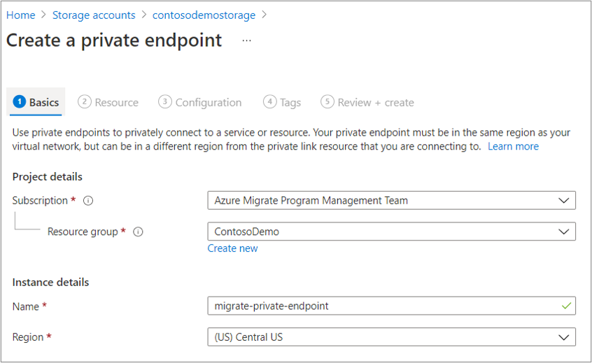
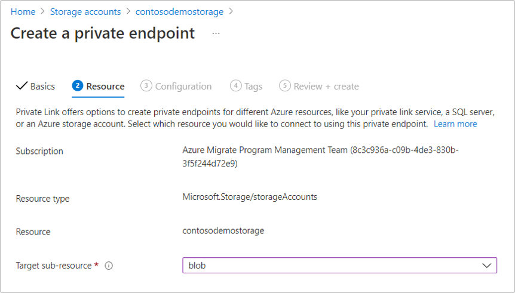
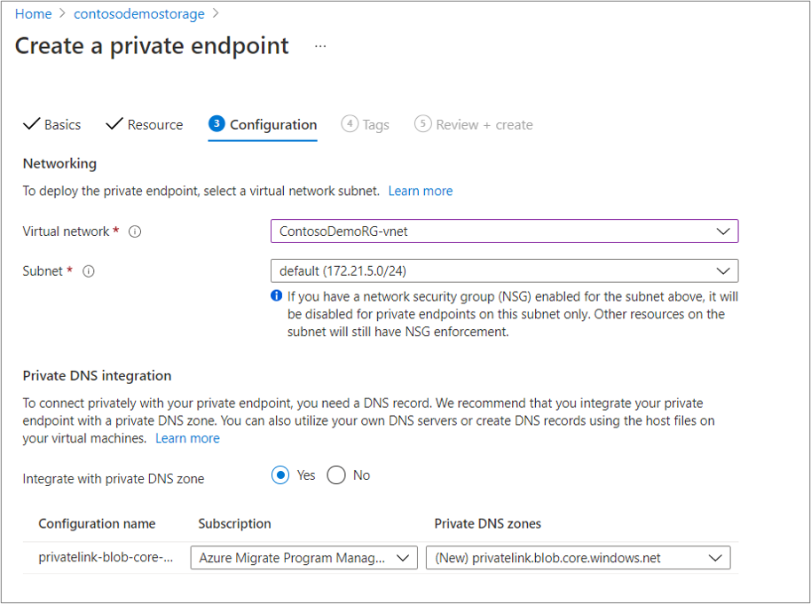

# Replicate data over ExpressRoute with Azure Migrate: Server Migration

In this article you'll learn how to configure [Azure Migrate: Server Migration](https://docs.microsoft.com/azure/migrate/migrate-services-overview#azure-migrate-server-migration-tool) to replicate data over an ExpressRoute circuit while migrating servers to Azure.

## Understand Azure ExpressRoute circuits
An ExpressRoute (ER) circuit connects your on-premises infrastructure to Microsoft through a connectivity provider. ExpressRoute circuits can be configured to use private peering, Microsoft peering, or both. Review the article on [ExpressRoute circuits and peering](https://docs.microsoft.com/azure/expressroute/expressroute-circuit-peerings#peeringcompare) to learn more about the various peering options available with ExpressRoute.

Azure Migrate's server migration tool helps you migrate on-premises servers and servers from other clouds to Azure virtual machines. The tool works by setting up an ongoing replication stream to replicate data from the servers to be migrated to managed disks in your Azure subscription. When you are ready to migrate the servers, the replicated data in Azure is used to migrate the servers.

Data replicated from your on-premises servers can be configured to be sent to your Azure subscription over the internet (using a secure encrypted connection), or over an ExpressRoute connection. When you have a large number of servers to migrate, using ExpressRoute for replication can help you migrate servers more efficiently by using the provisioned bandwidth available with your ExpressRoute circuit.

In this article, you'll learn
> [!div class="checklist"]
>
> * How to replicate data using an ExpressRoute circuit with private peering.
> * How to replicate data using an ExpressRoute circuit with Microsoft peering.

## Replicate data using an ExpressRoute circuit with private peering

> [!NOTE]
> Replicating over a private peering circuit is currently supported only for [agentless migration of VMware virtual machines to Azure](./tutorial-migrate-vmware.md). Private endpoint support for other [replication methods](./migrate-services-overview.md#azure-migrate-server-migration-tool) will be available soon.

In the agentless method of migrating VMware virtual machines to Azure, the Azure Migrate appliance first uploads replication data to a storage account (cache storage account) in your subscription. Replicated data from the cache storage account is then moved to replica-managed disks in your subscription by the Azure Migrate service. To use a private peering circuit for replication, you'll create and attach a private endpoint to the cache storage account use. Private endpoints use one or more private IP addresses from your virtual network (VNet), effectively bringing the storage account into your Azure VNet. The private endpoint allows the Azure Migrate appliance to connect to the cache storage account using ExpressRoute private peering and transfer data directly on the private IP address.    

> [!Important]
>
> - In addition to replication data, the Azure Migrate appliance communicates with the Azure Migrate service for its control plane activities including orchestrating replication. Control plane communication between the Azure Migrate appliance and the Azure Migrate service continues to happen over the internet on Azure Migrate service's public endpoint.
> - The private endpoint of the storage account should be accessible from the network the Azure Migrate appliance is deployed on.
> - DNS must be configured to resolve DNS queries by the Azure Migrate appliance for the cache storage account's blob service endpoint to the private IP address of the private endpoint attached to the cache storage account.
> - The cache storage account must be accessible on its public endpoint. (The Azure Migrate service uses the cache storage account's public endpoint to move data from the storage account to replica managed disks.) 

### 1. Pre-requisites

The Azure user creating the private endpoint should have the following permissions on the resource group and virtual network that the private endpoint will be created in.

**Use case** | **Permissions** 
--- | --- 
 Create and manage private endpoints. | Microsoft.Network/privateEndpoint/write/action Microsoft.Network/privateEndpoint/read/action  
|Attach a private endpoint to a VNet/subnet. This is required on the virtual network where the private endpoint will be created.| Microsoft.Network/virtualNetworks/subnet/join/action  Microsoft.Network/virtualNetworks/join/action
|Link the private endpoint to a storage account.  | Microsoft.Microsoft.Storage/storageAccounts/privateEndpointConnectionApproval/action   Microsoft.Microsoft.Storage/storageAccounts/privateEndpointConnections/read
|Create a network interface and join it to a network security group. | Microsoft.Network/networkInterfaces/read   Microsoft.Network/networkInterfaces/subnets/write   Microsoft.Network/networkInterfaces/subnets/read  Microsoft.Network/networkSecurityGroups/join/action (optional)
Create and manage private DNS zones.| Private DNS Zone Contributor role   _Or_   Microsoft.Network/privateDnsZones/A/*    Microsoft.Network/privateDnsZones/write Microsoft.Network/privateDnsZones/read   Microsoft.Network/privateEndpoints/privateDnsZoneGroups/write   Microsoft.Network/privateEndpoints/privateDnsZoneGroups/read   Microsoft.Network/privateDnsZones/virtualNetworkLinks/write    Microsoft.Network/privateDnsZones/virtualNetworkLinks/read   Microsoft.Network/virtualNetworks/join/action 

### 2. Identify the cache storage account 
 
Azure Migrate automatically creates a cache storage account when you configure replication (using the Azure portal experience) for a virtual machine for the first time in an Azure Migrate project. The storage account is created in the same subscription and resource group that you created the Azure Migrate project in.

To create and locate the storage account:

1. Use the Azure portal experience for Azure Migrate to replicate one or more virtual machines in the project.
2. Navigate to the resource group of the Azure Migrate project.
3. Locate the cache storage account by identifying the prefix **“lsa”** in the storage account name.

> [!Tip]
> If you have more than one storage account with the prefix **"lsa"** in your resource group, you can verify the storage account by navigating to the replication settings and target configuration menu for any of the replicating VMs in the project.   
> 

### 3. Upgrade  cache storage account to General Purpose v2 

You can create private endpoints only on a General Purpose v2 (GPv2) storage account. If the cache storage account is not a GPv2 storage account, upgrade it to GPv2 using the following steps:

1. Navigate to your storage account.
2. Select **Configuration**.
3. Under **Account kind**, select **Upgrade**.
4. Under **Confirm upgrade**, type in the name of your account.
5. Select **Upgrade** at the bottom of the page.

### 4. Create a private endpoint for the storage account

1. Go to your storage account, select **Networking** from the left menu, and select the **Private endpoint connections** tab.  
2. Select **+ Private endpoint**.

    a. In the **Create a private endpoint** window – select the **subscription** and **resource group**. Provide a name for your private endpoint and select the storage account region.  
    

    b. In the **Resource** tab, provide the **Subscription name** that the storage account is in. Choose **Microsoft.Storage/storageAccounts** as the **Resource type**. In **Resource**, provide the name of the GPv2 type replication storage account. Select **Blob** as the **Target sub-resource**.  
    

    c. In the **Configuration** tab, select the **Virtual network** and **Subnet** for the storage account’s private endpoint.  

    > [!Note]
    > The virtual network must contain the ExpressRoute gateway endpoint or must be connected to the virtual network with the ExpressRoute gateway. 

    In the **Private DNS Integration** section, select **Yes** and integrate with a private DNS zone. Selecting **Yes** automatically links the DNS zone to the selected virtual network and adds the DNS records that are required for DNS resolution of new IPs and fully qualified domain names created for the private endpoint. Learn more about [private DNS zones.](https://docs.microsoft.com/azure/dns/private-dns-overview)

    

    d. You can also add **Tags** for your private endpoint.  

    e. Continue to **Review + create** once done entering details. When the validation completes, select **Create** to create the private endpoint.

    > [!Note]
    > If the user creating the private endpoint is also the owner of the storage account, the private endpoint will be auto-approved. Otherwise, the owner must approve the private endpoint for usage. 

#### Create private DNS zones and add DNS records manually (Optional)

If you did not select the option to integrate with a private DNS zone at the time of the private endpoint creation, follow the steps in this section to manually create a private DNS zone. 

> [!Note]
> If you selected **Yes** to integrate with a private DNS zone, you can skip this section. 

1. Create a private DNS zone. 

    

    a.	On the **Private DNS zones** page, select the **+Add** button to start creating a new zone.  
    b.	On the **Create private DNS zone** page, fill in the required details. Enter the name of the private DNS zone as _privatelink_.blob.core.windows.net. 
    c. Continue to the **Review + create** tab to review and create the DNS zone.

2. Link the private DNS zone to your virtual network.  

    The private DNS zone created above must be linked to the virtual network that the private endpoint is attached to.

    a. Go to the private DNS zone created in the previous step and navigate to virtual network links on the left side of the page. Select the **+Add** button.   
    b. Fill in the required details. The **Subscription** and **Virtual network** fields must be filled with the corresponding details of the virtual network where your private endpoint is attached. The other fields can be left as is.

3. The next step is to add DNS records to the DNS zone. Add an entry for the storage account's fully qualified domain name into your private DNS zone.

    a. Go to your private DNS zone and navigate to the **Overview** section on the left side of the page. Select **+Record** set to start adding records.  

    b. In the **Add record set** page, add an entry for the fully qualified domain name and private IP as an A type record.

> [!Important]
> You may require additional DNS settings to resolve the private IP address of the storage account's private endpoint from the source environment. [Review this article](https://docs.microsoft.com/azure/private-link/private-endpoint-dns#on-premises-workloads-using-a-dns-forwarder) to understand the DNS configuration needed.

## Replicate data using an ExpressRoute circuit with Microsoft peering

You can use Microsoft peering or an existing public peering domain (deprecated for new ExpressRoute connections) to route your replication traffic through an ExpressRoute circuit as illustrated in the diagram below.

Even with replication data going over the Microsoft peered circuit, you'll still need internet connectivity from the on-premises site for other communication (control plane) with the Azure Migrate service. There are some additional URLs, that are not reachable over ExpressRoute, that the replication appliance / Hyper-V host needs access to orchestrate the replication process. You can review the URL requirements based on the migration scenario, [VMware agentless migrations](https://docs.microsoft.com/azure/migrate/migrate-appliance#public-cloud-urls) or [agent-based migrations](https://docs.microsoft.com/azure/migrate/migrate-replication-appliance).  

In case you use a proxy at your on-premises site and wish to use ExpressRoute for the replication traffic, you need to configure a proxy bypass for relevant URLs on the on-premises appliance. 

### Configure proxy bypass rules on the Azure Migrate appliance (for VMware agentless migrations)

1. Login (Remote desktop) to the Azure Migrate appliance.   
2. Open the file C:/ProgramData/MicrosoftAzure/Config/appliance.json using notepad.
3. In the file, change the line that says “EnableProxyBypassList”: “false”, to “EnableProxyBypassList”: “true”. Save the changes and restart the appliance.
4. After restarting, when you open the appliance configuration manager, you’ll be able to see the proxy bypass option in the web app UI. Add the URLs below to the proxy bypass list.   
    - .*.vault.azure.net
    - .*.servicebus.windows.net
    - .*.discoverysrv.windowsazure.com
    - .*.migration.windowsazure.com
    - .*.hypervrecoverymanager.windowsazure.com
    - .*.blob.core.windows.net

### Configure proxy bypass rules on the replication appliance (for agent-based migrations)

Follow the steps below to configure the Proxy bypass list on the Configuration server and Process servers:

1. [Download PsExec tool](https://docs.microsoft.com/sysinternals/downloads/psexec) to access system user context.
2. Open Internet Explorer in system user context by running the following command line psexec -s -i "%programfiles%\Internet Explorer\iexplore.exe"
3. Add proxy settings in IE.
4. In the bypass list, add the Azure storage URL.*.blob.core.windows.net.  

The above bypass rules will ensure that the replication traffic can flow through ExpressRoute while the management communication can go through the proxy for the Internet.  

Additionally, you must advertise routes in the Route Filter for the following BGP communities to make your Azure Migrate replication traffic traverse an ExpressRoute circuit instead of the internet.  

- Regional BGP community for the source Azure region (Azure Migrate Project region)
- Regional BGP community for the target Azure region (region for migration)
- BGP community for Azure Active Directory (12076:5060)

Learn more about [Route Filters](https://docs.microsoft.com/azure/expressroute/how-to-routefilter-portal) and the list of [BGP communities for ExpressRoute](https://docs.microsoft.com/azure/expressroute/expressroute-routing#bgp). 

## Next steps

- Learn more about [ExpressRoute circuits](https://docs.microsoft.com/azure/expressroute/expressroute-circuit-peerings).
- Learn more about [ExpressRoute routing domains](https://docs.microsoft.com/azure/expressroute/expressroute-circuit-peerings#peeringcompare).
- Learn more about [private endpoints](https://docs.microsoft.com/azure/private-link/private-endpoint-overview).