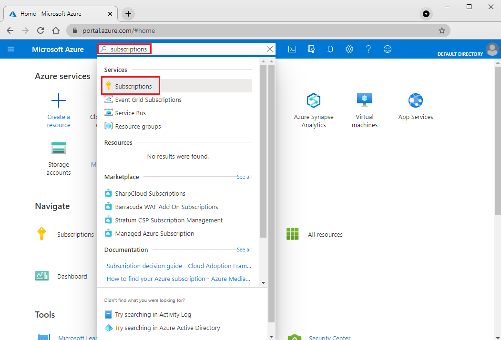
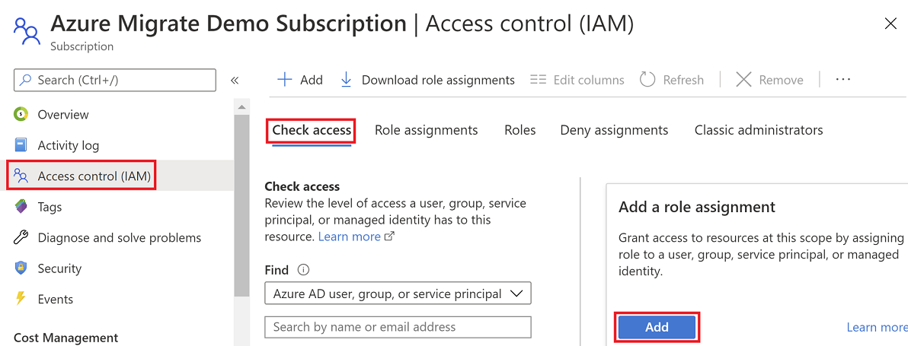
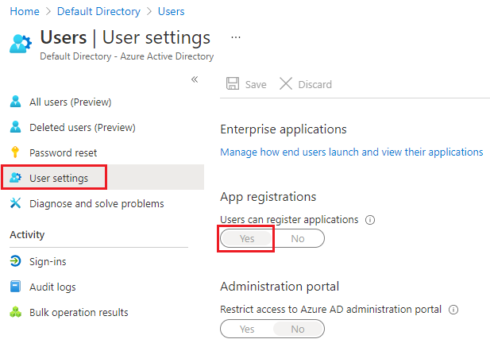
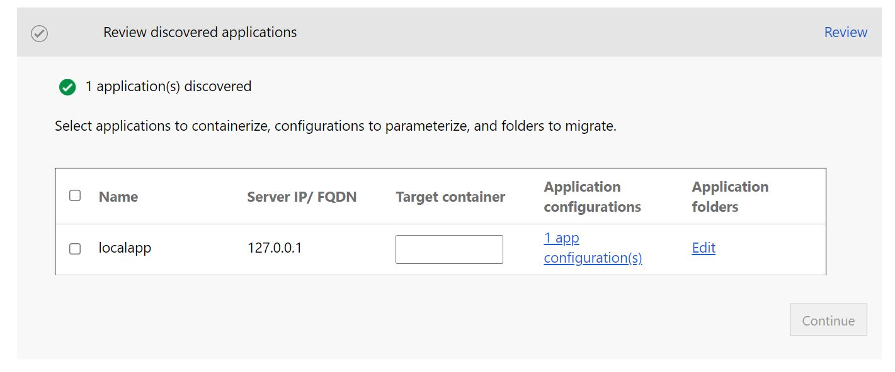
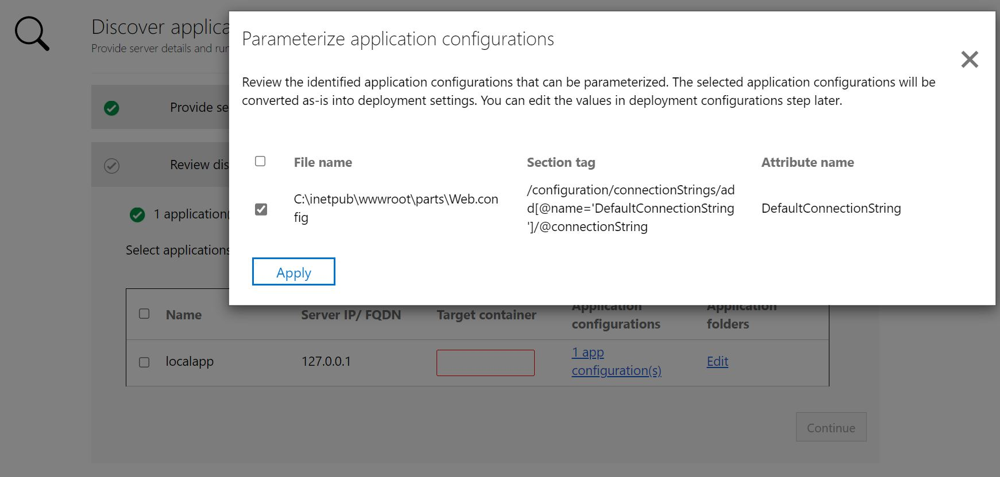
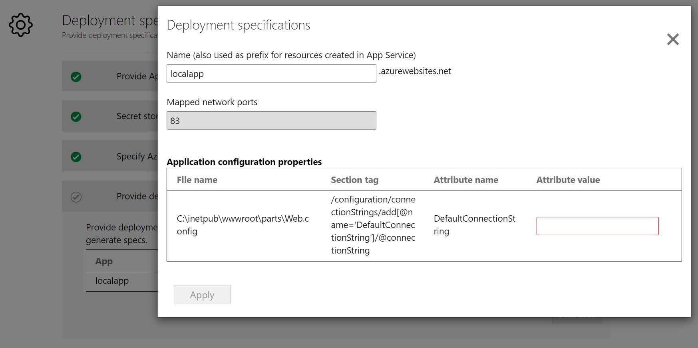

# ASP.NET app containerization and migration to Azure App Service

In this article, you'll learn how to containerize ASP.NET applications and migrate them to [Azure App Service](https://azure.microsoft.com/services/app-service/) by using the Azure Migrate App Containerization tool. The containerization process doesn't require access to your codebase and provides an easy way to containerize existing applications. The tool works by using the running state of the applications on a server to determine the application components. It then helps you package them in a container image. You can then deploy the containerized application on Azure App Service.

The Azure Migrate App Containerization tool currently supports:

- Containerizing ASP.NET apps and deploying them on Windows containers on App Service.
- Containerizing ASP.NET apps and deploying them on Windows containers on Azure Kubernetes Service (AKS). [Learn more about this containerization scenario.](./tutorial-app-containerization-aspnet-kubernetes.md)
- Containerizing Java web apps on Apache Tomcat (on Linux servers) and deploying them on Linux containers on AKS. [Learn more about this containerization scenario.](./tutorial-app-containerization-java-kubernetes.md)
- Containerizing Java web apps on Apache Tomcat (on Linux servers) and deploying them on Linux containers on App Service. [Learn more about this containerization scenario.](./tutorial-app-containerization-java-app-service.md)

The App Containerization tool helps you:

- **Discover your application components.** The tool remotely connects to the application servers that run your ASP.NET application and discovers the application components. It creates a Dockerfile that you can use to create a container image for the application.
- **Build the container image.** You can inspect and further customize the Dockerfile based on your application requirements and use it to build your application container image. The application container image is pushed to an Azure container registry that you specify.
- **Deploy to Azure App Service.**  The tool then generates the deployment files needed to deploy the containerized application to Azure App Service.

> [!NOTE]
> The Azure Migrate App Containerization tool helps you discover specific application types (ASP.NET and Java web apps on Apache Tomcat) and their components on an application server. To discover servers and the inventory of apps, roles, and features running on on-premises computers, use the [Azure Migrate Discovery and assessment tool](./tutorial-discover-vmware.md).

Not all applications will benefit from a straight shift to containers without significant rearchitecting. But some of the benefits of moving existing apps to containers without rewriting include:

- **Improved infrastructure utilization.** When you use containers, multiple applications can share resources and be hosted on the same infrastructure. This can help you consolidate infrastructure and improve utilization.
- **Simplified management.** By hosting your applications on modern managed platforms like AKS and App Service, you can simplify your management practices. You can achieve this simplification by retiring or reducing the infrastructure maintenance and management processes that you'd traditionally perform with owned infrastructure.
- **Application portability.** With increased adoption and standardization of container specification formats and platforms, application portability is no longer a concern.
- **Adopt modern management by using DevOps.** Using containers helps you adopt and standardize on modern practices for management and security and transition to DevOps.


In this tutorial, you'll learn how to:

> [!div class="checklist"]
> * Set up an Azure account.
> * Install the Azure Migrate App Containerization tool.
> * Discover your ASP.NET application.
> * Build the container image.
> * Deploy the containerized application on App Service.

> [!NOTE]
> Tutorials provide the simplest deployment path for a scenario so that you can quickly set up a proof of concept. Tutorials use default options when possible and don't show all settings and paths.

## Prerequisites

Before you start this tutorial, you should:

**Requirement** | **Details**
--- | ---
**Identify a machine on which to install the tool** | You need a Windows machine on which to install and run the Azure Migrate App Containerization tool. The Windows machine could run a server (Windows Server 2016 or later) or client (Windows 10) operating system. (The tool can run on your desktop.) <br/><br/> The Windows machine running the tool should have network connectivity to the servers or virtual machines hosting the ASP.NET applications that you'll containerize.<br/><br/> Ensure that 6 GB is available on the Windows machine running the Azure Migrate App Containerization tool. This space is for storing application artifacts. <br/><br/> The Windows machine should have internet access, directly or via a proxy. <br/> <br/>If the Microsoft Web Deployment tool isn't already installed on the machine running the App Containerization tool and the application server, install it. You can [download the tool](https://aka.ms/webdeploy3.6).
**Application servers** | Enable PowerShell remoting on the application servers: sign in to the application server and follow [these instructions to turn on PowerShell remoting](/powershell/module/microsoft.powershell.core/enable-psremoting). <br/><br/> If the application server is running Window Server 2008 R2, ensure that PowerShell 5.1 is installed on the application server. Follow the instructions [here to download and install PowerShell 5.1](/powershell/scripting/windows-powershell/wmf/setup/install-configure)  on the application server. <br/><br/> If the Microsoft Web Deployment tool isn't already installed on the machine running the App Containerization tool and the application server, install it. You can [download the tool](https://aka.ms/webdeploy3.6).
**ASP.NET application** | The tool currently supports: <br> <ul><li> ASP.NET applications that use .NET Framework 3.5 or later.<br/> <li>Application servers that run Windows Server 2008 R2 or later. (Application servers should be running PowerShell 5.1.) <br/><li> Applications that run on Internet Information Services 7.5 or later.</ul> <br/><br/> The tool currently doesn't support: <br/> <ul><li>Applications that require Windows authentication. (AKS doesn't currently support gMSA.) <br/> <li> Applications that depend on other Windows services hosted outside of Internet Information Services.


## Prepare an Azure user account

If you don't have an Azure subscription, create a [free account](https://azure.microsoft.com/pricing/free-trial/) before you start.

After your subscription is set up, you'll need an Azure user account with:
- Owner permissions on the Azure subscription.
- Permissions to register Azure Active Directory apps.

If you just created a free Azure account, you're the owner of your subscription. If you're not the subscription owner, work with the owner to assign the permissions as follows:

1. In the Azure portal, search for "subscriptions." Under **Services**, select **Subscriptions**:

    

2. On the **Subscriptions** page, select the subscription in which you want to create an Azure Migrate project.
3. In the subscription, on the left pane, select **Access control (IAM)**.
4. On the **Check access** tab, search for the relevant user account.
5. Under **Add a role assignment**, select **Add**:

    

6. On the **Add role assignment** page, select the **Owner** role, and then select the account (**azmigrateuser** in our example). Then select **Save**.

    

   Your Azure account also needs permissions to register Azure Active Directory apps.
8. In the Azure portal, go to **Azure Active Directory** > **Users** > **User Settings**.
9. In **User settings**, verify that Azure AD users can register applications. (This option is set to **Yes** by default.)

      

10. If the **App registrations** option is set to **No**, ask the tenant/global admin to assign the required permission. Alternatively, the tenant/global admin can assign the Application developer role to an account to allow the registration of Azure Active Directory apps. For more information, see [Assign roles to users](../active-directory/fundamentals/active-directory-users-assign-role-azure-portal.md).

## Download and install the Azure Migrate App Containerization tool

1. [Download the Azure Migrate App Containerization installer](https://go.microsoft.com/fwlink/?linkid=2134571) on a Windows machine.
2. Open PowerShell in administrator mode and change the PowerShell directory to the folder that contains the installer.
3. Run the installation script by using this command:

   ```powershell
   .\AppContainerizationInstaller.ps1
   ```

## Open the App Containerization tool

1. Open a browser on any machine that can connect to the Windows machine that's running the App Containerization tool. Go to the tool URL: **https://*machine name or IP address*: 44369**.

   Alternatively, you can open the app from your desktop by using the app shortcut.

2. If you see a warning that says your connection isn't private, select **Advanced** and continue to the website. This warning appears because the web interface uses a self-signed TLS/SSL certificate.
3. On the sign-in screen, use the machine's local administrator account to sign in.
4. Select **ASP.NET web apps** as the type of application you want to containerize.
5. In the **Target Azure service** list, select **Containers on Azure App Service**:

   

### Complete the tool prerequisites
1. Accept the license terms and read the third-party information.
6. In the tool web app **Set up prerequisites**, complete these steps:
   - **Connectivity.** The tool checks whether the Windows machine has internet access. If the machine uses a proxy:
     1. Select **Set up proxy** to specify the proxy address (in the form IP address or FQDN) and listening port.
     1. Specify credentials if the proxy needs authentication.
       
     1. If you've added proxy details or disabled the proxy or authentication, select **Save** to trigger the connectivity check again.
     
     Only HTTP proxy is supported.
   - **Install updates.** The tool automatically checks for the latest updates and installs them. You can also [manually install the latest version of the tool](https://go.microsoft.com/fwlink/?linkid=2134571).
   - **Install Microsoft Web Deploy tool.** The tool checks whether the Microsoft Web Deployment tool is installed on the Windows machine that's running the Azure Migrate App Containerization tool.
   - **Enable PowerShell remoting.** The tool prompts you to ensure that PowerShell remoting is enabled on the application servers running the ASP.NET applications that you want to containerize.


## Sign in to Azure

1. Select **Sign in** to sign in to your Azure account.

   You need a device code to authenticate with Azure. Selecting **Sign in** should open a window that contains the device code. If the window doesn't appear, make sure you've disabled the pop-up blocker in the browser.
2. Select **Copy code and Sign in** to copy the device code and open an Azure sign-in prompt in a new browser tab:

    

3. On the new tab, paste in the device code and complete sign-in by using your Azure account credentials. After you're signed in, you can close the browser tab and return to the App Containerization tool's web interface.
4. Select the **Azure tenant** that you want to use.
5. Specify the **Azure subscription** that you want to use.

## Discover ASP.NET applications

The App Containerization tool connects remotely to the application servers by using the provided credentials and attempts to discover ASP.NET applications hosted on the application servers.

1. Specify the **Server IP address / FQDN** and the credentials of the server that's running the ASP.NET application that should be used to remotely connect to the server for application discovery.
    - The credentials provided must be for a local administrator (Windows) on the application server.
    - For domain accounts (the user must be an administrator on the application server), prefix the user name with the domain name in this format: *<domain\user name>*.
    - For local accounts (the user must be an administrator on the application server), prefix the user name with the host name in this format: *<host name\user name>*.
    - You can run application discovery for as many as five servers at a time.

2. Select **Validate** to verify that the application server is reachable from the machine running the tool and that the credentials are valid. Upon successful validation, the **Status** column will show the status as **Mapped**:

    

3. Select **Continue** to start application discovery on the selected application servers.

4. When application discovery is finished, select the applications that you want to containerize:

    

6. Specify a name for the target container for each selected application. Specify the container name as <*name:tag*>, where *tag* is used for the container image. For example, you can specify the target container name as *appname:v1*.   

### Parameterize application configurations
Parameterizing the configuration makes it available as a deploy-time parameter. Parameterization allows you to configure a setting when you deploy the application as opposed to having it hard coded to a specific value in the container image. For example, this option is useful for parameters like database connection strings.
1. Select **app configurations** to review detected configurations.
2. Select the parameters that you want to parameterize, and then select **Apply**:

   

### Externalize file system dependencies

 You can add other folders that your application uses. Specify if they should be part of the container image or should be externalized to persistent storage via Azure file share. Using external persistent storage works great for stateful applications that store state outside the container or have other static content stored on the file system.

1. Select **Edit** under **Application folders** to review the detected application folders. These folders have been identified as mandatory artifacts needed by the application. They'll be copied into the container image.

2. Select **Add folder** and specify the folder paths that you want to add.
3. To add multiple folders to the same volume, separate the values with commas.
4. Select **Azure file share** as the storage option if you want the folders to be stored outside the container on persistent storage.
5. Select **Save** after you review the application folders:

   

6. Select **Continue** to proceed to the container image build phase.

## Build container image


1. In the dropdown list, select an [Azure container registry](../container-registry/index.yml) that will be used to build and store the container images for the apps. You can use an existing Azure container registry or create a new one by selecting **Create new registry**:

    

   > [!NOTE]
   > Only Azure container registries with the admin user account enabled are displayed. The admin user account is currently required for deploying an image from an Azure container registry to Azure App Service. For more information, see [Authenticate with an Azure container registry](../container-registry/container-registry-authentication.md#admin-account).

2. The Dockerfiles needed to build the container images for each selected application are generated at the beginning of the build step. Select **Review** to review the Dockerfile. You can also add any necessary customizations to the Dockerfile in the review step and save the changes before you start the build process.

3. Select the applications that you want to build images for, and then select **Build**. Selecting **Build** will start the container image build for each application. The tool monitors the build status and will let you continue to the next step when the build finishes.

4.  You can monitor the progress of the build by selecting **Build in Progress** under the status column. The link will become active a couple minutes after you trigger the build process.  

5. After the build is complete, select **Continue** to specify deployment settings:

    

## Deploy the containerized app on Azure App Service

After the container image is built, the next step is to deploy the application as a container on [Azure App Service](https://azure.microsoft.com/services/app-service/).

1. Select the Azure App Service plan that the application should use.

   If you don't have an App Service plan or want to create a new App Service plan to use, you can create one by selecting **Create new App Service plan**.      
1. Select **Continue** after you select the App Service plan.

2. If you parameterized application configurations, specify the secret store to use for the application. You can choose Azure Key Vault or App Service application settings to manage your application secrets. For more information, see [Configure connection strings](../app-service/configure-common.md#configure-connection-strings).

     - If you selected App Service application settings to manage your secrets,  select **Continue**.
     - If you want to use an Azure key vault to manage your application secrets, specify the key vault that you want to use.     
         - If you don’t have an Azure key vault or want to create a new key vault, you can create one by selecting **Create new Azure Key Vault**.
         - The tool will automatically assign the necessary permissions for managing secrets via the key vault.

3. If you added more folders and selected the Azure file share option for persistent storage, specify the Azure file share to be used by the App Containerization tool during deployment. The tool will copy over the application folders that you configured for Azure Files and mount them on the application container during deployment. 

   If you don't have an Azure file share or want to create a new Azure file share, you can create one by selecting **Create new Storage Account and file share**.  

4. You now need to specify the deployment configuration for the application. Select **Configure** to customize the deployment for the application. In the configure step, you can provide these customizations:
     - **Name.** Specify a unique app name for the application. This name will be used to generate the application URL. It will also be used as a prefix for other resources created as part of the deployment.
     - **Application configuration.** For any application configurations that are parameterized, provide the values to use for the current deployment.
     - **Storage configuration.** Review the information for any application folders that are configured for persistent storage.

    

5. After you save the deployment configuration for the application, the tool will generate the Kubernetes deployment YAML for the application.
     - Select **Review** to review the deployment configuration for the applications.
     - Select the applications that you want to deploy.
     - Select **Deploy** to start deployment for the selected applications.

         

     - After the application is deployed, you can select the **Deployment status** column to track the resources that were deployed for the application.


## Troubleshoot problems

To troubleshoot problems with the App Containerization tool, you can look at the log files on the Windows machine that's running the tool. Log files for the tool are located at *C:\ProgramData\Microsoft Azure Migrate App Containerization\Logs*.

## Next steps

- [Containerizing ASP.NET web apps and deploying them on Windows containers on AKS](./tutorial-app-containerization-aspnet-kubernetes.md)
- [Containerizing Java web apps on Apache Tomcat (on Linux servers) and deploying them on Linux containers on AKS](./tutorial-app-containerization-java-kubernetes.md)
- [Containerizing Java web apps on Apache Tomcat (on Linux servers) and deploying them on Linux containers on App Service](./tutorial-app-containerization-java-app-service.md)
