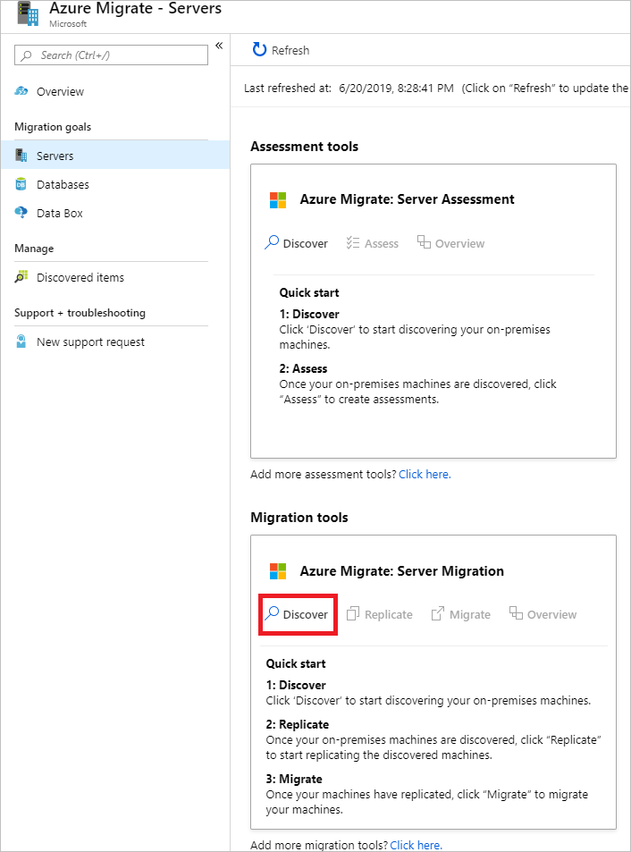
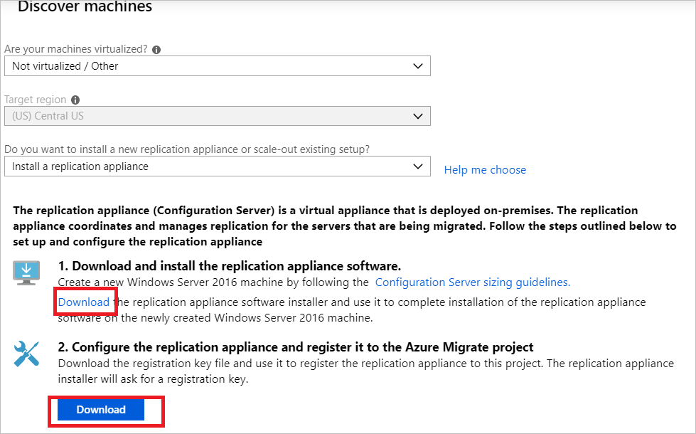
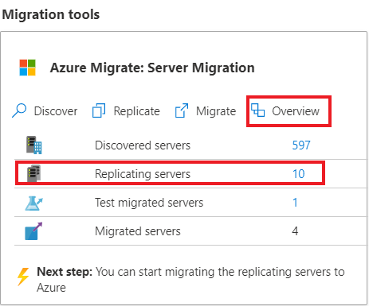
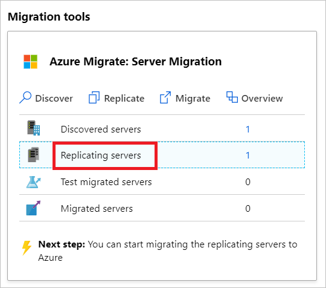

# Migrate machines as physical servers to Azure

This article shows you how to migrate machines as physical servers to Azure, using the Azure Migrate: Server Migration tool. Migrating machines by treating them as physical servers is useful in a number of scenarios:

- Migrate on-premises physical servers.
- Migrate VMs virtualized by platforms such as Xen, KVM.
- Migrate Hyper-V or VMware VMs, if for some reason you're unable to use the standard migration process for [Hyper-V](tutorial-migrate-hyper-v.md), or [VMware](server-migrate-overview.md) migration.
- Migrate VMs running in private clouds.
- Migrate VMs running in public clouds such as Amazon Web Services (AWS) or Google Cloud Platform (GCP).


This tutorial is the third in a series that demonstrates how to assess and migrate physical servers to Azure. In this tutorial, you learn how to:

> [!div class="checklist"]
> * Prepare to use Azure with Azure Migrate: Server Migration.
> * Check requirements for machines you want to migrate, and prepare a machine for the Azure Migrate replication appliance that's used to discover and migrate machines to Azure.
> * Add the Azure Migrate: Server Migration tool in the Azure Migrate hub.
> * Set up the replication appliance.
> * Install the Mobility service on machines you want to migrate.
> * Enable replication.
> * Run a test migration to make sure everything's working as expected.
> * Run a full migration to Azure.

> [!NOTE]
> Tutorials show you the simplest deployment path for a scenario so that you can quickly set up a proof-of-concept. Tutorials use default options where possible, and don't show all possible settings and paths. For detailed instructions, review the How-tos for Azure Migrate.

If you don't have an Azure subscription, create a [free account](https://azure.microsoft.com/pricing/free-trial/) before you begin.


## Prerequisites

Before you begin this tutorial, you should:

[Review](./agent-based-migration-architecture.md) the migration architecture.

## Prepare Azure

Prepare Azure for migration with Azure Migrate: Server Migration.

**Task** | **Details**
--- | ---
**Create an Azure Migrate project** | Your Azure account needs Contributor or Owner permissions to [create a new project](./create-manage-projects.md).
**Verify permissions for your Azure account** | Your Azure account needs permissions to create a VM, and write to an Azure managed disk.


### Assign permissions to create project

1. In the Azure portal, open the subscription, and select **Access control (IAM)**.
2. In **Check access**, find the relevant account, and click it to view permissions.
3. You should have **Contributor** or **Owner** permissions.
    - If you just created a free Azure account, you're the owner of your subscription.
    - If you're not the subscription owner, work with the owner to assign the role.


### Assign Azure account permissions

Assign the Virtual Machine Contributor role to the Azure account. This provides permissions to:

- Create a VM in the selected resource group.
- Create a VM in the selected virtual network.
- Write to an Azure managed disk.

### Create an Azure network
> [!IMPORTANT]
> Virtual Networks (VNets) are a regional service, so make sure you create your VNet in the desired target Azure Region. For example: if you are planning on replicating and migrating Virtual Machines from your On-Premises environment to the East US Azure Region, then your target VNet **must be created** in the East US Region. To connect VNets in different regions refer to the [Virtual network peering](https://docs.microsoft.com/en-us/azure/virtual-network/virtual-network-peering-overview) guide.

[Set up](../virtual-network/manage-virtual-network.md#create-a-virtual-network) an Azure virtual network (VNet). When you replicate to Azure, Azure VMs are created and joined to the Azure VNet that you specify when you set up migration.

## Prepare for migration

To prepare for physical server migration, you need to verify the physical server settings, and prepare to deploy a replication appliance.

### Check machine requirements for migration

Make sure machines comply with requirements for migration to Azure.

> [!NOTE]
> When migrating physical machines, Azure Migrate: Server Migration uses the same replication architecture as agent-based disaster recovery in the Azure Site Recovery service, and some components share the same code base. Some content might link to Site Recovery documentation.

1. [Verify](migrate-support-matrix-physical-migration.md#physical-server-requirements) physical server requirements.
2. Verify that on-premises machines that you replicate to Azure comply with [Azure VM requirements](migrate-support-matrix-physical-migration.md#azure-vm-requirements).
3. There are some changes needed on VMs before you migrate them to Azure.
    - For some operating systems, Azure Migrate makes these changes automatically.
    - It's important to make these changes before you begin migration. If you migrate the VM before you make the change, the VM might not boot up in Azure.
Review [Windows](prepare-for-migration.md#windows-machines) and [Linux](prepare-for-migration.md#linux-machines) changes you need to make.

### Prepare a machine for the replication appliance

Azure Migrate: Server Migration uses a replication appliance to replicate machines to Azure. The replication appliance runs the following components.

- **Configuration server**: The configuration server coordinates communications between on-premises and Azure, and manages data replication.
- **Process server**: The process server acts as a replication gateway. It receives replication data; optimizes it with caching, compression, and encryption, and sends it to a cache storage account in Azure.

Prepare for appliance deployment as follows:

- You prepare a machine to host the replication appliance. [Review](migrate-replication-appliance.md#appliance-requirements) the machine requirements.
- The replication appliance uses MySQL. Review the [options](migrate-replication-appliance.md#mysql-installation) for installing MySQL on the appliance.
- Review the Azure URLs required for the replication appliance to access [public](migrate-replication-appliance.md#url-access) and [government](migrate-replication-appliance.md#azure-government-url-access) clouds.
- Review [port](migrate-replication-appliance.md#port-access) access requirements for the replication appliance.

> [!NOTE]
> The replication appliance shouldn't be installed on a source machine that you want to replicate or on the Azure Migrate discovery and assessment appliance you may have installed before.

## Set up the replication appliance

The first step of migration is to set up the replication appliance. To set up the appliance for physical server migration, you download the installer file for the appliance, and then run it on the [machine you prepared](#prepare-a-machine-for-the-replication-appliance). After installing the appliance, you register it with Azure Migrate: Server Migration.


### Download the replication appliance installer

1. In the Azure Migrate project > **Servers**, in **Azure Migrate: Server Migration**, click **Discover**.

    

2. In **Discover machines** > **Are your machines virtualized?**, click **Not virtualized/Other**.
3. In **Target region**, select the Azure region to which you want to migrate the machines.
4. Select **Confirm that the target region for migration is region-name**.
5. Click **Create resources**. This creates an Azure Site Recovery vault in the background.
    - If you've already set up migration with Azure Migrate: Server Migration, the target option can't be configured, since resources were set up previously.    
    - You can't change the target region for this project after clicking this button.
    - All subsequent migrations are to this region.
    > [!NOTE]
    > If you selected private endpoint as the connectivity method for the Azure Migrate project when it was created, the Recovery Services vault will also be configured for private endpoint connectivity. Ensure that the private endpoints are reachable from the replication appliance. [**Learn more**](troubleshoot-network-connectivity.md)

6. In **Do you want to install a new replication appliance?**, select **Install a replication appliance**.
7. In **Download and install the replication appliance software**, download the appliance installer, and the registration key. You need to the key in order to register the appliance. The key is valid for five days after it's downloaded.

    

8. Copy the appliance setup file and key file to the Windows Server 2016 machine you created for the appliance.

9. After the installation completes, the Appliance configuration wizard will be launched automatically (You can also launch the wizard manually by using the cspsconfigtool shortcut that is created on the desktop of the appliance). In this tutorial, we'll be manually installing the Mobility Service on source VMs to be replicated, so create a dummy account in this step and proceed. You can provide the following details for creating the dummy account - "guest" as the friendly name, "username" as the username, and "password" as the password for the account. You will be using this dummy account in the Enable Replication stage.

10. After the appliance has restarted after setup, in **Discover machines**, select the new appliance in **Select Configuration Server**, and click **Finalize registration**. Finalize registration performs a couple of final tasks to prepare the replication appliance.

    

It may take some time after finalizing registration until discovered machines appear in Azure Migrate: Server Migration. As VMs are discovered, the **Discovered servers** count rises.


## Install the Mobility service

On machines you want to migrate, you need to install the Mobility service agent. The agent installers are available on the replication appliance. You find the right installer, and install the agent on each machine you want to migrate. Do this as follows:

1. Sign in to the replication appliance.
2. Navigate to **%ProgramData%\ASR\home\svsystems\pushinstallsvc\repository**.
3. Find the installer for the machine operating system and version. Review [supported operating systems](../site-recovery/vmware-physical-azure-support-matrix.md#replicated-machines).
4. Copy the installer file to the machine you want to migrate.
5. Make sure that you have the passphrase that was generated when you deployed the appliance.
    - Store the file in a temporary text file on the machine.
    - You can obtain the passphrase on the replication appliance. From the command line, run **C:\ProgramData\ASR\home\svsystems\bin\genpassphrase.exe -v** to view the current passphrase.
    - Don't regenerate the passphrase. This will break connectivity and you will have to reregister the replication appliance.

> [!NOTE]
> In the */Platform* parameter, you specify *VMware* if you migrate VMware VMs, or physical machines.

### Install on Windows

1. Extract the contents of installer file to a local folder (for example C:\Temp) on the machine, as follows:

    ```
    ren Microsoft-ASR_UA*Windows*release.exe MobilityServiceInstaller.exe
    MobilityServiceInstaller.exe /q /x:C:\Temp\Extracted
    cd C:\Temp\Extracted
    ```
2. Run the Mobility Service Installer:
    ```
   UnifiedAgent.exe /Role "MS" /Platform "VmWare" /Silent
    ```
3. Register the agent with the replication appliance:
    ```
    cd C:\Program Files (x86)\Microsoft Azure Site Recovery\agent
    UnifiedAgentConfigurator.exe  /CSEndPoint <replication appliance IP address> /PassphraseFilePath <Passphrase File Path>
    ```

### Install on Linux

1. Extract the contents of the installer tarball to a local folder (for example /tmp/MobSvcInstaller) on the machine, as follows:
    ```
    mkdir /tmp/MobSvcInstaller
    tar -C /tmp/MobSvcInstaller -xvf <Installer tarball>
    cd /tmp/MobSvcInstaller
    ```
2. Run the installer script:
    ```
    sudo ./install -r MS -v VmWare -q
    ```
3. Register the agent with the replication appliance:
    ```
    /usr/local/ASR/Vx/bin/UnifiedAgentConfigurator.sh -i <replication appliance IP address> -P <Passphrase File Path>
    ```

## Replicate machines

Now, select machines for migration.

> [!NOTE]
> You can replicate up to 10 machines together. If you need to replicate more, then replicate them simultaneously in batches of 10.

1. In the Azure Migrate project > **Servers**, **Azure Migrate: Server Migration**, click **Replicate**.

    :::image type="content" source="./media/tutorial-migrate-physical-virtual-machines/select-replicate.png" alt-text="Screenshot on selecting Replicate option.":::

2. In **Replicate**, > **Source settings** > **Are your machines virtualized?**, select **Not virtualized/Other**.
3. In **On-premises appliance**, select the name of the Azure Migrate appliance that you set up.
4. In **Process Server**, select the name of the replication appliance.
5. In **Guest credentials**, please select the dummy account created previously during the [replication installer setup](#download-the-replication-appliance-installer) to install the Mobility service manually (push install is not supported). Then click **Next: Virtual machines**.   

    :::image type="content" source="./media/tutorial-migrate-physical-virtual-machines/source-settings.png" alt-text="Screenshot on source settings.":::

6. In **Virtual Machines**, in **Import migration settings from an assessment?**, leave the default setting **No, I'll specify the migration settings manually**.
7. Check each VM you want to migrate. Then click **Next: Target settings**.

    :::image type="content" source="./media/tutorial-migrate-physical-virtual-machines/select-vms-inline.png" alt-text="Screenshot on selecting VMs." lightbox="./media/tutorial-migrate-physical-virtual-machines/select-vms-expanded.png":::


8. In **Target settings**, select the subscription, and target region to which you'll migrate, and specify the resource group in which the Azure VMs will reside after migration.
9. In **Virtual Network**, select the Azure VNet/subnet to which the Azure VMs will be joined after migration.   
10. In  **Cache storage account**, keep the default option to use the cache storage account that is automatically created for the project. Use the drop down if you'd like to specify a different storage account to use as the cache storage account for replication. <br/>
    >[!NOTE]
    > - If you selected private endpoint as the connectivity method for the Azure Migrate project, grant the Recovery Services vault access to the cache storage account. [**Learn more**](migrate-servers-to-azure-using-private-link.md#grant-access-permissions-to-the-recovery-services-vault)
    > - To replicate using ExpressRoute with private peering, create a private endpoint for the cache storage account. [**Learn more**](migrate-servers-to-azure-using-private-link.md#create-a-private-endpoint-for-the-storage-account-1)

11. In **Availability options**, select:
    -  Availability Zone to pin the migrated machine to a specific Availability Zone in the region. Use this option to distribute servers that form a multi-node application tier across Availability Zones. If you select this option, you'll need to specify the Availability Zone to use for each of the selected machine in the Compute tab. This option is only available if the target region selected for the migration supports Availability Zones
    -  Availability Set to place the migrated machine in an Availability Set. The target Resource Group that was selected must have one or more availability sets in order to use this option.
    - No infrastructure redundancy required option if you don't need either of these availability configurations for the migrated machines.

12. In **Disk encryption type**, select:
    - Encryption-at-rest with platform-managed key
    - Encryption-at-rest with customer-managed key
    - Double encryption with platform-managed and customer-managed keys

   > [!NOTE]
   > To replicate VMs with CMK, you'll need to [create a disk encryption set](../virtual-machines/disks-enable-customer-managed-keys-portal.md#set-up-your-disk-encryption-set) under the target Resource Group. A disk encryption set object maps Managed Disks to a Key Vault that contains the CMK to use for SSE.

13. In **Azure Hybrid Benefit**:

    - Select **No** if you don't want to apply Azure Hybrid Benefit. Then click **Next**.
    - Select **Yes** if you have Windows Server machines that are covered with active Software Assurance or Windows Server subscriptions, and you want to apply the benefit to the machines you're migrating. Then click **Next**.

    :::image type="content" source="./media/tutorial-migrate-physical-virtual-machines/target-settings.png" alt-text="Screenshot on target settings.":::

14. In **Compute**, review the VM name, size, OS disk type, and availability configuration (if selected in the previous step). VMs must conform with [Azure requirements](migrate-support-matrix-physical-migration.md#azure-vm-requirements).

    - **VM size**: If you're using assessment recommendations, the VM size dropdown shows the recommended size. Otherwise Azure Migrate picks a size based on the closest match in the Azure subscription. Alternatively, pick a manual size in **Azure VM size**.
    - **OS disk**: Specify the OS (boot) disk for the VM. The OS disk is the disk that has the operating system bootloader and installer.
    - **Availability Zone**: Specify the Availability Zone to use.
    - **Availability Set**: Specify the Availability Set to use.

15. In **Disks**, specify whether the VM disks should be replicated to Azure, and select the disk type (standard SSD/HDD or premium managed disks) in Azure. Then click **Next**.
    - You can exclude disks from replication.
    - If you exclude disks, won't be present on the Azure VM after migration.

    :::image type="content" source="./media/tutorial-migrate-physical-virtual-machines/disks-inline.png" alt-text="Screenshot shows the Disks tab of the Replicate dialog box." lightbox="./media/tutorial-migrate-physical-virtual-machines/disks-expanded.png":::

16. In **Tags**, choose to add tags to your Virtual machines, Disks, and NICs.

    :::image type="content" source="./media/tutorial-migrate-physical-virtual-machines/tags-inline.png" alt-text="Screenshot shows the tags tab of the Replicate dialog box." lightbox="./media/tutorial-migrate-physical-virtual-machines/tags-expanded.png":::


17. In **Review and start replication**, review the settings, and click **Replicate** to start the initial replication for the servers.

> [!NOTE]
> You can update replication settings any time before replication starts, **Manage** > **Replicating machines**. Settings can't be changed after replication starts.

## Track and monitor

- When you click **Replicate** a Start Replication job begins.
- When the Start Replication job finishes successfully, the machines begin their initial replication to Azure.
- After initial replication finishes, delta replication begins. Incremental changes to on-premises disks are periodically replicated to the replica disks in Azure.


You can track job status in the portal notifications.

You can monitor replication status by clicking on **Replicating servers** in **Azure Migrate: Server Migration**.


## Run a test migration


When delta replication begins, you can run a test migration for the VMs, before running a full migration to Azure. We highly recommend that you do this at least once for each machine, before you migrate it.

- Running a test migration checks that migration will work as expected, without impacting the on-premises machines, which remain operational, and continue replicating.
- Test migration simulates the migration by creating an Azure VM using replicated data (usually migrating to a non-production VNet in your Azure subscription).
- You can use the replicated test Azure VM to validate the migration, perform app testing, and address any issues before full migration.

Do a test migration as follows:


1. In **Migration goals** > **Servers** > **Azure Migrate: Server Migration**, click **Test migrated servers**.

    :::image type="content" source="./media/tutorial-migrate-physical-virtual-machines/test-migrated-servers.png" alt-text="Screenshot of Test migrated servers.":::

2. Right-click the VM to test, and click **Test migrate**.

    :::image type="content" source="./media/tutorial-migrate-physical-virtual-machines/test-migrate-inline.png" alt-text="Screenshot showing the result after clicking test migration." lightbox="./media/tutorial-migrate-physical-virtual-machines/test-migrate-expanded.png":::
 
3. In **Test Migration**, select the Azure VNet in which the Azure VM will be located after the migration. We recommend you use a non-production VNet.
4. The **Test migration** job starts. Monitor the job in the portal notifications.
5. After the migration finishes, view the migrated Azure VM in **Virtual Machines** in the Azure portal. The machine name has a suffix **-Test**.
6. After the test is done, right-click the Azure VM in **Replicating machines**, and click **Clean up test migration**.

    :::image type="content" source="./media/tutorial-migrate-physical-virtual-machines/clean-up-inline.png" alt-text="Screenshot of Clean up migration." lightbox="./media/tutorial-migrate-physical-virtual-machines/clean-up-expanded.png":::

    > [!NOTE]
    > You can now register your servers running SQL server with SQL VM RP to take advantage of automated patching, automated backup and simplified license management using SQL IaaS Agent Extension.
    >- Select **Manage** > **Replicating servers** > **Machine containing SQL server** > **Compute and Network** and select **yes** to register with SQL VM RP.
    >- Select Azure Hybrid benefit for SQL Server if you have SQL Server instances that are covered with active Software Assurance or SQL Server subscriptions and you want to apply the benefit to the machines you're migrating.hs.

## Migrate VMs

After you've verified that the test migration works as expected, you can migrate the on-premises machines.

1. In the Azure Migrate project > **Servers** > **Azure Migrate: Server Migration**, click **Replicating servers**.

    

2. In **Replicating machines**, right-click the VM > **Migrate**.
3. In **Migrate** > **Shut down virtual machines and perform a planned migration with no data loss**, select **No** > **OK**.

    > [!NOTE]
    > For minimal data loss, the recommendation is to bring the application down manually as part of the migration window (don't let the applications accept any connections) and then initiate the migration. The server needs to be kept running, so remaining changes can be synchronized before the migration is completed.

4. A migration job starts for the VM. Track the job in Azure notifications.
5. After the job finishes, you can view and manage the VM from the **Virtual Machines** page.

## Complete the migration

1. After the migration is done, right-click the VM > **Stop replication**. This does the following:
    - Stops replication for the on-premises machine.
    - Removes the machine from the **Replicating servers** count in Azure Migrate: Server Migration.
    - Cleans up replication state information for the machine.
1. Verify and [troubleshoot any Windows activation issues on the Azure VM.](/troubleshoot/azure/virtual-machines/troubleshoot-activation-problems) 
1. Perform any post-migration app tweaks, such as updating host names, database connection strings, and web server configurations.
1. Perform final application and migration acceptance testing on the migrated application now running in Azure.
1. Cut over traffic to the migrated Azure VM instance.
1. Remove the on-premises VMs from your local VM inventory.
1. Remove the on-premises VMs from local backups.
1. Update any internal documentation to show the new location and IP address of the Azure VMs.

## Post-migration best practices

- For increased resilience:
    - Keep data secure by backing up Azure VMs using the Azure Backup service. [Learn more](../backup/quick-backup-vm-portal.md).
    - Keep workloads running and continuously available by replicating Azure VMs to a secondary region with Site Recovery. [Learn more](../site-recovery/azure-to-azure-tutorial-enable-replication.md).
- For increased security:
    - Lock down and limit inbound traffic access with [Microsoft Defender for Cloud - Just in time administration](../security-center/security-center-just-in-time.md).
    - Restrict network traffic to management endpoints with [Network Security Groups](../virtual-network/network-security-groups-overview.md).
    - Deploy [Azure Disk Encryption](../security/fundamentals/azure-disk-encryption-vms-vmss.md) to help secure disks, and keep data safe from theft and unauthorized access.
    - Read more about [securing IaaS resources](https://azure.microsoft.com/services/virtual-machines/secure-well-managed-iaas/), and visit the [Microsoft Defender for Cloud](https://azure.microsoft.com/services/security-center/).
- For monitoring and management:
    - Consider deploying [Azure Cost Management](../cost-management-billing/cost-management-billing-overview.md) to monitor resource usage and spending.


## Next steps

Investigate the [cloud migration journey](/azure/architecture/cloud-adoption/getting-started/migrate) in the Azure Cloud Adoption Framework.
