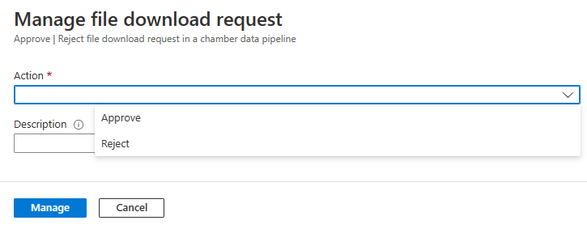

# Export data from an Azure Modeling and Simulation Workbench

<!--- SCREENSHOT OF CHAMBER --->

Azure Modeling and Simulation Workbench uses a two key approvals process to ensure optimal security and privacy when exporting data.  A Chamber Admin provides the first key approval.  A Workbench Owner provides the second key approval. 
This article explains the steps to export data from Azure Modeling and Simulation Workbench."

## Prerequisites

- An Azure account with an active subscription. [Create an account for free](https://azure.microsoft.com/free/?WT.mc_id=A261C142F).
- An instance of Modeling and Simulation Design Workbench installed with at least one chamber.
- A user who is a Workbench Owner (Subscription Owner/Contributor) and a user provisioned as a Chamber Admin or Chamber User.
- [AzCopy](/azure/storage/common/storage-ref-azcopy) installed on machine, with access to the configured network for the target chamber. Only machines that are on the specified network path for the chamber can export files.

## Sign in to Azure portal

Open your web browser and go to the [Azure portal](https://portal.azure.com/). Enter your credentials to sign in to the portal.

## Copy export file to data out folder

To export a file, first you need to copy the file to the data out folder in the data pipeline.

  > [!NOTE]
  > Supported filename characters are alphanumerics, underscores, periods, and hyphens.
  > Data pipeline will only process files in /mount/datapipeline/dataout.

1. Type *Modeling and Simulation Workbench* in the global search and select **Modeling and Simulation Workbench** under **Services**.

1. Select your Modeling and Simulation Workbench from the resource list.

1. Select **Chamber** in the left side menu. A resource list displays. Select the chamber you want to export data from.

1. Select **Connector** in the left side menu.  A resource list displays. Select the displayed connector.

1. Select the "Dashboard URL" link that should take you to the ETX dashboard.

1. Select an available workload and open a terminal session.

1. Copy the file you want to export to the data pipeline's data out folder: */mount/datapipeline/dataout.*

## Request to export the file

After the file is copied to the data out folder, a Chamber Admin completes the following steps to request to export the file.

1. Select **Data Pipeline > File** in the chamber you're exporting data from.

1. Select the file you want to export from the displayed resource list. Files are named *mount-datapipeline-datain-\<filename\>.*

1. Confirm the data pipeline direction in the File overview section is **outbound**. Then select **Request download.**

1. Enter a reason in the Description field and select **File Request.**

   > [!div class="mx-imgBorder"]
   > 

## Approve or reject an export request

The next phase, approving (or rejecting) the export request, is completed by the Workbench Owner.

1. Select **Data Pipeline > File Request** in the chamber you're exporting data from.

1. Select the file request you want to manage from the displayed resource list. In the File Request overview section, the status of the file request must display as **Requested** in order to approve it.

1. Select **Manage** in the File Request overview section.

1. Select **Approve** or **Reject** in the Action drop-down and enter a description in the Description field.

   > [!div class="mx-imgBorder"]
   > 

1. Select **Manage.**

1. The status of the file export request displays in the File Request overview section as either Approved or Rejected.  The status must show as **Approved** to enable users to download the file.

## Download approved export file from chamber

Complete the following steps to download an approved export file from a chamber.

1. Select **Data Pipeline > File Request** in the chamber you're exporting data from.

1. Select the approved file request you want to download from the displayed resource list. The status of the file request must display as **Approved** in order to download it.

1. Select the **Download URL** button in the file request overview section, and copy the displayed Download URL from the popup.

1. Using the AzCopy command, copy out your file. for example, `azcopy copy "<downloadURL>" <targetFilePath>`

  > [!IMPORTANT]
  >
  > If you're exporting multiple smaller files, it's recommended to zip or tarball them into a single file.
  >
  > GB sized tarballs/zipped files are supported, depending on your connection type and network speed.

## Next steps

Check out [Manage chamber storage](./how-to-guide-manage-storage.md) to learn how to manage chamber storage in Azure Modeling and Simulation Workbench.
