# Usage scenarios

Some of the insights you might want to gain after Traffic Analytics is fully configured, are as follows:

## Find traffic hotspots

**Look for**

- Which hosts, subnets, virtual networks, and virtual machine scale set are sending or receiving the most traffic, traversing maximum malicious traffic and blocking significant flows?
    - Check comparative chart for hosts, subnet, virtual network, and virtual machine scale set. Understanding, which hosts, subnets, virtual networks and virtual machine scale set are sending or receiving the most traffic can help you identify the hosts that are processing the most traffic, and whether the traffic distribution is done properly.
    - You can evaluate if the volume of traffic is appropriate for a host. Is the volume of traffic normal behavior, or does it merit further investigation?
- How much inbound/outbound traffic is there?
    -   Is the host expected to receive more inbound traffic than outbound, or vice-versa?
- Statistics of blocked traffic.
    - Why is a host blocking a significant volume of benign traffic? This behavior requires further investigation and probably optimization of configuration
- Statistics of malicious allowed/blocked traffic
  - Why is a host receiving malicious traffic and why are flows from malicious sources allowed? This behavior requires further investigation and probably optimization of configuration.

    Select **See all** under **IP** as shown in the following image:

    

    The following image shows time trending for the top five talking hosts and the flow-related details (allowed – inbound/outbound and denied - inbound/outbound flows) for a host:

	Select **See more** under **Details of top 5 talking IPs'** as shown in the following image to get insights about all the hosts:

    
	

**Look for**

- Which are the most conversing host pairs?
    - Expected behavior like front-end or back-end communication or irregular behavior, like back-end internet traffic.
- Statistics of allowed/blocked traffic
    - Why a host is allowing or blocking significant traffic volume
- Most frequently used application protocol among most conversing host pairs:
    - Are these applications allowed on this network?
    - Are the applications configured properly? Are they using the appropriate protocol for communication? Select **See all** under **Frequent conversation**, as show in the following image:

        

- The following image shows time trending for the top five conversations and the flow-related details such as allowed and denied inbound and outbound flows for a conversation pair:

    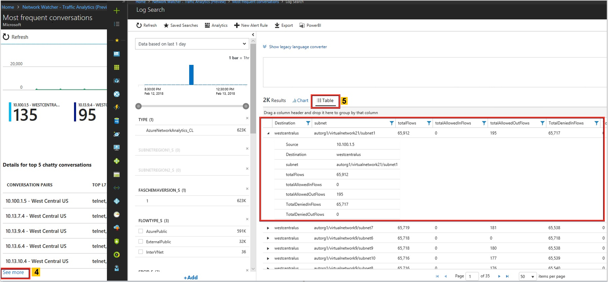

**Look for**

- Which application protocol is most used in your environment, and which conversing host pairs are using the application protocol the most?
    - Are these applications allowed on this network?
    - Are the applications configured properly? Are they using the appropriate protocol for communication? Expected behavior is common ports such as 80 and 443. For standard communication, if any unusual ports are displayed, they might require a configuration change. Select **See all** under **Application port**, in the following image:

        

- The following images show time trending for the top five L7 protocols and the flow-related details (for example, allowed and denied flows) for an L7 protocol:

    

    

**Look for**

- Capacity utilization trends of a VPN gateway in your environment.
    - Each VPN SKU allows a certain amount of bandwidth. Are the VPN gateways underutilized?
    - Are your gateways reaching capacity? Should you upgrade to the next higher SKU?
- Which are the most conversing hosts, via which VPN gateway, over which port?
    - Is this pattern normal? Select **See all** under **VPN gateway**, as shown in the following image:

        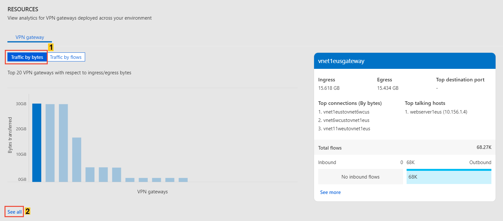

- The following image shows time trending for capacity utilization of an Azure VPN Gateway and the flow-related details (such as allowed flows and ports):

    

## Visualize traffic distribution by geography

**Look for**

- Traffic distribution per data center such as top sources of traffic to a datacenter, top rogue networks conversing with the data center, and top conversing application protocols.
  - If you observe more load on a data center, you can plan for efficient traffic distribution.
  - If rogue networks are conversing in the data center, then correct NSG rules to block them.

    Select **View map** under **Your environment**, as shown in the following image:

    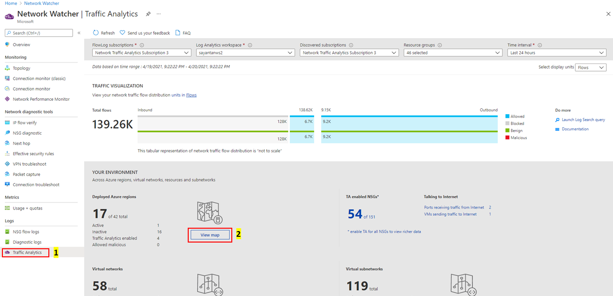

- The geo-map shows the top ribbon for selection of parameters such as data centers (Deployed/No-deployment/Active/Inactive/Traffic Analytics Enabled/Traffic Analytics Not Enabled) and countries/regions contributing Benign/Malicious traffic to the active deployment:

    

- The geo-map shows the traffic distribution to a data center from countries/regions and continents communicating to it in blue (Benign traffic) and red (malicious traffic) colored lines:

    

    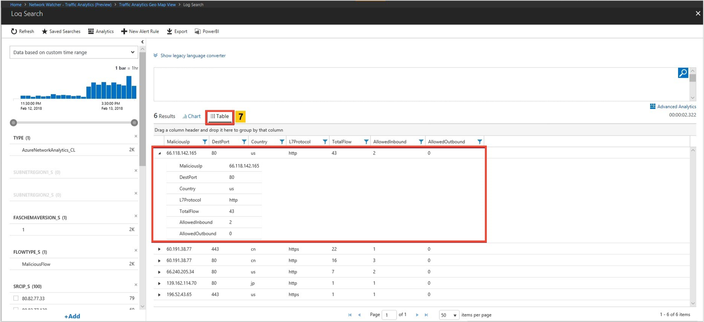
	
- The **More Insight** blade of an Azure region also shows the total traffic remaining inside that region (that is, source and destination in same region). It further gives insights about traffic exchanged between availability zones of a datacenter 

	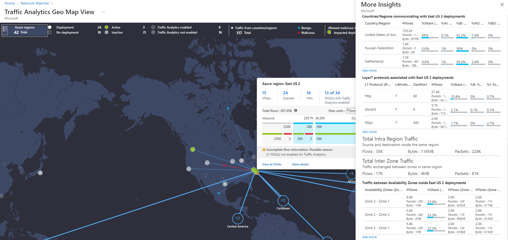

## Visualize traffic distribution by virtual networks

**Look for**

- Traffic distribution per virtual network, topology, top sources of traffic to the virtual network, top rogue networks conversing to the virtual network, and top conversing application protocols.
  - Knowing which virtual network is conversing to which virtual network. If the conversation is not expected, it can be corrected.
  - If rogue networks are conversing with a virtual network, you can correct NSG rules to block the rogue networks.
 
    Select **View VNets** under **Your environment** as shown in the following image:

    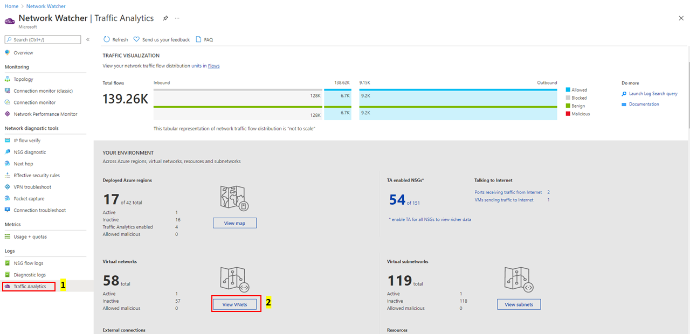

- The Virtual Network Topology shows the top ribbon for selection of parameters like a virtual network's (Inter virtual network Connections/Active/Inactive), External Connections, Active Flows, and Malicious flows of the virtual network.
- You can filter the Virtual Network Topology based on subscriptions, workspaces, resource groups and time interval. Extra filters that help you understand the flow are:
  Flow Type (InterVNet, IntraVNET, and so on), Flow Direction (Inbound, Outbound), Flow Status (Allowed, Blocked), VNETs (Targeted and Connected), Connection Type (Peering or Gateway - P2S and S2S), and NSG. Use these filters to focus on VNets that you want to examine in detail.
- You can zoom-in and zoom-out while viewing Virtual Network Topology using mouse scroll wheel. Left-click and moving the mouse lets you drag the topology in desired direction. You can also use keyboard shortcuts to achieve these actions: A (to drag left), D (to drag right), W (to drag up), S (to drag down), + (to zoom in), - (to zoom out), R (to zoom reset).
- The Virtual Network Topology shows the traffic distribution to a virtual network  to flows (Allowed/Blocked/Inbound/Outbound/Benign/Malicious), application protocol, and network security groups, for example:

    
    
    

    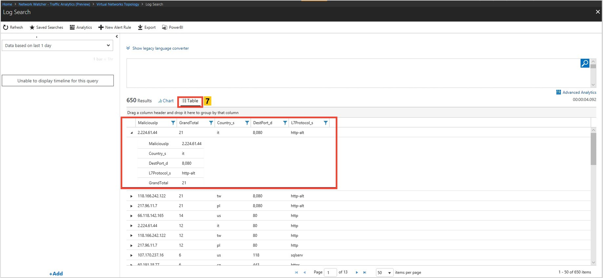

**Look for**

- Traffic distribution per subnet, topology, top sources of traffic to the subnet, top rogue networks conversing to the subnet, and top conversing application protocols.
    - Knowing which subnet is conversing to which subnet. If you see unexpected conversations, you can correct your configuration.
    - If rogue networks are conversing with a subnet, you are able to correct it by configuring NSG rules to block the rogue networks.
- The Subnets Topology shows the top ribbon for selection of parameters such as Active/Inactive subnet, External Connections, Active Flows, and Malicious flows of the subnet.
- You can zoom-in and zoom-out while viewing Virtual Network Topology using mouse scroll wheel. Left-click and moving the mouse lets you drag the topology in desired direction. You can also use keyboard shortcuts to achieve these actions: A (to drag left), D (to drag right), W (to drag up), S (to drag down), + (to zoom in), - (to zoom out), R (to zoom reset).
- The Subnet Topology shows the traffic distribution to a virtual network regarding flows (Allowed/Blocked/Inbound/Outbound/Benign/Malicious), application protocol, and NSGs, for example:

    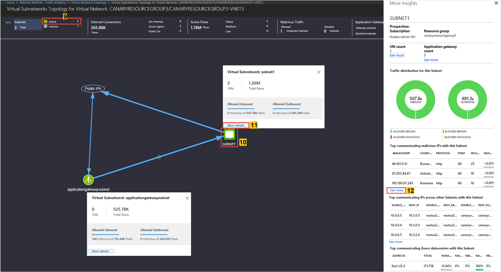

**Look for**

Traffic distribution per Application gateway & Load Balancer, topology, top sources of traffic, top rogue networks conversing to the Application gateway & Load Balancer, and top conversing application protocols. 
    
 - Knowing which subnet is conversing to which Application gateway or Load Balancer. If you observe unexpected conversations, you can correct your configuration.
 - If rogue networks are conversing with an Application gateway or Load Balancer, you are able to correct it by configuring NSG rules to block the rogue networks. 

    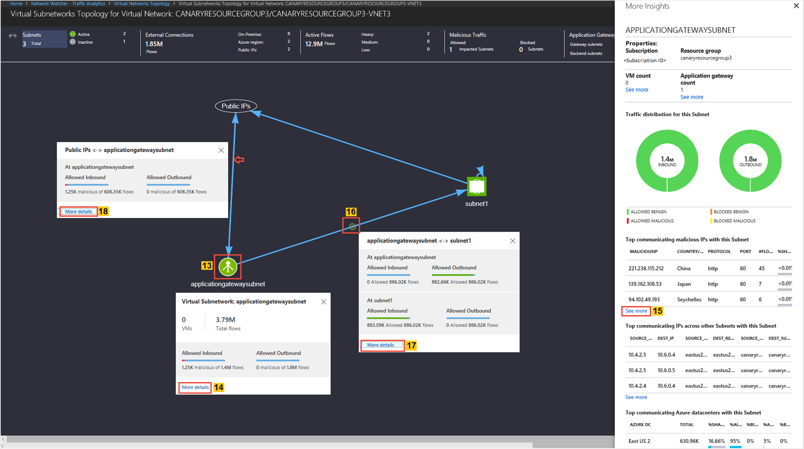

## View ports and virtual machines receiving traffic from the internet

**Look for**

- Which open ports are conversing over the internet?
  - If unexpected ports are found open, you can correct your configuration:

    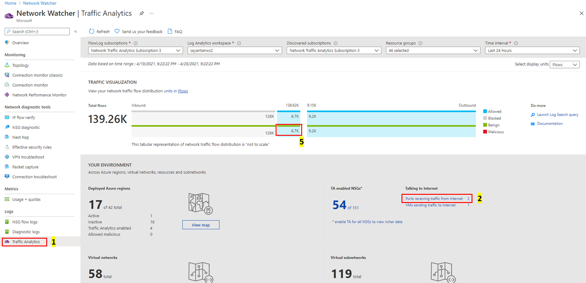

    

**Look for**

Do you have malicious traffic in your environment? Where is it originating from? Where is it destined to?

## View information about public IPs' interacting with your deployment

**Look for**

- Which public IPs' are conversing with my network? What is the WHOIS data and geographic location of all public IPs'?
- Which malicious IPs' are sending traffic to my deployments? What is the threat type and threat description for malicious IPs'?
	- The Public IP Information section, gives a summary of all types of public IPs' present in your network traffic. 
	  Select the public IP type of interest to view details. This [schema document](./traffic-analytics-schema.md#public-ip-details-schema) defines the data fields presented.
	  
	  :::image type="content" source="./media/traffic-analytics/public-ip-information.png" alt-text="Screenshot that displays the public I P information." lightbox="./media/traffic-analytics/public-ip-information.png":::
	  
	- On the traffic analytics dashboard, click on any IP to view its information	
	
	  :::image type="content" source="./media/traffic-analytics/external-public-ip-details.png" alt-text="Screenshot that displays the external I P information in tool tip." lightbox="./media/traffic-analytics/external-public-ip-details.png":::
	  
	  :::image type="content" source="./media/traffic-analytics/malicious-ip-details.png" alt-text="Screenshot that displays the malicious I P information in tool tip." lightbox="./media/traffic-analytics/malicious-ip-details.png":::

## Visualize the trends in NSG/NSG rules hits

**Look for**

- Which NSG/NSG rules have the most hits in comparative chart with flows distribution?
- What are the top source and destination conversation pairs per NSG/NSG rules?

    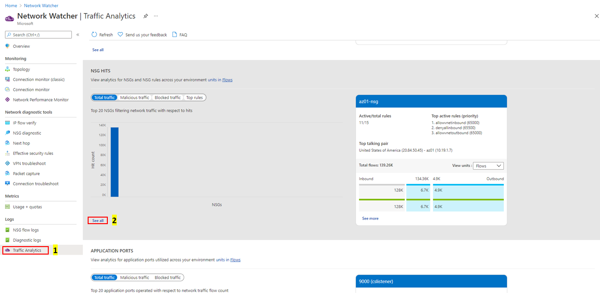

- The following images show time trending for hits of NSG rules and source-destination flow details for a network security group:

  - Quickly detect which NSGs and NSG rules are traversing malicious flows and which are the top malicious IP addresses accessing your cloud environment
  - Identify which NSG/NSG rules are allowing/blocking significant network traffic
  - Select top filters for granular inspection of an NSG or NSG rules

    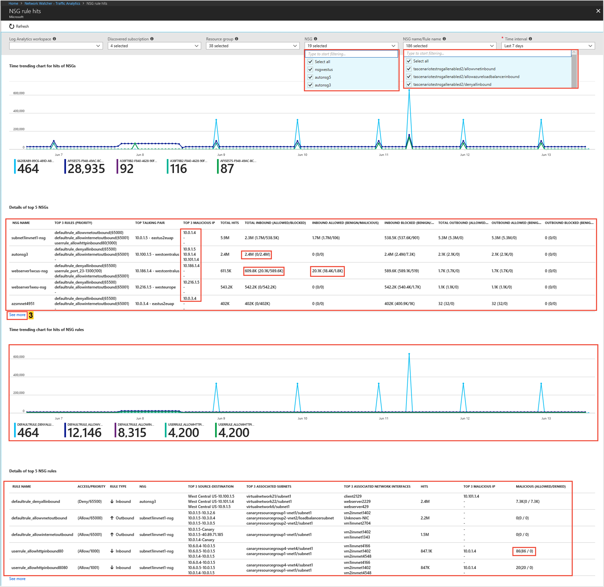

    
    