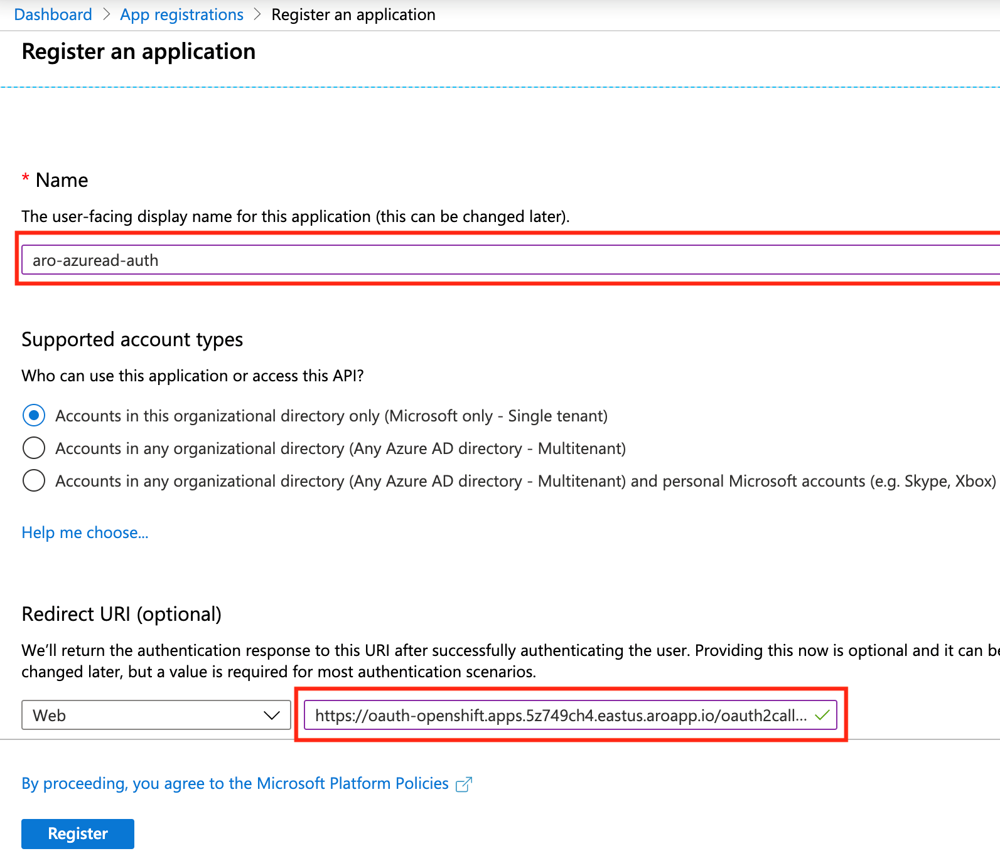
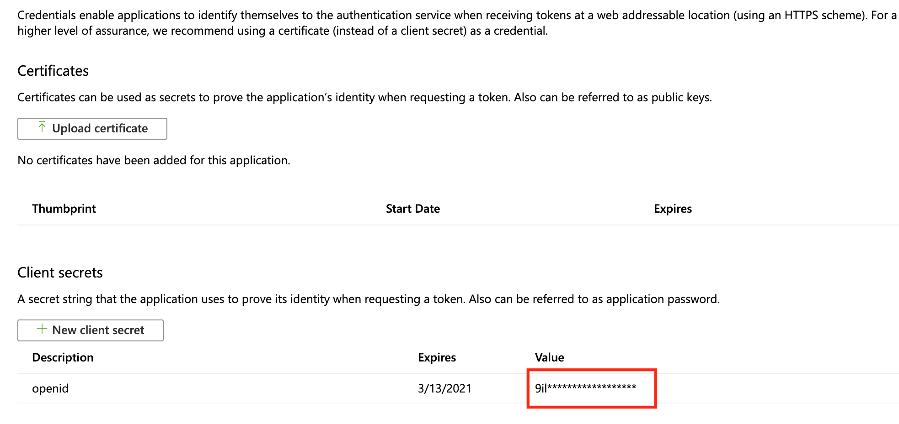
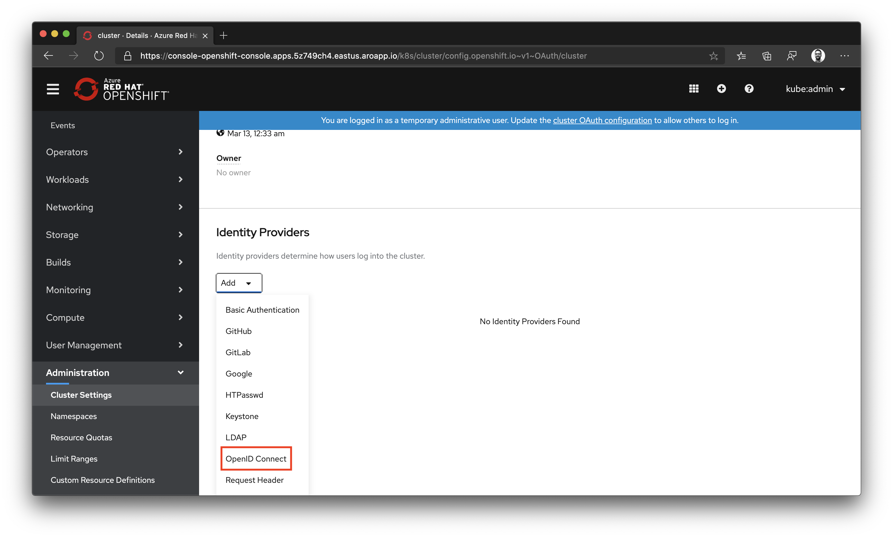
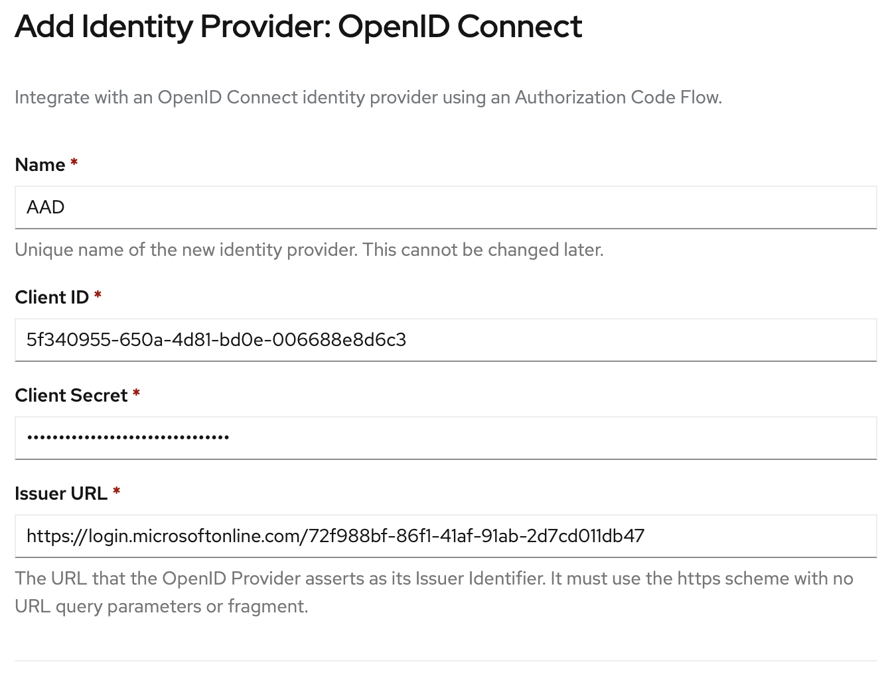
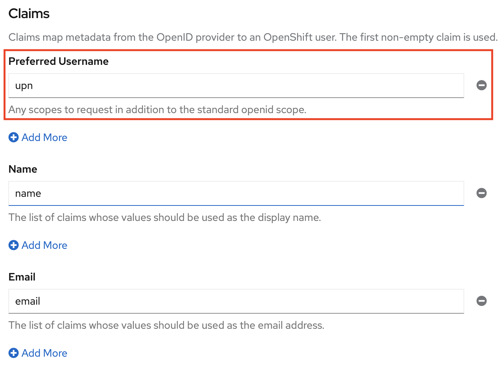
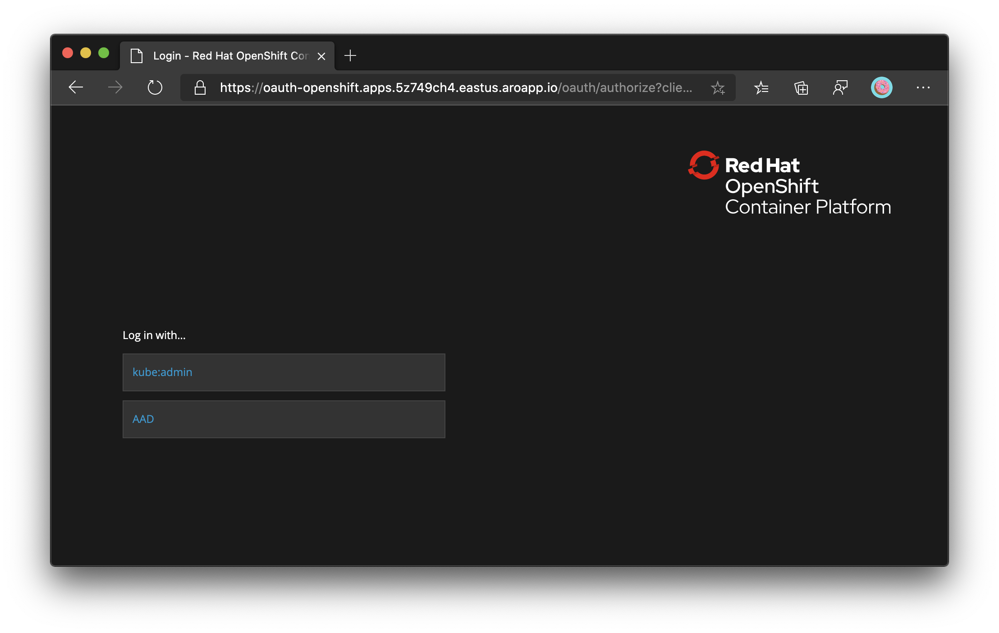

# Configure Microsoft Entra authentication for an Azure Red Hat OpenShift 4 cluster (Portal)

If you choose to install and use the CLI locally, this tutorial requires that you are running the Azure CLI version 2.6.0 or later. Run `az --version` to find the version. If you need to install or upgrade, see [Install Azure CLI](/cli/azure/install-azure-cli).

## Before you begin

Construct the cluster's **OAuth callback URL** and make note of it. Make sure to replace **aro-rg** with your resource group's name and **aro-cluster** with your cluster's name.

> [!NOTE]
> The `AAD` section in the OAuth callback URL should match the OAuth identity provider name you'll setup later.

```azurecli-interactive
domain=$(az aro show -g aro-rg -n aro-cluster --query clusterProfile.domain -o tsv)
location=$(az aro show -g aro-rg -n aro-cluster --query location -o tsv)
echo "OAuth callback URL: https://oauth-openshift.apps.$domain.$location.aroapp.io/oauth2callback/AAD"
```

<a name='create-an-azure-active-directory-application-for-authentication'></a>

## Create a Microsoft Entra application for authentication

Login to the Azure portal, and navigate to [App registrations blade](https://portal.azure.com/#blade/Microsoft_AAD_RegisteredApps/ApplicationsListBlade), then click on **New registration** to create a new application.

Provide a name for the application, for example **aro-azuread-auth**, and fill in the **Redirect URI** using the value of the OAuth callback URL you retrieved earlier.



Navigate to **Certificates & secrets** and click on **New client secret** and fill in the details. Make note of the key value, as you'll use it in a later stage. You won't be able to retrieve it again.



Navigate to the **Overview** and make note of the **Application (client) ID** and **Directory (tenant) ID**. You'll need them in a later stage.


## Configure optional claims

Application developers can use [optional claims](../active-directory/develop/active-directory-optional-claims.md) in their Microsoft Entra applications to specify which claims they want in tokens sent to their application.

You can use optional claims to:

* Select additional claims to include in tokens for your application.
* Change the behavior of certain claims that Microsoft Entra ID returns in tokens.
* Add and access custom claims for your application.

We'll configure OpenShift to use the `email` claim and fall back to `upn` to set the Preferred Username by adding the `upn` as part of the ID token returned by Microsoft Entra ID.

Navigate to **Token configuration** and click on **Add optional claim**. Select **ID** then check the **email** and **upn** claims.


## Assign users and groups to the cluster (optional)

Applications registered in a Microsoft Entra tenant are, by default, available to all users of the tenant who authenticate successfully. Microsoft Entra ID allows tenant administrators and developers to restrict an app to a specific set of users or security groups in the tenant.

Follow the instructions on the Microsoft Entra documentation to [assign users and groups to the app](../active-directory/develop/howto-restrict-your-app-to-a-set-of-users.md).

## Configure OpenShift OpenID authentication

Retrieve the `kubeadmin` credentials. Run the following command to find the password for the `kubeadmin` user.

```azurecli-interactive
az aro list-credentials \
  --name aro-cluster \
  --resource-group aro-rg
```

The following example output shows the password will be in `kubeadminPassword`.

```json
{
  "kubeadminPassword": "<generated password>",
  "kubeadminUsername": "kubeadmin"
}
```

You can find the cluster console URL by running the following command, which will look like `https://console-openshift-console.apps.<random>.<region>.aroapp.io/`

```azurecli-interactive
 az aro show \
    --name aro-cluster \
    --resource-group aro-rg \
    --query "consoleProfile.url" -o tsv
```

Launch the console URL in a browser and login using the `kubeadmin` credentials.

Navigate to **Administration**, click on **Cluster Settings**, then select the **Configuration** tab. Scroll to select **OAuth**.

Scroll down to select **Add** under **Identity Providers** and select **OpenID Connect**.


Fill in the name as **Microsoft Entra ID**, the **Client ID** as the **Application ID** and the **Client Secret**. The **Issuer URL** is formatted as such: `https://login.microsoftonline.com/xxxxxxxx-xxxx-xxxx-xxxx-xxxxxxxxxxxx/v2.0`. Replace the placeholder with the Tenant ID you retrieved earlier.



Scroll down to the **Claims** section and update the **Preferred Username** to use the value from the **upn** claim.



<a name='verify-login-through-azure-active-directory'></a>

## Verify login through Microsoft Entra ID

If you now logout of the OpenShift Web Console and try to login again, you'll be presented with a new option to login with **Microsoft Entra ID**. You may need to wait for a few minutes.




> [!NOTE]
> If you encounter the error like "AADSTS50011: The redirect URI https://oauth-openshift.apps.xxxxxxxxxx.xxxxxxx.aroapp.io/oauth2callback/xxxx specified in the request does not match the redirect URIs configured", you can follow the troubleshooting guide [Azure AD (OIDC) login failed when Redirect URI is not set correctly](https://access.redhat.com/solutions/7016893) to solve the issue.  
