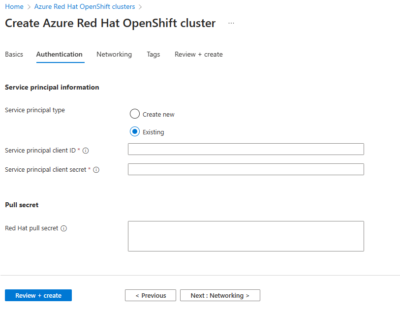

# Create and use a service principal with an Azure Red Hat OpenShift cluster 

To interact with Azure APIs, an Azure Red Hat OpenShift cluster requires an Azure Active Directory (AD) service principal. This service principal is used to dynamically create and manage other Azure resources, such as an Azure load balancer or an Azure Container Registry (ACR). For more information, see [Application and service principal objects in Azure Active Directory](../active-directory/develop/app-objects-and-service-principals.md).

This article explains how to create and use a service principal for your Azure Red Hat OpenShift clusters using the Azure command-line interface (Azure CLI) or the Azure portal.

## Before you begin 

To create an Azure AD service principal, you must have permissions to register an application with your Azure AD tenant and to assign the application to a role in your subscription. You need **User Access Administrator** and **Contributor** permissions at the resource-group level to create service principals.

Use the following Azure CLI command to add these permissions.

```azurecli-interactive
az role assignment create \
    --role 'User Access Administrator' \
    --assignee-object-id $SP_OBJECT_ID \m 
    --resource-group $RESOURCEGROUP \
    --assignee-principal-type 'ServicePrincipal'

az role assignment create \
    --role 'Contributor' \
    --assignee-object-id $SP_OBJECT_ID \
    --resource-group $RESOURCEGROUP \
    --assignee-principal-type 'ServicePrincipal'
```

If you don't have the required permissions, you can ask your Azure AD or subscription administrator to assign them. Alternatively, your Azure AD or subscription administrator can create a service principal in advance for you to use with the Azure Red Hat OpenShift cluster. 

If you're using a service principal from a different Azure AD tenant, there are additional considerations regarding the permissions available when you deploy the cluster. For example, you may not have the appropriate permissions to read and write directory information. 

For more information on user roles and permissions, see [What are the default user permissions in Azure Active Directory?](../active-directory/fundamentals/users-default-permissions.md).

> [!NOTE]
> Service principals expire in one year unless configured for longer periods. For information on extending your service principal expiration period, see [What are the default user permissions in Azure Active Directory?](/cli/azure/ad/sp/credential.md?view=azure-cli-latest#az-ad-sp-credential-reset).

::: zone pivot="aro-azurecli"

## Create a service principal with Azure CLI

The following sections explain how to use the Azure CLI to create a service principal for your Azure Red Hat OpenShift cluster.

## Prerequisite

If you’re using the Azure CLI, you’ll need Azure CLI version 2.0.59 or later installed and configured. Run `az --version` to find the version. If you need to install or upgrade, see [Install Azure CLI](/cli/azure/install-azure-cli).
 

## Create a service principal - Azure CLI

 To create a service principal with the Azure CLI, run the `az ad sp create-for-rbac` command. 

> [!NOTE]
> When using a service principal to create a new cluster, you may need to assign a Contributor role here. 

```azure-cli
az ad sp create-for-rbac --name myAROClusterServicePrincipal 
```

The output is similar to the following example.

```
{ 

  "appId": "<appId.", 

  "displayName": "myAROClusterServicePrincipal", 

  "name": "http://myAROClusterServicePrincipal", 

  "password": "\<password>", 

  "tenant": "\<tenant-id>" 

} 
```

Retain your `appId` and `password`. These values are used when you create an Azure Red Hat OpenShift cluster in the next section. 

## Use the service principal - Azure CLI

To use an existing service principal when you create an Azure Red Hat OpenShift cluster using the `az aro create` command, use the `--service-principal` and `--client-secret` parameters to specify the appId and password from the output of the `az ad sp create-for-rbac` command: 

```azure-cli 
az aro create \ 

    --resource-group myResourceGroup \ 

    --name myAROCluster \ 

    --service-principal <appId> \ 

    --client-secret <password> 
```

> [!IMPORTANT] 
> If you're using an existing service principal with a customized secret, ensure the secret doesn't exceed 190 bytes. 

::: zone-end

::: zone pivot="aro-azureportal"

## Create a service principal with the Azure portal

The following sections explain how to use the Azure portal to create a service principal for your Azure Red Hat OpenShift cluster.

## Create a service principal - Azure portal

To create a service principal, see [Create an Azure AD app and service principal in the portal](../active-directory/develop/howto-create-service-principal-portal.md).

## Use the service principal - Azure portal

If you deploy an AKS cluster using the Azure portal, on the **Authentication** page of the **Create Kubernetes cluster** dialog, choose to **Configure service principal**. Select **Use existing**, and specify the following values. 

- **Service principal client ID** is your appId. 
- **Service principal client secret** is the decrypted Secret value. 

[ ](./media/openshift-service-principal-portal.png/#lightbox)

::: zone-end