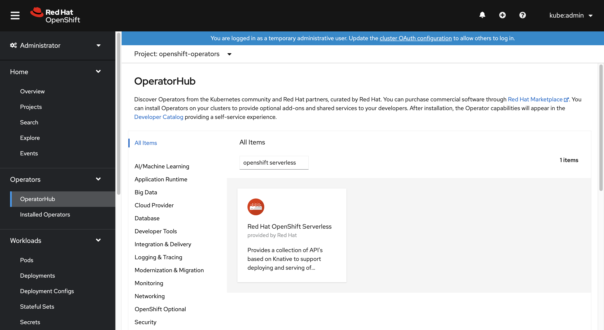
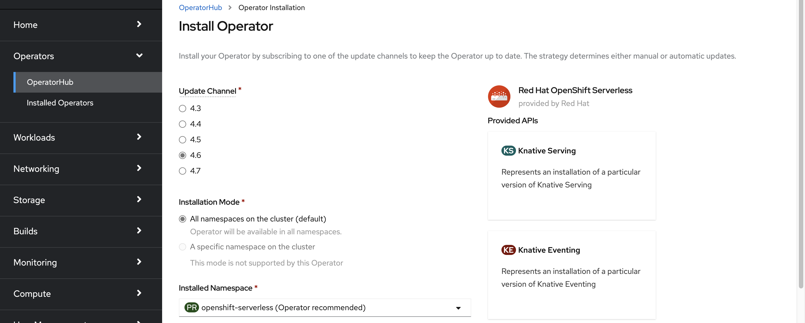
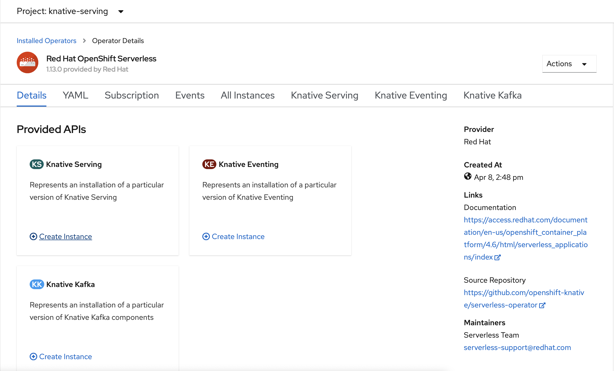
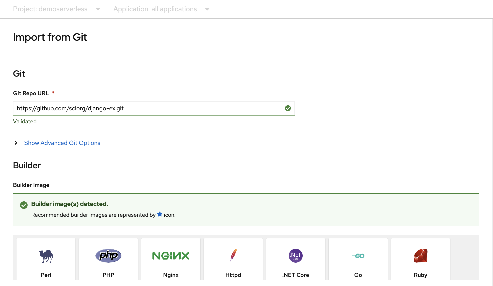
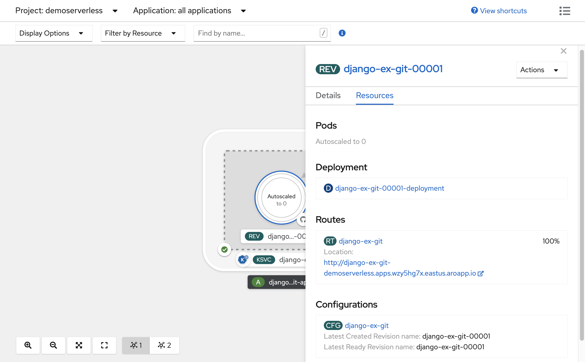
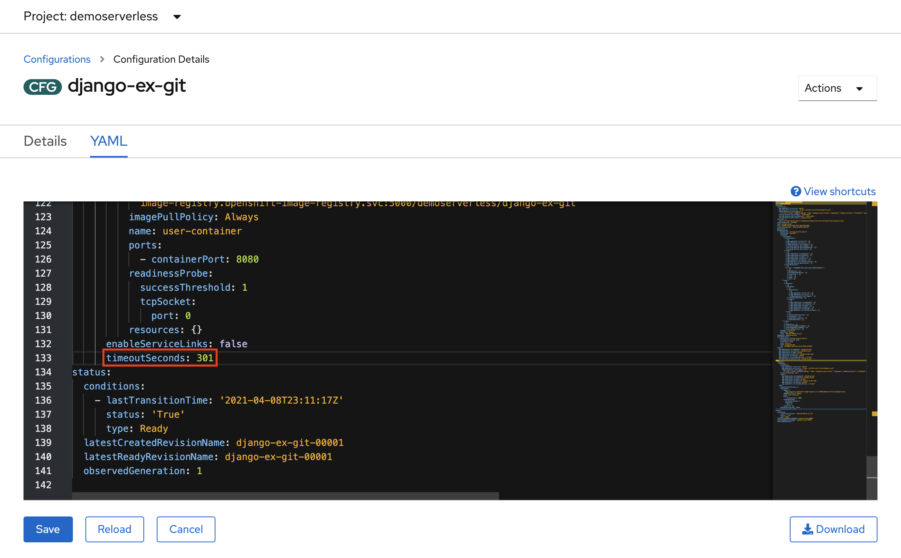

# Deploy applications to Azure Red Hat OpenShift using OpenShift Serverless

In this article, you'll deploy an application to an Azure Red Hat OpenShift cluster with [OpenShift Serverless](https://www.openshift.com/learn/topics/serverless). OpenShift Serverless helps developers to deploy and run applications that'll scale up or scale to zero on-demand. This eliminates resource consumption when it's not in use.

Application code can be packaged in a container along with the appropriate runtimes. Serverless functionality will start the application containers when they are triggered by an event. You can trigger applications through various events: from your own applications, from multiple cloud service providers, software as a service (SaaS) systems and other services.

You can use built-in OpenShift interface features to manage all aspects of serverless container deployment. Developers can visually identify which events are driving the launch of containerized applications. There are also multiple ways to modify event parameters. OpenShift Serverless applications can be integrated with other OpenShift services, such as OpenShift Pipelines, Service Mesh, and Monitoring. This provides a complete serverless application development and deployment experience.

## Before you start

[!INCLUDE [aro-howto-beforeyoubegin](includes/aro-howto-before-you-begin.md)]

### Install the Knative command-line tool (kn)

Download the latest release of the CLI appropriate to your machine from <https://github.com/knative/client/releases/>

If you run commands on the Azure Cloud Shell, download the latest Knative CLI for Linux.

```azurecli-interactive
cd ~
wget https://github.com/knative/client/releases/download/v0.22.0/kn-linux-amd64

mkdir knative
chmod +x kn-linux-amd64
mv kn-linux-amd64 knative/kn
echo 'export PATH=$PATH:~/knative' >> ~/.bashrc && source ~/.bashrc
```

### Launch the OpenShift web console

Find your cluster web console URL by running:

```azurecli-interactive
 az aro show \
    --name <cluster name> \
    --resource-group <resource group> \
    --query "consoleProfile.url" -o tsv
```

You should get a URL similar to the following.

```output
https://console-openshift-console.apps.wzy5hg7x.eastus.aroapp.io/
```

Launch a web browser and open the console URL. Log in using the `kubeadmin` credentials.

:::image type="content" source="media/login.png" alt-text="A screenshot that shows the Azure Red Hat OpenShift log-in screen":::

## Install the OpenShift Serverless operator

When you're logged into the OpenShift web console, confirm that you're in *Administrator* view. Open the *Operator Hub* and select the **OpenShift Serverless** operator.



Next, open the operator installation page by selecting **Install**.


Choose the appropriate *Update Channel* for your Azure Red Hat OpenShift's cluster version and install the operator in the `openshift-serverless` namespace. Scroll down and select **Install**.



Within a few minutes, the status page reflects that the operator is installed and is ready for use. Select the **View Operator** button to proceed.


## Install Knative Serving

The option to run a container in a serverless fashion on OpenShift Serverless is possible by using upstream Knative. Knative extends Kubernetes to provide a set of components that deploy, run, and manage modern applications through its serverless methodology.

### Create an instance of the Knative Serving

In the upper-left corner of the window, in the **Project** list, select `knative-server`. Then in the **Provided APIs** pane, select **Create Instance** within the *Knative Serving* card.



On the *Create Knative Serving* page, Keep all of the default values. Scroll down and select the **Create** button.


OpenShift Serverless is installed when the *Status* column shows **Ready**. Now you're ready to create an OpenShift Serverless project.


## Create a serverless project

To create a new project called `demoserverless`, run the following command:

```azurecli-interactive
oc new-project demoserverless
```

The output should be similar to the following:

```output
Now using project "demoserverless" on server "https://api.wzy5hg7x.eastus.aroapp.io:6443".

You can add applications to this project with the 'new-app' command. For example, build a new example application in Python with the following:

    oc new-app django-psql-example

Or use kubectl to deploy a simple Kubernetes application:

    kubectl create deployment hello-node --image=gcr.io/hello-minikube-zero-install/hello-node
```

Let's switch from the Administrator perspective to the Developer perspective. Go to your list of projects in the left menu and select `demoserverless`. You are now at the **Topology** page for the project.


## Deploy using the web console

On the **Topology** page, select **From Git**. On the *Import from Git* page, use `https://github.com/sclorg/django-ex.git` as the **Git Repo URL**. A sample web application is implemented with Python programming language.



> [!NOTE]
> OpenShift detects that this is a Python project and selects the appropriate builder image.

Scroll to **Resources** and confirm that **Knative Service** is selected as the resource type to generate. This will create a Knative Service, a type of deployment that enables OpenShift Serverless scaling to zero when idle.


At the bottom of the page, select **Create**. This creates resources to manage the build and deployment of the application. You'll then be redirected to the topology overview for the project.

The topology overview provides a visual representation of the application you've deployed. You can see the overall application structure.

Wait for the build to complete. It may take a few minutes. When the build completes, a green checkmark appears in the lower-left corner of the service.


## See your application scale

At the top of the Topology view, in the **Display Options** list, select *Pod Count*. Wait for the Pod count to scale down to zero Pods. Scaling down may take a few minutes.


In the upper-right corner of the Knative Service panel, select the **Open URL** icon. The application opens in a new browser tab. Close the tab and return to the Topology view. There you can see that your application scaled up to one Pod, to accommodate your request. After a few minutes, your application scales back down to zero Pods.


## Forcing a new revision and setting traffic distribution

Knative services allow traffic mapping, which means that revisions of a service can be mapped to an allocated portion of traffic. With each service configuration update, a new revision is created. The service route then points all traffic to the latest ready revision by default. You can change this behavior by defining which revision gets portions of the traffic. Traffic mapping also provides the option to create unique URLs for individual revisions.

In the topology created, select the revision displayed inside your service to view its details. The badges under the Pod ring and at the top of the detail panel should be `(REV)`. In the side panel, within the **Resources** tab, scroll down and select the configuration associated with your service.



Force a configuration update by switching to the *YAML* tab and scrolling down to edit the value of `timeoutSeconds`. Change the value to `301`. Select **Save**. In a real world scenario, configuration updates can also be triggered by updating the container image tag.



Return to *Topology* view, you'll see that a new revision has been deployed. Select the service ending with the badge `(KSVC)` and select the **Set Traffic Distribution** button. You should now be able to divide traffic between the revisions in the service.


The **Topology** view will now show you how traffic is distributed between the revisions.


## Using the Knative command-line tool (kn)

In prior steps, you've used the OpenShift web console to create and deploy an application to OpenShift Serverless. Since OpenShift Serverless is running Knative underneath, you can also use the Knative command-line tool (kn) to create Knative services.

> [!NOTE]
> If you haven't installed the `kn` CLI already, make sure to follow the steps in the prerequisites section of this article. Also make sure that you've logged in using the OpenShift command-line tool `oc`.

We're going to use a container image that is already built at `quay.io/rhdevelopers/knative-tutorial-greeter`.

### Deploy a service

To deploy the service, run the following command:

```azurecli-interactive
kn service create greeter \
--image quay.io/rhdevelopers/knative-tutorial-greeter:quarkus \
--namespace demoserverless \
--revision-name greeter-v1
```

You'll see an output similar to the following.

```output
Creating service 'greeter' in namespace 'demoserverless':

  0.044s The Route is still working to reflect the latest desired specification.
  0.083s ...
  0.114s Configuration "greeter" is waiting for a Revision to become ready.
 10.420s ...
 10.489s Ingress has not yet been reconciled.
 10.582s Waiting for load balancer to be ready
 10.763s Ready to serve.

Service 'greeter' created to latest revision 'greeter-v1' is available at URL:
http://greeter-demoserverless.apps.wzy5hg7x.eastus.aroapp.io
```

You can retrieve a list of routes in the project by running:

```azurecli-interactive
kn route list
```

You'll get back a list of routes in the namespace. Open the URL in a web browser to view the deployed service.

```output
NAME      URL                                                            READY
greeter   http://greeter-demoserverless.apps.wzy5hg7x.eastus.aroapp.io   True
```

### Deploy a new version of the service

Deploy a new version of the application by running the following command, and by passing the `:latest` image tag and an environment variable `MESSAGE_PREFIX`:

```azurecli-interactive
kn service update greeter \
 --image quay.io/rhdevelopers/knative-tutorial-greeter:latest \
 --namespace demoserverless \
 --env MESSAGE_PREFIX=GreeterV2 \
 --revision-name greeter-v2
```

You'll get back a confirmation that a new revision, `greeter-v2` has been deployed.

```output
Updating Service 'greeter' in namespace 'demoserverless':

  5.029s Traffic is not yet migrated to the latest revision.
  5.086s Ingress has not yet been reconciled.
  5.190s Waiting for load balancer to be ready
  5.332s Ready to serve.

Service 'greeter' updated to latest revision 'greeter-v2' is available at URL:
http://greeter-demoserverless.apps.wzy5hg7x.eastus.aroapp.io
```

To view a list of all revisions and their traffic distributions, run the following command:

```azurecli-interactive
kn revision list
```

You'll get a list similar to the following output. Note that in this instance, the new revision is receiving 100% of the traffic.

```output
NAME            SERVICE   TRAFFIC   TAGS   GENERATION   AGE     CONDITIONS   READY   REASON
greeter-v2      greeter   100%             2            90s     3 OK / 4     True
greeter-v1      greeter                    1            5m32s   3 OK / 4     True
```

### Blue/green and canary deployments

When a new revision is deployed, by default, it is assigned 100% of the traffic. Let's say you want to implement a blue/green deployment strategy where you can quickly rollback to the older version of the application. Knative makes this easy.

You can update the service to create three traffic tags, while assigning 100% of traffic to them.

- **current**: points at current deployed version
- **prev**: points at the previous version
- **latest**: always points at the latest version

```azurecli-interactive
kn service update greeter \
   --tag greeter-v2=current \
   --tag greeter-v1=prev \
   --tag @latest=latest
```

You'll get a confirmation similar to the following.

```output
Updating Service 'greeter' in namespace 'demoserverless':

  0.037s Ingress has not yet been reconciled.
  0.121s Waiting for load balancer to be ready
  0.287s Ready to serve.

Service 'greeter' with latest revision 'greeter-v2' (unchanged) is available at URL:
http://greeter-demoserverless.apps.wzy5hg7x.eastus.aroapp.io
```

List routes using the command below:

```azurecli-interactive
kn route describe greeter
```

You'll receive output showing the URLs for each of the tags, along with their traffic distribution.

```output
Name:       greeter
Namespace:  demoserverless
Age:        10m
URL:        http://greeter-demoserverless.apps.wzy5hg7x.eastus.aroapp.io
Service:    greeter

Traffic Targets:
  100%  @latest (greeter-v2) #latest
        URL:  http://latest-greeter-demoserverless.apps.wzy5hg7x.eastus.aroapp.io
    0%  greeter-v1 #prev
        URL:  http://prev-greeter-demoserverless.apps.wzy5hg7x.eastus.aroapp.io
    0%  greeter-v2 #current
        URL:  http://current-greeter-demoserverless.apps.wzy5hg7x.eastus.aroapp.io

[..]
```

Let's say you want to quickly rollback to the previous version, you can update traffic distribution to send 100% of traffic to the previous tag:

```azurecli-interactive
kn service update greeter --traffic current=0 --traffic prev=100
```

List the routes and check again, by using the following command:

```azurecli-interactive
kn route describe greeter
```

You'll see output showing that 100% of traffic distribution is going to the previous version.

```output
Name:       greeter
Namespace:  demoserverless
Age:        19m
URL:        http://greeter-demoserverless.apps.wzy5hg7x.eastus.aroapp.io
Service:    greeter

Traffic Targets:
    0%  @latest (greeter-v2) #latest
        URL:  http://latest-greeter-demoserverless.apps.wzy5hg7x.eastus.aroapp.io
  100%  greeter-v1 #prev
        URL:  http://prev-greeter-demoserverless.apps.wzy5hg7x.eastus.aroapp.io
    0%  greeter-v2 #current
        URL:  http://current-greeter-demoserverless.apps.wzy5hg7x.eastus.aroapp.io

[..]
```

Play around with the traffic distribution while refreshing the main route in your browser (`http://greeter-demoserverless.apps.wzy5hg7x.eastus.aroapp.io` in this case).

## Clean up resources

When you're finished with the application, you can run the following command to delete the project:

```azurecli-interactive
oc delete project demoserverless
```

You can also delete the cluster by following the instructions in [Tutorial: Delete an Azure Red Hat OpenShift 4 cluster](./tutorial-delete-cluster.md).

## Next steps

In this guide, you learned how to:
> [!div class="checklist"]
>
> * Install the OpenShift Serverless operator and Knative Serving
> * Deploy a serverless project using the web console
> * Deploy a serverless project using the Knative CLI (kn)
> * Configure blue/green deployments and canary deployments using the Knative CLI (kn)

Learn more about how to build and deploy serverless, event-driven applications on Azure Red Hat OpenShift using [OpenShift Serverless](https://www.openshift.com/learn/topics/serverless), follow the [Getting started with OpenShift Serverless](https://docs.openshift.com/container-platform/4.6/serverless/functions/serverless-functions-getting-started.html) documentation and the [Creating and managing serverless applications](https://docs.openshift.com/container-platform/4.5/serverless/serving-creating-managing-apps.html) documentation.
