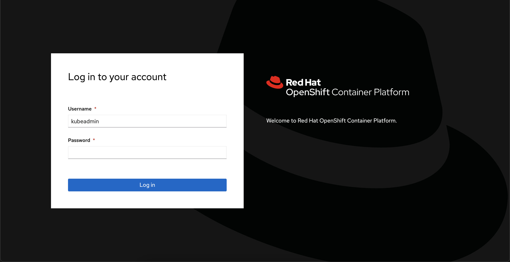
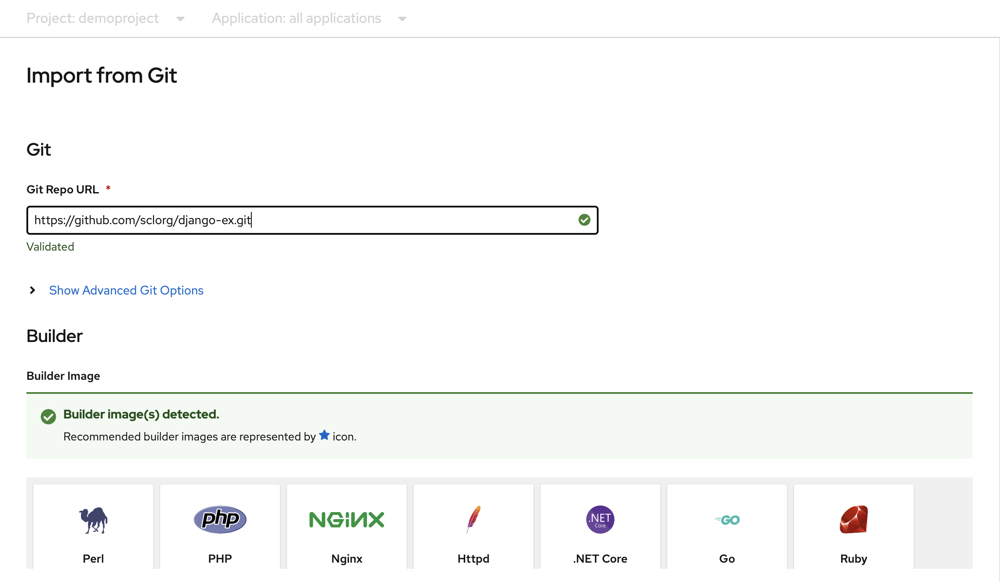
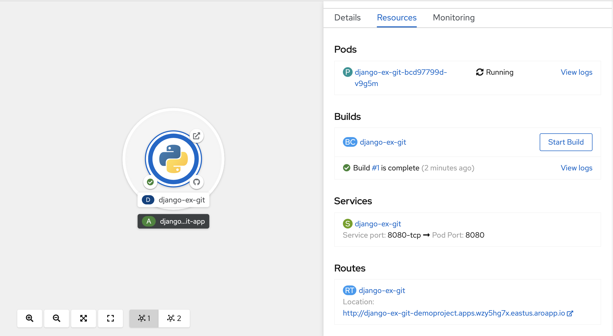
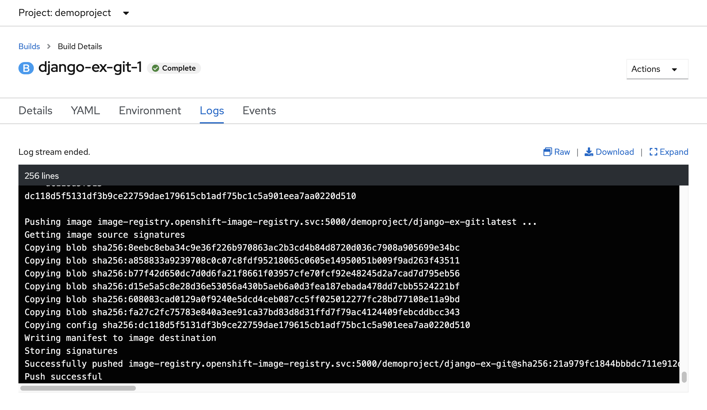
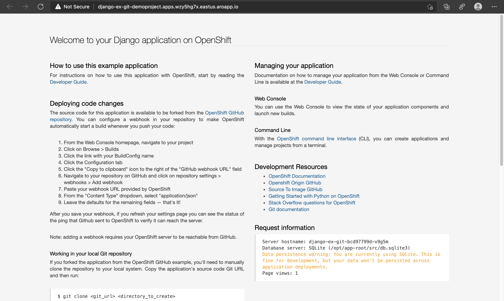

# Deploy an application from source to Azure Red Hat OpenShift

In this article, you deploy an application to an Azure Red Hat OpenShift cluster from source code using a source-to-image (S2I) build. [Source-to-Image (S2I)](https://docs.openshift.com/container-platform/4.6/builds/understanding-image-builds.html#builds-strategy-s2i-build_understanding-image-builds) is a build process for building reproducible container images from source code. S2I produces ready-to-run images by injecting source code into a container image and letting the container prepare that source code for execution. You can have OpenShift build an application from source to deploy it, so you don't have to construct a container by hand with every change. OpenShift can then build and deploy new versions automatically when notified of source code changes.

## Before you begin

[!INCLUDE [aro-howto-beforeyoubegin](includes/aro-howto-beforeyoubegin.md)]

## Create a project

To create a new project called `demoproject`, run the command:

```azurecli-interactive
oc new-project demoproject
```

You should see an output similar to:

```output
Now using project "demoproject" on server "https://api.wzy5hg7x.eastus.aroapp.io:6443".

You can add applications to this project with the 'new-app' command. For example, try:

    oc new-app django-psql-example

to build a new example application in Python. Or use kubectl to deploy a simple Kubernetes application:

    kubectl create deployment hello-node --image=gcr.io/hello-minikube-zero-install/hello-node
```

## Launch the web console

Find out the cluster web console URL by running:

```azurecli-interactive
 az aro show \
    --name <cluster name> \
    --resource-group <resource group> \
    --query "consoleProfile.url" -o tsv
```

You should get a URL similar to this one.

```output
https://console-openshift-console.apps.wzy5hg7x.eastus.aroapp.io/
```

Launch the console URL in a browser and login using the `kubeadmin` credentials.



Switch to the *Developer* perspective instead of the *Administrator* perspective in the left-hand side menu and select `demoproject` in the list of projects. You should then be at the *Topology* page for the project.


As the project is empty, no workloads should be found and you'll be presented with various options for how you can deploy an application.

## Deploying using the web console

From the options presented for deploying an application, select *From Git*. This will land you on the *Import from Git* page. Use `https://github.com/sclorg/django-ex.git` as the **Git Repo URL**. The sample web application is implemented using the Python programming language.



> [!NOTE]
> OpenShift detects that this is a Python project and selects the appropriate builder image.

Scroll down to *Advanced Options* and make sure that **Create a route to the application** is checked. This action will create an OpenShift route, a way to expose a service by giving it an externally reachable hostname.


When you're ready, at the bottom of the page click on **Create**. This will create resources to manage the build and deployment of the application. You'll then be redirected to the topology overview for the project.


The topology overview provides a visual representation of the application you've deployed. With this view, you can see the overall application structure.

The Git icon can be clicked to take you to the Git repository from which the source code for the application was built. The icon shown on the bottom left shows the build status of the application. Clicking this icon will take you to the build details section. If the application has exposed routes, the icon on the top right can be clicked to open the URL for the application route that was created.

While the application is scaling up or down, starting rollouts and recreating pods, the application representation in the topology view will be animated to give you a real-time view of what's going on.

Clicking on the application icon will bring up more details as shown below.



## Viewing the builder logs

Once the build has started, click on the *View Logs* link shown on the *Resources* panel.



This will allow you to monitor the progress of the build as it runs. The builder image, Python in this case, will inject the application source code into the final image before it pushes it to the OpenShift internal image registry. The build will have completed successfully when you see a final message of "Push successful".

## Accessing the application

Once the build of the application image has completed, it will be deployed.

Click on *Topology* in the left-hand menu bar to return to the topology view for the project. When you created the application using the web console, a *Route* was automatically created for the application and it will be exposed outside of the cluster. The URL that can be used to access the application from a web browser was visible on the *Resources* tab for the application you viewed previously.

From the topology view, you can  get to the URL for the deployed application by clicking on the icon top right of the ring. When the deployment is complete, click on the icon and you should see the application you deployed.



## Deploying using the command-line

You've learnt how to deploy an application using the web console, now lets deploy the same web application, but this time using the `oc` command-line tool.

Run the following command to delete the project and start over:

```azurecli-interactive
oc delete project demoproject
```

You should get a confirmation message that the `demoproject` was deleted.

```output
project.project.openshift.io "demoproject" deleted
```

Create the `demoproject` again by running:

```azurecli-interactive
oc new-project demoproject
```

Within the project, create a new application from the source on GitHub, specifying the S2I builder for the latest version of Python provided.

```azurecli-interactive
oc new-app python:latest~https://github.com/sclorg/django-ex.git
```

This should display output similar to:

```output
--> Found image 8ec6f0d (4 weeks old) in image stream "openshift/python" under tag "latest" for "python:latest"

    Python 3.8
    ----------
   [...]

    Tags: builder, python, python38, python-38, rh-python38

    * A source build using source code from https://github.com/sclorg/django-ex.git will be created
      * The resulting image will be pushed to image stream tag "django-ex:latest"
      * Use 'oc start-build' to trigger a new build
    * This image will be deployed in deployment config "django-ex"
    * Port 8080/tcp will be load balanced by service "django-ex"
      * Other containers can access this service through the hostname "django-ex"

--> Creating resources ...
    imagestream.image.openshift.io "django-ex" created
    buildconfig.build.openshift.io "django-ex" created
    deploymentconfig.apps.openshift.io "django-ex" created
    service "django-ex" created
--> Success
    Build scheduled, use 'oc logs -f bc/django-ex' to track its progress.
    Application is not exposed. You can expose services to the outside world by executing one or more of the commands below:
     'oc expose svc/django-ex'
    Run 'oc status' to view your app.
```

OpenShift will use the name of the Git repository as the name for the application. Review the status of the build and deployment by running:

```azurecli-interactive
oc status
```

When the build and deployment is completed, you should see a similar output to.

```output
In project demoproject on server https://api.wzy5hg7x.eastus.aroapp.io:6443

svc/django-ex - 172.30.200.50:8080
  dc/django-ex deploys istag/django-ex:latest <-
    bc/django-ex source builds https://github.com/sclorg/django-ex.git on openshift/python:latest
    deployment #1 deployed about a minute ago - 1 pod


2 infos identified, use 'oc status --suggest' to see details.
```

To expose the application outside the OpenShift cluster, you'll need to create a route by running:

```azurecli-interactive
oc expose service/django-ex
```

You should get a confirmation.

```output
route.route.openshift.io/django-ex exposed
```

Retrieve the URL by running:

```azurecli-interactive
oc get route django-ex
```

You should get back the hostname assigned to the route that you can use to browse to the deployed application.

```output
NAME        HOST/PORT                                              PATH   SERVICES    PORT       TERMINATION   WILDCARD
django-ex   django-ex-demoproject.apps.wzy5hg7x.eastus.aroapp.io          django-ex   8080-tcp                 None
```

## Triggering a new binary build

As you work on the application, you'll likely want to make changes and see them deployed. You can easily setup a webhook that will trigger a new build and deployment with every code commit. However, this may not be desirable as sometimes you'd like to see the changes without having to push every code change to the repository.

In cases where you're rapidly iterating on changes, you can use what is called a binary build. To demonstrate this scenario, clone the Git repository for the application locally by running:

```azurecli-interactive
git clone https://github.com/sclorg/django-ex.git
```

This will create a sub directory `django-ex` containing the source code for the application:

```output
Cloning into 'django-ex'...
remote: Enumerating objects: 980, done.
remote: Total 980 (delta 0), reused 0 (delta 0), pack-reused 980
Receiving objects: 100% (980/980), 276.23 KiB | 4.85 MiB/s, done.
Resolving deltas: 100% (434/434), done.
```

Change into the sub directory:

```azurecli-interactive
cd django-ex
```

Open the integrated Azure Cloud Shell editor:

```azurecli-interactive
code welcome/templates/welcome/index.html
```

Scroll down and change the line that says `Welcome to your Django application on OpenShift` to say `Welcome to Azure Red Hat OpenShift`. Save the file and close the editor through the `...` menu on the top right.


Start a new build by running the command:

```azurecli-interactive
oc start-build django-ex --from-dir=. --wait
```

By passing the `--from-dir=.` flag, the OpenShift command-line will upload the source code from the specified directory then initiate the build and deployment process. You should get an output similar to the below, and after a few minutes, the build should be completed.

```output
Uploading directory "." as binary input for the build ...
.
Uploading finished
build.build.openshift.io/django-ex-2 started
```

If you refresh the browser with the application, you should see the updated title.


## Clean up resources

When you're done with the application, you can run the following command to delete the project:

```azurecli-interactive
oc delete project demoproject
```

You can also delete the cluster by following the instructions in [Tutorial: Delete an Azure Red Hat OpenShift 4 cluster](./tutorial-delete-cluster.md).

## Next steps

In this guide, you learned how to:
> [!div class="checklist"]
>
> * Create a project
> * Deploy an application from source code using the web console
> * Deploy an application from source code using the OpenShift command-line
> * Trigger a binary build using the OpenShift command-line
