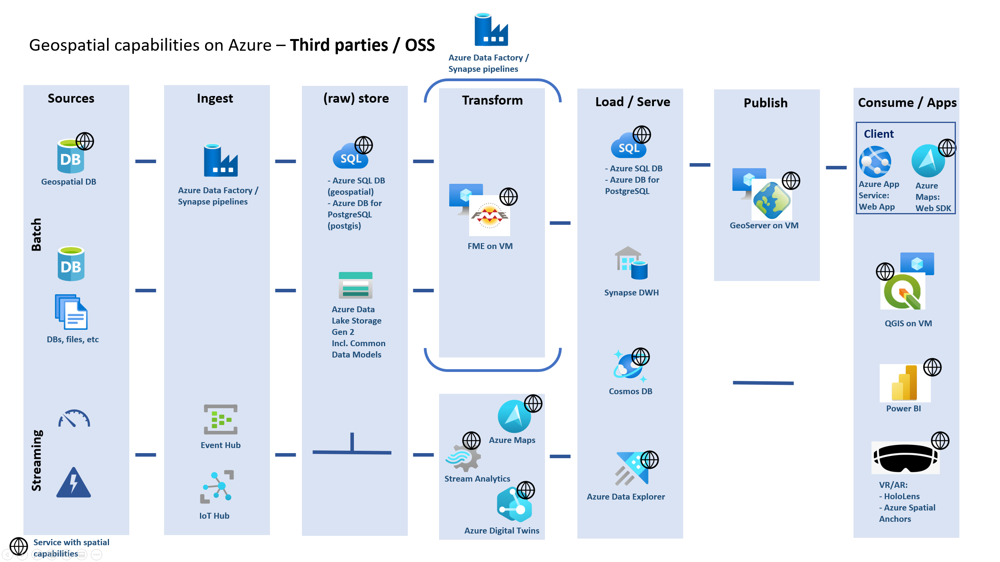
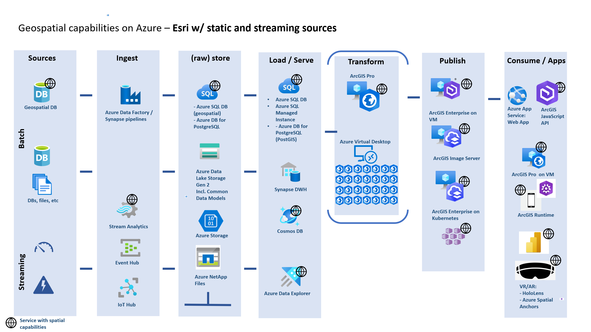
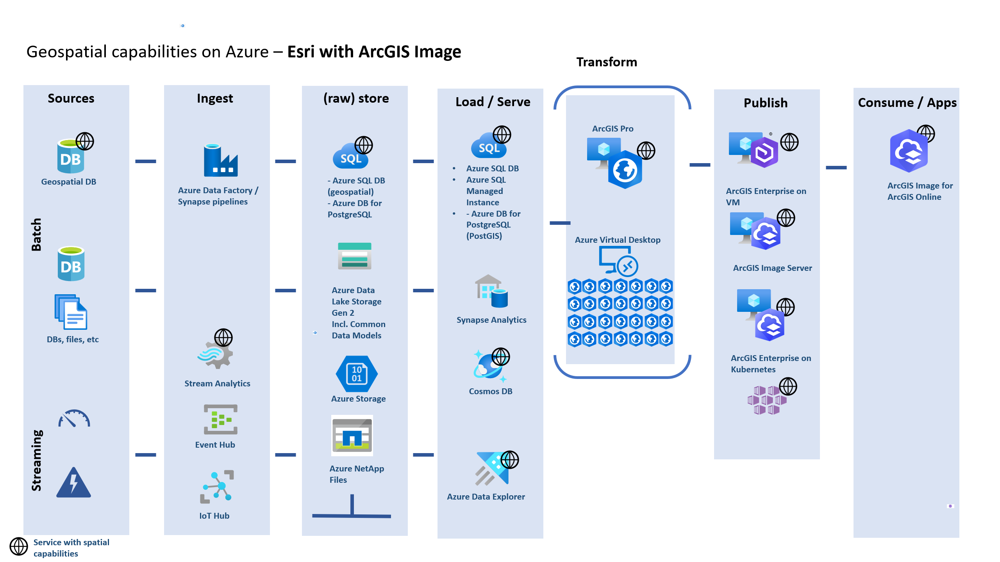
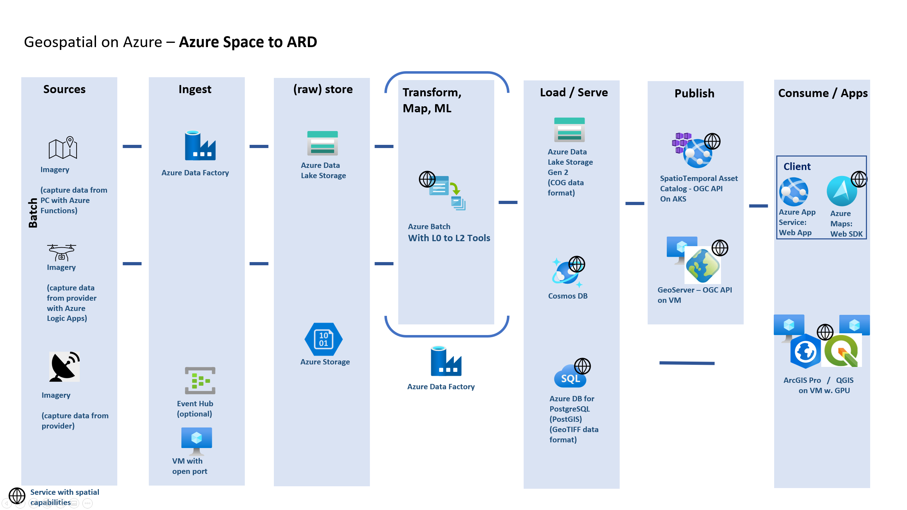

# End-to-end geospatial storage, analysis, and visualization

Geospatial data comes in various forms and requires a wide range of capabilities to process, analyze and visualize the data. While Geographic Information System (GIS) is common, it also is largely not cloud-native. Most GIS run on the desktop which limits their scale and performance. While there have been advances in moving the data to the backend, these systems remain IaaS bound which makes them difficult to scale.

This article will provide a high-level approach to use cloud-native capabilities along with some open-source software options and commercial options. Three personas will be considered. The personas are architects that are looking for a high-level flow without getting into the specifics of an implementation. The personas include the following:

- General geospatial architect. This architect is looking for a means to implement geospatial but may not have a background in GIS or Remote Sensing.
- OSS geospatial architect. This architect is dedicated to an open-source software (OSS) solution but takes advantage of the cloud for compute and storage.
- COTS geospatial architect. This architect is dedicated to COTS but also takes advantage of cloud compute and storage.

## Potential use cases

The solutions provided in these architectures apply to many use cases:

- Processing, storing, and providing access to large amounts of raster data, such as layers or climate data.
- Combining entity location data from ERP systems with GIS reference data or include vector data, arrays, point clouds, etc.
- Storing Internet of Things (IoT) telemetry from moving devices, and analyze in real time or in batch
- Running analytical geospatial queries.
- Embedding curated and contextualized geospatial data in web apps.
- Processing data from drones, aerial photography, satellite imagery, LiDAR, gridded model results etc.

## General geospatial architecture

Azure has many native geospatial capabilities. In this diagram and the ones that follow, you&#39;ll find high-level stages in which geospatial data undergoes. First, you have the data source, an ingestion step, a place where the data is stored, transformed, served, published, and finally consumed. Note the globe icon beside the services with native geospatial capabilities. Also, these diagrams are not to be considered linear processes. One may start in the Transforms column, Publish and Consume, and then create some additional derived datasets which requires going back to a previous column.

This architecture flow assumes that the data may be coming from databases, files or streaming sources and not stored in a native GIS format. Once the data is ingested with Azure Data Factory, or via Azure IoT, Event Hub and Stream Analytics, it could then be stored permanently in warm storage with Azure SQL, Azure SQL Managed Instance, Azure Database for PostgreSQL or Azure Data Lake. From there, the data can be transformed and processed in batch with Azure Batch or Synapse Spark Pool, of which both can be automated through the usage of an Azure Data Factory or Synapse pipeline. For real-time data, it can be further transformed or processed with Stream Analytics, Azure Maps or brought into context with Azure Digital Twins. Once the data is transformed, it can then once again be served for additional uses in Azure SQL DB or Azure Database for PostgreSQL, Synapse SQL Pool (for abstracted non-geospatial data), Cosmos DB or Azure Data Explorer. Once ready, the data can be queried directly through the data base API, but frequently a publish layer is used. The Azure Maps Data API would suffice for small datasets, otherwise a non-native service can be introduced based on OSS or COTS, for accessing the data through web services or desktop applications. Finally, the Azure Maps Web SDK hosted in Azure App Service would allow for geovisualization. Another option is to use Azure Maps in Power BI. Lastly, HoloLens and Azure Spatial Anchors can be used to view the data and place it in the real-world for virtual reality (VR) and augmented reality (AR) experiences.

It should be noted as well that many of these options are optional and could be supplemented with OSS to reduce cost while also maintaining scalability, or 3rd party tools to utilize their specific capabilities. The next session addresses this need.

## 3rd Party and OSS geospatial architecture

This pattern takes the approach of using Azure native geospatial capabilities while at the same time taking advantage of some 3rd party tools and OSS tools.

The most significant difference between this approach and the previous flow diagram is the use of FME on from Safe Software, Inc. which can be acquired from the Azure Marketplace. FME allows geospatial architects to integrate various type of geospatial data which includes CAD (for Azure Maps Creator), GIS, BIM, 3D, point clouds, LIDAR, etc. There are 450+ integration options, and can speed up the creation of many data transformations through its functionality. Implementation, however, is based on the usage of a virtual machine, and has therefore limits in its scaling capabilities. The automation of FME transformations might be reached using FME API calls with the use of Azure Data Factory and/or with Azure Functions. Once the data is loaded in Azure SQL, for example, it can then be served in GeoServer and published as a Web Feature Service (vector) or Web Mapping Tile Service (raster) and visualized in Azure Maps web SDK or analyzed with QGIS for the desktop along with the other [Azure Maps base maps](../azure-maps/supported-map-styles.md).

## COTS geospatial architecture: Esri with static and streaming sources

The next approach we&#39;ll look at uses commercial GIS as the basis for the solution. Esri&#39;s technology, available from the Azure Marketplace, will be the foundation for this architecture, although other commercial software can fit the same patterns. As before, the sources, ingestion, (raw) store, Load/Serve largely remain the same. The data can also be transformed with ArcGIS Pro on a standalone computer (VM) or as part of a larger solution with [Azure Virtual Desktop](https://azure.microsoft.com/services/virtual-desktop/). The data can be published via [ArcGIS Enterprise](https://enterprise.arcgis.com/en/) or with the ArcGIS Enterprise on Kubernetes (Azure Kubernetes Service). Imagery can be processed on IaaS with ArcGIS Image as part of the ArcGIS Enterprise deployment. The data can be consumed in web apps hosted in Azure App Service with the ArcGIS JavaScript SDK, an ArcGIS Pro end user, ArcGIS Runtime mobile SDK, or with ArcGIS for Power BI. Likewise, users can consume the data with ArcGIS Online.

## COTS geospatial imagery architecture: Esri&#39;s ArcGIS Image and Azure Orbital

The next architecture involves Azure Orbital and Esri&#39;s ArcGIS Image. With this end-to-end flow, Azure Orbital allows you to schedule contacts with satellites and downlink the data into a VM or stream to Azure Event Hub. Besides direct streamed satellite data, drone or other imagery data can be brought on the platform, and processed. The raw data can be stored in Azure NetApp Files, an Azure Storage account (blob), or in a database such as Azure Database for PostgreSQL. Depending on the satellite and sensor platform, the data is transformed from Level 0 to Level 2 dataset. See [NASA Data Processing Levels](https://earthdata.nasa.gov/collaborate/open-data-services-and-software/data-information-policy/data-levels). To which level is required, is dependent on the satellite and sensor. Next, ArcGIS Pro can transform the data into a Mosaic Dataset. The Mosaic Dataset is then turned into an image service with ArcGIS Enterprise (on VMs or Kubernetes). ArcGIS Image Server can serve the data directly as an image service or a user can consume the image service via [ArcGIS Image for ArcGIS Online](https://www.esri.com/en-us/cp/arcgis-image-for-arcgis-online/overview?adumkts=integrated_marketing&amp;aduc=advertising&amp;adum=ppc&amp;aduSF=bing&amp;utm_Source=advertising&amp;aduca=dg_arcgis_image_for_arcgis_online&amp;aduco=olp_visualization&amp;adut=ppcbrand&amp;adupt=lead_gen&amp;sf_id=7015x000000STNjAAO&amp;ef_id=:G:s&amp;s_kwcid=AL!8948!3!!e!!o!!arcgis%20image%20for%20arcgis%20online&amp;_bk=arcgis%20image%20for%20arcgis%20online&amp;_bt=&amp;_bm=e&amp;_bn=o&amp;_bg=1306220144341354&amp;gclid=815d41bc28b312920c8b23ba5ef1bb14&amp;gclsrc=3p.ds&amp;msclkid=815d41bc28b312920c8b23ba5ef1bb14&amp;utm_source=bing&amp;utm_medium=cpc&amp;utm_campaign=DG%20ArcGIS%20Image%20-%20Brand%20-%20PPC%20-%20Phrase&amp;utm_term=arcgis%20image%20for%20arcgis%20online&amp;utm_content=Brand).

## COTS/OSS geospatial imagery architecture: Azure Space to Analysis Ready Dataset

When Analysis Ready Datasets are made available through APIs that enable search and query capabilities, like with Microsoft&#39;s Planetary Computer, there is no need to first download the data from a satellite. However, if low lead times are required for imagery, acquiring the data directly from Azure Space is ideal because a satellite operator or mission driven organization can schedule a contact with a satellite via Azure Orbital. The process for going from Level 0 to Level 2 Analysis Ready Dataset varies by the satellite and the imagery products. Multiple tools and intermediate steps are often required. Azure Batch or another compute resource can process the data in a cluster and store the resulting data. The data may go through multiple steps before it is ready for being used in ArcGIS or QGIS or some other geovisualization tool. For example, once the data is in a [Cloud Optimized GeoTIFF](https://www.cogeo.org/) (COG) format, it is served up via a Storage Account or Azure Data Lake and made accessible and queryable via the [STAC API](https://stacspec.org/), which can be deployed on Azure as a service, with AKS among others. Alternatively, the data is published as a Web Mapping Tile Service with GeoServer. Consumers can then access the data in ArcGIS Pro or QGIS or via a web app with Azure Maps or Esri&#39;s mobile and web SDKs.

## Components

- [Azure Event Hubs](../event-hubs/event-hubs-about.md) is a fully managed streaming platform for big data. This platform as a service (PaaS) offers a partitioned consumer model. Multiple applications can use this model to process the data stream at the same time.
- [Azure Orbital](../orbital/overview.md) is a fully managed, cloud-based ground station as a service that allows you to streamline your operations by ingesting space data directly into Azure.
- [Azure Data Factory](../data-factory/introduction.md) is an integration service that works with data from disparate data stores. You can use this fully managed, serverless platform to create, schedule, and orchestrate data transformation workflows.
- [Azure Cosmos DB](../cosmos-db/introduction.md) is a fully managed NoSQL database service for modern app development.
- [Azure Synapse Analytics](../synapse-analytics/overview-what-is.md) is an enterprise analytics service that accelerates time to insight across data warehouses and big data systems.
- [Azure Digital Twins](../digital-twins/overview.md) is a platform as a service offering that enabled the creation of twin graphs based on digital models of entire environments, which could be buildings, factories, farms, energy networks, railways, stadiums, or entire cities.
- [Azure Virtual Desktop](../virtual-desktop/overview.md) is a desktop and app virtualization service that runs on the cloud.
- [Azure Databricks](/azure/databricks/scenarios/what-is-azure-databricks) is a data analytics platform. Its fully managed Spark clusters process large streams of data from multiple sources. Azure Databricks can transform geospatial data at large scale for use in analytics and data visualization.
- [Azure Batch](https://azure.microsoft.com/services/batch/) allows you to run large-scale parallel and high-performance computing jobs.
- [Azure Data Lake Storage](../data-lake-store/data-lake-store-overview.md) is a scalable and secure data lake for high-performance analytics workloads. This service can manage multiple petabytes of information while sustaining hundreds of gigabits of throughput. The data typically comes from multiple, heterogeneous sources and can be structured, semi-structured, or unstructured.
- [Azure SQL Database](https://azure.microsoft.com/products/azure-sql/database/) is a PaaS version of SQL Server and is an intelligent, scalable, relational database service.
- [Azure Database for PostgreSQL](../postgresql/overview.md) is a fully managed relational database service that&#39;s based on the community edition of the open-source [PostgreSQL](https://www.postgresql.org/) database engine.
- [PostGIS](https://www.postgis.net/) is an extension for the PostgreSQL database that integrates with GIS servers. PostGIS can run SQL location queries that involve geographic objects.
- [Power BI](https://docs.microsoft.com/power-bi/fundamentals/power-bi-overview) is a collection of software services and apps. You can use Power BI to connect unrelated sources of data and create visuals of them.
- The [Azure Maps visual for Power BI](../azure-maps/power-bi-visual-get-started.md) provides a way to enhance maps with spatial data. You can use this visual to show how location data affects business metrics.
- [App Service](../app-service/overview.md) and its [Web Apps](../app-service/overview.md) feature provide a framework for building, deploying, and scaling web apps. The App Service platform offers built-in infrastructure maintenance, security patching, and scaling.
- [GIS data APIs in Azure Maps](../azure-maps/about-azure-maps.md) store and retrieve map data in formats like GeoJSON and vector tiles.
- [Azure Data Explorer](https://docs.microsoft.com/azure/data-explorer/data-explorer-overview) is a fast, fully managed data analytics service that can work with [large volumes of data](https://docs.microsoft.com/azure/data-explorer/engine-v3). This service originally focused on time series and log analytics. It now also handles diverse data streams from applications, websites, IoT devices, and other sources. [Geospatial functionality](https://azure.microsoft.com/updates/adx-geo-updates/) in Azure Data Explorer provides options for rendering map data.
- [Azure NetApp Files](https://azure.microsoft.com/services/netapp/) is an enterprise-class, high-performance, metered file Network Attached Storage (NAS) service.
- [Quantum GIS](https://www.qgis.org/en/site/) is a free and open-source desktop GIS that supports editing, analysis, geovisualization of geospatial data.
- [ArcGIS Enterprise](https://enterprise.arcgis.com/en/get-started/latest/windows/what-is-arcgis-enterprise-.htm) is a platform for mapping and geovisualization, analytics and data management, which hosts data, applications, and custom low-code/no-code applications. It works along with the desktop GIS called ArcGIS Pro or ArcGIS Desktop (not included here because it has been supplanted by ArcGIS Pro).
- [ArcGIS Pro](https://www.esri.com/arcgis/products/arcgis-pro/overview) is Esri&#39;s professional desktop GIS application. It allows power users to explore, geovisualize, and analyze data. It includes 2D and 3D capabilities and runs best on Azure High Performance Compute VMs such as the NV series. The use of ArcGIS can be scaled using Azure Virtual Desktop.
- [ArcGIS Image for ArcGIS Online](https://www.esri.com/en-us/cp/arcgis-image-for-arcgis-online/overview?adumkts=integrated_marketing&amp;aduc=advertising&amp;adum=ppc&amp;aduSF=bing&amp;utm_Source=advertising&amp;aduca=dg_arcgis_image_for_arcgis_online&amp;aduco=olp_scalability&amp;adut=ppcbrand&amp;adupt=lead_gen&amp;sf_id=7015x000000STNjAAO&amp;ef_id=:G:s&amp;s_kwcid=AL!8948!3!!e!!o!!arcgis%20image%20for%20arcgis%20online&amp;_bk=arcgis%20image%20for%20arcgis%20online&amp;_bt=&amp;_bm=e&amp;_bn=o&amp;_bg=1306220144341354&amp;gclid=1f10b314439b15d18aa0d111519c6122&amp;gclsrc=3p.ds&amp;msclkid=1f10b314439b15d18aa0d111519c6122&amp;utm_source=bing&amp;utm_medium=cpc&amp;utm_campaign=DG%20ArcGIS%20Image%20-%20Brand%20-%20PPC%20-%20Phrase&amp;utm_term=arcgis%20image%20for%20arcgis%20online&amp;utm_content=Brand) is an extension to ArcGIS Online (SaaS) which allows for geovisualization, hosting, publishing, and analysis.
- [STAC](https://stacspec.org/) API specification allows you to query and retrieve raster data via a catalog.

Although not shown in the diagrams above, Azure Monitor, Log Analytics and Key Vault would also be part of a broader solution.

- [Azure Monitor](../azure-monitor/overview.md) collects data on environments and Azure resources. This diagnostic information is helpful for maintaining availability and performance. Two data platforms make up Monitor:
  - [Azure Monitor Logs](../azure-monitor/logs/log-analytics-overview.md) records and stores log and performance data.
  - [Azure Monitor Metrics](../azure-monitor/essentials/metrics-getting-started.md) collects numerical values at regular intervals.
- [Azure Log Analytics](../azure-monitor/logs/log-analytics-overview.md) is an Azure portal tool that runs queries on Monitor log data. Log Analytics also provides features for charting and statistically analyzing query results.
- [Key Vault](../key-vault/general/basic-concepts.md) stores and controls access to secrets such as tokens, passwords, and API keys. Key Vault also creates and controls encryption keys and manages security certificates.

## Alternatives

Various Spark libraries are available for working with geospatial data on Azure Databricks and Synapse Spark Pools. See these libraries:

- [Apache Sedona (GeoSpark)](http://sedona.apache.org/)
- [GeoPandas](https://geopandas.org/)
- [GeoTrellis](https://geotrellis.io/)

But [other solutions also exist for processing and scaling geospatial workloads with Azure Databricks](https://databricks.com/blog/2019/12/05/processing-geospatial-data-at-scale-with-databricks.html).

- Other Python libraries to consider include [PySAL](http://pysal.org/), [Rasterio](https://rasterio.readthedocs.io/en/latest/intro.html), [WhiteboxTools](https://www.whiteboxgeo.com/manual/wbt_book/intro.html), [Turf.js](https://turfjs.org/), [Pointpats](https://pointpats.readthedocs.io/en/latest/), [Raster Vision](https://docs.rastervision.io/en/0.13/), [EarthPy](https://earthpy.readthedocs.io/en/latest/index.html), [Planetary Computer](https://planetarycomputer.microsoft.com/), [PDAL](https://pdal.io/), etc.

- [Vector tiles](https://github.com/mapbox/vector-tile-spec) provide an efficient way to display GIS data on maps. A solution could use PostGIS to dynamically query vector tiles. This approach works well for simple queries and result sets that contain well under 1 million records. But in the following cases, a different approach may be better:
  - Your queries are computationally expensive.
  - Your data doesn&#39;t change frequently.
  - You&#39;re displaying large data sets.

In these situations, consider using [Tippecanoe](https://github.com/mapbox/tippecanoe) to generate vector tiles. You can run Tippecanoe as part of your data processing flow, either as a container or with [Azure Functions](../azure-functions/functions-overview.md). You can make the resulting tiles available through APIs.

- Like Event Hubs, [Azure IoT Hub](../iot-hub/iot-concepts-and-iot-hub.md) can ingest large amounts of data. But IoT Hub also offers bi-directional communication capabilities with devices. If you receive data directly from devices but also send commands and policies back to devices, consider IoT Hub instead of Event Hubs.

### Related resources

#### Related architectures

- [Big data analytics with Azure Data Explorer](https://docs.microsoft.com/azure/architecture/solution-ideas/articles/big-data-azure-data-explorer)
- [Health data consortium on Azure](https://docs.microsoft.com/azure/architecture/example-scenario/data/azure-health-data-consortium)
- [DataOps for the modern data warehouse](https://docs.microsoft.com/azure/architecture/example-scenario/data-warehouse/dataops-mdw)
- [Azure Data Explorer interactive analytics](https://docs.microsoft.com/azure/architecture/solution-ideas/articles/interactive-azure-data-explorer)

#### Related guides

- [Geospatial data processing and analytics](https://docs.microsoft.com/azure/architecture/example-scenario/data/geospatial-data-processing-analytics-azure)
- [Compare the machine learning products and technologies from Microsoft - Azure Databricks](https://docs.microsoft.com/azure/architecture/data-guide/technology-choices/data-science-and-machine-learning#azure-databricks)
- [Machine learning operations (MLOps) framework to scale up machine learning lifecycle with Azure Machine Learning](https://docs.microsoft.com/azure/architecture/example-scenario/mlops/mlops-technical-paper)
- [Azure Machine Learning decision guide for optimal tool selection](https://docs.microsoft.com/azure/architecture/example-scenario/mlops/aml-decision-tree)
- [Monitor Azure Databricks](https://docs.microsoft.com/azure/architecture/databricks-monitoring/)
