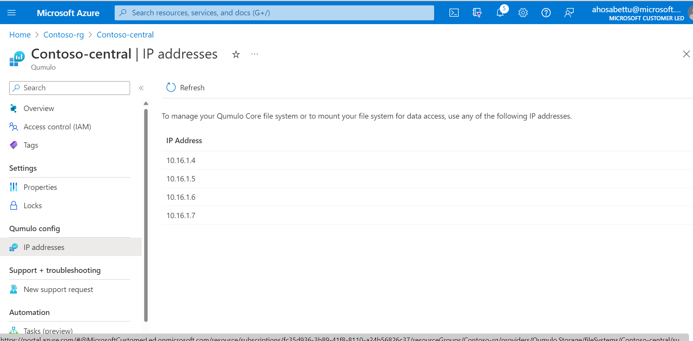

# How to Manage the Azure Native Qumulo Service

This article describes how to manage Azure Native Qumulo Scalable File Service.

## Resource Overview

    
    Screenshot

To see the details of you of your Qumulo resource, select **Overview** in the left pane.

These details include the following:

- Resource group
- Qumulo Core Web UI Login URL
- Location of the filesystem
- Virtual network and subnet details
- Subscription
- Marketplace Status of the service
- Pricing plan
- Storage type

Selecting the “IP addresses” button at the bottom displays the IP addresses associated with the filesystem which can be used to use and manage the file system.

  Screenshot

## Using Qumulo

See [Qumulo’s documentation hub](https://docs.qumulo.com/cloud-guide/) for help configuring and using your file system.

    

<!-- This does not match the image in the document. -->

  
    

## Delete the Qumulo FileSystem --

To delete a deployment of Qumulo File System.

1. From the Resource menu, select your Qumulo File System
1. Select the Overview on the left
1. Select **Delete**.
1. Confirm that you want to delete the Qumulo File System along with associated data and other resources attached to the service.
1. Click **Delete**. Note that this action is not reversible: the data contained in the file system will be permanently deleted.

  Screenshot

## Next Steps

