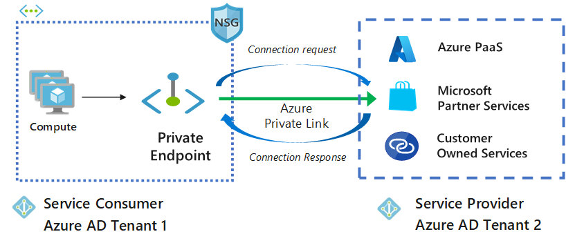

# Manage a Private Endpoint connection

Azure Private Link works on an approval call flow model where the Private Link service consumer can request a connection to the service provider for consuming the service. 

The service provider can then decide whether to allow the consumer to connect or not. Azure Private Link enables the service providers to manage the private endpoint connection on their resources. 

This article provides instructions about how to manage the Private Endpoint connections.



There are two connection approval methods that a Private Link service consumer can choose from:

- **Automatic**: If the service consumer has Azure RBAC permissions on the service provider resource, the consumer can choose the automatic approval method. When the request reaches the service provider resource, no action is required from the service provider and the connection is automatically approved. 

- **Manual**: If the service consumer doesn’t have Azure RBAC permissions on the service provider resource, the consumer can choose the manual approval method. The connection request appears on the service resources as **Pending**. The service provider has to manually approve the request before connections can be established. 
In manual cases, service consumer can also specify a message with the request to provide more context to the service provider. The service provider has following options to choose from for all Private Endpoint connections: **Approved**, **Reject**, **Remove**.

The below table shows the various service provider actions and the resulting connection states for Private Endpoints.  The service provider can also change the connection state of private endpoint connection at a later time without consumer intervention. The action will update the state of the endpoint on the consumer side. 


| Service Provider Action  | Service Consumer Private Endpoint State | Description |
|---------|---------|---------|
| None    |    Pending     |    Connection is created manually and is pending for approval by the Private Link resource owner.       |
| Approve    |  Approved       |  Connection was automatically or manually approved and is ready to be used.     |
| Reject     | Rejected        | Connection was rejected by the private link resource owner.        |
| Remove    |  Disconnected       | Connection was removed by the private link resource owner, the private endpoint becomes informative and should be deleted for clean up.        |

## Manage Private Endpoint connections on Azure PaaS resources

The Azure portal is the preferred method for managing private endpoint connections on Azure PaaS resources. 

1. Sign in to the [Azure portal](https://portal.azure.com).

2. In the search box at the top of the portal, enter **Private link**. In the search results, select **Private link**.

3. In the **Private link center**, select **Private endpoints** or **Private link services**.

4. For each of your endpoints, you can view the number of Private Endpoint connections associated with it. You can filter the resources as needed.

5. Select the private endpoint.  Under the connections listed, select the connection that you want to manage. 

6. You can change the state of the connection by selecting from the options at the top.

## Manage Private Endpoint connections on a customer/partner owned Private Link service

Azure PowerShell and Azure CLI are the preferred methods for managing Private Endpoint connections on Microsoft Partner Services or customer owned services. 
 
### PowerShell 
  
Use the following PowerShell commands to manage private endpoint connections.  

#### Get Private Link connection states 

Use [Get-AzPrivateEndpointConnection](/powershell/module/az.network/get-azprivateendpointconnection) to get the Private Endpoint connections and their states.  

```azurepowershell
Get-AzPrivateEndpointConnection -Name myPrivateLinkService -ResourceGroupName myResourceGroup 
```
 
#### Approve a Private Endpoint connection 
 
Use [Approve-AzPrivateEndpointConnection](/powershell/module/az.network/approve-azprivateendpointconnection) cmdlet to approve a Private Endpoint connection. 
 
```azurepowershell
Approve-AzPrivateEndpointConnection -Name myPrivateEndpointConnection -ResourceGroupName myResourceGroup -ServiceName myPrivateLinkService
```
 
#### Deny Private Endpoint connection 
 
Use [Deny-AzPrivateEndpointConnection](/powershell/module/az.network/deny-azprivateendpointconnection) cmdlet to reject a Private Endpoint connection. 

```azurepowershell
Deny-AzPrivateEndpointConnection -Name myPrivateEndpointConnection -ResourceGroupName myResourceGroup -ServiceName myPrivateLinkService 
```

#### Remove Private Endpoint Connection 
 
Use [Remove-AzPrivateEndpointConnection](/powershell/module/az.network/remove-azprivateendpointconnection) cmdlet to remove a Private Endpoint connection. 

```azurepowershell
Remove-AzPrivateEndpointConnection -Name myPrivateEndpointConnection -ResourceGroupName myResourceGroup -ServiceName myPrivateLinkService
```
 
### Azure CLI 
 
#### Get Private Link connection states 

Use [az network private-endpoint-connection show](/cli/azure/network/private-endpoint-connection#az_network_private_endpoint_connection_show)  to get the Private Endpoint connections and their states.  

```azurecli
  az network private-endpoint-connection show \
    --name myPrivateEndpointConnection \
    --resource-group myResourceGroup
```
 
#### Approve a Private Endpoint connection 
 
Use [az network private-endpoint-connection approve](/cli/azure/network/private-endpoint-connection#az_network_private_endpoint_connection_approve) cmdlet to approve a Private Endpoint connection. 
 
```azurecli
  az network private-endpoint-connection approve \
    --name myPrivateEndpointConnection  \
    --resource-group myResourceGroup
```
 
#### Deny Private Endpoint connection 
 
Use [az network private-endpoint-connection reject](/cli/azure/network/private-endpoint-connection#az_network_private_endpoint_connection_reject) cmdlet to reject a Private Endpoint connection. 

```azurecli
  az network private-endpoint-connection reject \
    --name myPrivateEndpointConnection  \
    --resource-group myResourceGroup
```

#### Remove Private Endpoint Connection 
 
Use [az network private-endpoint-connection delete](/cli/azure/network/private-endpoint-connection#az_network_private_endpoint_connection_delete) cmdlet to remove a Private Endpoint connection. 

```azurecli
  az network private-endpoint-connection delete \
    --name myPrivateEndpointConnection 
    --resource-group myResourceGroup
```

## Next steps
- [Learn about Private Endpoints](private-endpoint-overview.md)
 
