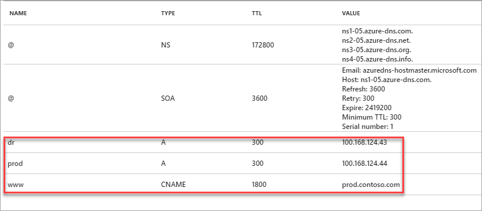

# Reliability in Azure DNS

This article contains detailed information on [cross-region disaster recovery and business continuity](#cross-region-disaster-recovery-and-business-continuity) support for Azure DNS. 


## Cross-region disaster recovery and business continuity

[!INCLUDE [introduction to disaster recovery](includes/reliability-disaster-recovery-description-include.md)]


The Azure DNS failover solution for disaster recovery uses the standard DNS mechanism to fail over to the backup site. The manual option via Azure DNS works best when used in conjunction with the [cold standby or the pilot light approach](/azure/well-architected/reliability/highly-available-multi-region-design#active-passive).

Since the DNS server is outside the failover or disaster zone, it's insulated against any downtime. You can architect a simple failover scenario as long as the operator has network connectivity during disaster and can make the flip. If the solution is scripted, then you must ensure that the server or service running the script is also insulated against the problem affecting the production environment. Also, a low TTL for the zone prevents resolver caching over long periods of time, allowing the customer to access the site within the RTO. For a cold standby and pilot light, since some prewarming and other administrative activity may be required, you should also give enough time before making the flip.

>[!NOTE]
>Azure private DNS zone supports DNS resolution between virtual networks across Azure regions, even without explicitly peering the virtual networks.  However, all virtual networks must be linked to the private DNS zone. 

To learn how to create an Azure private DNS zone using the Azure portal, see [Quickstart: Create an Azure private DNS zone using the Azure portal](/azure/dns/private-dns-getstarted-portal). 

To create an Azure DNS Private Resolver using Azure portal, see [Quickstart: Create an Azure DNS Private Resolver using the Azure portal](/azure/dns/dns-private-resolver-get-started-portal).


## Disaster recovery in multi-region geography

There are two technical aspects towards setting up your disaster recovery architecture:

-  Using a deployment mechanism to replicate instances, data, and configurations between primary and standby environments. This type of disaster recovery can be done natively viaAzure Site Recovery, see [Azure Site Recovery Documentation](../site-recovery/index.yml) via Microsoft Azure partner appliances/services like Veritas or NetApp. 

- Developing a solution to divert network/web traffic from the primary site to the standby site. This type of disaster recovery can be achieved via Azure DNS, [Azure Traffic Manager(DNS)](reliability-traffic-manager.md), or third-party global load balancers. 

This article focuses specifically on Azure DNS disaster recovery planning.


#### Set up disaster recovery and outage detection 

The Azure DNS manual failover solution for disaster recovery uses the standard DNS mechanism to fail over to the backup site. The manual option via Azure DNS works best when used in conjunction with the cold standby or the pilot light approach.


*Figure - Manual failover using Azure DNS*

The assumptions made for the solution are:
- Both primary and secondary endpoints have static IPs that don’t change often. Say for the primary site the IP is 100.168.124.44 and the IP for the secondary site is 100.168.124.43.
- An Azure DNS zone exists for both the primary and secondary site. Say for the primary site the endpoint is prod.contoso.com and for the backup site is dr.contoso.com. A DNS record for the main application known as www\.contoso.com also exists.   
- The TTL is at or below the RTO SLA set in the organization. For example, if an enterprise sets the RTO of the application disaster response to be 60 mins, then the TTL should be less than 60 mins, preferably the lower the better. 
  You can set up Azure DNS for manual failover as follows:
    - Create a DNS zone
    - Create DNS zone records
    - Update CNAME record

1. Create a DNS zone (for example, www\.contoso.com) as shown below:

    

    *Figure - Create a DNS zone in Azure*

1.  Within this zone, create three records (for example - www\.contoso.com, prod.contoso.com and dr.consoto.com) as show below.

    

    *Figure - Create DNS zone records in Azure*

    In this scenario, site, www\.contoso.com has a TTL of 30 mins, which is well below the stated RTO, and is pointing to the production site prod.contoso.com. This configuration is during normal business operations. The TTL of prod.contoso.com and dr.contoso.com has been set to 300 seconds or 5 mins. 
    You can use an Azure monitoring service such as Azure Monitor or Azure App Insights, or, any partner monitoring solutions such as Dynatrace. You can even use home grown solutions that can monitor or detect application or virtual infrastructure level failures.

1. Once failure is detected, change the record value to point to dr.contoso.com as shown below:
       
    
    
    *Figure - Update the CNAME record in Azure*
    
    Within 30 minutes, during which most resolvers will refresh the cached zone file, any query to www\.contoso.com will be redirected to dr.contoso.com.
    You can also run the following Azure CLI command to change the CNAME value:
     ```azurecli
       az network dns record-set cname set-record \
       --resource-group 123 \
       --zone-name contoso.com \
       --record-set-name www \
       --cname dr.contoso.com
    ```
    This step can be executed manually or via automation. It can be done manually via the console or by the Azure CLI. The Azure SDK and API can be used to automate the CNAME update so that no manual intervention is required. Automation can be built via Azure functions or within a third-party monitoring application or even from on- premises.


## Next steps

- [Reliability in Azure](/azure/reliability/availability-zones-overview)
- Learn more about [Azure Traffic Manager](../traffic-manager/traffic-manager-overview.md).
- Learn more about [Azure DNS](../dns/dns-overview.md).