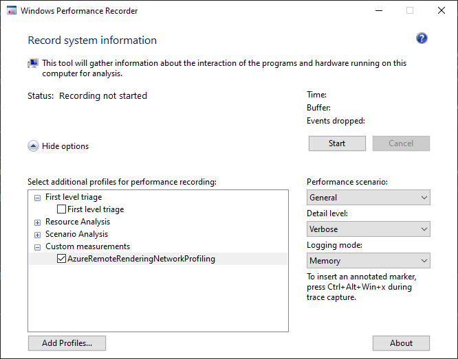
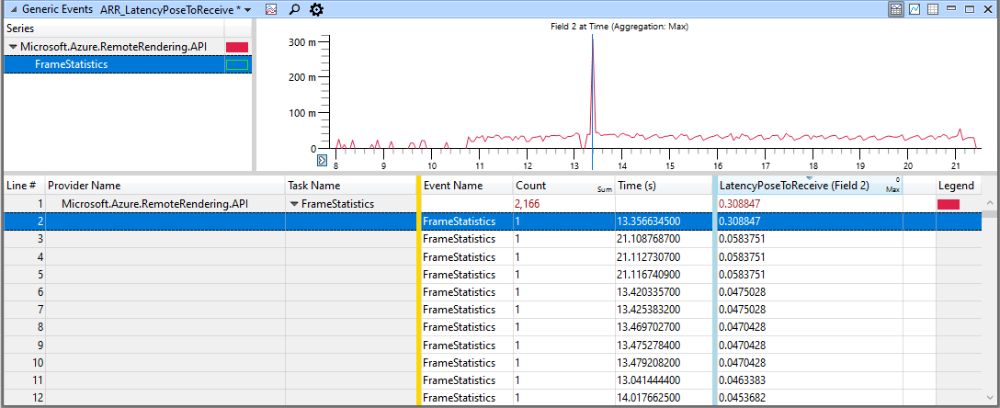
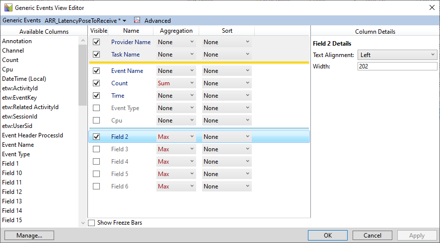

# Create client-side performance traces

There are many reasons why the performance of Azure Remote Rendering might not be as good as desired. Apart from pure rendering performance on the cloud server, especially the quality of the network connection has a significant influence on the experience. To profile the server's performance, refer to chapter [Server-side performance queries](../overview/features/performance-queries.md).

This chapter focuses on how to identify potential client-side bottlenecks through *:::no-loc text="performance traces.":::*

## Getting started

If you're new to the Windows :::no-loc text="performance tracing"::: functionality, this section mentions the most fundamental terms and applications to get you started.

### Installation

The applications used to do tracing with Azure Remote Rendering (ARR) are general purpose tools that can be used for all Windows development. They're provided through the [Windows Performance Toolkit](/windows-hardware/test/wpt/). To get this toolkit, download the [Windows Assessment and Deployment Kit](/windows-hardware/get-started/adk-install).

### Terminology

A range of terms is important when talking about performance traces. The most important ones are:

* [**E**vent **T**racing for **W**indows](/windows/win32/etw/about-event-tracing) (ETW)\
**ETW** is the overarching name for the efficient kernel-level tracing facility that is built into Windows. Applications that support ETW emit events to log actions that might help to track down performance issues, thus the name *event* tracing. By default, the operating system already emits events for things like disk accesses, task switches and such. Applications like ARR additionally emit custom events, for instance about dropped frames, network lag etc.

* **E**vent **T**race **L**ogging (ETL)\
**ETL** describes a gathered (logged) trace and is therefore typically used as the file extension for files that store the tracing data. Thus when you do a trace, you typically have an *\*.etl* file afterwards.

* [**W**indows **P**erformance **R**ecorder](/windows-hardware/test/wpt/windows-performance-recorder) (WPR)\
**WPR** is the name of the application that starts and stops the recording of event traces. WPR takes a profile file (*\*.wprp*) that configures which exact events to log. Such a `wprp` file is provided with the ARR SDK. When doing traces on a desktop PC, you can launch WPR directly. When doing a trace on the HoloLens, you typically go through the web interface instead.

* [**W**indows **P**erformance **A**nalyzer](/windows-hardware/test/wpt/windows-performance-analyzer) (WPA)\
**WPA** is the name of the GUI application that is used to open *\*.etl* files and sift through the data to identify performance issues. WPA allows you to sort data by various criteria, display the data in several ways, dig down into details, and correlate information.

* `Perfetto`\
[**Perfetto**](https://perfetto.dev/) is a system profiling and application tracing tool for Android and Linux, which is available since Android 9 Pie. Perfetto is also enabled on [Meta Quest and Quest 2](https://developer.oculus.com/blog/how-to-run-a-perfetto-trace-on-oculus-quest-or-quest-2/) devices (when developer mode is enabled), since v27 OS. [Perfetto Trace Viewer UI](https://ui.perfetto.dev/) can be used to open and analyze resulting Perfetto traces.

While ETL traces can be created on any Windows device (local PC, HoloLens, cloud server, etc.), they're typically saved to disk and analyzed with WPA on a desktop PC. ETL files can be sent to other developers for them to have a look. ETL traces can include sensitive information, such as file-paths and IP addresses. You can use ETW in two ways: to record traces, or to analyze traces. Recording traces is straight-forward and requires minimal setup. Analyzing traces on the other hand does require a decent understanding of both the WPA tool and the problem that you're investigating. General material for learning WPA is given later, and guidelines for how to interpret ARR-specific traces.

## Recording a trace on a local PC

Use traces on PC to either get familiar with the tools or if you have an issue where the hardware restrictions of the HoloLens aren't relevant. Otherwise you can skip to the [Recording a trace on a HoloLens](#recording-a-trace-on-a-hololens) section. Especially ARR performance issues should only be traced directly on a HoloLens.

### WPR configuration

1. Launch the [:::no-loc text="Windows Performance Recorder":::](/windows-hardware/test/wpt/windows-performance-recorder) from the *start menu*.
1. Expand **More Options**.
1. Select **Add Profiles...**.
1. Select the file *AzureRemoteRenderingNetworkProfiling.wprp*. You can find this file in the ARR SDK under *Tools/ETLProfiles*.
   The profile is listed in WPR under *Custom measurements*. Make sure it's the only enabled profile.
1. Expand *First level triage*.
    * If all you want to do is capture a quick trace of the ARR networking events, **disable** this option.
    * If you need to correlate ARR network events with other system characteristics, such as CPU or memory usage, then **enable** this option.
    * Traces with this option enabled are most likely multiple gigabytes in size and might take a long time to save and open in WPA.

Afterwards your WPR configuration should look like this:



### Recording

Select **Start** to start recording a trace. You can start and stop recording at any time; you don't need to close your application before doing so. As you can see you don't need to specify which application to trace, as ETW records a trace for the entire system. The `wprp` file specifies which types of events to record.

Select **Save** to stop recording and specify where to store the ETL file.

You now have an ETL file that you can open in WPA.

## Recording a trace on a HoloLens

To record a trace on a HoloLens, boot up your device and enter its IP address into a browser to open up the *Device Portal*.


1. On the left, navigate to *Performance > Performance Tracing*.
1. Select **Custom profiles**.
1. Select **:::no-loc text="Browse...":::**.
1. Select the file *AzureRemoteRenderingNetworkProfiling.wprp*. You can find this file in the ARR SDK under *Tools/ETLProfiles*.
1. Select **Start Trace**.
1. The HoloLens is now recording a trace. Make sure to trigger the performance issues that you want to investigate. Then select **Stop Trace**.
1. The trace is then listed at the bottom of the webpage. To download the ETL file, select the disk icon at the right-hand side.

You now have an ETL file that you can open in WPA.

## Recording a trace on a Meta Quest device

To record a trace on a Quest, you need [adb command-line tool](https://developer.android.com/tools/adb).

1. Make sure that [developer mode is enabled on your Quest](https://developer.oculus.com/documentation/native/android/mobile-device-setup/#enable-developer-mode).
1. Make sure that adb is authorized to access your device by running `adb devices` and verifying that the device is listed.
1. Locate tracing config file *AzureRemoteRenderingPerfetto.txt* file from ARR SDK under *Tools/ETLProfiles*.
    * By default, the trace configuration is set up to run for 30 seconds. This configuration can be modified by editing the `duration_ms: 30000` value in *AzureRemoteRenderingPerfetto.txt* file.
1. On PowerShell, run `$config = cat "AzureRemoteRenderingPerfetto.txt" | adb shell perfetto -c - $config --txt --o "/data/misc/perfetto-traces/trace"`.
1. You should see output similar to this line.
   ```
   [522.149] perfetto_cmd.cc:825     Connected to the Perfetto traced service, TTL: 30s
   ```
1. Quest device is now recording a trace. Start your application and trigger the issue that you want to investigate.
1. When the trace recording is finished, you should see an output similar to this line.
   ```
   [552.637] perfetto_cmd.cc:946     Trace written into the output file
   ```
1. Finally, you can pull the file from the device by running `adb pull "/data/misc/perfetto-traces/trace" "outputTrace.pftrace"`.

You now have a Perfetto trace file that you can open on [Perfetto Trace Viewer UI](https://ui.perfetto.dev/).

## Analyzing traces with WPA

### WPA basics

Windows Performance Analyzer is the standard tool to open ETL files and inspect the traces. An explanation how WPA works is out of scope for this article. To get started, have a look at these resources:

* Watch the [introductory videos](/windows-hardware/test/wpt/windows-performance-analyzer) for a first overview.
* Look into the *Getting Started* tab in WPA itself, which explains common steps. Have a look at the available articles. Especially under "View Data" you get a quick introduction how to create graphs for specific data.
* Look through the excellent information [on this website](https://randomascii.wordpress.com/2015/09/24/etw-central/), however, not all of it's relevant for beginners.

### Graphing data

To get started with ARR tracing, the following pieces are good to know.



The image shows a table of tracing data and a graph representation of the same data.

In the table at the bottom, note the yellow (golden) bar and the blue bar. You can drag these bars and place them at any position.

All **columns to the left of the yellow bar** are interpreted as **keys**. Keys are used to structure the tree in the top-left window. Here we have two *key* columns, "Provider Name" and "Task Name." So the tree structure in the top-left window is two levels deep. If you reorder the columns or add or remove columns from the key area, the structure in the tree view changes.

**Columns to the right of the blue bar** are used for the **graph display** in the top-right window. Most of the time only the first column is used, but some graph modes require multiple columns of data. For line graphs to work, the *aggregation mode* on that column must be set. Use 'Avg' or 'Max.' The aggregation mode is used to determine the value of the graph at a given pixel, when a pixel covers a range with multiple events. This property can be observed by setting aggregation to 'Sum' and then zooming in and out.

The columns in the middle have no special meaning.



In the *Generic Events View Editor* you can configure all the columns to display, the aggregation mode, sorting and which columns are used as keys or for graphing. In the example image, **Field 2** is enabled and Field 3 - 6 are disabled. Field 2 is typically the first *custom data* field of an ETW event and thus for ARR "FrameStatistics" events, which represent some network latency value. Enable other "Field" columns to see further values of this event.

### Presets

To properly analyze a trace, you need to figure out your own workflow, and preferred data display. However, to be able to get a quick overview over the ARR-specific events, we include Windows Software Protection Platform profile and presets files in the folder *Tools/ETLProfiles*. To load a full profile, select *Profiles > Apply...* from the WPA menu bar, or open the *My Presets* panel (*Window > My Presets*) and select *Import*. The former sets up a complete WPA configuration as in the image below this paragraph. The latter only makes presets for the various view configurations available and allow you to quickly open a view to look at a specific piece of ARR event data.


The image shows views of various ARR-specific events plus a view of the overall CPU utilization.

## Next steps

* [Server-side performance queries](../overview/features/performance-queries.md)
