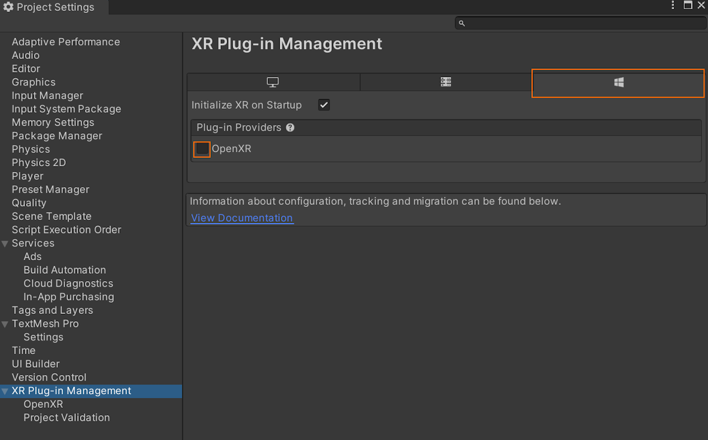
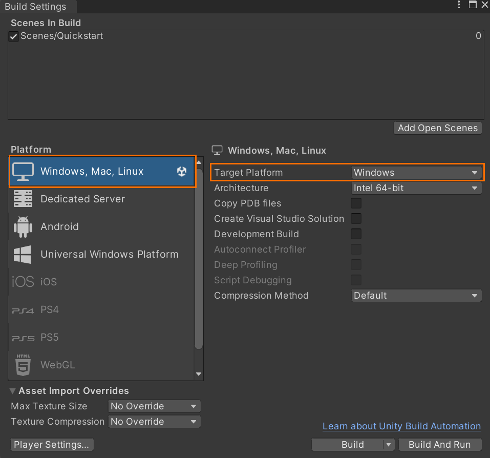
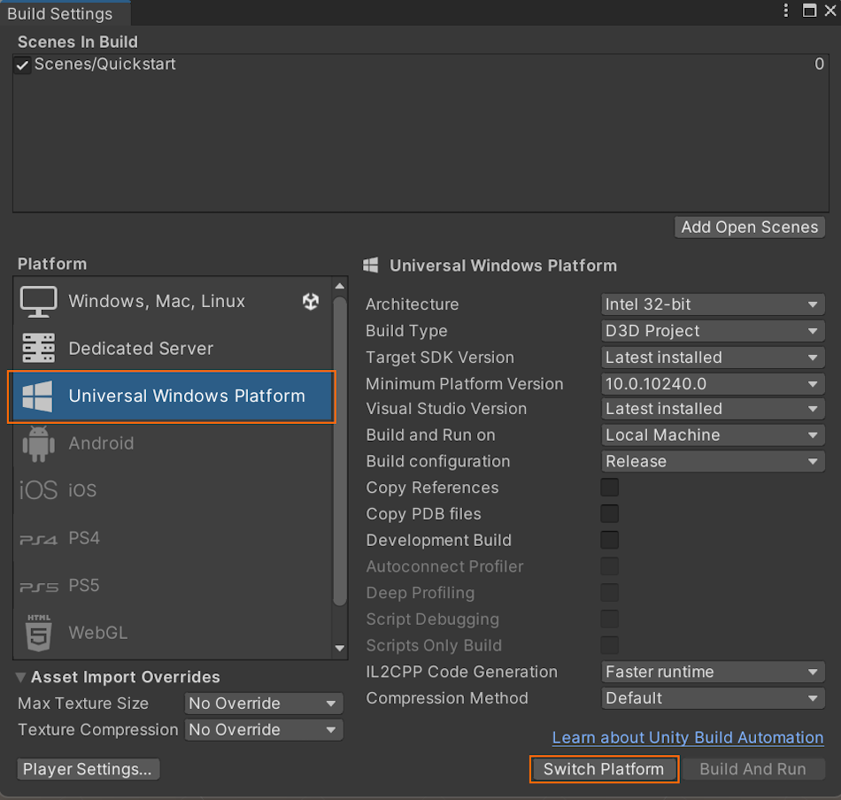

# Quickstart: Deploy Unity sample to Desktop

This quickstart covers how to deploy and run the quickstart sample app for Unity to a desktop PC.

In this quickstart, you learn how to:

> [!div class="checklist"]
>
>* Build the quickstart sample app for desktop
>* Deploy the sample to a PC
>* Run the sample on a PC

## Prerequisites

In this quickstart, we deploy the sample project from [Quickstart: Render a model with Unity](render-model.md).

Make sure your credentials are saved properly with the scene and you can connect to a session from within the Unity editor.

## Disable virtual reality support

Only flat desktop apps are currently supported on desktop so VR support has to be disabled.

# [Unity 2020+ - Standalone](#tab/Unity2020PlusSettingsStandalone)

1. In the standalone build VR support is automatically disabled. No steps are needed here.

# [Unity 2020+ - UWP](#tab/Unity2020PlusSettings)

1. Open *Edit > Project Settings...*
1. Select **XR Plugin Management** in the menu to the left.
1. Select the **Universal Windows Platform settings** tab.
1. Disable **OpenXR**.\
    

# [Unity 2019 - Legacy](#tab/Unity2020Settings)

1. Open *Edit > Project Settings...*
1. Select **Player** in the menu to the left.
1. Select the **Universal Windows Platform settings** tab.
1. Expand the **XR Settings**.
1. Disable **Virtual Reality Supported**.\
    
---

## Build the sample project

# [Unity 2021+ - Standalone](#tab/Unity2021PlusBuild)

1. Open *File > Build Settings*.
1. Change *Platform* to **PC, Mac & Linux Standalone**
1. Set *Target Platform* to **Windows**.\
  
1. Select **Switch to Platform**.
1. When pressing **Build** (or 'Build And Run'), you're asked to select some folder where the solution should be stored.

# [Unity 2021+ - UWP](#tab/Unity2021PlusBuild)

1. Open *File > Build Settings*.
1. Change *Platform* to **Universal Windows Platform**\
  
1. Select **Switch to Platform**.
1. When pressing **Build** (or 'Build And Run'), you're asked to select some folder where the solution should be stored.

# [Unity 2020](#tab/Unity2020Build)

1. Open *File > Build Settings*.
1. Change *Platform* to **Universal Windows Platform**
1. Set *Target Device* to **PC**.
1. Set *Architecture* to **x86**.
1. Set *Build Type* to **D3D Project**.\
  
1. Select **Switch to Platform**.
1. When pressing **Build** (or 'Build And Run'), you're asked to select some folder where the solution should be stored.

---

## Build the Visual Studio solution

1. Open the generated **Quickstart.sln** with Visual Studio.
1. Change the configuration to **Release** and **x86**.
1. Switch the debugger mode to **Local Machine**.\
  
1. Build the solution.

## Launch the sample project

Start the Debugger in Visual Studio (F5). It automatically deploys the app to the PC.

The sample app should launch and then start a new session. After a while, the session is ready and the remotely rendered model will appear in front of you.
If you want to launch the sample a second time later, you can also find it from the Start menu now.

## Next steps

In the next quickstart, we'll take a look at converting a custom model.

> [!div class="nextstepaction"]
> [Quickstart: Convert a model for rendering](convert-model.md)
