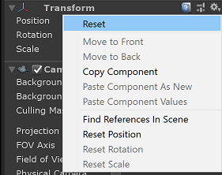
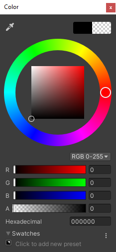
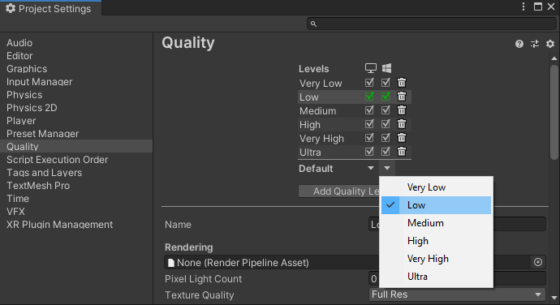
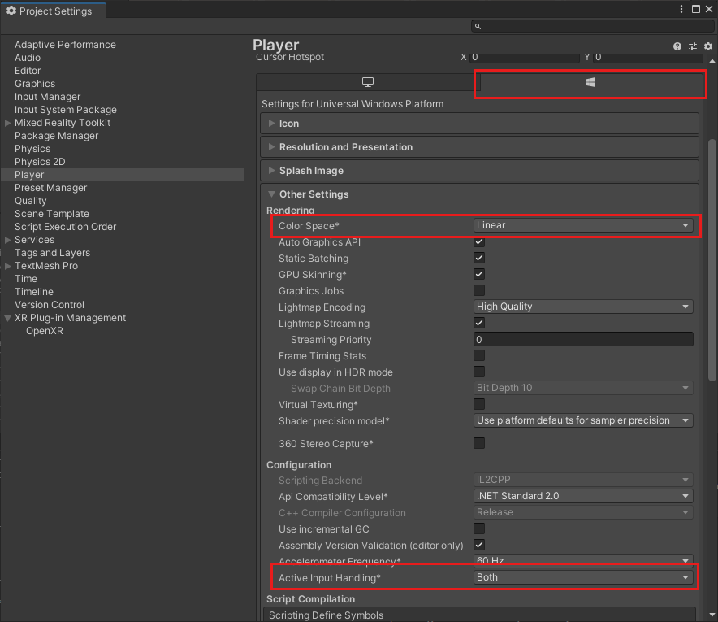
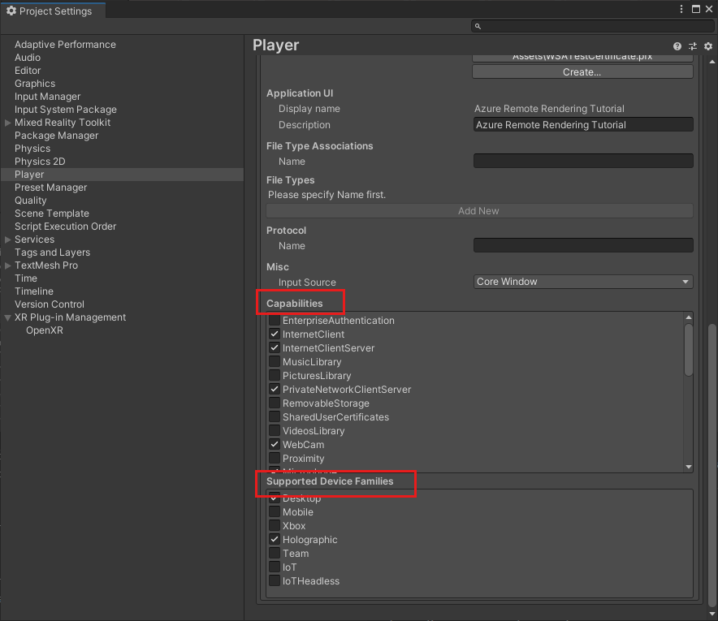
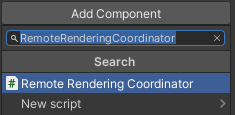
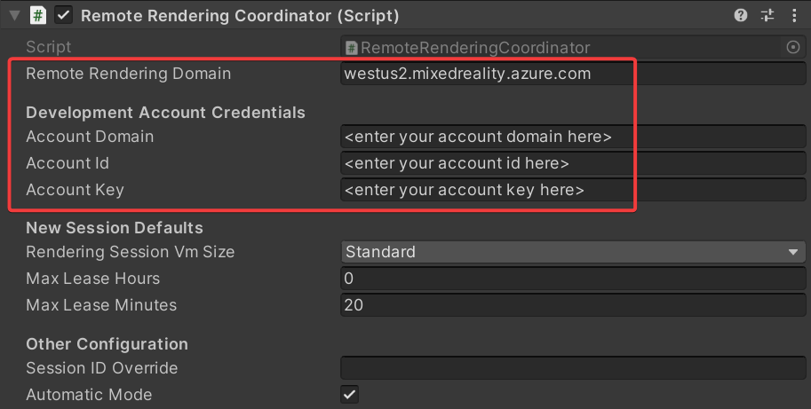
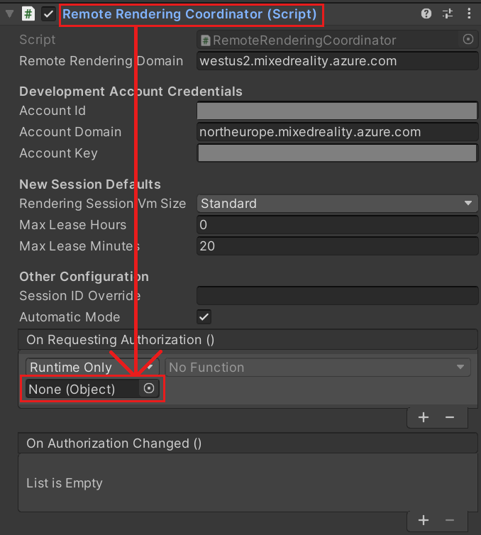
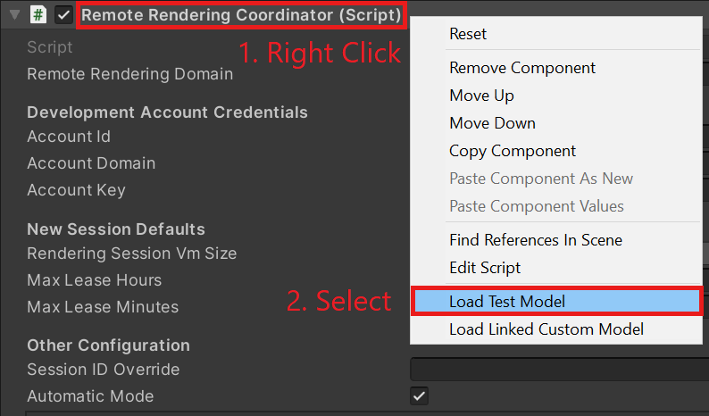

       
# Tutorial: Viewing a remotely rendered model

In this tutorial, you learn how to:

> [!div class="checklist"]
>
> * Provision an Azure Remote Rendering (ARR) instance
> * Create and stop a rendering session
> * Reuse an existing rendering session
> * Connect and disconnect from sessions
> * Load models into a rendering session

## Prerequisites

For this tutorial you need:

* An active pay-as-you-go Azure subscription [Create an account](https://azure.microsoft.com/pricing/purchase-options/pay-as-you-go/)
* Windows SDK 10.0.18362.0 [(download)](https://developer.microsoft.com/windows/downloads/windows-10-sdk)
* The latest version of Visual Studio 2022 [(download)](https://visualstudio.microsoft.com/vs/)
* Git [(download)](https://git-scm.com/downloads)
* Git LFS plugin [(download)](https://git-lfs.github.com/)
* Unity (see [system requirements](../../../overview/system-requirements.md#unity) for supported versions)
* Intermediate knowledge of Unity and the C# language (for example: creating scripts and objects, using prefabs, configuring Unity events, etc.)

## Provision an Azure Remote Rendering (ARR) instance

To get access to the Azure Remote Rendering service, you first need to [create an account](../../../how-tos/create-an-account.md#create-an-account).

## Create a new Unity project

> [!TIP]
> The [ARR samples repository](https://github.com/Azure/azure-remote-rendering) contains a project with all the tutorials completed, it can be used as a reference. Look in *Unity\Tutorial-Complete* for the complete Unity project.

From the Unity Hub, create a new project.
In this example, we'll assume the project is being created in a folder called **RemoteRendering**.

:::image type="content" source="./media/unity-new-project.PNG" alt-text="Screenshot of Unity Hub showing the Create a New Unity Project dialog. The panel 3D is selected.":::

## Include the Azure Remote Rendering and OpenXR packages

Follow the instructions on how to [add the Azure Remote Rendering and OpenXR packages](../../../how-tos/unity/install-remote-rendering-unity-package.md) to your Unity Project.

## Configure the camera

1. Select the **Main Camera** node.

1. Open the context menu by right-clicking on the *Transform* component and select the **Reset** option:

    

1. Set **Clear flags** to *Solid Color*

1. Set **Background** to *Black* (#000000), with fully transparent (0) alpha (A)

    

1. Set **Clipping Planes** to *Near = 0.1* and *Far = 20*. This means rendering will clip geometry that is closer than 10 cm or farther than 20 meters.

    

## Adjust the project settings

1. Open *Edit > Project Settings...*
1. Select **Quality** from the left list menu
    1. Change the **Default Quality Level** of all platforms to *Low*. This setting will enable more efficient rendering of local content and doesn't affect the quality of remotely rendered content.

        

    > [!NOTE]
    > In the scope of this tutorial, we stick with the Unity built-in render pipeline. If you would like to use the Universal Render Pipeline, see [Unity Render Pipelines](../../../how-tos/unity/unity-render-pipelines.md) for additional setup steps.

1. Select **XR Plugin Management** from the left list menu
    1. Click the **Install XR Plugin Management** button.
    1. Select the **Universal Windows Platform settings** tab, represented as a Windows icon.
    1. Click the **Open XR** checkbox under **Plug-In Providers**
    1. If a dialog opens that asks you to enable the native platform backends for the new input system click **No**.

    

    > [!NOTE]
    > If the **Microsoft HoloLens feature group** is disabled the Windows Mixed Reality OpenXR Plugin is missing from your project. Follow the instructions on how to [add the Azure Remote Rendering and OpenXR packages](../../../how-tos/unity/install-remote-rendering-unity-package.md) to install it.

1. Select **OpenXR** from the left list menu
    1. Set **Depth Submission Mode** to *Depth 16 Bit*
    1. Add the **Microsoft Hand Interaction Profile** to **Interaction Profiles**.
    1. Enable these OpenXR features:
        * **Hand Tracking**
        * **Mixed Reality Features**
        * **Motion Controller Model**

    

    > [!NOTE]
    > If you don't see the required OpenXR features listed the Windows Mixed Reality OpenXR Plugin is missing from your project. Follow the instructions on how to [add the Azure Remote Rendering and OpenXR packages](../../../how-tos/unity/install-remote-rendering-unity-package.md) to install it.

1. Select **Player** from the left list menu
    1. Select the **Universal Windows Platform settings** tab, represented as a Windows icon.
    1. Expand **Other Settings**
    1. Under **Rendering** change **Color Space** to **Linear** and restart Unity when it asks you to.
    1. Under **Configuration** change **Active Input Handling** to **Both** and restart Unity when it asks you to.
        
    1. Expand **Publishing Settings**
    1. Scroll down to **Capabilities** and select:
        * **InternetClient**
        * **InternetClientServer**
        * **SpatialPerception**
        * **PrivateNetworkClientServer** (*optional*). Select this option if you want to connect the Unity remote debugger to your device.
    1. Under **Supported Device Families**, enable **Holographic** and **Desktop**
        

1. Close or dock the **Project Settings** panel
1. Open *File->Build Settings*
    1. Select **Universal Windows Platform**
    1. Configure your settings to match those found below
    1. Press the **Switch Platform** button.\
    
1. After Unity changes platforms, close the build panel.

## Validate project setup

Perform the following steps to validate that the project settings are correct.

1. Choose the **ValidateProject** entry from the **RemoteRendering** menu in the Unity editor toolbar.
1. Review the **ValidateProject** window for errors and fix project settings where necessary.

    

> [!NOTE]
> If you use MRTK in your project and you enable the camera subsystem, MRTK will override manual changes that you apply to the camera. This includes fixes from the ValidateProject tool.

## Create a script to coordinate Azure Remote Rendering connection and state

There are four basic stages to show remotely rendered models, outlined in the flowchart below. Each stage must be performed in order. The next step is to create a script which will manage the application state and proceed through each required stage.


1. In the *Project* pane, under **Assets**, create a new folder called *RemoteRenderingCore*. Then inside *RemoteRenderingCore*, create another folder called *Scripts*.

1. Create a [new C# script](https://docs.unity3d.com/Manual/CreatingAndUsingScripts.html) called **RemoteRenderingCoordinator**.
Your project should look like this:

    

    This coordinator script will track and manage the remote rendering state. Of note, some of this code is used for maintaining state, exposing functionality to other components, triggering events, and storing application-specific data that is not *directly* related to Azure Remote Rendering. Use the code below as a starting point, and we'll address and implement the specific Azure Remote Rendering code later in the tutorial.

1. Open **RemoteRenderingCoordinator** in your code editor and replace its entire content with the code below:

```cs
// Copyright (c) Microsoft Corporation. All rights reserved.
// Licensed under the MIT License. See LICENSE in the project root for license information.

using Microsoft.Azure.RemoteRendering;
using Microsoft.Azure.RemoteRendering.Unity;
using System;
using System.Linq;
using System.Threading.Tasks;
using UnityEngine;
using UnityEngine.Events;

#if UNITY_WSA
using UnityEngine.XR.WSA;
#endif

/// <summary>
/// Remote Rendering Coordinator is the controller for all Remote Rendering operations.
/// </summary>

// Require the GameObject with a RemoteRenderingCoordinator to also have the ARRServiceUnity component
[RequireComponent(typeof(ARRServiceUnity))]
public class RemoteRenderingCoordinator : MonoBehaviour
{
    public enum RemoteRenderingState
    {
        NotSet,
        NotInitialized,
        NotAuthorized,
        NoSession,
        ConnectingToExistingRemoteSession,
        ConnectingToNewRemoteSession,
        RemoteSessionReady,
        ConnectingToRuntime,
        RuntimeConnected
    }

    public static RemoteRenderingCoordinator instance;

    // Account
    // RemoteRenderingDomain must be '<region>.mixedreality.azure.com' - if no '<region>' is specified, connections will fail
    // For most people '<region>' is either 'westus2' or 'westeurope'
    [SerializeField]
    private string remoteRenderingDomain = "westus2.mixedreality.azure.com";
    public string RemoteRenderingDomain
    {
        get => remoteRenderingDomain.Trim();
        set => remoteRenderingDomain = value;
    }

    [Header("Development Account Credentials")]
    [SerializeField]
    private string accountId = "<enter your account id here>";
    public string AccountId {
        get => accountId.Trim();
        set => accountId = value;
    }

    [SerializeField]
    private string accountDomain = "<enter your account domain here>";
    public string AccountDomain
    {
        get => accountDomain.Trim();
        set => accountDomain = value;
    }    

    [SerializeField]
    private string accountKey = "<enter your account key here>";
    public string AccountKey {
        get => accountKey.Trim();
        set => accountKey = value;
    }

    // These settings are important. All three should be set as low as possible, while maintaining a good user experience
    // See the documentation around session management and the technical differences in session VM size
    [Header("New Session Defaults")]

    public RenderingSessionVmSize renderingSessionVmSize = RenderingSessionVmSize.Standard;
    public uint maxLeaseHours = 0;
    public uint maxLeaseMinutes = 20;

    [Header("Other Configuration")]

    [Tooltip("If you have a known active SessionID, you can fill it in here before connecting")]
    [SerializeField]
    private string sessionIDOverride;
    public string SessionIDOverride {
        get => sessionIDOverride.Trim();
        set => sessionIDOverride = value;
    }

    // When Automatic Mode is true, the coordinator will attempt to automatically proceed through the process of connecting and loading a model
    public bool automaticMode = true;

    public event Action RequestingAuthorization;
    public UnityEvent OnRequestingAuthorization = new UnityEvent();

    public event Action AuthorizedChanged;
    public UnityEvent OnAuthorizationChanged = new UnityEvent();
    private bool authorized;
    public bool Authorized
    {
        get => authorized;
        set
        {
            if (value == true) //This is a one-way value, once we're authorized it lasts until the app is shutdown.
            {
                authorized = value;
                AuthorizedChanged?.Invoke();
            }
        }
    }

    public delegate Task<SessionConfiguration> AccountInfoGetter();

    public static AccountInfoGetter ARRCredentialGetter
    {
        private get;
        set;
    }

    private RemoteRenderingState currentCoordinatorState = RemoteRenderingState.NotSet;
    public RemoteRenderingState CurrentCoordinatorState
    {
        get => currentCoordinatorState;
        private set
        {
            if (currentCoordinatorState != value)
            {
                currentCoordinatorState = value;
                Debug.LogFormat(LogType.Log, LogOption.NoStacktrace, null, "{0}", $"State changed to: {currentCoordinatorState}");
                CoordinatorStateChange?.Invoke(currentCoordinatorState);
            }
        }
    }

    public static event Action<RemoteRenderingState> CoordinatorStateChange;

    public static RenderingSession CurrentSession => instance?.ARRSessionService?.CurrentActiveSession;

    private ARRServiceUnity arrSessionService;

    private ARRServiceUnity ARRSessionService
    {
        get
        {
            if (arrSessionService == null)
                arrSessionService = GetComponent<ARRServiceUnity>();
            return arrSessionService;
        }
    }

    private async Task<SessionConfiguration> GetDevelopmentCredentials()
    {
        Debug.LogWarning("Using development credentials! Not recommended for production.");
        return await Task.FromResult(new SessionConfiguration(AccountDomain, RemoteRenderingDomain, AccountId, AccountKey));
    }

    /// <summary>
    /// Keep the last used SessionID, when launching, connect to this session if its available
    /// </summary>
    private string LastUsedSessionID
    {
        get
        {
            if (!string.IsNullOrEmpty(SessionIDOverride))
                return SessionIDOverride;

            if (PlayerPrefs.HasKey("LastUsedSessionID"))
                return PlayerPrefs.GetString("LastUsedSessionID");
            else
                return null;
        }
        set
        {
            PlayerPrefs.SetString("LastUsedSessionID", value);
        }
    }

    public void Awake()
    {
        //Forward events to Unity events
        RequestingAuthorization += () => OnRequestingAuthorization?.Invoke();
        AuthorizedChanged += () => OnAuthorizationChanged?.Invoke();

        //Attach to event
        AuthorizedChanged += RemoteRenderingCoordinator_AuthorizedChanged;

        if (instance == null)
            instance = this;
        else
            Destroy(this);

        CoordinatorStateChange += AutomaticMode;

        CurrentCoordinatorState = RemoteRenderingState.NotInitialized;
    }

    private void RemoteRenderingCoordinator_AuthorizedChanged()
    {
        if (CurrentCoordinatorState != RemoteRenderingState.NotAuthorized)
            return; //This isn't valid from any other state than NotAuthorized


        //We just became authorized to connect to Azure
        InitializeSessionService();
    }

    /// <summary>
    /// Automatic mode attempts to automatically progress through the connection and loading steps. Doesn't handle error states.
    /// </summary>
    /// <param name="currentState">The current state</param>
    private async void AutomaticMode(RemoteRenderingState currentState)
    {
        if (!automaticMode)
            return;

        //Add a small delay for visual effect
        await Task.Delay(1500);
        switch (currentState)
        {
            case RemoteRenderingState.NotInitialized:
                InitializeARR();
                break;
            case RemoteRenderingState.NotAuthorized:
                RequestAuthorization();
                break;
            case RemoteRenderingState.NoSession:
                JoinRemoteSession();
                break;
            case RemoteRenderingState.RemoteSessionReady:
                ConnectRuntimeToRemoteSession();
                break;
        }
    }

    /// <summary>
    /// Initializes ARR, associating the main camera
    /// Note: This must be called on the main Unity thread
    /// </summary>
    public void InitializeARR()
    {
        //Implement me
    }

    /// <summary>
    /// Create a new remote session manager
    /// If the ARRCredentialGetter is set, use it as it, otherwise use the development credentials 
    /// </summary>
    public async void InitializeSessionService()
    {
        //Implement me
    }

    /// <summary>
    /// Trigger the event for checking authorization, respond to this event by prompting the user for authentication
    /// If authorized, set Authorized = true
    /// </summary>
    public void RequestAuthorization()
    {
        RequestingAuthorization?.Invoke();
    }

    public void BypassAuthorization()
    {
        Authorized = true;
    }

    /// <summary>
    /// Attempts to join an existing session or start a new session
    /// </summary>
    public async void JoinRemoteSession()
    {
        //Implement me
    }

    public async void StopRemoteSession()
    {
        //Implement me
    }

    private async Task<bool> IsSessionAvailable(string sessionID)
    {
        bool sessionAvailable = false;
        try
        {
            RenderingSessionPropertiesArrayResult result = await ARRSessionService.Client.GetCurrentRenderingSessionsAsync();
            if (result.ErrorCode == Result.Success)
            {
                RenderingSessionProperties[] properties = result.SessionProperties;
                if (properties != null)
                {
                    sessionAvailable = properties.Any(x => x.Id == sessionID && (x.Status == RenderingSessionStatus.Ready || x.Status == RenderingSessionStatus.Starting));
                }
            }
            else
            {
                Debug.LogError($"Failed to get current rendering sessions. Error: {result.Context.ErrorMessage}");
            }
        }
        catch (RRException ex)
        {
            Debug.LogError($"Failed to get current rendering sessions. Error: {ex.Message}");
        }
        return sessionAvailable;
    }

    /// <summary>
    /// Connects the local runtime to the current active session, if there's a session available
    /// </summary>
    public async void ConnectRuntimeToRemoteSession()
    {
        //Implement me
    }

    public void DisconnectRuntimeFromRemoteSession()
    {
        //Implement me
    }

    /// <summary>
    /// The session must have its runtime pump updated.
    /// The Connection.Update() will push messages to the server, receive messages, and update the frame-buffer with the remotely rendered content.
    /// </summary>
    private void LateUpdate()
    {
        ARRSessionService?.CurrentActiveSession?.Connection?.Update();
    }

    /// <summary>
    /// Loads a model into the remote session for rendering
    /// </summary>
    /// <param name="modelPath">The model's path</param>
    /// <param name="progress">A call back method that accepts a float progress value [0->1]</param>
    /// <param name="parent">The parent Transform for this remote entity</param>
    /// <returns>An awaitable Remote Rendering Entity</returns>
    public async Task<Entity> LoadModel(string modelPath, Transform parent = null, Action<float> progress = null)
    {
        //Implement me
        return null;
    }

    private async void OnRemoteSessionStatusChanged(ARRServiceUnity caller, RenderingSession session)
    {
        var properties = await session.GetPropertiesAsync();

        switch (properties.SessionProperties.Status)
        {
            case RenderingSessionStatus.Error:
            case RenderingSessionStatus.Expired:
            case RenderingSessionStatus.Stopped:
            case RenderingSessionStatus.Unknown:
                CurrentCoordinatorState = RemoteRenderingState.NoSession;
                break;
            case RenderingSessionStatus.Starting:
                CurrentCoordinatorState = RemoteRenderingState.ConnectingToNewRemoteSession;
                break;
            case RenderingSessionStatus.Ready:
                CurrentCoordinatorState = RemoteRenderingState.RemoteSessionReady;
                break;
        }
    }

    private void OnLocalRuntimeStatusChanged(ConnectionStatus status, Result error)
    {
        switch (status)
        {
            case ConnectionStatus.Connected:
                CurrentCoordinatorState = RemoteRenderingState.RuntimeConnected;
                break;
            case ConnectionStatus.Connecting:
                CurrentCoordinatorState = RemoteRenderingState.ConnectingToRuntime;
                break;
            case ConnectionStatus.Disconnected:
                CurrentCoordinatorState = RemoteRenderingState.RemoteSessionReady;
                break;
        }
    }
}
```

## Create the Azure Remote Rendering GameObject

The remote rendering coordinator and its required script (*ARRServiceUnity*) are both MonoBehaviours that must be attached to a GameObject in the scene. The *ARRServiceUnity* script is provided by ARR to expose much of ARR's functionality for connecting to and managing remote sessions.

1. Create a new GameObject in the scene (Ctrl+Shift+N or *GameObject->Create Empty*) and name it **RemoteRenderingCoordinator**.
1. Add the *RemoteRenderingCoordinator* script to the **RemoteRenderingCoordinator** GameObject.\

1. Confirm the *ARRServiceUnity* script, appearing as *Service* in the inspector, is automatically added to the GameObject. In case you're wondering, this is a result having `[RequireComponent(typeof(ARRServiceUnity))]` at the top of the **RemoteRenderingCoordinator** script.
1. Add your Azure Remote Rendering credentials, your Account Domain, and the Remote Rendering Domain to the coordinator script:\


## Initialize Azure Remote Rendering

Now that we have the framework for our coordinator, we will implement each of the four stages starting with **Initialize Remote Rendering**.


**Initialize** tells Azure Remote Rendering which camera object to use for rendering and progresses the state machine into **NotAuthorized**. This means it's initialized but not yet authorized to connect to a session. Since starting an ARR session incurs a cost, we need to confirm the user wants to proceed.

When entering the **NotAuthorized** state, **CheckAuthorization** is called, which invokes the **RequestingAuthorization** event and determines which account credentials to use (**AccountInfo** is defined near the top of the class and uses the credentials you defined via the Unity Inspector in the step above).

   > [!NOTE]
   > Runtime recompilation is not supported by ARR. Modifying the script and saving it while the play mode is active may result in Unity freezing and needing to force shut down through the task manager. Always ensure you've stopped play mode before editing your scripts.

1. Replace the contents of **InitializeARR** and **InitializeSessionService** with the completed code below:

 ```cs
/// <summary>
/// Initializes ARR, associating the main camera
/// Note: This must be called on the main Unity thread
/// </summary>
public void InitializeARR()
{
    RemoteManagerUnity.InitializeManager(new RemoteUnityClientInit(Camera.main));

    CurrentCoordinatorState = RemoteRenderingState.NotAuthorized;
}

/// <summary>
/// Create a new remote session manager
/// If the ARRCredentialGetter is set, use it as it, otherwise use the development credentials 
/// </summary>
public async void InitializeSessionService()
{
    if (ARRCredentialGetter == null)
        ARRCredentialGetter = GetDevelopmentCredentials;

    var sessionConfiguration = await ARRCredentialGetter.Invoke();

    ARRSessionService.OnSessionStatusChanged += OnRemoteSessionStatusChanged;

    try
    {
        ARRSessionService.Initialize(sessionConfiguration);
    }
    catch (ArgumentException argumentException)
    {
        Debug.LogError(argumentException.Message);
        CurrentCoordinatorState = RemoteRenderingState.NotAuthorized;
        return;
    }

    CurrentCoordinatorState = RemoteRenderingState.NoSession;
}
```

In order to progress from **NotAuthorized** to **NoSession**, we'd typically present a modal dialog to the user so they can choose (and we'll do just that in another chapter). For now, we'll automatically bypass the authorization check by calling **ByPassAuthentication** as soon as the **RequestingAuthorization** event is triggered.

1. Select the **RemoteRenderingCoordinator** GameObject and find the **OnRequestingAuthorization** Unity Event exposed in the Inspector of the **RemoteRenderingCoordinator** component.

1. Add a new event by pressing the '+' in the lower right.
1. Drag the component on to its own event, to reference itself.

1. In the drop down select **RemoteRenderingCoordinator -> BypassAuthorization**.\


## Create or join a remote session

The second stage is to Create or Join a Remote Rendering Session (see [Remote Rendering Sessions](../../../concepts/sessions.md) for more information).


The remote session is where the models will be rendered. The **JoinRemoteSession( )** method will attempt to join an existing session, tracked with the **LastUsedSessionID** property or if there is an assigned active session ID on **SessionIDOverride**. **SessionIDOverride** is intended for your debugging purposes only, it should only be used when you know the session exists and would like to explicitly connect to it.

If no sessions are available, a new session will be created. Creating a new session is, however, a time-consuming operation. Therefore, you should try to create sessions only when required and reuse them whenever possible (see [Commercial Ready: Session pooling, scheduling, and best practices](../commercial-ready/commercial-ready.md#fast-startup-time-strategies) for more information on managing sessions).

> [!TIP]
> **StopRemoteSession()** will end the active session. To prevent unnecessary charges, you should always stop sessions when they are no longer needed.

The state machine will now progress to either **ConnectingToNewRemoteSession** or **ConnectingToExistingRemoteSession**, depending on available sessions. Both opening an existing session or creating a new session will trigger the **ARRSessionService.OnSessionStatusChanged** event, executing our **OnRemoteSessionStatusChanged** method. Ideally, this will result in advancing the state machine to **RemoteSessionReady**.

1. To join a new session, modify the code to replace the **JoinRemoteSession( )** and **StopRemoteSession( )** methods with the completed examples below:

```cs
/// <summary>
/// Attempts to join an existing session or start a new session
/// </summary>
public async void JoinRemoteSession()
{
    //If there's a session available that previously belonged to us, and it's ready, use it. Otherwise start a new session.
    RenderingSessionProperties joinResult;
    if (await IsSessionAvailable(LastUsedSessionID))
    {
        CurrentCoordinatorState = RemoteRenderingState.ConnectingToExistingRemoteSession;
        joinResult = await ARRSessionService.OpenSession(LastUsedSessionID);
    }
    else
    {
        CurrentCoordinatorState = RemoteRenderingState.ConnectingToNewRemoteSession;
        joinResult = await ARRSessionService.StartSession(new RenderingSessionCreationOptions(renderingSessionVmSize, (int)maxLeaseHours, (int)maxLeaseMinutes));
    }

    if (joinResult.Status == RenderingSessionStatus.Ready || joinResult.Status == RenderingSessionStatus.Starting)
    {
        LastUsedSessionID = joinResult.Id;
    }
    else
    {
        //The session should be ready or starting, if it's not, something went wrong
        await ARRSessionService.StopSession();
        if(LastUsedSessionID == SessionIDOverride)
            SessionIDOverride = "";
        CurrentCoordinatorState = RemoteRenderingState.NoSession;
    }
}

public async void StopRemoteSession()
{
    if (ARRSessionService.CurrentActiveSession != null)
    {
        await ARRSessionService.CurrentActiveSession.StopAsync();
    }
}
```

If you want to save time by reusing sessions, make sure to deactivate the option **Auto-Stop Session** in the *ARRServiceUnity* component. Keep in mind that this will leave sessions running, even when no one is connected to them. Your session may run for as long as your *MaxLeaseTime* before it is shut down by the server (The value for *MaxLeaseTime* can be modified in the Remote Rendering Coordinator, under *New Session Defaults*). On the other hand, if you automatically shut down every session when disconnecting, you will have to wait for a new session to be started every time, which can be a somewhat lengthy process.

> [!NOTE]
> Stopping a session will take immediate effect and cannot be undone. Once stopped, you have to create a new session, with the same startup overhead.

## Connect the local runtime to the remote session

Next, the application needs to connect its local runtime to the remote session.


The application also needs to listen for events about the connection between the runtime and the current session; those state changes are handled in **OnLocalRuntimeStatusChanged**. This code will advance our state to **ConnectingToRuntime**. Once connected in **OnLocalRuntimeStatusChanged**, the state will advance to **RuntimeConnected**. Connecting to the runtime is the last state the coordinator concerns itself with, which means the application is done with all the common configuration and is ready to begin the session-specific work of loading and rendering models.

 1. Replace the **ConnectRuntimeToRemoteSession( )** and **DisconnectRuntimeFromRemoteSession( )** methods with the completed versions below.
 1. It's important to take note of the Unity method **LateUpdate** and that it's updating the current active session. This allows the current session to send/receive messages and update the frame buffer with the frames received from the remote session. It's critical to ARR functioning correctly.

```cs
/// <summary>
/// Connects the local runtime to the current active session, if there's a session available
/// </summary>
public async void ConnectRuntimeToRemoteSession()
{
    if (ARRSessionService == null || ARRSessionService.CurrentActiveSession == null)
    {
        Debug.LogError("Not ready to connect runtime");
        return;
    }

    // Connect the local runtime to the currently connected session
    // This session is set when connecting to a new or existing session

    ARRSessionService.CurrentActiveSession.ConnectionStatusChanged += OnLocalRuntimeStatusChanged;
    await ARRSessionService.CurrentActiveSession.ConnectAsync(new RendererInitOptions());
}

public void DisconnectRuntimeFromRemoteSession()
{
    if (ARRSessionService == null || ARRSessionService.CurrentActiveSession == null || ARRSessionService.CurrentActiveSession.ConnectionStatus != ConnectionStatus.Connected)
    {
        Debug.LogError("Runtime not connected!");
        return;
    }

    ARRSessionService.CurrentActiveSession.Disconnect();
    ARRSessionService.CurrentActiveSession.ConnectionStatusChanged -= OnLocalRuntimeStatusChanged;
    CurrentCoordinatorState = RemoteRenderingState.RemoteSessionReady;
}
```

> [!NOTE]
> Connecting the local runtime to a remote session depends on **Update** being called on the currently active session. If you find your application is never progressing past the **ConnectingToRuntime** state, ensure you're calling **Update** regularly on the active session.

## Load a model

With the required foundation in place, you are ready to load a model into the remote session and start receiving frames.


The **LoadModel** method is designed to accept a model path, progress handler, and parent transform. These arguments will be used to load a model into the remote session, update the user on the loading progress, and orient the remotely rendered model based on the parent transform.

1. Replace the **LoadModel** method entirely with the code below:

    ```cs
    /// <summary>
    /// Loads a model into the remote session for rendering
    /// </summary>
    /// <param name="modelName">The model's path</param>
    /// <param name="parent">The parent Transform for this remote entity</param>
    /// <param name="progress">A call back method that accepts a float progress value [0->1]</param>
    /// <returns>An awaitable Remote Rendering Entity</returns>
    public async Task<Entity> LoadModel(string modelPath, Transform parent = null, Action<float> progress = null)
    {
        //Create a root object to parent a loaded model to
        var modelEntity = ARRSessionService.CurrentActiveSession.Connection.CreateEntity();

        //Get the game object representation of this entity
        var modelGameObject = modelEntity.GetOrCreateGameObject(UnityCreationMode.DoNotCreateUnityComponents);

        //Ensure the entity will sync its transform with the server
        var sync = modelGameObject.GetComponent<RemoteEntitySyncObject>();
        sync.SyncEveryFrame = true;

        //Parent the new object under the defined parent
        if (parent != null)
        {
            modelGameObject.transform.SetParent(parent, false);
            modelGameObject.name = parent.name + "_Entity";
        }

        //Load a model that will be parented to the entity
        var loadModelParams = new LoadModelFromSasOptions(modelPath, modelEntity);
        var loadModelAsync = ARRSessionService.CurrentActiveSession.Connection.LoadModelFromSasAsync(loadModelParams, progress);
        var result = await loadModelAsync;
        return modelEntity;
    }
    ```

The code above is performing the following steps:

1. Create a [Remote Entity](../../../concepts/entities.md).
1. Create a local GameObject to represent the remote entity.
1. Configure the local GameObject to sync its state (i.e. Transform) to the remote entity every frame.
1. Load model data from Blob Storage into the remote entity.
1. Return the parent Entity, for later reference.

## View the test model

We now have all the code required to view a remotely rendered model, all four of the required stages for remote rendering are complete. Now we need to add a little code to start the model load process.


1. Add the following code to the **RemoteRenderingCoordinator** class, just below the **LoadModel** method is fine:

    ```cs
    private bool loadingTestModel = false;
    [ContextMenu("Load Test Model")]
    public async void LoadTestModel()
    {
        if(CurrentCoordinatorState != RemoteRenderingState.RuntimeConnected)
        {
            Debug.LogError("Please wait for the runtime to connect before loading the test model. Try again later.");
            return;
        }
        if(loadingTestModel)
        {
            Debug.Log("Test model already loading or loaded!");
            return;
        }
        loadingTestModel = true;
    
        // Create a parent object to use for positioning
        GameObject testParent = new GameObject("TestModelParent");
        testParent.transform.position = new Vector3(0f, 0f, 3f);
    
        // The 'built in engine path' is a special path that references a test model built into Azure Remote Rendering.
        await LoadModel("builtin://Engine", testParent.transform, (progressValue) => Debug.Log($"Loading Test Model progress: {Math.Round(progressValue * 100, 2)}%"));
    }
    ```
    
    This code creates a GameObject to act as the parent to the test model. Then it calls the **LoadModel** method to load the model "builtin://Engine", which is an asset built into Azure Remote Rendering for the purpose of testing the rendering.

1. Save your code.
1. Press the Play button in the Unity Editor to start the process of connecting to Azure Remote Rendering and creating a new session.
1. You will not see much in the Game view, however, the Console will show the state of the application changing. It will likely progress to `ConnectingToNewRemoteSession`, and stay there, possibly for up to five minutes.
1. Select the **RemoteRenderingCoordinator** GameObject to see its attached scripts in the inspector. Watch the **Service** component update as it progresses through its initialization and connection steps.
1. Monitor the Console output - waiting for the state to change to **RuntimeConnected**.
1. Once the runtime is connected, right-click on the **RemoteRenderingCoordinator** in the inspector to expose the context menu. Then, click the **Load Test Model** option in the context menu, added by the `[ContextMenu("Load Test Model")]` part of our code above.

    

1. Watch the Console for the output of the **ProgressHandler** we passed into the **LoadModel** method.
1. See the remotely rendered model!

> [!NOTE]
> The remote model will never be visible in the Scene view, only in the game view. This is because ARR is rendering the frames remotely specifically for the perspective of the Game view camera and isn't aware of the Editor camera (used to render the Scene view).

## Next steps


Congratulations! You've created a basic application capable of viewing remotely rendered models using Azure Remote Rendering. In the next tutorial, we will integrate MRTK and import our own models.

> [!div class="nextstepaction"]
> [Next: Interfaces and custom models](../custom-models/custom-models.md)
