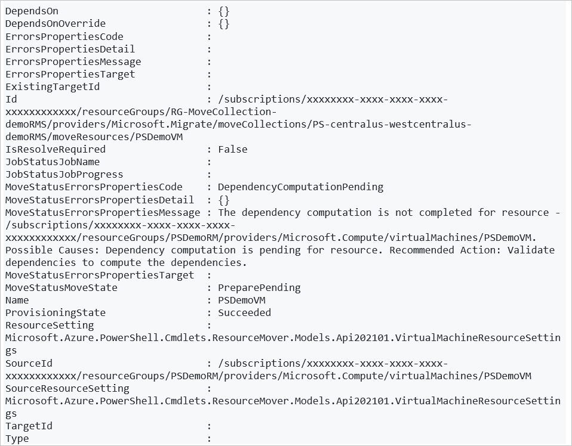
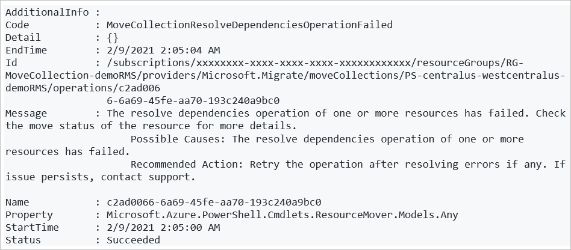
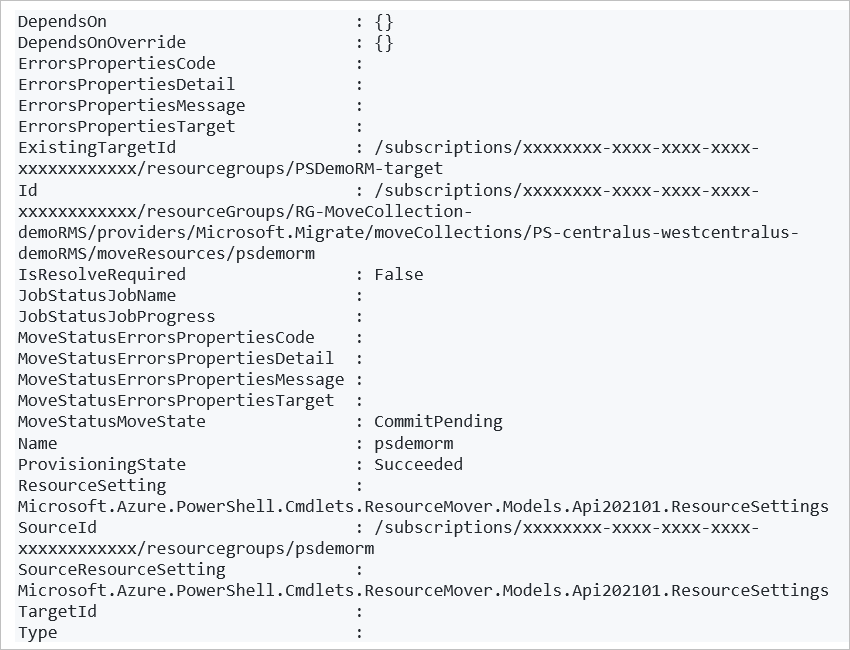
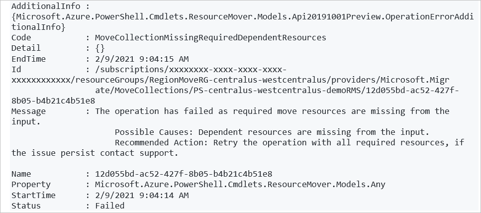

# Move resources across regions in PowerShell

This article explains how to move Azure resources to a different Azure region, using PowerShell in [Azure Resource Mover](overview.md).

In this tutorial, you learn how to:

> [!div class="checklist"]
> * Check prerequisites and requirements.
> * Set up the move collection.
> * Add resources to the move collection, and resolve dependencies.
> * Prepare and move the source resource group.
> * Prepare and move the other resources.
> * Decide whether you want to discard or commit the move.
> * Optionally remove resources in the source region after the move.

> [!NOTE]
> Tutorials show the quickest path for trying out a scenario, and use default options.

If you don't have an Azure subscription, create a [free account](https://azure.microsoft.com/pricing/free-trial/) before you begin. Then sign in to the [Azure portal](https://portal.azure.com).

## Prerequisites

**Requirement** | **Description**
--- | ---
**Subscription permissions** | Check you have *Owner* access on the subscription containing the resources that you want to move<br/><br/> **Why do I need Owner access?** The first time you add a resource for a  specific source and destination pair in an Azure subscription, Resource Mover creates a [system-assigned managed identity](../active-directory/managed-identities-azure-resources/overview.md#managed-identity-types) (formerly known as Managed Service Identify (MSI)) that's trusted by the subscription. To create the identity, and to assign it the required role (Contributor or User Access administrator in the source subscription), the account you use to add resources needs *Owner* permissions on the subscription. [Learn more](../role-based-access-control/rbac-and-directory-admin-roles.md#azure-roles) about Azure roles.
**Resource Mover support** | [Review](common-questions.md) supported regions and other common questions.
**VM support** |  Check that any VMs you want to move are supported.<br/><br/> - [Verify](support-matrix-move-region-azure-vm.md#windows-vm-support) supported Windows VMs.<br/><br/> - [Verify](support-matrix-move-region-azure-vm.md#linux-vm-support) supported Linux VMs and kernel versions.<br/><br/> - Check supported [compute](support-matrix-move-region-azure-vm.md#supported-vm-compute-settings), [storage](support-matrix-move-region-azure-vm.md#supported-vm-storage-settings), and [networking](support-matrix-move-region-azure-vm.md#supported-vm-networking-settings) settings.
**SQL support** | If you want to move SQL resources, review the [SQL requirements list](tutorial-move-region-sql.md#check-sql-requirements).
**Destination subscription** | The subscription in the destination region needs enough quota to create the resources you're moving in the target region. If it doesn't have quota, [request additional limits](../azure-resource-manager/management/azure-subscription-service-limits.md).
**Destination region charges** | Verify pricing and charges associated with the target region to which you're moving VMs. Use the [pricing calculator](https://azure.microsoft.com/pricing/calculator/) to help you.

### Review PowerShell requirements

Most move resources operations are the same whether using the Azure portal or PowerShell, with a couple of exceptions.

**Operation** | **Portal** | **PowerShell**
--- | --- | ---
**Create a move collection** | A move collection (a list of all the resources you're moving) is created automatically. Required identity permissions are assigned in the backend by the portal. | You use PowerShell cmdlets to:<br/><br/> - Create a resource group for the move collection and specify the location for it.<br/><br/> - Assign a managed identity to the collection.<br/><br/> - Add resources to the collection.
**Remove a move collection** | You can't directly remove a move collection in the portal. | You use a PowerShell cmdlet to remove a move collection.
**Resource move operations**<br/><br/> (Prepare, initiate move, commit etc.).| Single steps with automatic validation by Resource Mover. | PowerShell cmdlets to:<br/><br/> 1) Validate dependencies.<br/><br/> 2) Perform the move.
**Delete source resources** | Directly in the Resource Mover portal. | PowerShell cmdlets at the resource-type level.

### Sample values

We're using these values in our script examples:

**Setting** | **Value**
--- | ---
Subscription ID | subscription-id
Source region |  Central US
Target region | West Central US
Resource group (holding metadata for move collection) | RG-MoveCollection-demoRMS
Move collection name | PS-centralus-westcentralus-demoRMS
Resource group (source region) | PSDemoRM
Resource group (target region) | PSDemoRM-target
Resource Move service location | East US 2
IdentityType | SystemAssigned
VM to move | PSDemoVM

## Sign in to Azure

Sign in to your Azure subscription with the Connect-AzAccount cmdlet:

```azurepowershell-interactive
Connect-AzAccount – Subscription "<subscription-id>"
```

## Set up the move collection

The MoveCollection object stores metadata and configuration information about resources you want to move. To set up a move collection, you do the following:

- Create a resource group for the move collection.
- Register the service provider to the subscription, so that the MoveCollection resource can be created.
- Create the MoveCollection object with managed identity. For the MoveCollection object to access the subscription in which the Resource Mover service is located, it needs a [system-assigned managed identity](../active-directory/managed-identities-azure-resources/overview.md#managed-identity-types) (formerly known as Managed Service Identity (MSI)) that's trusted by the subscription.
- Grant access to the Resource Mover subscription for the managed identity.

### Create the resource group

Create a resource group for the move collection metadata and configuration information, as follows:

```azurepowershell-interactive
New-AzResourceGroup -Name "RG-MoveCollection-demoRMS" -Location "East US 2"
```

**Output**:


### Register the resource provider

1. Register the resource provider Microsoft.Migrate, so that the MoveCollection resource can be created, as follows:

    ```azurepowershell-interactive
    Register-AzResourceProvider -ProviderNamespace Microsoft.Migrate
    ```

2. Wait for registration:

    ```azurepowershell-interactive
    While(((Get-AzResourceProvider -ProviderNamespace Microsoft.Migrate)| where {$_.RegistrationState -eq "Registered" -and $_.ResourceTypes.ResourceTypeName -eq "moveCollections"}|measure).Count -eq 0)
    {
        Start-Sleep -Seconds 5
        Write-Output "Waiting for registration to complete."
    }
    ```

### Create a MoveCollection object

Create a MoveCollection object, and assign a managed identity to it, as follows:

```azurepowershell-interactive
New-AzResourceMoverMoveCollection -Name "PS-centralus-westcentralus-demoRMS"  -ResourceGroupName "RG-MoveCollection-demoRMS" -SourceRegion "centralus" -TargetRegion "westcentralus" -Location "centraluseuap" -IdentityType "SystemAssigned"
```

**Output**:


### Grant access to the managed identity

Grant the managed identity access to the Resource Mover subscription as follows. You must be the subscription owner.

1. Retrieve identity details from the MoveCollection object.

    ```azurepowershell-interactive
    $moveCollection = Get-AzResourceMoverMoveCollection -SubscriptionId $subscriptionId -ResourceGroupName "RG-MoveCollection-demoRMS" -Name "PS-centralus-westcentralus-demoRMS"

    $identityPrincipalId = $moveCollection.IdentityPrincipalId
    ```

2. Assign the required roles to the identity so Azure Resource Mover can access your subscription to help move resources.

    ```azurepowershell-interactive
    New-AzRoleAssignment -ObjectId $identityPrincipalId -RoleDefinitionName Contributor -Scope "/subscriptions/$subscriptionId"

    New-AzRoleAssignment -ObjectId $identityPrincipalId -RoleDefinitionName "User Access Administrator" -Scope "/subscriptions/$subscriptionId"
    ```

## Add resources to the move collection

Retrieve the IDs for existing source resources you want to move. Create the destination resource settings object, then add resources to the move collection.

> [!NOTE]
> Resources added to a move collection must be in the same subscription, but can be in different resource groups.

Add resources as follows:

1. Get the source resource ID:

    ```azurepowershell-interactive
    Get-AzResource -Name PSDemoVM -ResourceGroupName PSDemoRM
    ```

    **Output**

    

2. Create the target resource settings object in accordance with the resource you're moving. In our case it's a VM.

    ```azurepowershell-interactive
    $targetResourceSettingsObj = New-Object Microsoft.Azure.PowerShell.Cmdlets.ResourceMover.Models.Api202101.VirtualMachineResourceSettings
    ```

3. Set the resource type and target resource name for the object.

    ```azurepowershell-interactive
    $targetResourceSettingsObj.ResourceType = "Microsoft.Compute/virtualMachines"
    $targetResourceSettingsObj.TargetResourceName = "PSDemoVM"
    ```

    > [!NOTE]
    > Our target VM has the same name as the VM in the source region. You can choose a different name.

4. Add the source resources to the move collection, using the resource ID and target settings object you retrieved/created.

    ```azurepowershell-interactive
    Add-AzResourceMoverMoveResource -ResourceGroupName "RG-MoveCollection-demoRMS" -MoveCollectionName "PS-centralus-westcentralus-demoRMS" -SourceId "/subscriptions/xxxxxxxx-xxxx-xxxx-xxxx xxxxxxxxxxxx/resourceGroups/
    PSDemoRM/providers/Microsoft.Compute/virtualMachines/PSDemoVM" -Name "PSDemoVM" -ResourceSetting $targetResourceSettingsObj
    ```

    **Output**
    

## Validate and add dependencies

Check whether the resources you added have any dependencies on other resources, and add as needed.

1. Validate dependencies as follows:

    ```azurepowershell-interactive
    Resolve-AzResourceMoverMoveCollectionDependency -ResourceGroupName "RG-MoveCollection-demoRMS" -MoveCollectionName "PS-centralus-westcentralus-demoRMS"
    ```

    **Output (when dependencies exist)**

    

2. Identity missing dependencies:

    - To retrieve a list of all missing dependencies:

        ```azurepowershell-interactive
        Get-AzResourceMoverUnresolvedDependency -MoveCollectionName "PS-centralus-westcentralus-demoRMS" -ResourceGroupName "RG-MoveCollection-demoRMS" -DependencyLevel Descendant
        ```

       **Output**
        
       

    - To retrieve only first-level dependencies (direct dependencies for the resource):

        ```azurepowershell-interactive
        Get-AzResourceMoverUnresolvedDependency -MoveCollectionName "PS-centralus-westcentralus-demoRMS" -ResourceGroupName "RG-MoveCollection-demoRMS" -DependencyLevel Direct
        ```

       **Output**
        
       

3. To add any outstanding missing dependencies, repeat the instructions above to [add resources to the move collection](#add-resources-to-the-move-collection), and revalidate until there are no outstanding resources.

> [!NOTE]
> If for any reason you want to remove resources from the resource collection, follow the instructions in [this article](remove-move-resources.md).

## Add the source resource group

Add the source resource group that contains resources you want to move to the move collection.

1. Retrieve the ID of the resource group.

    ```azurepowershell-interactive
    Get-AzResourceMoverUnresolvedDependency -MoveCollectionName "PS-centralus-westcentralus-demoRMS" -ResourceGroupName "RG-MoveCollection-demoRMS" -DependencyLevel Direct
    ```

    **Output**
    
    

    > [!NOTE]
    > We're using a resource group that's already in the target region.

2. Use the retrieved ID to add the resource group to the collection.

    ```azurepowershell-interactive
    Add-AzResourceMoverMoveResource -ResourceGroupName "RG-MoveCollection-demoRMS"  -MoveCollectionName "PS-centralus-westcentralus-demoRMS" -SourceId "/subscriptions/xxxxxxxx-xxxx-xxxx-xxxx-xxxxxxxxxxxx/resourcegroups/psdemorm"  -Name "psdemorm"  -ExistingTargetId "/subscriptions/xxxxxxxx-xxxx-xxxx-xxxx-xxxxxxxxxxxx/resourcegroups/PSDemoRM-target"
    ```

    **Output**
    
    

3. Verify dependencies to make sure you haven't missed anything after adding the resource group.

    ```azurepowershell-interactive
    Resolve-AzResourceMoverMoveCollectionDependency -ResourceGroupName "RG-MoveCollection-demoRMS" -MoveCollectionName "PS-centralus-westcentralus-demoRMS"
    ```

4. We see there are no outstanding dependencies.

    **Output**
    
    

## Prepare resources

You usually need to prepare resources in the source region before the move. For example:

- To move stateless resources such as Azure virtual networks, network adapters, load balancers, and network security groups, you might need to export an Azure Resource Manager template.
- To move stateful resources such as Azure VMs and SQL databases, you might need to start replicating resources from the source to destination region.

In this tutorial, since we're moving VMs, we need to prepare the source resource group, and then initiate and commit its move, before we can start preparing VMs.

> [!NOTE]
> If you have an existing target resource group, you can directly commit the move for the source resource group, and skip the prepare and initiate move stages.

### Prepare the source resource group

1. Prepare the resource group:

    ```azurepowershell-interactive
    Invoke-AzResourceMoverPrepare -ResourceGroupName "RG-MoveCollection-demoRMS" -MoveCollectionName "PS-centralus-westcentralus-demoRMS"  -MoveResource "PSDemoRM"
    ```

    **Output**
    
    

2. Initiate the move of the source resource group.

    ```azurepowershell-interactive
    Invoke-AzResourceMoverInitiateMove -ResourceGroupName "RG-MoveCollection-demoRMS" -MoveCollectionName "PS-centralus-westcentralus-demoRMS"  -MoveResource "PSDemoRM"
    ```

    **Output**:

    

3. Commit the move for the source resource group.

    ```azurepowershell-interactive
    Invoke-AzResourceMoverCommit -ResourceGroupName "RG-MoveCollection-demoRMS" -MoveCollectionName "PS-centralus-westcentralus-demoRMS"  -MoveResource "PSDemoRM"
    ```

    **Output**

    

### Prepare VM resources

After preparing and moving the source resource group, we can prepare VM resources for the move.

1. Validate the dependencies before you prepare VM resources.

    ```azurepowershell-interactive
    $resp = Invoke-AzResourceMoverPrepare -ResourceGroupName "RG-MoveCollection-demoRMS" -MoveCollectionName "PS-centralus-westcentralus-demoRMS"  -MoveResource $('psdemovm') -ValidateOnly
    ```

    **Output**

    

2. Get the dependent resources that need to be prepared along with the VM.

    ```azurepowershell-interactive
    $resp.AdditionalInfo[0].InfoMoveResource
    ```

    **Output**

    

3. Initiate the prepare process for all dependent resources.

    ```azurepowershell-interactive
    Invoke-AzResourceMoverPrepare -ResourceGroupName "RG-MoveCollection-demoRMS" -MoveCollectionName "PS-centralus-westcentralus-demoRMS"  -MoveResource $('PSDemoVM','psdemovm111', 'PSDemoRM-vnet','PSDemoVM-nsg')
    ```

    **Output**

    

    > [!NOTE]
    > You can provide the source resource ID instead of resource name as the input parameters for the Prepare cmdlet, as well as in the Initiate Move and Commit cmdlets. To do this, run:

    ```azurepowershell-interactive
        Invoke-AzResourceMoverPrepare -ResourceGroupName "RG-MoveCollection-demoRMS" -MoveCollectionName "PS-centralus-westcentralus-demoRMS" -MoveResourceInputType MoveResourceSourceId  -MoveResource $('/subscriptions/xxxxxxxx-xxxx-xxxx-xxxx-xxxxxxxxxxxx/resourceGroups/PSDemoRMS/providers/Microsoft.Network/networkSecurityGroups/PSDemoVM-nsg')
    ```

## Initiate move of VM resources

1. Verify that the VM resources are in an *Initiate Move Pending* state:

    ```azurepowershell-interactive
    Get-AzResourceMoverMoveResource  -SubscriptionId " xxxxxxxx-xxxx-xxxx-xxxx-xxxxxxxxxxxx " -ResourceGroupName "RG-MoveCollection-demoRMS" -MoveCollectionName "PS-centralus-westcentralus-demoRMS "   | Where-Object {  $_.MoveStatusMoveState -eq “InitiateMovePending" } | Select Name
    ```

    **Output**

    

2. Initiate the move:

    ```azurepowershell-interactive
    Invoke-AzResourceMoverInitiateMove -ResourceGroupName "RG-MoveCollection-demoRMS" -MoveCollectionName "PS-centralus-westcentralus-demoRMS"  -MoveResource $('psdemovm111', 'PSDemoRM-vnet','PSDemoVM-nsg', 'PSDemoVM') -MoveResourceInputType "MoveResourceId"
    ```

    **Output**

    

## Discard or commit?

After the initial move, you can decide whether you want to commit the move, or to discard it.

- **Discard**: You might discard a move if you're testing, and you don't want to actually move the source resource. Discarding the move returns the resource to a state of *Initiate move pending*. You can then initiate the move again if needed.
- **Commit**: Commit completes the move to the target region. After committing, a source resource will be in a state of *Delete source pending*, and you can decide if you want to delete it.

### Discard the move

To discard the move:

```azurepowershell-interactive
Invoke-AzResourceMoverDiscard -ResourceGroupName "RG-MoveCollection-demoRMS" -MoveCollectionName "PS-centralus-westcentralus-demoRMS"  -MoveResource $('psdemovm111', 'PSDemoRM-vnet','PSDemoVM-nsg', 'PSDemoVM') -MoveResourceInputType "MoveResourceId"
```

**Output**


### Commit the move

1. Commit the move as follows:

    ```azurepowershell-interactive
    Invoke-AzResourceMoverCommit -ResourceGroupName "RG-MoveCollection-demoRMS" -MoveCollectionName "PS-centralus-westcentralus-demoRMS"  -MoveResource $('psdemovm111', 'PSDemoRM-vnet','PSDemoVM-nsg', ‘PSDemoVM’) -MoveResourceInputType "MoveResourceId"
    ```

    **Output**

    

2. Verify that all resources have moved to the target region:

    ```azurepowershell-interactive
    Get-AzResourceMoverMoveResource  -ResourceGroupName "RG-MoveCollection-demoRMS " -MoveCollectionName "PS-centralus-westcentralus-demoRMS"
    ```

    All resources are now in a *Delete Source Pending* state in the target region.

## Delete source resources

After committing the move, and verifying that resources work as expected in the target region, you can delete each source resource in the [Azure portal](../azure-resource-manager/management/manage-resources-portal.md#delete-resources), using [PowerShell](../azure-resource-manager/management/manage-resources-powershell.md#delete-resources), or using [Azure CLI](../azure-resource-manager/management/manage-resources-cli.md#delete-resources).

## Next steps

In this tutorial, you:

> [!div class="checklist"]
> * Moved Azure VMs to another Azure region using PowerShell.
> * Moved resources associated with VMs to another region.

Now, try moving Azure VMs using the portal:

> [!div class="nextstepaction"]
> [Move Azure VMs in the portal](./tutorial-move-region-virtual-machines.md)
