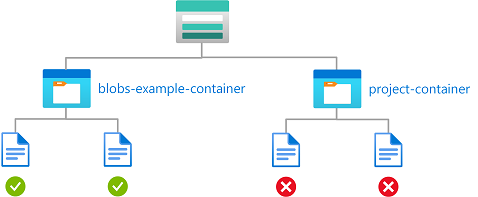
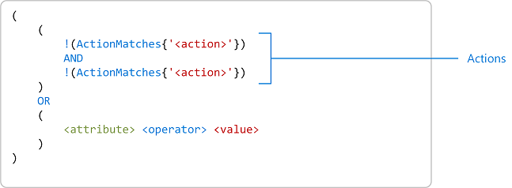
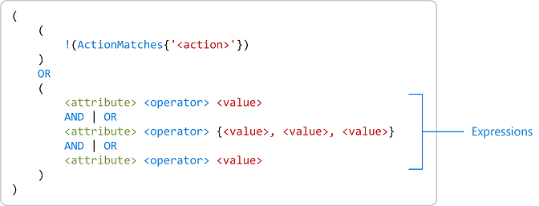

# Azure role assignment condition format and syntax

A condition is an additional check that you can optionally add to your role assignment to provide more fine-grained access control. For example, you can add a condition that requires an object to have a specific tag to read the object. This article describes the format and syntax of role assignment conditions.

## Condition format

To better understand role assignment conditions, it helps to look at the format.

### Simple condition

The most basic condition consists of a targeted action and an expression. An action is an operation that a user can perform on a resource type. An expression is a statement that evaluates to true or false, which determines whether the action is allowed to be performed.

The following shows the format of a simple condition.


```
(
    (
        !(ActionMatches{'<action>'})
    )
    OR
    (
        <attribute> <operator> <value>
    )
)
```

The following condition has an action of "Read a blob". The expression checks whether the container name is blobs-example-container.

```
(
    (
        !(ActionMatches{'Microsoft.Storage/storageAccounts/blobServices/containers/blobs/read'})
    )
    OR 
    (
        @Resource[Microsoft.Storage/storageAccounts/blobServices/containers:name]
        StringEquals 'blobs-example-container'
    )
)
```



### How a condition is evaluated

If a user tries to perform an action in the role assignment that is not `<action>`, `!(ActionMatches)` evaluates to true and the overall condition evaluates to true to allow the action to be performed.

If a user tries to perform `<action>` in the role assignment, `!(ActionMatches)` evaluates to false, so the expression is evaluated. If the expression evaluates to true, the overall condition evaluates to true to allow `<action>` to be performed. Otherwise, `<action>` is not allowed to be performed.

The following pseudo code shows another way that you can read this condition.

```
if a user tries to perform an action in the role assignment that does not match <action>
{
    Allow action to be performed
}
else
{
    if <attribute> <operator> <value> is true
    {
        Allow <action> to be performed
    }
    else
    {
        Do not allow <action> to be performed
    }
}
```

### Suboperations

Some actions have suboperations. For example, the `Microsoft.Storage/storageAccounts/blobServices/containers/blobs/read` data action has the suboperation "List blobs". Conditions with suboperations have the following format.


```
(
    (
        !(ActionMatches{'<action>'}
        AND
        SubOperationMatches{'<subOperation>'})

    )
    OR
    (
        <attribute> <operator> <value>
    )
)
```

### Multiple actions

A condition can include multiple actions that you want to allow if the condition is true. If you select multiple actions for a single condition, there might be fewer attributes to choose from for your condition because the attributes must be available across the selected actions.



```
(
    (
        !(ActionMatches{'<action>'})
        AND
        !(ActionMatches{'<action>'})
    )
    OR
    (
        <attribute> <operator> <value>
    )
)
```

### Multiple expressions

A condition can include multiple expressions. Depending on the operator, attributes can be checked against multiple values.



```
(
    (
        !(ActionMatches{'<action>'})
    )
    OR
    (
        <attribute> <operator> <value>
        AND | OR
        <attribute> <operator> {<value>, <value>, <value>}
        AND | OR
        <attribute> <operator> <value>
    )
)
```

### Multiple conditions

You can also combine conditions to target multiple actions.


```
(
    (
        !(ActionMatches{'<action>'})
    )
    OR
    (
        <attribute> <operator> <value>
        AND | OR
        <attribute> <operator> {<value>, <value>, <value>}
        AND | OR
        <attribute> <operator> <value>
    )
)
AND
(
    (
        !(ActionMatches{'<action>'})
    )
    OR
    (
        <attribute> <operator> <value>
        AND | OR
        <attribute> <operator> <value>
    )
)
```

## Condition syntax

The following shows the syntax for a role assignment condition.

```
(
    (
        !(ActionMatches{'<action>'} AND SubOperationMatches{'<subOperation>'})
        AND
        !(ActionMatches{'<action>'} AND SubOperationMatches{'<subOperation>'})
        AND
        ...
    )
    OR
    (
        <attribute> <operator> {<value, <value>, ...}
        AND | OR
        <attribute> <operator> {<value>, <value>, ...}
        AND | OR
        ...
    )
)
AND
(
    (
        !(ActionMatches{'<action>'} AND SubOperationMatches{'<subOperation>'})
        AND
        !(ActionMatches{'<action>'} AND SubOperationMatches{'<subOperation>'})
        AND
        ...
    )
    OR
    (
        <attribute> <operator> {<value, <value>, ...}
        AND | OR
        <attribute> <operator> {<value>, <value>, ...}
        AND | OR
        ...
    )
)
AND
...
```

## Actions

Currently, conditions can be added to built-in or custom role assignments that have blob storage or queue storage data actions. These include the following built-in roles:

- [Storage Blob Data Contributor](built-in-roles.md#storage-blob-data-contributor)
- [Storage Blob Data Owner](built-in-roles.md#storage-blob-data-owner)
- [Storage Blob Data Reader](built-in-roles.md#storage-blob-data-reader)
- [Storage Queue Data Contributor](built-in-roles.md#storage-queue-data-contributor)
- [Storage Queue Data Message Processor](built-in-roles.md#storage-queue-data-message-processor)
- [Storage Queue Data Message Sender](built-in-roles.md#storage-queue-data-message-sender)
- [Storage Queue Data Reader](built-in-roles.md#storage-queue-data-reader)

For a list of the storage actions you can use in conditions, see:

> [Actions and attributes for Azure role assignment conditions for Azure Blob Storage](../storage/blobs/storage-auth-abac-attributes.md)
> [Actions and attributes for Azure role assignment conditions for Azure Queue Storage](../storage/queues/queues-auth-abac-attributes.md).

## Attributes

Depending on the selected actions, the attribute might be found in different places. If you select multiple actions for a single condition, there might be fewer attributes to choose from for your condition because the attributes must be available across all of the selected actions. To specify an attribute, you must include the source as a prefix.

> [!div class="mx-tableFixed"]
> | Attribute source | Description | Code |
> | --- | --- | --- |
> | [Environment](#environment-attributes) | Indicates that the attribute is associated with the environment of the request, such as the network origin of the request and the current date and time.</br>***(Environment attributes are currently in preview.)*** | `@Environment` |
> | [Principal](#principal-attributes) | Indicates that the attribute is an Azure AD custom security attribute on the principal, such as a user, enterprise application (service principal), or managed identity.</br>***(Principal attributes are currently in preview.)*** | `@Principal` |
> | [Request](#request-attributes) | Indicates that the attribute is part of the action request, such as setting the blob index tag. | `@Request` |
> | [Resource](#resource-attributes) | Indicates that the attribute is a property of the resource, such as a container name. | `@Resource` |

#### Environment attributes

Environment attributes are associated with the circumstances under which the access request is made, such as the date and time of day or the network environment. The network environment of the access request might be whether it is over a specific private endpoint or virtual network subnet, or perhaps over any private link.

> [!IMPORTANT]
> Environment attributes are currently in PREVIEW.
> See the [Supplemental Terms of Use for Microsoft Azure Previews](https://azure.microsoft.com/support/legal/preview-supplemental-terms/) for legal terms that apply to Azure features that are in beta, preview, or otherwise not yet released into general availability.

The following table lists the the supported environment attributes for conditions.

> [!div class="mx-tableFixed"]
> | Display name | Description | Attribute | Type |
> | --- | --- | --- | --- |
> | Subnet name | Use this attribute in conditions to restrict access to a specific subnet. | `Microsoft.Network/virtualNetworks/subnets` | String |
> | Private endpoint name | Use this attribute in conditions to restrict access over a specific private endpoint. | `Microsoft.Network/privateEndpoints` | String |
> | Is private link | Use this attribute in conditions to require access over any private link. | `isPrivateLink` | Boolean |
> | UTC now | Use this attribute in conditions to restrict access to objects during specific time periods. | `UtcNow` | DateTime |

For a complete list of the storage attributes you can use in conditions, see:

- [Azure Blob Storage attributes](../storage/blobs/storage-auth-abac-attributes.md#azure-blob-storage-attributes)
- [Azure Queue Storage attributes](../storage/queues/queues-auth-abac-attributes.md#azure-queues-storage-attributes)

#### Principal attributes

Principal attributes are Azure AD custom security attributes associated with the principal requesting access to a resource. The security principal can be a user, an enterprise application (a service principal), or a managed identity.

> [!IMPORTANT]
> Principal attributes are currently in PREVIEW.
> See the [Supplemental Terms of Use for Microsoft Azure Previews](https://azure.microsoft.com/support/legal/preview-supplemental-terms/) for legal terms that apply to Azure features that are in beta, preview, or otherwise not yet released into general availability.

To use principal attributes, you must have **all** of the following:

- Azure AD Premium P1 or P2 license
- Azure AD permissions for signed-in user, such as the [Attribute Assignment Administrator](../active-directory/roles/permissions-reference.md#attribute-assignment-administrator) role
- Custom security attributes defined in Azure AD

For more information about custom security attributes, see:

- [Allow read access to blobs based on tags and custom security attributes (Preview)](conditions-custom-security-attributes.md)
- [Principal does not appear in Attribute source (Preview)](conditions-troubleshoot.md#symptom---principal-does-not-appear-in-attribute-source)
- [Add or deactivate custom security attributes in Azure AD (Preview)](../active-directory/fundamentals/custom-security-attributes-add.md)

#### Request attributes

Request attributes are associated with the criteria specified in an access request, such as the specified prefix of blobs to be listed.

For a complete list of the blob storage and queue storage attributes you can use in conditions, see:

- [Azure Blob Storage attributes](../storage/blobs/storage-auth-abac-attributes.md#azure-blob-storage-attributes)
- [Azure Queue Storage attributes](../storage/queues/queues-auth-abac-attributes.md#azure-queues-storage-attributes)

#### Resource attributes

Resource attributes are associated with the object to which access is being requested, such as the storage account name, container name, or whether hierarchical namespace is enabled for the storage account.

For a complete list of the blob storage and queue storage attributes you can use in conditions, see:

- [Azure Blob Storage attributes](../storage/blobs/storage-auth-abac-attributes.md#azure-blob-storage-attributes)
- [Azure Queue Storage attributes](../storage/queues/queues-auth-abac-attributes.md#azure-queues-storage-attributes)

## Function operators

This section lists the function operators that are available to construct conditions.

### ActionMatches

> [!div class="mx-tdCol2BreakAll"]
> | Property | Value |
> | --- | --- |
> | **Operator** | `ActionMatches` |
> | **Description** | Checks if the current action matches the specified action pattern. |
> | **Examples** | `ActionMatches{'Microsoft.Storage/storageAccounts/blobServices/containers/blobs/read'}`<br/>If the action being checked equals "Microsoft.Storage/storageAccounts/blobServices/containers/blobs/read", then true<br/><br/>`ActionMatches{'Microsoft.Authorization/roleAssignments/*'}`<br/>If the action being checked equals "Microsoft.Authorization/roleAssignments/write", then true<br/><br/>`ActionMatches{'Microsoft.Authorization/roleDefinitions/*'}`<br/>If the action being checked equals "Microsoft.Authorization/roleAssignments/write", then false |

#### SubOperationMatches

> [!div class="mx-tdCol2BreakAll"]
> | Property | Value |
> | --- | --- |
> | **Operator** | `SubOperationMatches` |
> | **Description** | Checks if the current suboperation matches the specified suboperation pattern. |
> | **Examples** | `SubOperationMatches{'Blob.List'}` |

#### Exists

> [!div class="mx-tdCol2BreakAll"]
> | Property | Value |
> | --- | --- |
> | **Operator** | `Exists` |
> | **Description** | Checks if the specified attribute exists. |
> | **Examples** | `Exists @Request[Microsoft.Storage/storageAccounts/blobServices/containers/blobs:snapshot]` |
> | **Attributes support** | [Encryption scope name](../storage/blobs/storage-auth-abac-attributes.md#encryption-scope-name)<br/>[Snapshot](../storage/blobs/storage-auth-abac-attributes.md#snapshot)<br/>[Version ID](../storage/blobs/storage-auth-abac-attributes.md#version-id) |

## Logical operators

This section lists the logical operators that are available to construct conditions.

### And

> [!div class="mx-tdCol2BreakAll"]
> | Property | Value |
> | --- | --- |
> | **Operators** | `AND`<br/>`&&` |
> | **Description** | And operator. |
> | **Examples** | `!(ActionMatches{'Microsoft.Storage/storageAccounts/blobServices/containers/blobs/read'} AND NOT SubOperationMatches{'Blob.List'})` |

### Or

> [!div class="mx-tdCol2BreakAll"]
> | Property | Value |
> | --- | --- |
> | **Operators** | `OR`<br/>`||` |
> | **Description** | Or operator. |
> | **Examples** | `@Request[Microsoft.Storage/storageAccounts/blobServices/containers/blobs:versionId] DateTimeEquals '2022-06-01T00:00:00.0Z' OR NOT Exists @Request[Microsoft.Storage/storageAccounts/blobServices/containers/blobs:versionId` |

### Not

> [!div class="mx-tdCol2BreakAll"]
> | Property | Value |
> | --- | --- |
> | **Operators** | `NOT`<br/>`!` |
> | **Description** | Not or negation operator. |
> | **Examples** | `NOT Exists @Request[Microsoft.Storage/storageAccounts/blobServices/containers/blobs:versionId]` |

## Boolean comparison operators

This section lists the Boolean comparison operators that are available to construct conditions.

> [!div class="mx-tdCol2BreakAll"]
> | Property | Value |
> | --- | --- |
> | **Operators** | `BoolEquals`<br/>`BoolNotEquals` |
> | **Description** | Boolean comparison. |
> | **Examples** | `@Resource[Microsoft.Storage/storageAccounts:isHnsEnabled] BoolEquals true` |

## String comparison operators

This section lists the string comparison operators that are available to construct conditions.

### StringEquals

> [!div class="mx-tdCol2BreakAll"]
> | Property | Value |
> | --- | --- |
> | **Operators** | `StringEquals`<br/>`StringEqualsIgnoreCase` |
> | **Description** | Case-sensitive (or case-insensitive) matching. The values must exactly match the string. |
> | **Examples** | `@Request[Microsoft.Storage/storageAccounts/blobServices/containers/blobs/tags:Project<$key_case_sensitive$>] StringEquals 'Cascade'` |

### StringNotEquals

> [!div class="mx-tdCol2BreakAll"]
> | Property | Value |
> | --- | --- |
> | **Operators** | `StringNotEquals`<br/>`StringNotEqualsIgnoreCase` |
> | **Description** | Negation of `StringEquals` (or `StringEqualsIgnoreCase`) operator. |

### StringStartsWith

> [!div class="mx-tdCol2BreakAll"]
> | Property | Value |
> | --- | --- |
> | **Operators** | `StringStartsWith`<br/>`StringStartsWithIgnoreCase` |
> | **Description** | Case-sensitive (or case-insensitive) matching. The values start with the string. |

### StringNotStartsWith

> [!div class="mx-tdCol2BreakAll"]
> | Property | Value |
> | --- | --- |
> | **Operators** | `StringNotStartsWith`<br/>`StringNotStartsWithIgnoreCase` |
> | **Description** | Negation of `StringStartsWith` (or `StringStartsWithIgnoreCase`) operator. |

### StringLike

> [!div class="mx-tdCol2BreakAll"]
> | Property | Value |
> | --- | --- |
> | **Operators** | `StringLike`<br/>`StringLikeIgnoreCase` |
> | **Description** | Case-sensitive (or case-insensitive) matching. The values can include a multi-character match wildcard (`*`) or a single-character match wildcard (`?`) anywhere in the string. If needed, these characters can be escaped by add a backslash `\*` and `\?`. |
> | **Examples** | `@Resource[Microsoft.Storage/storageAccounts/blobServices/containers/blobs:path] StringLike 'readonly/*'`<br/><br/>`Resource[name1] StringLike 'a*c?'`<br/>If Resource[name1] equals "abcd", then true<br/><br/>`Resource[name1] StringLike 'A*C?'`<br/>If Resource[name1] equals "abcd", then false<br/><br/>`Resource[name1] StringLike 'a*c'`<br/>If Resource[name1] equals "abcd", then false |

### StringNotLike

> [!div class="mx-tdCol2BreakAll"]
> | Property | Value |
> | --- | --- |
> | **Operators** | `StringNotLike`<br/>`StringNotLikeIgnoreCase` |
> | **Description** | Negation of `StringLike` (or `StringLikeIgnoreCase`) operator. |

## Numeric comparison operators

This section lists the numeric comparison operators that are available to construct conditions.

> [!div class="mx-tdCol2BreakAll"]
> | Property | Value |
> | --- | --- |
> | **Operators** | `NumericEquals`<br/>`NumericNotEquals`<br/>`NumericGreaterThan`<br/>`NumericGreaterThanEquals`<br/>`NumericLessThan`<br/>`NumericLessThanEquals` |
> | **Description** | Number matching. Only integers are supported. |

## DateTime comparison operators

This section lists the date/time comparison operators that are available to construct conditions.

> [!div class="mx-tdCol2BreakAll"]
> | Property | Value |
> | --- | --- |
> | **Operators** | `DateTimeEquals`<br/>`DateTimeNotEquals`<br/>`DateTimeGreaterThan`<br/>`DateTimeGreaterThanEquals`<br/>`DateTimeLessThan`<br/>`DateTimeLessThanEquals` |
> | **Description** | Full-precision check with the format: `yyyy-mm-ddThh:mm:ss.mmmmmmmZ`. Used for blob version ID, blob snapshot, and UTC now. |
> | **Examples** | `@Request[Microsoft.Storage/storageAccounts/blobServices/containers/blobs:versionId] DateTimeEquals '2022-06-01T00:00:00.0Z'` |

## Cross product comparison operators

This section lists the cross product comparison operators that are available to construct conditions.

### ForAnyOfAnyValues

> [!div class="mx-tdCol2BreakAll"]
> | Property | Value |
> | --- | --- |
> | **Operators** | `ForAnyOfAnyValues:StringEquals`<br/>`ForAnyOfAnyValues:StringEqualsIgnoreCase`<br/>`ForAnyOfAnyValues:StringNotEquals`<br/>`ForAnyOfAnyValues:StringNotEqualsIgnoreCase`<br/>`ForAnyOfAnyValues:StringLike`<br/>`ForAnyOfAnyValues:StringLikeIgnoreCase`<br/>`ForAnyOfAnyValues:StringNotLike`<br/>`ForAnyOfAnyValues:StringNotLikeIgnoreCase`<br/>`ForAnyOfAnyValues:NumericEquals`<br/>`ForAnyOfAnyValues:NumericNotEquals`<br/>`ForAnyOfAnyValues:NumericGreaterThan`<br/>`ForAnyOfAnyValues:NumericGreaterThanEquals`<br/>`ForAnyOfAnyValues:NumericLessThan`<br/>`ForAnyOfAnyValues:NumericLessThanEquals` |
> | **Description** | If at least one value on the left-hand side satisfies the comparison to at least one value on the right-hand side, then the expression evaluates to true. Has the format: `ForAnyOfAnyValues:<BooleanFunction>`. Supports multiple strings and numbers. |
> | **Examples** | `@Resource[Microsoft.Storage/storageAccounts/encryptionScopes:name] ForAnyOfAnyValues:StringEquals {'validScope1', 'validScope2'}`<br/>If encryption scope name equals `validScope1` or `validScope2`, then true.<br/><br/>`{'red', 'blue'} ForAnyOfAnyValues:StringEquals {'blue', 'green'}`<br/>true<br/><br/>`{'red', 'blue'} ForAnyOfAnyValues:StringEquals {'orange', 'green'}`<br/>false |

### ForAllOfAnyValues

> [!div class="mx-tdCol2BreakAll"]
> | Property | Value |
> | --- | --- |
> | **Operators** | `ForAllOfAnyValues:StringEquals`<br/>`ForAllOfAnyValues:StringEqualsIgnoreCase`<br/>`ForAllOfAnyValues:StringNotEquals`<br/>`ForAllOfAnyValues:StringNotEqualsIgnoreCase`<br/>`ForAllOfAnyValues:StringLike`<br/>`ForAllOfAnyValues:StringLikeIgnoreCase`<br/>`ForAllOfAnyValues:StringNotLike`<br/>`ForAllOfAnyValues:StringNotLikeIgnoreCase`<br/>`ForAllOfAnyValues:NumericEquals`<br/>`ForAllOfAnyValues:NumericNotEquals`<br/>`ForAllOfAnyValues:NumericGreaterThan`<br/>`ForAllOfAnyValues:NumericGreaterThanEquals`<br/>`ForAllOfAnyValues:NumericLessThan`<br/>`ForAllOfAnyValues:NumericLessThanEquals` |
> | **Description** | If every value on the left-hand side satisfies the comparison to at least one value on the right-hand side, then the expression evaluates to true. Has the format: `ForAllOfAnyValues:<BooleanFunction>`. Supports multiple strings and numbers. |
> | **Examples** | `@Request[Microsoft.Storage/storageAccounts/blobServices/containers/blobs/tags:Project<$key_case_sensitive$>] ForAllOfAnyValues:StringEquals {'Cascade', 'Baker', 'Skagit'}`<br/><br/>`{'red', 'blue'} ForAllOfAnyValues:StringEquals {'orange', 'red', 'blue'}`<br/>true<br/><br/>`{'red', 'blue'} ForAllOfAnyValues:StringEquals {'red', 'green'}`<br/>false |

### ForAnyOfAllValues

> [!div class="mx-tdCol2BreakAll"]
> | Property | Value |
> | --- | --- |
> | **Operators** | `ForAnyOfAllValues:StringEquals`<br/>`ForAnyOfAllValues:StringEqualsIgnoreCase`<br/>`ForAnyOfAllValues:StringNotEquals`<br/>`ForAnyOfAllValues:StringNotEqualsIgnoreCase`<br/>`ForAnyOfAllValues:StringLike`<br/>`ForAnyOfAllValues:StringLikeIgnoreCase`<br/>`ForAnyOfAllValues:StringNotLike`<br/>`ForAnyOfAllValues:StringNotLikeIgnoreCase`<br/>`ForAnyOfAllValues:NumericEquals`<br/>`ForAnyOfAllValues:NumericNotEquals`<br/>`ForAnyOfAllValues:NumericGreaterThan`<br/>`ForAnyOfAllValues:NumericGreaterThanEquals`<br/>`ForAnyOfAllValues:NumericLessThan`<br/>`ForAnyOfAllValues:NumericLessThanEquals` |
> | **Description** | If at least one value on the left-hand side satisfies the comparison to every value on the right-hand side, then the expression evaluates to true. Has the format: `ForAnyOfAllValues:<BooleanFunction>`. Supports multiple strings and numbers. |
> | **Examples** | `{10, 20} ForAnyOfAllValues:NumericLessThan {15, 18}`<br/>true |

### ForAllOfAllValues

> [!div class="mx-tdCol2BreakAll"]
> | Property | Value |
> | --- | --- |
> | **Operators** | `ForAllOfAllValues:StringEquals`<br/>`ForAllOfAllValues:StringEqualsIgnoreCase`<br/>`ForAllOfAllValues:StringNotEquals`<br/>`ForAllOfAllValues:StringNotEqualsIgnoreCase`<br/>`ForAllOfAllValues:StringLike`<br/>`ForAllOfAllValues:StringLikeIgnoreCase`<br/>`ForAllOfAllValues:StringNotLike`<br/>`ForAllOfAllValues:StringNotLikeIgnoreCase`<br/>`ForAllOfAllValues:NumericEquals`<br/>`ForAllOfAllValues:NumericNotEquals`<br/>`ForAllOfAllValues:NumericGreaterThan`<br/>`ForAllOfAllValues:NumericGreaterThanEquals`<br/>`ForAllOfAllValues:NumericLessThan`<br/>`ForAllOfAllValues:NumericLessThanEquals` |
> | **Description** | If every value on the left-hand side satisfies the comparison to every value on the right-hand side, then the expression evaluates to true. Has the format: `ForAllOfAllValues:<BooleanFunction>`. Supports multiple strings and numbers. |
> | **Examples** | `{10, 20} ForAllOfAllValues:NumericLessThan {5, 15, 18}`<br/>false<br/><br/>`{10, 20} ForAllOfAllValues:NumericLessThan {25, 30}`<br/>true<br/><br/>`{10, 20} ForAllOfAllValues:NumericLessThan {15, 25, 30}`<br/>false |

## Special characters

| Character | Description |
| --- | --- |
| `*` | An asterisk (*) represents a multi-character wildcard match that can be used with `Like` operators. If needed, you can escape an asterisk by adding a backslash `\*`. |
| `?` | A question mark (?) represents a single-character wildcard match that can be used with `Like` operators. If needed, you can escape a question mark by adding a backslash `\?`. |
| `$` | A dollar sign ($) is used to help delineate tag keys. In Azure PowerShell, if a string enclosed in double quotes (") includes a dollar sign, you must prefix it with a backtick (\`). For example: ``tags:Project<`$key_case_sensitive`$>``. | 

## Grouping and precedence

If you have three or more expressions for a targeted action with different operators between the expressions, the evaluation order is ambiguous. You use parentheses `()` to group expressions and specify the order that the expressions are evaluated. Expressions enclosed in parentheses have higher precedence. For example, if you have the following expression:

```
a AND b OR c
```

You must add parentheses in one of the following ways:

```
(a AND b) OR c
```

```
a AND (b OR c)
```

## Next steps

- [Example Azure role assignment conditions for Blob Storage](../storage/blobs/storage-auth-abac-examples.md)
- [Add or edit Azure role assignment conditions using the Azure portal](conditions-role-assignments-portal.md)
