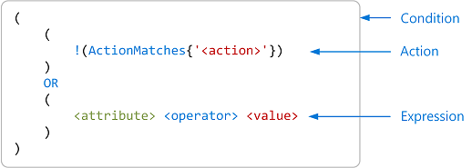
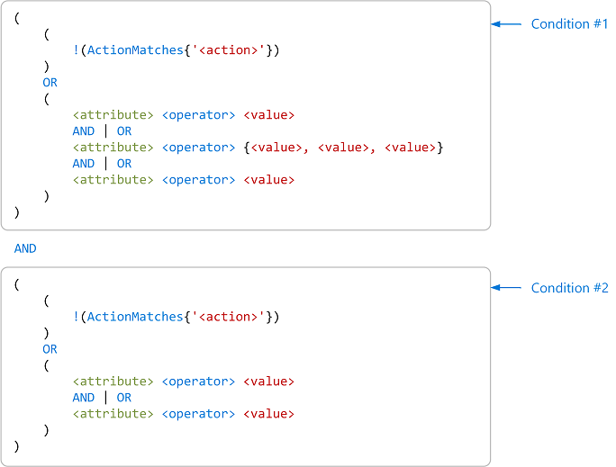

# Azure role assignment condition format and syntax (preview)

> [!IMPORTANT]
> Azure ABAC and Azure role assignment conditions are currently in preview.
> This preview version is provided without a service level agreement, and it's not recommended for production workloads. Certain features might not be supported or might have constrained capabilities.
> For more information, see [Supplemental Terms of Use for Microsoft Azure Previews](https://azure.microsoft.com/support/legal/preview-supplemental-terms/).

A condition is an additional check that you can optionally add to your role assignment to provide more fine-grained access control. For example, you can add a condition that requires an object to have a specific tag to read the object. This article describes the format and syntax of role assignment conditions.

## Condition format

To better understand role assignment conditions, it helps to look at the format.

### Simple condition

The most basic condition consists of a targeted action and an expression. An action is an operation that a user can perform on a resource type. An expression is a statement that evaluates to true or false, which determines whether the action is allowed to be performed.

The following shows the format of a simple condition.



The following condition has an action of "Read a blob". The expression checks whether the container name is blobs-example-container.


### How a condition is evaluated

If a user tries to perform an action in the role assignment that is not `<action>`, `!(ActionMatches)` evaluates to true and the overall condition evaluates to true to allow the action to be performed.

If a user tries to perform `<action>` in the role assignment, `!(ActionMatches)` evaluates to false, so the expression is evaluated. If the expression evaluates to true, the overall condition evaluates to true to allow `<action>` to be performed. Otherwise, `<action>` is not allowed to be performed.

The following pseudo code shows another way that you can read this condition.

```
if a user tries to perform an action in the role assignment that does not match <action>
{
    Allow action to be performed
}
else
{
    if <attribute> <operator> <value> is true
    {
        Allow <action> to be performed
    }
    else
    {
        Do not allow <action> to be performed
    }
}
```

### Suboperations

Some actions have suboperations. For example, the "Read a blob" data action has the suboperation "Read content from a blob with tag conditions". Conditions with suboperations have the following format.


### Multiple actions

A condition can include multiple actions that you want to allow if the condition is true. If you select multiple actions for a single condition, there might be fewer attributes to choose from for your condition because the attributes must be available across the selected actions.


### Multiple expressions

A condition can include multiple expressions. Depending on the operator, attributes can be checked against multiple values.


### Multiple conditions

You can also combine conditions to target multiple actions.



## Condition syntax

The following shows the syntax for a role assignment condition.

```
(
    (
        !(ActionMatches{'<action>'} AND SubOperationMatches{'<subOperation>'})
        AND
        !(ActionMatches{'<action>'} AND SubOperationMatches{'<subOperation>'})
        AND
        ...
    )
    OR
    (
        <attribute> <operator> {<value, <value>, ...}
        AND | OR
        <attribute> <operator> {<value>, <value>, ...}
        AND | OR
        ...
    )
)
AND
(
    (
        !(ActionMatches{'<action>'} AND SubOperationMatches{'<subOperation>'})
        AND
        !(ActionMatches{'<action>'} AND SubOperationMatches{'<subOperation>'})
        AND
        ...
    )
    OR
    (
        <attribute> <operator> {<value, <value>, ...}
        AND | OR
        <attribute> <operator> {<value>, <value>, ...}
        AND | OR
        ...
    )
)
AND
...
```

## Actions

Currently, conditions can be added to built-in or custom role assignments that have storage blob data actions. These include the following built-in roles:

- [Storage Blob Data Contributor](built-in-roles.md#storage-blob-data-contributor)
- [Storage Blob Data Owner](built-in-roles.md#storage-blob-data-owner)
- [Storage Blob Data Reader](built-in-roles.md#storage-blob-data-reader)

For a a list of the storage blob actions you can use in conditions, see [Actions and attributes for Azure role assignment conditions in Azure Storage (preview)](../storage/common/storage-auth-abac-attributes.md)

## Attributes

Depending on the selected actions, the attribute might be found in different places. If you select multiple actions for a single condition, there might be fewer attributes to choose from for your condition because the attributes must be available across the selected actions. To specify an attribute, you must include the source as a prefix.

> [!div class="mx-tableFixed"]
> | Attribute source | Description | Code |
> | --- | --- | --- |
> | Principal | Indicates that the attribute is an Azure AD custom security attribute on the principal, such as a user, enterprise application (service principal), or managed identity. | `@Principal` |
> | Resource | Indicates that the attribute is on the resource, such as a container name. | `@Resource` |
> | Request | Indicates that the attribute is part of the action request, such as setting the blob index tag. | `@Request` |

To use principal attributes, you must have **all** of the following:

- Azure AD Premium P1 or P2 license
- Azure AD permissions for signed-in user, such as the Attribute Assignment Administrator role
- Custom security attributes defined in Azure AD

For more information about custom security attributes, see:

- [Principal does not appear in Attribute source when adding a condition](conditions-troubleshoot.md#symptom---principal-does-not-appear-in-attribute-source-when-adding-a-condition)
- [Add or deactivate custom security attributes in Azure AD](../active-directory/fundamentals/custom-security-attributes-add.md)

For a list of the storage blob attributes you can use in conditions, see:

- [Actions and attributes for Azure role assignment conditions in Azure Storage (preview)](../storage/common/storage-auth-abac-attributes.md)

## Operators

The following table lists the operators that are available to construct conditions.

| Category | Operator | Description |
| --- | --- | --- |
| Logical comparison |`AND`<br/>`&&` | And operator. |
|  | `OR`<br/>`||` | Or operator. |
|  | `NOT`<br/>`!` | Not or negation operator. |
| String comparison | `StringEquals`<br/>`StringEqualsIgnoreCase` | Case-sensitive (or case-insensitive) matching. The values must exactly match the string. |
|  | `StringNotEquals`<br/>`StringNotEqualsIgnoreCase` | Negation of `StringEquals` (or `StringEqualsIgnoreCase`) operator |
|  | `StringStartsWith`<br/>`StringStartsWithIgnoreCase` | Case-sensitive (or case-insensitive) matching. The values start with the string. |
|  | `StringNotStartsWith`<br/>`StringNotStartsWithIgnoreCase` | Negation of `StringStartsWith` (or `StringStartsWithIgnoreCase`) operator |
|  | `StringLike`<br/>`StringLikeIgnoreCase` | Case-sensitive (or case-insensitive) matching. The values can include a multi-character match wildcard (`*`) or a single-character match wildcard (`?`) anywhere in the string. If needed, these characters can be escaped by add a backslash `\*` and `\?`. |
|  | `StringNotLike`<br/>`StringNotLikeIgnoreCase` | Negation of `StringLike` (or `StringLikeIgnoreCase`) operator |
| Numeric comparison | `NumericEquals`<br/>`NumericNotEquals`<br/>`NumericLessThan`<br/>`NumericLessThanEquals`<br/>`NumericGreaterThan`<br/>`NumericGreaterThanEquals` | Currently, only integers are supported. |
| Higher-level functions | `ActionMatches` | Checks if Action[ID] value matches the specified action pattern. This operator is equivalent to the action matching logic that the SDK uses when comparing an action to an action pattern inside a Permission. |
| Cross product comparison | `ForAnyOfAnyValues:StringEquals`<br/>`ForAnyOfAnyValues:StringEqualsIgnoreCase`<br/>`ForAnyOfAnyValues:StringNotEquals`<br/>`ForAnyOfAnyValues:StringNotEqualsIgnoreCase`<br/>`ForAnyOfAnyValues:StringLike`<br/>`ForAnyOfAnyValues:StringLikeIgnoreCase`<br/>`ForAnyOfAnyValues:StringNotLike`<br/>`ForAnyOfAnyValues:StringNotLikeIgnoreCase`<br/>`ForAnyOfAnyValues:NumericEquals`<br/>`ForAnyOfAnyValues:NumericNotEquals`<br/>`ForAnyOfAnyValues:NumericGreaterThan`<br/>`ForAnyOfAnyValues:NumericGreaterThanEquals`<br/>`ForAnyOfAnyValues:NumericLessThan`<br/>`ForAnyOfAnyValues:NumericLessThanEquals` | If at least one value on the left-hand side satisfies the comparison to at least one value on the right-hand side, then the expression evaluates to true. Has the format: `ForAnyOfAnyValues:<BooleanFunction>`. Supports multiple strings and numbers. |
|  | `ForAllOfAnyValues:StringEquals`<br/>`ForAllOfAnyValues:StringEqualsIgnoreCase`<br/>`ForAllOfAnyValues:StringNotEquals`<br/>`ForAllOfAnyValues:StringNotEqualsIgnoreCase`<br/>`ForAllOfAnyValues:StringLike`<br/>`ForAllOfAnyValues:StringLikeIgnoreCase`<br/>`ForAllOfAnyValues:StringNotLike`<br/>`ForAllOfAnyValues:StringNotLikeIgnoreCase`<br/>`ForAllOfAnyValues:NumericEquals`<br/>`ForAllOfAnyValues:NumericNotEquals`<br/>`ForAllOfAnyValues:NumericGreaterThan`<br/>`ForAllOfAnyValues:NumericGreaterThanEquals`<br/>`ForAllOfAnyValues:NumericLessThan`<br/>`ForAllOfAnyValues:NumericLessThanEquals` | If every value on the left-hand side satisfies the comparison to at least one value on the right-hand side, then the expression evaluates to true. Has the format: `ForAllOfAnyValues:<BooleanFunction>`. Supports multiple strings and numbers. |
|  | `ForAnyOfAllValues:StringEquals`<br/>`ForAnyOfAllValues:StringEqualsIgnoreCase`<br/>`ForAnyOfAllValues:StringNotEquals`<br/>`ForAnyOfAllValues:StringNotEqualsIgnoreCase`<br/>`ForAnyOfAllValues:StringLike`<br/>`ForAnyOfAllValues:StringLikeIgnoreCase`<br/>`ForAnyOfAllValues:StringNotLike`<br/>`ForAnyOfAllValues:StringNotLikeIgnoreCase`<br/>`ForAnyOfAllValues:NumericEquals`<br/>`ForAnyOfAllValues:NumericNotEquals`<br/>`ForAnyOfAllValues:NumericGreaterThan`<br/>`ForAnyOfAllValues:NumericGreaterThanEquals`<br/>`ForAnyOfAllValues:NumericLessThan`<br/>`ForAnyOfAllValues:NumericLessThanEquals` | If at least one value on the left-hand side satisfies the comparison to every value on the right-hand side, then the expression evaluates to true. Has the format: `ForAnyOfAllValues:<BooleanFunction>`. Supports multiple strings and numbers. |
|  | `ForAllOfAllValues:StringEquals`<br/>`ForAllOfAllValues:StringEqualsIgnoreCase`<br/>`ForAllOfAllValues:StringNotEquals`<br/>`ForAllOfAllValues:StringNotEqualsIgnoreCase`<br/>`ForAllOfAllValues:StringLike`<br/>`ForAllOfAllValues:StringLikeIgnoreCase`<br/>`ForAllOfAllValues:StringNotLike`<br/>`ForAllOfAllValues:StringNotLikeIgnoreCase`<br/>`ForAllOfAllValues:NumericEquals`<br/>`ForAllOfAllValues:NumericNotEquals`<br/>`ForAllOfAllValues:NumericGreaterThan`<br/>`ForAllOfAllValues:NumericGreaterThanEquals`<br/>`ForAllOfAllValues:NumericLessThan`<br/>`ForAllOfAllValues:NumericLessThanEquals` | If every value on the left-hand side satisfies the comparison to every value on the right-hand side, then the expression evaluates to true. Has the format: `ForAllOfAllValues:<BooleanFunction>`. Supports multiple strings and numbers. |

## Operator examples

> [!div class="mx-tableFixed"]
> | Example | Result |
> | --- | --- |
> | `ActionMatches{'Microsoft.Authorization/roleAssignments/*'}` | If the action being checked equals "Microsoft.Authorization/roleAssignments/write" then true |
> | `ActionMatches{'Microsoft.Authorization/roleDefinitions/*'}` | If the action being checked equals "Microsoft.Authorization/roleAssignments/write" then false |
> | `Resource[name1] StringLike 'a*c?'` | If Resource[name1] equals "abcd", then true |
> | `Resource[name1] StringLike 'A*C?'` | If Resource[name1] equals "abcd", then false |
> | `Resource[name1] StringLike 'a*c'` | If Resource[name1] equals "abcd", then false |
> | `{'red', 'blue'} ForAnyOfAnyValues:StringEquals {'blue', 'green'}` | true |
> | `{'red', 'blue'} ForAnyOfAnyValues:StringEquals {'orange', 'green'}` | false |
> | `{'red', 'blue'} ForAllOfAnyValues:StringEquals {'orange', 'red', 'blue'}` | true |
> | `{'red', 'blue'} ForAllOfAnyValues:StringEquals {'red', 'green'}` | false |
> | `{10, 20} ForAnyOfAllValues:NumericLessThan {15, 18}` | true |
> | `{10, 20} ForAllOfAllValues:NumericLessThan {5, 15, 18}` | false |
> | `{10, 20} ForAllOfAllValues:NumericLessThan {25, 30}` | true |
> | `{10, 20} ForAllOfAllValues:NumericLessThan {15, 25, 30}` | false |

## Special characters

| Character | Description |
| --- | --- |
| `*` | An asterisk (*) represents a multi-character wildcard match that can be used with `Like` operators. If needed, you can escape an asterisk by adding a backslash `\*`. |
| `?` | A question mark (?) represents a single-character wildcard match that can be used with `Like` operators. If needed, you can escape a question mark by adding a backslash `\?`. |
| `$` | A dollar sign ($) is used to help delineate tag keys. In Azure PowerShell, if a string enclosed in double quotes (") includes a dollar sign, you must prefix it with a backtick (\`). For example: ``tags:Project<`$key_case_sensitive`$>``. | 

## Grouping and precedence

You use parentheses `()` to group expressions and define precedence in a condition. If you have three or more expressions for a targeted action, you must add parentheses to define the order that the expressions are evaluated. Expressions enclosed in parentheses have higher precedence. For example, if you have the following expression:

```
a AND b OR c
```

You must add parentheses in one of the following ways:

```
(a AND b) OR c
```

```
a AND (b OR c)
```

## Next steps

- [Example Azure role assignment conditions (preview)](../storage/common/storage-auth-abac-examples.md)
- [Actions and attributes for Azure role assignment conditions in Azure Storage (preview)](../storage/common/storage-auth-abac-attributes.md)
