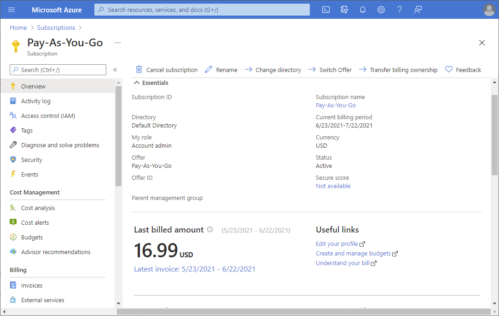
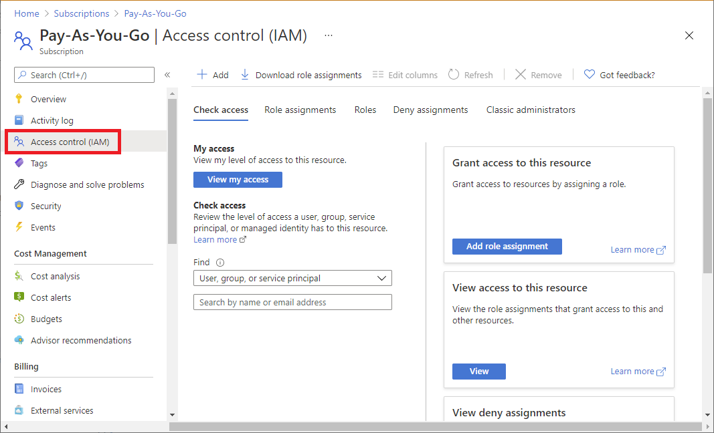
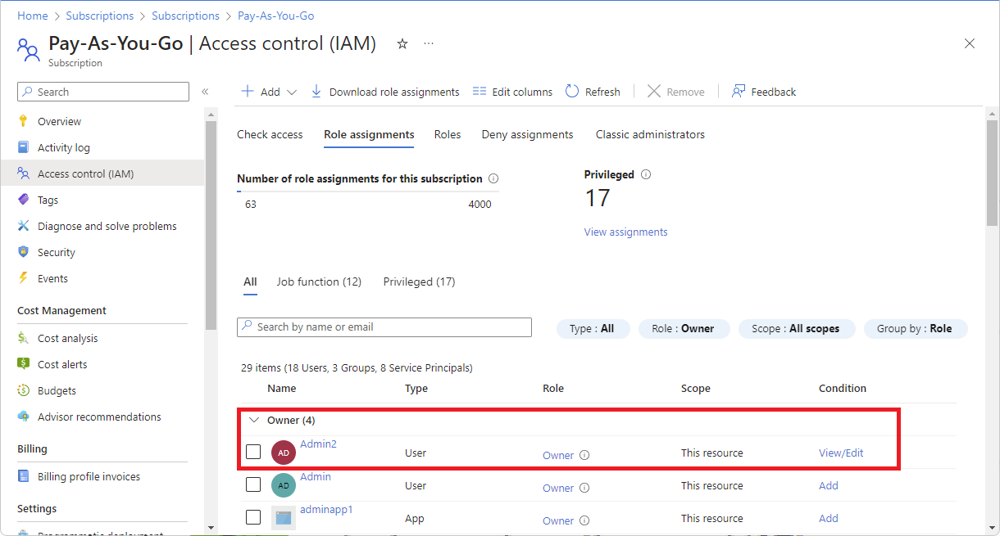

# Assign a user as an administrator of an Azure subscription with conditions

To make a user an administrator of an Azure subscription, you assign them the [Owner](built-in-roles.md#owner) role at the subscription scope. The Owner role gives the user full access to all resources in the subscription, including the permission to grant access to others. Since the Owner role is a highly privileged role, Microsoft recommends you add a condition to constrain the role assignment. For example, you can allow a user to only assign the Virtual Machine Contributor role to service principals.

This article describes how to assign a user as an administrator of an Azure subscription with conditions. These steps are the same as any other role assignment.

## Prerequisites

[!INCLUDE [Azure role assignment prerequisites](../../includes/role-based-access-control/prerequisites-role-assignments.md)]

## Step 1: Open the subscription

1. Sign in to the [Azure portal](https://portal.azure.com).

1. In the Search box at the top, search for subscriptions.

1. Click the subscription you want to use.

    The following shows an example subscription.

    

## Step 2: Open the Add role assignment page

**Access control (IAM)** is the page that you typically use to assign roles to grant access to Azure resources. It's also known as identity and access management (IAM) and appears in several locations in the Azure portal.

1. Click **Access control (IAM)**.

    The following shows an example of the Access control (IAM) page for a subscription.

    

1. Click the **Role assignments** tab to view the role assignments at this scope.

1. Click **Add** > **Add role assignment**.

   If you don't have permissions to assign roles, the Add role assignment option will be disabled.

    

    The Add role assignment page opens.

## Step 3: Select the Owner role

The [Owner](built-in-roles.md#owner) role grant full access to manage all resources, including the ability to assign roles in Azure RBAC. You should have a maximum of 3 subscription owners to reduce the potential for breach by a compromised owner.

1. On the **Role** tab, select the **Privileged administrator roles** tab.

   

1. Select the **Owner** role.

1. Click **Next**.

## Step 4: Select who needs access

1. On the **Members** tab, select **User, group, or service principal**.

   

1. Click **Select members**.

1. Find and select the user.

    You can type in the **Select** box to search the directory for display name or email address.

   

1. Click **Save** to add the user to the Members list.

1. In the **Description** box enter an optional description for this role assignment.

    Later you can show this description in the role assignments list.

1. Click **Next**.

## Step 5: Add a condition

Since the Owner role is a highly privileged role, Microsoft recommends you add a condition to constrain the role assignment.

1. On the **Conditions** tab under **What user can do**, select the **Allow user to only assign selected roles to selected principals (fewer privileges)** option.

    :::image type="content" source="./media/role-assignments-portal-subscription-admin/condition-constrained-owner.png" alt-text="Screenshot of Add role assignment with the constrained option selected." lightbox="./media/role-assignments-portal-subscription-admin/condition-constrained-owner.png":::

1. Select **Select roles and principals**.

    The Add role assignment condition page appears with a list of condition templates.

    :::image type="content" source="./media/shared/condition-templates.png" alt-text="Screenshot of Add role assignment condition with a list of condition templates." lightbox="./media/shared/condition-templates.png":::

1. Select a condition template and then select **Configure**.

    | Condition template | Select this template to |
    | --- | --- |
    | Constrain roles | Allow user to only assign roles you select |
    | Constrain roles and principal types | Allow user to only assign roles you select Allow user to only assign these roles to principal types you select (users, groups, or service principals) |
    | Constrain roles and principals | Allow user to only assign roles you select Allow user to only assign these roles to principals you select |

    > [!TIP]
    > If you want to allow most role assignments, but don't allow specific role assignments, you can use the advanced condition editor and manually add a condition. For an example, see [Example: Allow most roles, but don't allow others to assign roles](delegate-role-assignments-examples.md#example-allow-most-roles-but-dont-allow-others-to-assign-roles).
    
1. In the configure pane, add the required configurations.

    :::image type="content" source="./media/shared/condition-template-configure-pane.png" alt-text="Screenshot of configure pane for a condition with selection added." lightbox="./media/shared/condition-template-configure-pane.png":::

1. Select **Save** to add the condition to the role assignment.

## Step 6: Assign role

1. On the **Review + assign** tab, review the role assignment settings.

1. Click **Review + assign** to assign the role.

   After a few moments, the user is assigned the Owner role for the subscription.

    

## Next steps

- [Assign Azure roles using the Azure portal](role-assignments-portal.yml)
- [Organize your resources with Azure management groups](../governance/management-groups/overview.md)
- [Alert on privileged Azure role assignments](role-assignments-alert.md)
